# Informe Acondicionamiento Térmico. Ejemplo

## Página 1

INFORME CUMPLIMIENTO PDA 
RT ART 4.1.10 OGUC 
 
 
PROYECTO                              
CASA OTERO LARENAS 
Ampliación Mayor a 100 [m2]
Pasaje Alcoy # 1147, Vitacura, RM 
PROPIETARIO
María Dolores Larenas Celis (RUT 13.471.985-0) 
ARQUITECTA PATROCINANTE 
DANIELA IVONNE CARTER CARVAJAL (RUT 15.993.992-8)
CONSTRUCTOR
FELIPE YÁÑEZ GONZÁLEZ (RUT 15.587.129-6)
 
1)  GENERALIDADES 
El presente informe demuestra el cumplimiento de las condiciones térmicas del sistema constructivo 
de la envolvente y soluciones de acondicionamiento adoptadas según lo estipulado en el ART 4.1.10 
de la O.G.U.C., el cual fue modificado y publicado en el Diario Oficial el 27 de mayo del 2024 y cuya 
entrada en vigencia es a partir del 28 de noviembre del presente año 2025.  
 
IMPLICANCIAS 
A) Aumento de exigencias al comportamiento térmico: 
Se aumentan las exigencias de comportamiento térmico a los techos, muros y pisos 
ventilados. Adicionalmente, se incorporan exigencias térmicas a puertas exteriores y 
sobrecimientos.  
 
B) Porcentaje máximo de ventanas:  
Se establecen superficies máximas según la orientación y el comportamiento térmico de 
la ventana, permitiendo mayores superficies vidriadas en la orientación norte y menores 
en la orientación sur.  
 
C) Análisis del riesgo de condensación:  
Se deberá verificar que no exista riesgo de condensación superficial e intersticial en los 
complejos de muros perimetrales, techumbre y piso ventilado. El análisis deberá incluir 
los puentes térmicos de la solución constructiva.  
 
D) Hermeticidad:  
La envolvente térmica de las viviendas deberá cumplir con exigencias respecto a las 
infiltraciones de aire máxima según su emplazamiento. Asimismo, las puertas exteriores 
y las ventanas deberán cumplir con una Clase de permeabilidad al aire mínima.  
 
E) Ventilación:  
Se deberán incorporar sistemas de ventilación para alcanzar condiciones saludables del 
aire interior.

## Página 2

1) ZONA TÉRMICA:  
Centro Norte - D  
(Vitacura, RM) 
 
 
 
 
 
 
 
 
 
 
 
 
 
 
 
 
 
 
 
 
 
 
 
 
 
 
 
Figura 1:  
Plano Zonificación Térmica Zona Centro Norte. 
Fuente:  
Web MINVU Nueva Reglamentación Térmica (2025)

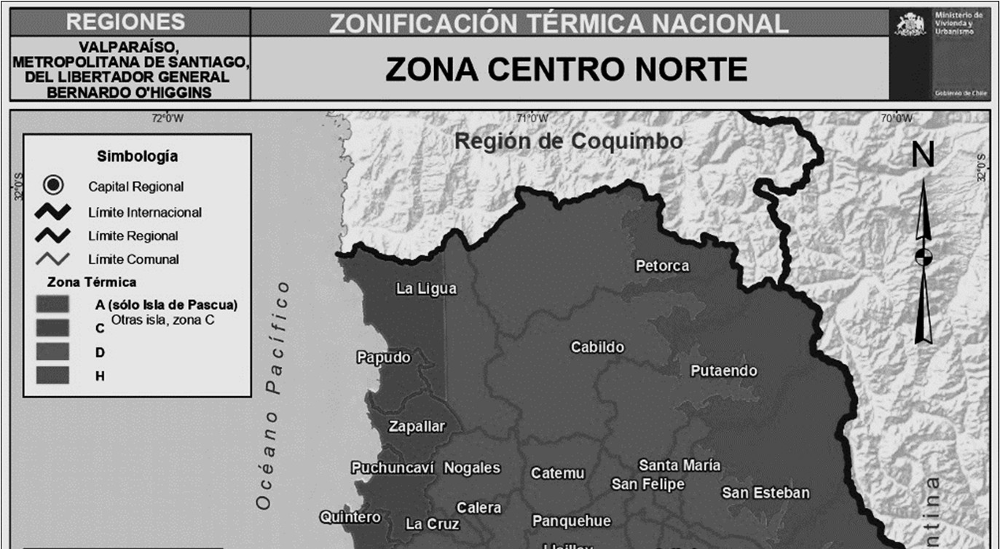

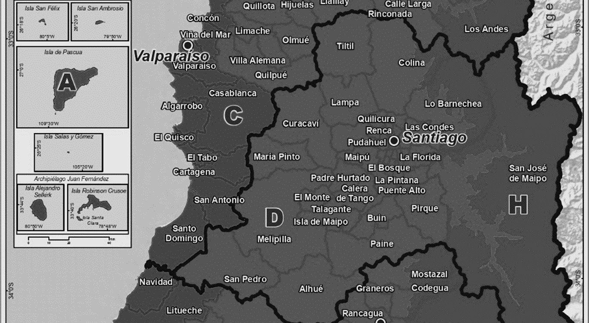

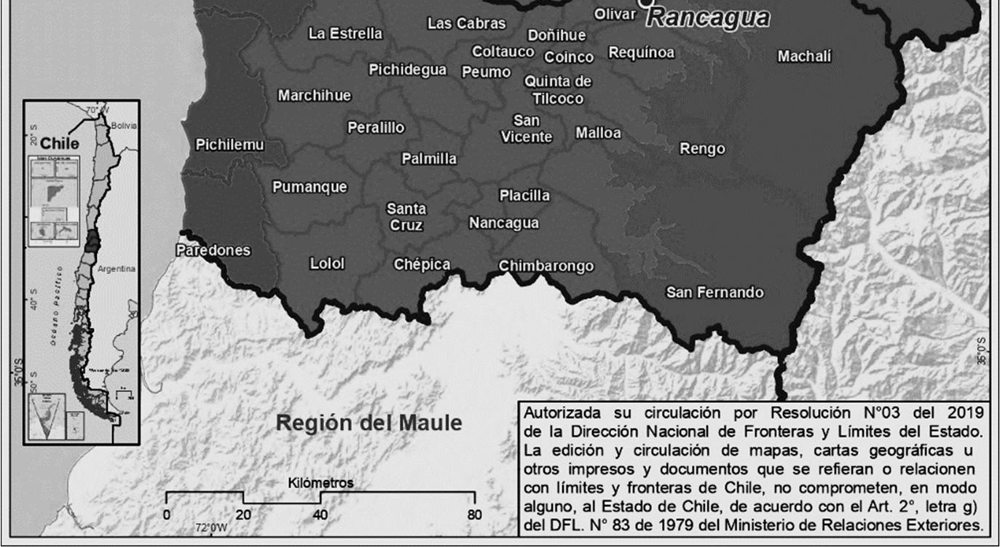

## Página 3

2) CONDICIONES CLIMÁTICAS SEGÚN EMPLAZAMIENTO:  
Según el Anexo 1 de la Resolución Exenta RES N° 1802 del MINVU (Ministerio de Vivienda y 
Urbanismo) que data desde el 26 de noviembre del presente año, se señala que según plano 
actualizado de la NCh 1079, Vitacura corresponde a la Zona térmica D (Figura 1), ya que está 
dentro del límite de la cota 2.000 [msnm] en la Región Metropolitana de Santiago. Para dicha 
clasificación del emplazamiento geográfico el Informe de condiciones para el cálculo de 
condensación según NCh1973 y otras normas relacionadas, dan cuenta de que se debe 
considerar: 
 
Temperatura Exterior (T° ext.):  
2,2 [°C]. 
 
Humedad Relativa (HR):  
92%.  
 
  
3) TRANSMITANCIA MÁXIMA DE LA ENVOLVENTE TÉRMICA:  
En primer lugar, se debe considerar que la envolvente térmica es el conjunto de elementos 
constructivos que conforman el paquete constructivo perimetral de una edificación para cumplir 
las exigencias de acondicionamiento térmico señaladas en la Ordenanza y que, a su vez, la 
separan de un recinto no acondicionado o de elementos del ambiente exterior, tales como 
terreno, aire, agua, asoleamiento, temperatura, humedad u otros. Los complejos de techumbre, 
muros perimetrales, piso ventilado y puertas opacas deberán tener una transmitancia térmica 
U igual o menor, o una resistencia Rt igual o superior, a la señalada en la Tabla 1, respecto a la 
zona térmica en la cual se emplaza el proyecto, de acuerdo al plano de zonificación contenido en 
la reglamentación térmica (Figura 1).  
 
 
 
 
 
ZONA 
TÉRMICA
COMPLEJO DE 
TECHUMBRE 
COMPLEJO DE MUROS 
PERIMETRALES 
COMPLEJO DE PISO 
VENTILADO 
COMPLEJO DE  
PUERTAS  
OPACAS 
U * 
Rt * 
U * 
Rt * 
U * 
Rt * 
U * 
Rt * 
W/m ²K
m²K/W
W/m ²K
m²K/W
W/m ²K
m²K/W
W/m ²K
m²K/W
A 
0,84
1,19
2,10
0,48
3,60
0,28
B 
0,47 
2,13 
0,80 
1,25 
0,70 
1,43 
1,70 
0,59 
C
0,47 
2,13 
0,80 
1,25 
0,87 
1,15 
1,70 
0,59 
D
0,38
2,63
0,80
1,25
0,60
1,67
1,70
0,59
E
0,33 
3,03 
0,60 
1,67 
0,60 
1,67 
1,70 
0,59 
F
0,28 
3,57 
0,45 
2,22 
0,50 
2,00 
1,70 
0,59 
G 
0,28
3,57
0,40
2,50
0,39
2,56
1,70
0,59
H
0,25
4,00
0,30
3,33
0,32
3,13
1,70
0,59
I
0,25
4,00
0,35
2,86
0,32
3,13
1,70
0,59

## Página 4

Se destacan variables a considerar. Se desprecia PISO VENTILADO por ser edificación en contacto 
con el suelo (NTN). 
 
ZONA TÉRMICA vs REQUERIMIENTOS DE REGLAMENTACIÓN TÉRMICA ZONA D 
 
 
ZONA TÉRMICA REGLAMENTACIÓN TÉRMICA 
 
 
D 
U COMPLEJO TECHUMBRE ZONA TÉRMICA D
0,38 [w/m2K]
Rt COMPLEJO TECHUMBRE ZONA TÉRMICA D 
2,63 [w/m2K] 
U COMPLEJO MUROS PERIMETRALES ZONA TÉRMICA D
0,80 [w/m2K]
Rt COMPLEJO MUROS PERIMETRALES ZONA TÉRMICA D
1,25 [w/m2K]
U COMPLEJO PISO VENTILADO ZONA TÉRMICA D
0,60 [w/m2K]
Rt COMPLEJO PISO VENTILADO ZONA TÉRMICA D 
1,67 [w/m2K] 
U COMPLEJO PUERTAS OPACAS ZONA TÉRMICA D
1,70 [w/m2K]
Rt COMPLEJO PUERTA OPACAS ZONA TÉRMICA D 
0,59 [w/m2K] 
 
 
Elemento de 
Envolvente 
Especificación Técnica del Proyecto 
Zona D 
(U) 
Valor Proyecto (U) 
Estado 
Muros 
Perimetrales 
Existente : Estructura de Albañilería existente / con 
sistema mortero EIFS +EPS 15 kg/m3 +emballetado 
Pol Arriata.     Ampliación: panel aislado emballetado 
50 POL de Arratia + membrana hidrófuga Tyvek 
Homewrap Dupont (Formato 1.52x30.48), + panel 
SIP capa posterior de EPS 15 kg/m³.+ Yeso de cartón 
(vulcanita) ST, RH de 10 [mm]+enlucido de yeso 
Romeral de 10 [mm] de espesor y una densidad de 
1000 kg/m³ .                              
≤0.80
Existente : 0,58
 
CUMPLE
Ampliación 
L. Mineral : 0.26 
 
 
Ampliación  
Cadeneta Pino :0,41 
Techumbre 
Panel Aislado Emballetado 50 POL, Arratia con ρ = 
7200 kg/m³ y e=0,5 cm, + membrana Hidrofuga 
Volcán Wrap Techo de 0,03cm+ fibrocemento 
Permanit (Pizarreño) ρ = 1350 kg/m³ + OSB 
estructural LP de 18 mm de ρ = 648 kg/m³, + Lana de 
Vidrio Aislanglass Kraft marca Volcán, + placa de yeso 
cartón ST/RH + enlucido de yeso Romeral o en su 
defecto entablado de madera machihembrada 
pintado o barnizado. 
≤0.38 
0.37 
CUMPLE 
Ventanas 
(Promedio) 
Doble Vidriado Hermético Low-E (DVH) 4/12/4. 
N : ≤ 83 
2.40 - 2,60 
CUMPLE 
Marco PVC con RPT. (Cuadro de Vanos V-01 a V-14) 
S : ≤ 48 
E : ≤ 60 
  
O : ≤ 60 
Puertas Opacas 
Núcleo Sólido Alta Densidad (VCP) 45mm, Marca 
JELD-WEN Pro-Core / MASONITE Safe 'N Sound. 
≤1.70 
1.35 
CUMPLE 
Sobrecimientos 
Aislación perimetral con Poliestireno Expandido de 
Alta Densidad (EPS HD) e=30mm + Fibrocemento  
Exigido 
Instalado 
CUMPLE

## Página 5

El complejo de ventanas según su orientación y valor de transmitancia térmica U, deberá tener un 
porcentaje de superficies igual o menor al indicado en la Tabla anterior, para la zona térmica en la 
cual se ubica el proyecto de acuerdo con los planos de zonificación térmica para la reglamentación 
térmica, contenidos en la NCh 1079. 
 
4) CÁLCULO Y JUSTIFICACIÓN DE SUPERFICIES VIDRIADAS  
Metodología de Cálculo 
De acuerdo con la actualización de la Reglamentación Térmica del Artículo 4.1.10 de la OGUC, se ha 
determinado la superficie máxima de ventanas de la vivienda en función de su orientación 
geográfica y el valor de Transmitancia Térmica (U) del conjunto ventana (vidrio + marco). El objetivo 
es equilibrar las ganancias solares pasivas con la resistencia térmica de la envolvente para optimizar 
la demanda de energía. 
 
ZONA 
TÉRMICA
ORIENTACIÓN
Upvm [W/m²K] SEGÚN TRANSMITANCIA TÉRMICA "U" DE VENTANA 
≤0,6 
≤0,8 
≤1,2 
≤1,6 
≤2,0 
≤2,4 
≤2,8 
≤3,2 
≤3,6 
B 
Norte 
na 
na 
1,19 
1,58 
1,95 
2,30 
2,64 
2,96 
3,26 
O - P 
na 
na 
1,16 
1,50 
1,81 
2,10 
2,36 
2,60 
2,79 
Sur 
na 
na 
1,12 
1,42 
1,70 
1,94 
2,16 
2,34 
2,45 
C 
Norte 
na 
na 
1,18 
1,54 
1,89 
2,24 
2,56 
2,84 
3,12 
O - P
na
na
1,12
1,42
1,70
1,95
2,18
2,38
2,54
Sur
na
na
1,08
1,34
1,57
1,78
1,96
2,10
2,17
D 
Norte
na
na
1,16
1,51
1,84
2,16
2,46
2,72
2,96
O - P
na
na
1,08
1,34
1,58
1,81
2,00
2,17
2,28
Sur 
na 
na 
1,04 
1,26 
1,45 
1,62 
1,76 
1,86 
1,92 
E 
Norte 
na 
0,78 
1,12 
1,45 
1,76 
2,04 
2,32 
2,55 
2,73 
O - P 
na 
0,72 
0,96 
1,18 
1,38 
1,57 
1,72 
1,85 
1,95 
Sur 
na 
0,70 
0,89 
1,06 
1,22 
1,34 
1,44 
1,51 
1,53 
F 
Norte
0,58
0,75
1,07
1,37
1,66
1,93
2,17
2,35
2,50
O - P
0,53
0,64
0,83
1,01
1,18
1,33
1,44
1,55
1,58
Sur 
0,51 
0,59 
0,74 
0,86 
0,98 
1,05 
1,11 
1,14 
1,11 
G 
Norte
0,57
0,73
1,03
1,31
1,58
1,82
2,01
2,19
2,29
O - P
0,49
0,57
0,73
0,88
1,01
1,12
1,22
1,27
1,30
Sur
0,46
0,52
0,62
0,71
0,78
0,82
0,86
0,85
0,82
H 
Norte 
0,53 
0,68 
0,97 
1,24 
1,47 
1,69 
1,85 
1,98 
2,05 
O - P 
0,40 
0,47 
0,59 
0,70 
0,79 
0,87 
0,93 
0,97 
0,96 
Sur 
0,39 
0,45 
0,54 
0,63 
0,69 
0,72 
0,75 
0,74 
0,70 
I 
Norte 
0,54 
0,68 
0,95 
1,19 
1,41 
1,60 
1,75 
1,83 
1,85 
O - P 
0,46 
0,54 
0,70 
0,85 
0,98 
1,09 
1,18 
1,23 
1,26 
Sur 
0,42 
0,47 
0,56 
0,64 
0,70 
0,72 
0,74 
0,72 
0,68

## Página 6

Parámetros Técnicos de las Ventanas Proyectadas 
 
Para el presente proyecto, se han especificado ventanas con las siguientes características técnicas, 
las cuales cuentan con sus respectivos ensayos de laboratorio: 
 
Tipo de Vidrio: Doble Vidriado Hermético Low-E (DVH) con recubrimiento soft‑coat con 
gas Argón en cámara de aire y sales higroscópicas, además de una barrera de butilo. 
Composición mínima: 4mm / Cámara 12mm / 4mm). 
 
Tipo de Marco: PVC con cámaras de aire / Aluminio con RPT (Rotura de Puente Térmico). 
 
Valor U-ventanas: desde 2,4 a 2,6 W/(m^2*K). 
 
Zona Térmica del Proyecto: Zona D - Vitacura. 
Tabla de Porcentajes Máximos según Orientación 
 
Ventana
Área 
Total V. 
(m2) 
Área 
Vidrios 
(m2) 
Área 
Marco 
(m2) 
Orientación Área Muro 
(m2) 
U 
[𝑊/𝑚𝐾] 
% Máx. (U 
≤ 2,6) 
V 01 
2,7 
2,1875
0,5125 
Poniente  
55,849 
2,5
≤ 60 % 
V 02 
2,70 
2,1875
0,5125 
Sur 
63,622 
2,5
≤ 48 % 
V 03 
0,25 
0,1600
0,0900 
Sur 
63,622 
2,6
≤ 48 % 
V 04 
0,84 
0,6830
0,1570 
Oriente 
49,788 
2,6
≤ 60 % 
V 05 
1,56 
1,1700
0,3900 
Norte 
56,597 
2,5
≤ 83 % 
V 06 
5,88 
5,5320
0,3480 
Oriente 
49,788 
2,4
≤ 60 % 
V 07 
4,80 
4,4490
0,3510 
Poniente 
55,849 
2,5
≤ 60 % 
V 08 
3,36 
3,0990
0,2610 
Norte 
56,597 
2,5
≤ 83 % 
V 09 
0,50 
0,3200
0,1800 
Oriente 
49,788 
2,6
≤ 60 % 
V 10 
0,50 
0,3200
0,1800 
Oriente 
49,788 
2,6
≤ 60 % 
V 11 
2,25 
2,0309
0,2191 
Oriente 
49,788 
2,5
≤ 60 % 
V 12
3,60
3,3554
0,2446
Oriente
49,788
2,5
≤ 60 %
V 13
0,25
0,1600
0,0900
Poniente
55,849
2,5
≤ 60 %
V 14
1,60
1,2250
0,3750
Poniente
55,849
2,5
≤ 60 %
Resultados cuadro de Ventanas  
 
 
 
 
 
 
 
 
 
Poniente 
Sur
Oriente
Norte
Área Ventanas
9,35
2,95
13,57
4,92
Área Muros 
55,849
63,622
49,788
56,597
% Ventanas 
16,74%
4,6
27,3
8,7
áx. (U ≤ 2,8 ) ≤ 60 %
≤ 48 %
≤ 60 %
≤ 83 %
Estado
Cumple 
Cumple 
Cumple 
Cumple

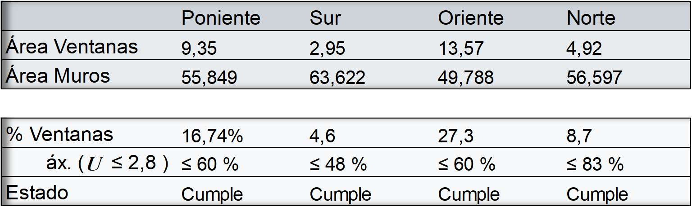

## Página 7

5) PARAMETROS DE CADA VENTANA EN CUMPLIMIENTO CON NORMATIVA TERMICA  
VENTANA V01

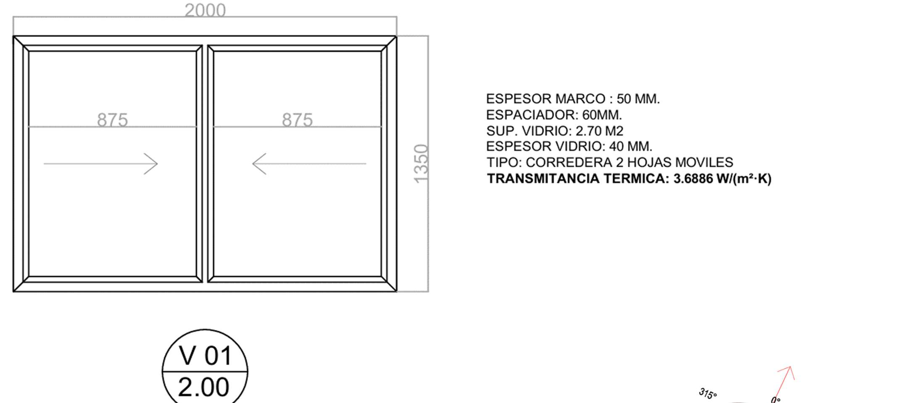

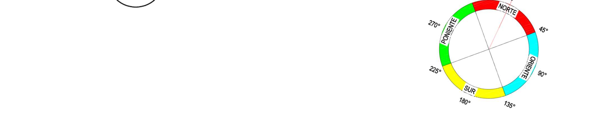

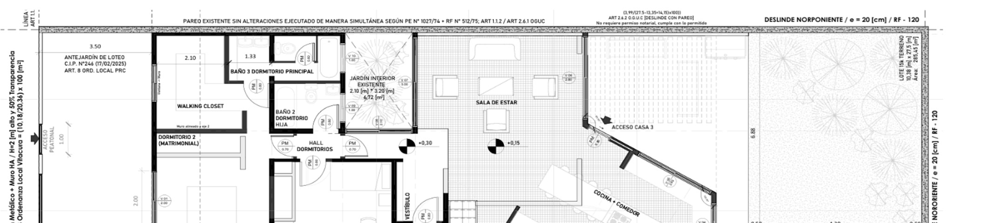

## Página 8

VENTANA V02

ESPESOR MARCO : 50 MM.
ESPACIADOR: 60MM.

SUP. VIDRIO: 2.70 M2

ESPESOR VIDRIO: 40 MM.

TIPO: CORREDERA 2 HOJAS MOVILES

JADÍN DE LOTEO

ART. 8 ORD. LOCAL PRC

WALKING CLOSET

ART 13 Ordenanza Local Vitacura = (10,18/20,38) x 100 [ma]

DESLINDE NORORIENTE / e = 20 [cm] / RF - 120

PISCINA PRIVADA INTERIOR
24 (m] * 438 [m]* 20 [pn)+ 10,512 ln]

DESLINDE SURPONIENTE / Portón Metálico + Muro HA / H=2 [m] alto y 50% Transparencia

15.25 sn 648

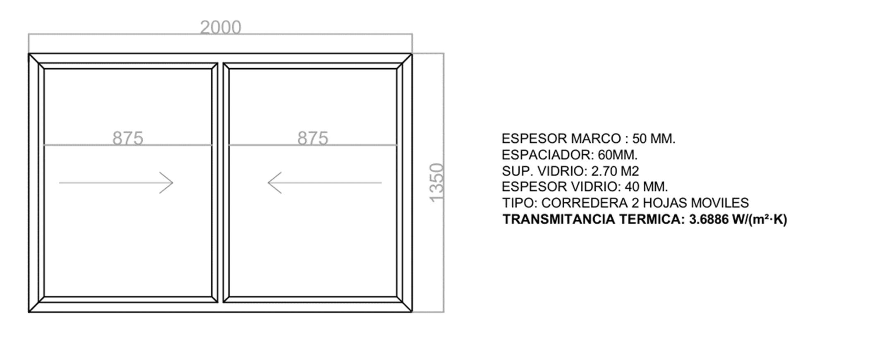

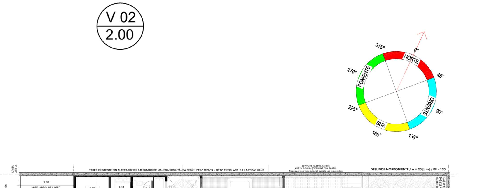

## Página 9

VENTANA V03

ESPESOR MARCO : 50 MM.
ESPACIADOR: 60MM.

SUP. VIDRIO: 0.25 M2
ESPESOR VIDRIO: 40 MM.
TIPO: FIJA

1 ARTZA3005€ [DESLADE

UNEA

1 PAREO EXISTENTE SIN ALTERACIONES EJECUTADO DE MANERA SIMULTÁNEA SEQÚN PE IV" 1027/74 + RF NC 312/73, ART 112 / ART 26. 00UC
ERE TERRIER NAO LEN LES UCRNAS

ANTEJARDÍN DE LOTEO
CLP.N"246 (17/02/2025)
ART.8 ORD. LOCAL PRC

ART 13 Ordenanza Local Vitacura = (10,18/20,35) x 100 [m3]

DESLINDE NORORIENTE / e = 20 [cm] / RF - 120

PISCINA PRIVADA INTERI(
24 (m] * 438 fm] * 20 femje 10,512 fo

DESLINDE SURPONIENTE / Portón Metálico + Muro HA / H=2 [m] alto y 50% Transparencia

Ui0* 25 PARKING (1%<30% ÁREA)

1525 E) 68

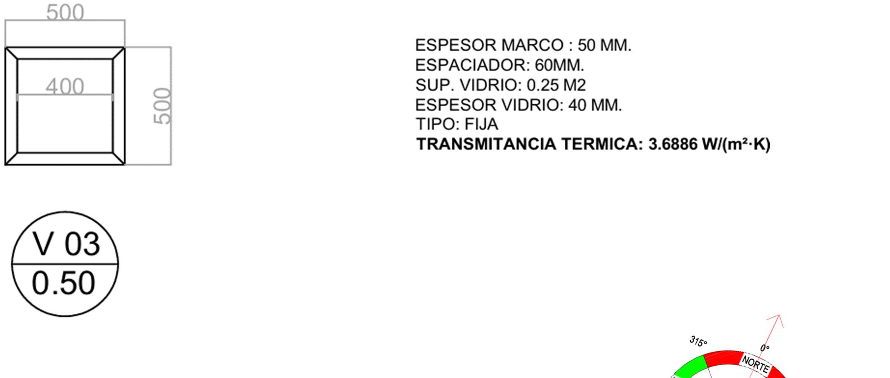

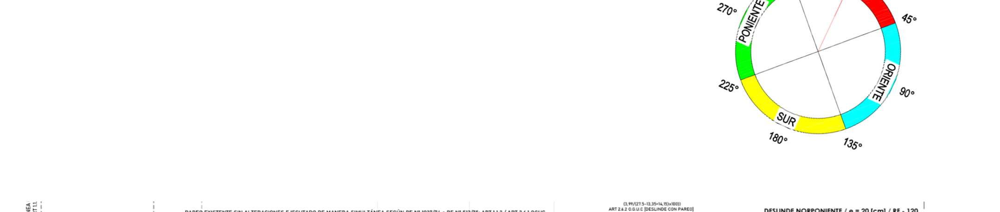

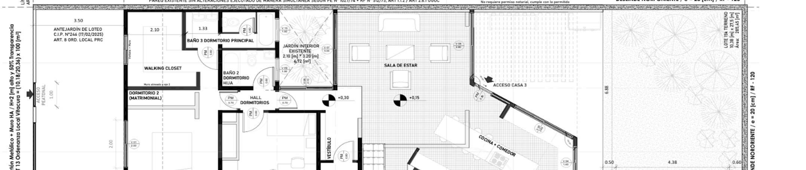

## Página 10

VENTANA VO4

ESPESOR MARCO : 50 MM.
ESPACIADOR: 60MM.

c SUP. VIDRIO: 0.84 M2

S ESPESOR VIDRIO: 40 MM.
TIPO: CORREDERA 2 HOJAS MOVILES

2. /E
MN %

- 9)
Sr

$3; ;
E ! PAREO EXISTENTE SIN ALTERACIONES EJECUTADO DE MANERA SIMULTÁNEA SEGÚN PE NC 1027/24 RF N'SIZ/78; ART 112 / ART 261 00UC

350

ANTEJARDÍN DE LOTEO
CAP. N"246 (11/02/2025)

ART.8 ORO. LOCAL PRE

ART 13 Ordenanza Local Vitacura = (10,18/20,35) x 100 [m2]

PISCINA PRIVADA INTERIOR
2.4 [mm] * 438 [m] * 20 [mj+ 10,512 jo

DESUNDE SURPONIENTE / Portón Metálico + Muro HA / H=2 [m] alto y 50% Transparencia

EA
DESLINDE SURORIENTE / e = 20 [cm] / RF - 120

1525 sn 648

1
1 ;

ñ 7 Norte
n :

1

2 AAA AAA

DESLINDE NORORIENTE / e = 20 [cm] / RF - 120

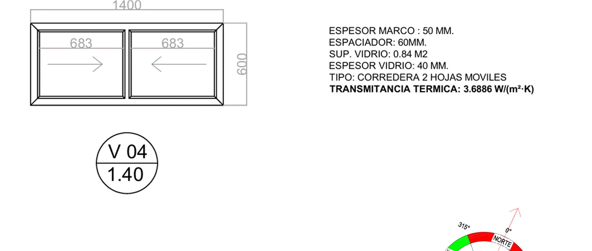

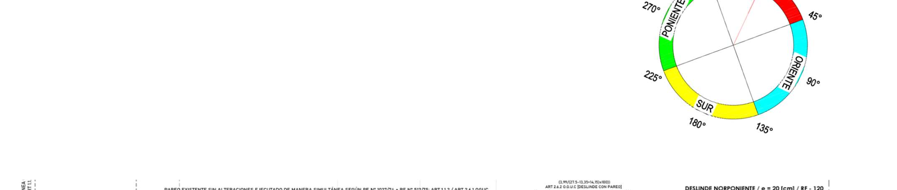

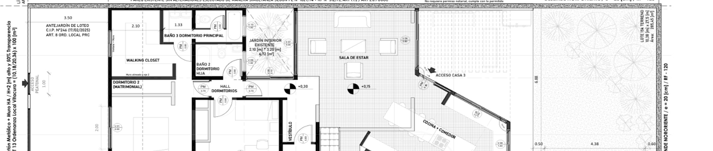

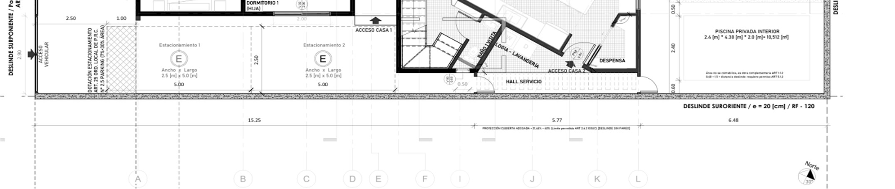

## Página 11

VENTANA VO05

2600

ESPESOR MARCO : 50 MM.
ESPACIADOR: 60MM.

SUP. VIDRIO: 1.56 M2

ESPESOR VIDRIO: 40 MM.

TIPO: CORREDERA 2 HOJAS MOVILES

950

go,
<te / 5 A 450

Y

S Ñ —

A AS
<25o A 2
' , 9
S A <
1890 7850

DESLINDE NORPONIENTE / e = 20 [cm] / RF - 120 |

as 039 mo)

PAREO EXISTENTE SIN ALTERACIONES EJECUTADO DE MANERA SIMULTÁNEA SEGÚN PE N" 1027/74 + RF N' 512/75; ART 1.12 / ART 261 00UC a a

Lunes

¡arras

- RRE RR PR ARAN A NE RR TR E RS PA RS AEREA LN RN RT ER RA

y

350
ANTEJARDÍN DE LOTEO
CLP.N"244 (11/02/2025)
ART.8 ORD. LOCAL PRC S
JARDÍN INTERIOR y

2:10 fm) 7220 fm]
412 fo]

o ACCESO CASA 3

ART 13 Ordenanza Local Vitacura = (10,18/20,35) x 100 [m2]

DESLINDE NORORIENTE / e = 20 [cm] / RF - 120

PISCINA PRIVADA INTERIOR

24 (m] * 438 fm] * 20 (rnje 10,512 fr]

DESLINDE SURPONIENTE / Portón Metálico + Muro HA / H=2 [m] alto y 50% Transparencia

1525 1%) 6x8

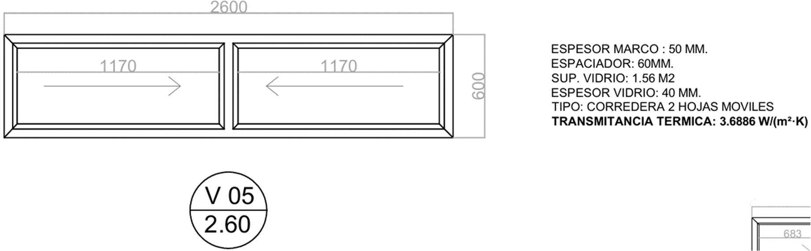

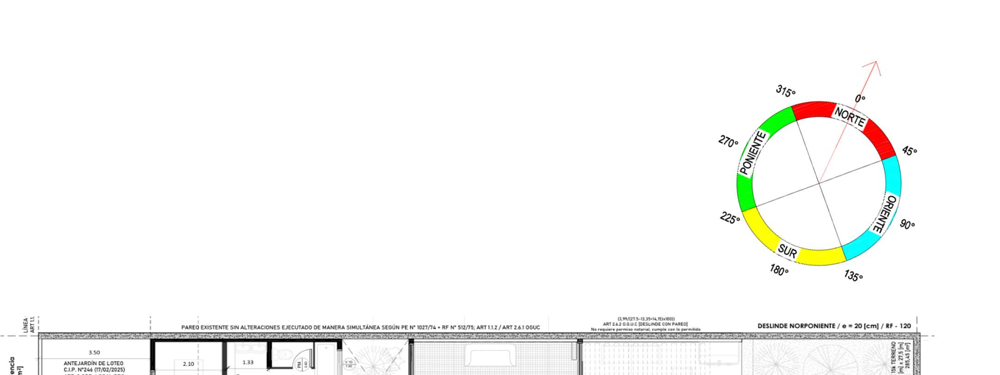

## Página 12

ART 13 Ordenanza Local Vitacura = (10,18/20,35) x 100 [m2]

DESLINDE SURPONIENTE / Portón Metálico + Muro HA / H=2 [m] alto y 50% Transparencia

Luna

¡ARTAL

VENTANA V06

2800

350

ANTEJARDÍN DE LOTEO
CAP.N"248 (17/02/2025)
ART. 8 ORD. LOCAL PRC

0 -
Aid

ACCESO
VEHICULAR

dl
28!
Sé
ni
EP%,

[DOTACIÓN ESTACIONAMIENTO

amara mo

ESPESOR MARCO : 50 MM.
ESPACIADOR: 60MM.

SUP. VIDRIO: 5.88 M2

ESPESOR VIDRIO: 40 MM.

TIPO: CORREDERA 2 HOJAS MOVILES

PISCINA PRIVADA INTERIOR
24 (m] * 4:38 fm] * 20 [rm]+ 10,512 ln

648

DESLINDE NORORIENTE / e = 20 [cm] / RF - 120

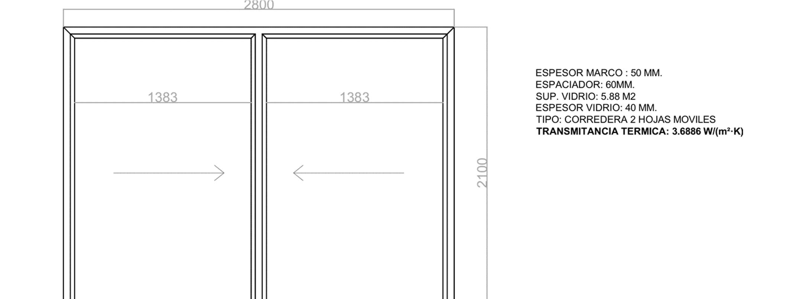

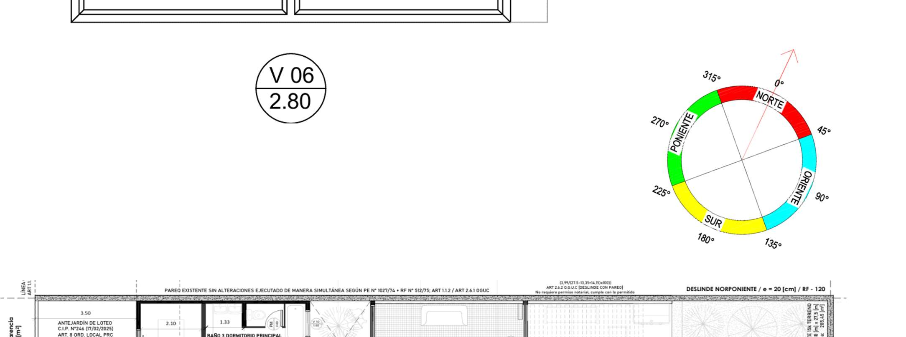

## Página 13

ART 13 Ordenanza Local Vitacura = (10,18/20,35) x 100 [m2]

DESUNDE SURPONIENTE / Portón Metálico + Muro HA / H=2 [m] alto y 50% Transparencia

VENTANA VO07

3000

ESPESOR MARCO : 50 MM.
ESPACIADOR: 60MM.

SUP. VIDRIO: 4.8 M2

ESPESOR VIDRIO: 40 MM.

TIPO: CORREDERA 2 HOJAS MOVILES

1600

¡ mars 039 mo
1 PAREO EXISTENTE SIN ALTERACIONES EJECUTADO DE MANERA SIMULTÁNEA SEGÚN PE N" 1027/74 + RF N* 512/75; ART112 / ART 261 00UC A da la DESLINDE NORPONIENTE / e = 20 [cm] / RF - 120
ERRATA TRES TAIANA NOSE DER IR IR IA RR TAN ESTE TARTA ETA RS DRAE

ARTI

Lunes

ANTEJARDÍN DE LOTEO
CLP.N"246 (17/02/2025)
ART. 8 ORD. LOCAL PRC

DESLINDE NORORIENTE / e = 20 [cm] / RF - 120

PISCINA PRIVADA INTERIOR
24 [mm] * 4.38 lo] * 20 fl» 10,512 jo

$ PARKING (1%30% ÁREA)
AAA

Elooración ESTACIONAMIENTO
250RD, LOCAL DEP.RC

RRE

DESLINDE SURORIENTE / e = 20 [cm] / RF - 120

15.25 sn 648

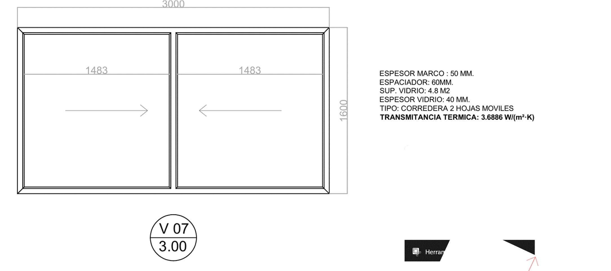

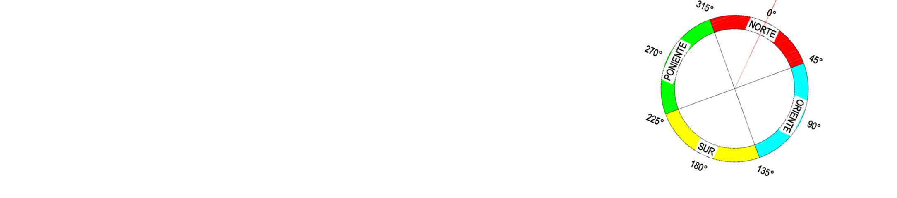

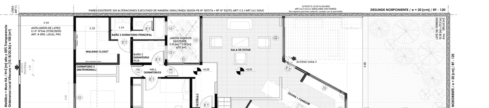

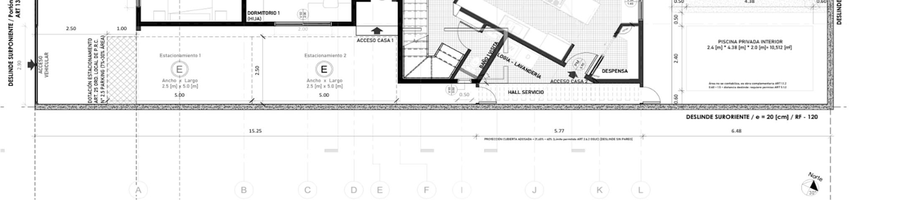

## Página 14

DESLINDE SURPONIENTE / Portón Metálico + Muro HA / H=2 [m] alto y 50% Transparencia

Lumen
ART

ART 13 Ordenanza Local Vitacura = (10,18/20,36) x 100 [m2]

VENTANA VO08

ANTEJARDÍN DE LOTEO
CAP. N*244 (19/02/2025)
ART. 8 ORO. LOCAL PRO

y

A

1600

ESPESOR MARCO : 50 MM.
ESPACIADOR: 60MM.

SUP. VIDRIO: 3.36 M2

ESPESOR VIDRIO: 40 MM.

TIPO: CORREDERA 2 HOJAS MOVILES

ns DESLINDE NORPONIENTE / e = 20 [cm] / RF - 120
HRS A

DESLINDE NORORIENTE / e = 20 [cm] / RF - 120

ISCINA PRIVADA INTERIOR

pr
24 fr] * 438 fo] * 200 fr 10.512 (ro

6s

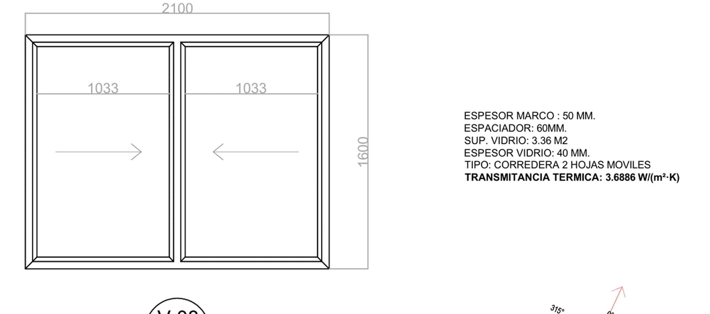

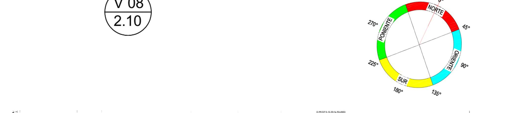

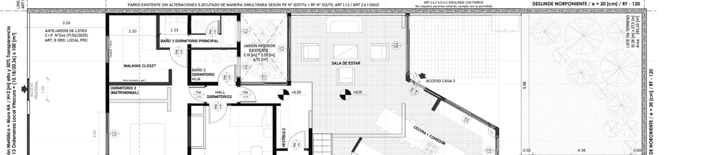

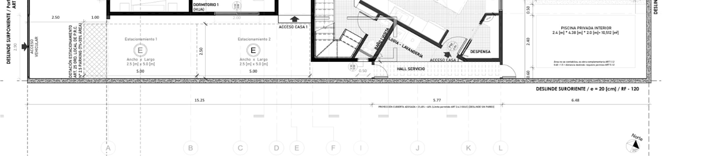

## Página 15

ART 13 Ordenanza Local Vitacura = (10,18/20,3) x 100 [m2]

DESLINDE SURPONIENTE / Portón Metálico + Muro HA / H=2 [m] alto y 50% Transparencia

VENTANA V09

ESPESOR MARCO : 50 MM.
ESPACIADOR: 60MM.

SUP. VIDRIO: 0.5 M2

ESPESOR VIDRIO: 40 MM.

TIPO: CORREDERA 2 HOJAS MOVILES

M/S 38 A m0), |
.e PESUROS con pase DESLINDE NORPONIENTE / e = 20 [cm] / RF - 120 |

1 PAREO EXISTENTE SIN ALTERACIONES EJECUTADO DE MANERA SIMULTÁNEA SEQUN PE N 1027/74 + RF N" 512/75; ART 112 /ART 26 OGUC sa,

ANTEJARDÍN DE LOTEO
C_P.N"246 (17/02/2025)
ART. 8 ORD. LOCAL PRC

LOTE 15h TERRENO Pl]

10,38 jon] x 27,5 fm]
Área 285,45 [0]

DESLINDE NORORIENTE / e = 20 [cm] / RF - 120

PISCINA PRIVADA INTERIOR
24 (m]* 438 fm] * 20 (ro]e 10,512 foi]

A
tl
]
Bl
ll
E
DESLINDE SURORIENTE / e = 20 [cm] / RF - 120

15.25 sm 648

Mor

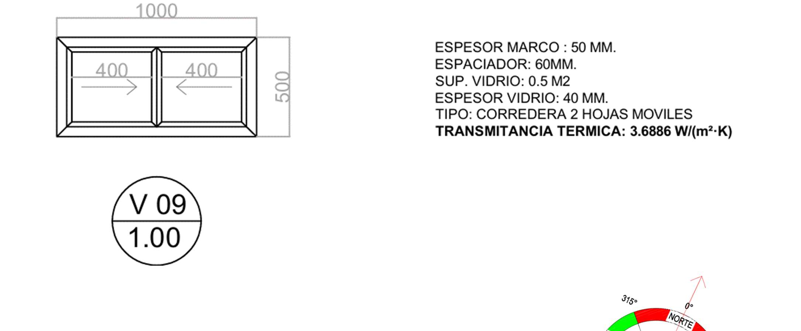

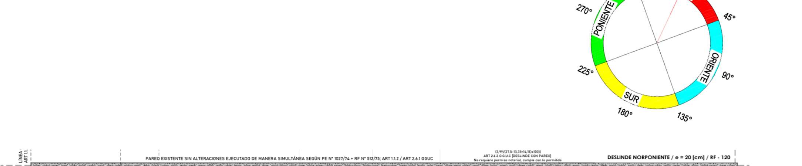

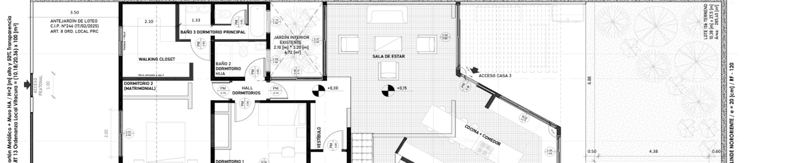

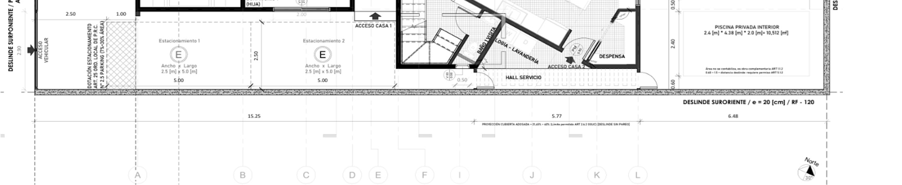

## Página 16

VENTANA V10

ESPESOR MARCO : 50 MM.
ESPACIADOR: 60MM.

SUP. VIDRIO: 0.5 M2

ESPESOR VIDRIO: 40 MM.

TIPO: CORREDERA 2 HOJAS MOVILES

oz»
3 ( RE
2/0 iS XA .
Y A 45
U/ A > a
AN

350

ANTEJARDÍN DE LOTEO
CLP.N"248 (11/02/2025)
ART. 8 ORD. LOCAL PRO

JARDÍN INTERIOR

BMSTENTE
210 (m)73204m)
472101

ART 13 Ordenanza Local Vitacura = (10,18/20,36) x 100 [m3]

DESLINDE NORORIENTE / e = 20 [cm] / RF - 120

PISCINA PRIVADA INTERIOR
24 [mm] * 4.38 fm] * 20 [+ 10,512 ja]

lo
25

DESLINDE SURPONIENTE / Portón Metálico + Muro HA / H=2 [m] alto y 50% Transparencia

[DOTACIÓN ESTACIONAMIENTO
|N"25 PARKING (7%<30% ÁREA)

ART. 25 ORD. LOCAL DEP.R.C

RN E RI RS AT RAR RS A E RI EII
1 DESLINDE SURORIENTE / e = 20 [cm] / RF - 120

15.25 sn 648

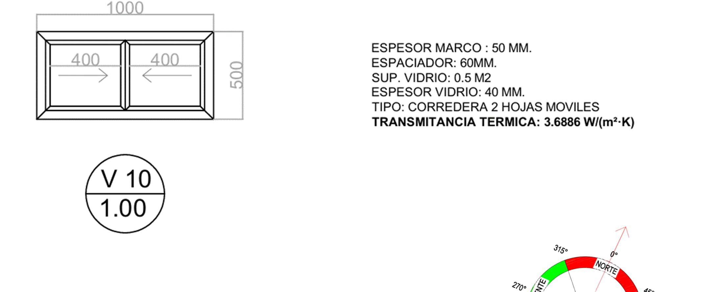

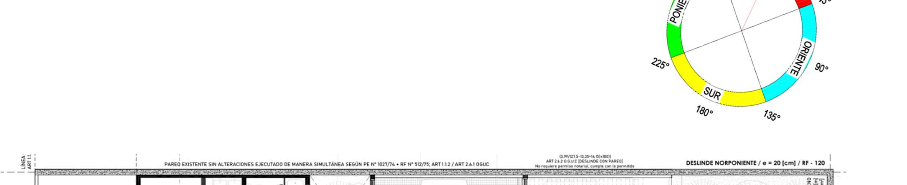

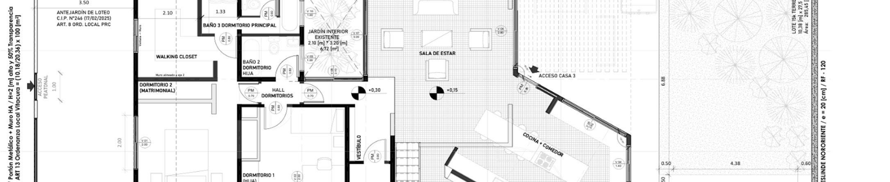

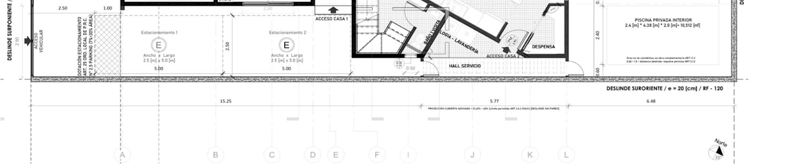

## Página 17

VENTANA V11

ESPESOR MARCO : 50 MM.
ESPACIADOR: 60MM.

LO DEMO: LE DESAMOR SUMPOENTE (LARGO TOTAL = 16,38 (7

SUP. VIDRIO: 2.25 M2
ESPESOR VIDRIO: 40 MM.
TIPO: CORREDERA 2 HOJAS MOVILES

450

LS
O
[OOOO]
pS

OOOO yA

OO

KE CESLINOE SUMORENTE (LARGO TOTAL + 31.38 (pl)

EL CEL NDE NOMPOMENTE (LARDO POTAL + 10,38 Jr)

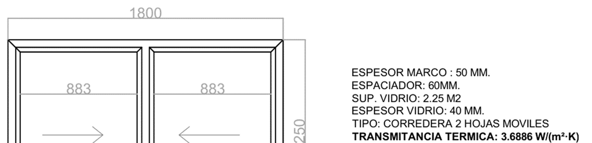

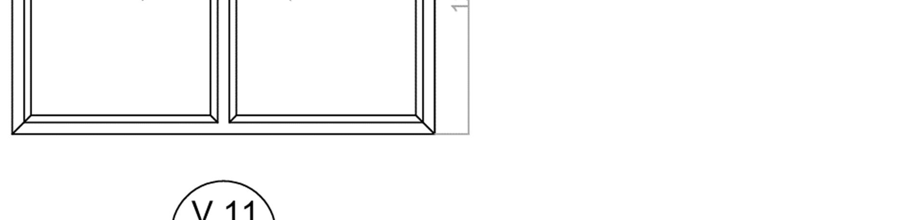

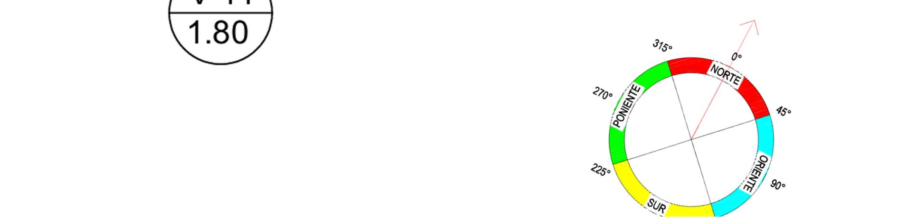

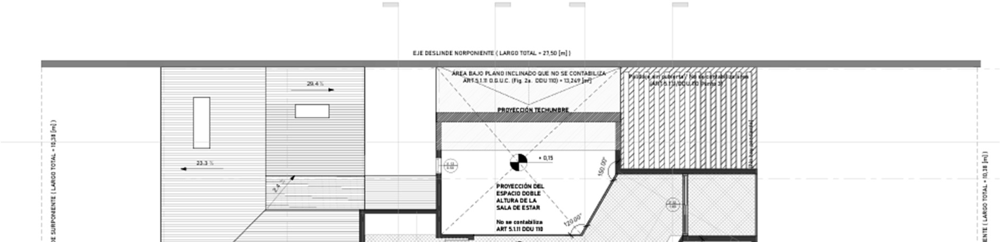

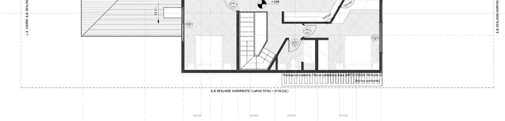

## Página 18

VENTANA 12

LO. DEMRO: E CESLINDE SURPONIENTE | LARGO TOTAL + 18:38 lp)

EJE DESLINDE NORPCASENTE ( LARGO TOTAL + 2230 [m1

EL CESLINCE SUMORENTE | LANCO TOTAL = 31.38 (pe)

ESPESOR MARCO : 50 MM.
ESPACIADOR: 60MM.

SUP. VIDRIO: 0.36 M2

ESPESOR VIDRIO: 40 MM.

TIPO: CORREDERA 2 HOJAS MOVILES

LE DESLINCE NONPONEENTE (LARGO TOTAL + 10,38 Jr)

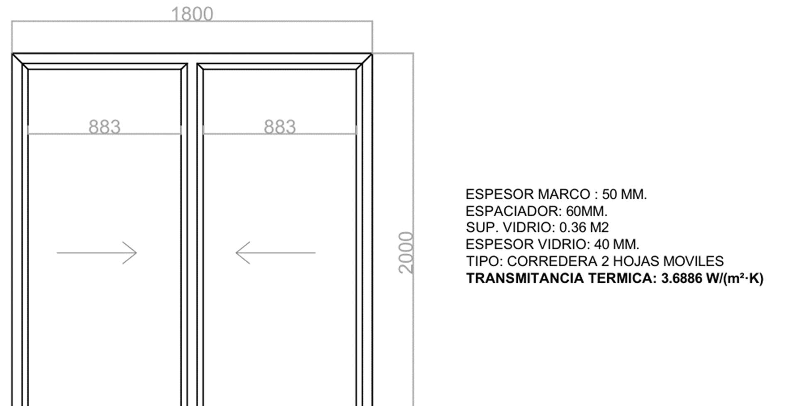

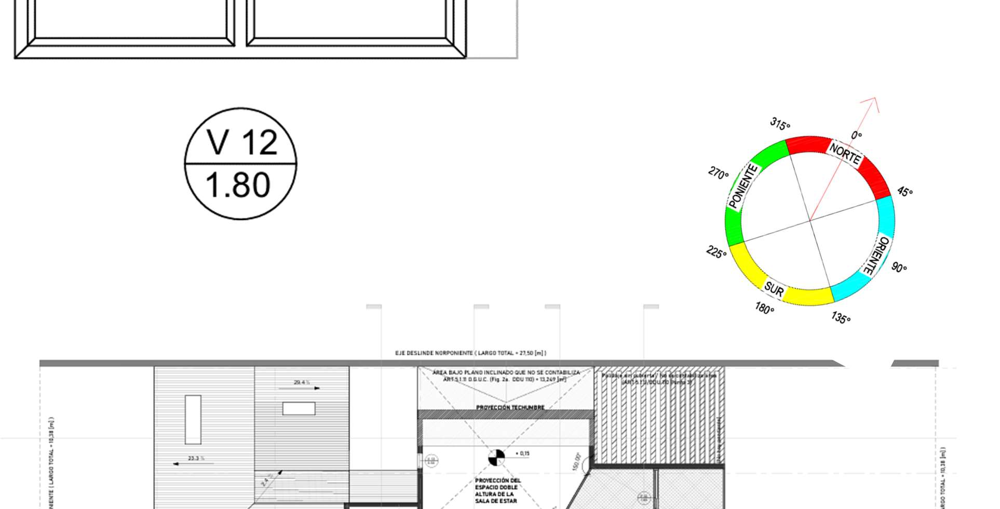

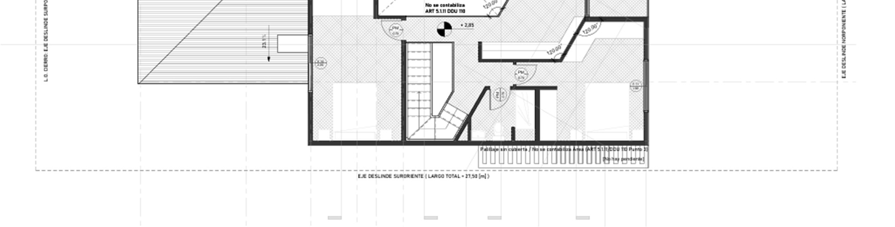

## Página 19

VENTANA V13

TIPO: CORREDERA 2 HOJAS MOVILES

=
>
3
e]
¡0)
04
<
2
14
O
0
w
o
0
1%

ESPACIADOR: 60MM.
SUP. VIDRIO: 0.25 M2
ESPESOR VIDRIO: 40 MM.

EJE DESUNDE NORPCAENTE (LARGO TOTAL + 2230 [m1

Ny

UA ACTOS + TVLOL OSA) MINO AMO BEN T530 2

AO
A A A

A

IL CESLINCE SUMORCENTE [LARGO TOTA

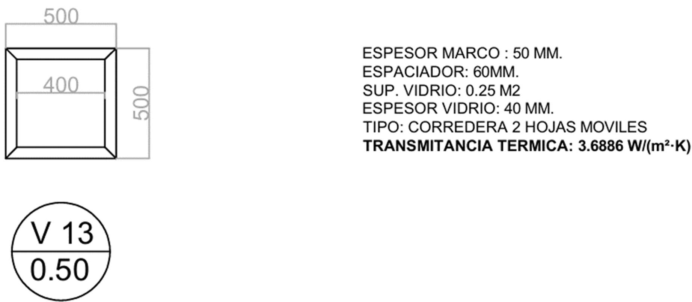

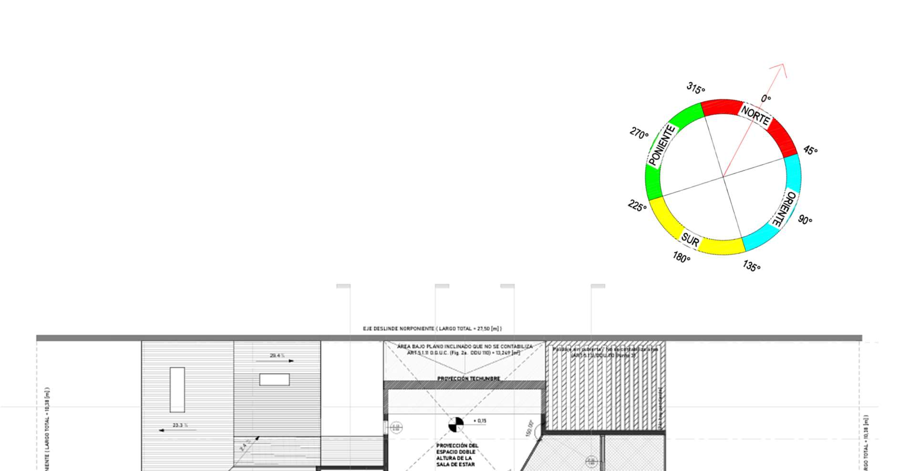

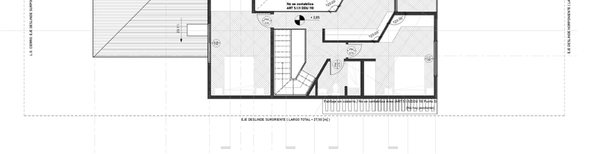

## Página 20

VENTANA V14 
 
 
 
 
 
 
 
 
 
 
 
 
 
 
 
 
 
 
 
 
 
 
 
 
VENTANA V14

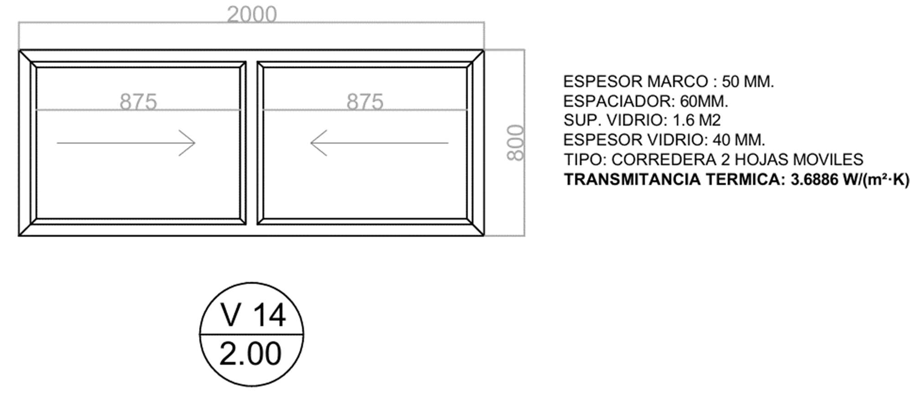

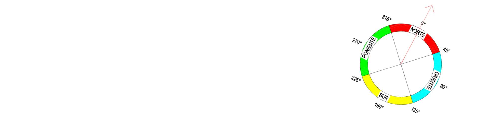

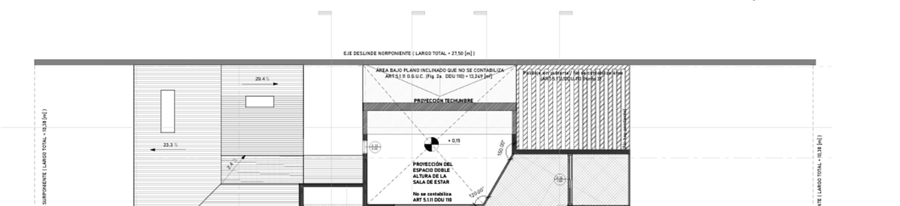


## Página 21

PLANILLA DE CÁLCULO TRANSMITANCIA DE VENTANAS: V 01, V 02


## Página 22

PLANILLA DE CÁLCULO TRANSMITANCIA DE VENTANAS: V 03


## Página 23

PLANILLA DE CÁLCULO TRANSMITANCIA DE VENTANAS: V 04


## Página 24

PLANILLA DE CÁLCULO TRANSMITANCIA DE VENTANAS: V 05, V 06


## Página 25

PLANILLA DE CÁLCULO TRANSMITANCIA DE VENTANAS: V 07


## Página 26

PLANILLA DE CÁLCULO TRANSMITANCIA DE VENTANAS: V 08


## Página 27

PLANILLA DE CÁLCULO TRANSMITANCIA DE VENTANAS: V 09


## Página 28

PLANILLA DE CÁLCULO TRANSMITANCIA DE VENTANAS: V10

## Página 29

PLANILLA DE CÁLCULO TRANSMITANCIA DE VENTANAS: V 11


## Página 30

PLANILLA DE CÁLCULO TRANSMITANCIA DE VENTANAS: V 12


## Página 31

PLANILLA DE CÁLCULO TRANSMITANCIA DE VENTANAS: V 13


## Página 32

PLANILLA DE CÁLCULO TRANSMITANCIA DE VENTANAS: V 14


## Página 33

Planilla-análisis-higrotérmico MURO EMB-SIP-YC 
 
MATERIALES 
 
 
 
N
Biblioteca
Material 
Abreviatura Propiedad 
térmica 
Valor 
propiedad 
térmica 
Propiedad 
difusión 
de vapor 
Valor 
propiedad 
difusión de 
vapor 
1
ISO 10456 
- Tabla 3 
metales -
Acero 
inoxidable, 
ρ 
= 
7900 kg/m³ 
EMB EXT
λ [W/mK]
17
μ []
inf
2
DITEC
EPS ρ = 15 kg/m³ -
archipex 
EMB INT
λ [W/mK]
0,0413
μ []
35
3
DITEC
Tyvek homewrap
M HYDRO
R 
[m²K/W] 
0
μ []
1761
4 
DITEC 
OSB ρ = 648 kg/m³ OSB - SIP 
λ [W/mK] 0,14 
μ [] 
371 
5 
DITEC 
EPS ρ = 15 kg/m³ - 
archipex 
OSB - SIP 
λ [W/mK] 0,0413 
μ [] 
35 
6
DITEC
OSB ρ = 648 kg/m³ OSB - SIP
λ [W/mK]
0,14
μ []
371
7
DITEC
Yeso Cartón ST ρ = 
750 kg/m³ 
YC
λ [W/mK]
0,24
μ []
20
8 
ISO 10456 
- Tabla 3 
Enlucidos 
- 
Enlucido de yeso, 
ρ = 1000 kg/m³ 
ENL Y 
λ [W/mK] 0,4 
μ [] 
10 
9

## Página 34

CONFIGURACIÓN 
 
 
 
Espesor capas
Capas
Sección A
Total sec
Espesor 
capas, d 
Nombre Sección: 
EMB / SIP / YC 
RT eq 
[m]
Fracción de área, f:
[m²K/W] 
0,02 
Capa 1 
metales - Acero inoxidable, ρ = 7900 
kg/m³, λ = 17 [W/mK], μ = inf 
0,001 
0,05
Capa 2
EPS ρ = 15 kg/m³ - archipex, λ = 
0,0413 [W/mK], μ = 35 [] 
1,211
0,000175
Capa 3
Tyvek homewrap, R = 0 [m²K/W], μ
= 1761 [] 
0,000
0,011 
Capa 4 
OSB ρ = 648 kg/m³, λ = 0,14 
[W/mK], μ = 371 [] 
0,079 
0,09
Capa 5
EPS ρ = 15 kg/m³ - archipex, λ = 
0,0413 [W/mK], μ = 35 [] 
2,179
0,011
Capa 6
OSB ρ = 648 kg/m³, λ = 0,14 
[W/mK], μ = 371 [] 
0,079
0,008 
Capa 7 
Yeso Cartón ST ρ = 750 kg/m³, λ = 
0,24 [W/mK], μ = 20 [] 
0,033 
0,01
Capa 8
Enlucidos - Enlucido de yeso, ρ = 
1000 kg/m³, λ = 0,4 [W/mK], μ = 10 
0,025
Espesor total 
= 0,2002 [m] 
RT sección [m²K/W] =
3,78

## Página 35

Transmitancia 
 
 
 
Cálculo de la Resistencia Térmica Total, RT para la sección: 
  
Sección: A
EMB / SIP / YC
Capa
Material
espesor [m]
R [m²K/W]
Rse  
  
0,040 
1 metales - Acero inoxidable, ρ = 7900 kg/m³
0,02
0,001
2 EPS ρ = 15 kg/m³ - archipex 
0,05 
1,211 
3 Tyvek homewrap 
0,000175 
0,000 
4 OSB ρ = 648 kg/m³
0,011
0,079
5 EPS ρ = 15 kg/m³ - archipex 
0,09 
2,179 
6 OSB ρ = 648 kg/m³
0,011
0,079
7 Yeso Cartón ST ρ = 750 kg/m³
0,008
0,033
8 Enlucidos - Enlucido de yeso, ρ = 1000 kg/m³ 
0,01 
0,025 
Rsi
0,130
  
  
Resistencia térmica 
total de la sección, 
[m²K/W]:
3,776 
Resistencia Térmica Total, RT =  
3,78 
[m²K/W]

## Página 36

CONDENSACIÓN 
  
CONDENSACIÓN SEGÚN 
NCH1973.OF2014 
  
  
  
  
  
  
  
    
  
  
  
  
  
  
  
  
  
  
  
  Condiciones de análisis 
  
  
  
             
    
  
  
  
  
  
  
  
  
  
  
 
    
Julio 
  
  
  
  
  
  
  
  
  
 
  
Temp. exterior, 
ϴ_e 
2,2 °C 
  
  
  
  
  
  
  
  
  
 
  
HR exterior, 
ϕ_e 
92% 
  
  
  
  
  
  
  
  
  
 
  
Temp. interior, 
ϴ_i 
19 °C 
  
  
  
  
  
  
  
  
  
 
  HR interior, ϕ_i 
75% 
  
  
  
  
  
  
  
  
  
 
  
HR crítica, 
ϕ_sicr 
100% 
  
ϕ_sicr 
por 
defecto 100%  
  
  
  
  
  
 
  Mobiliario 
No 
  
  
  
  
  
  
  
  
  
 
  Resultados 
  
  
  
  
             
  
    
  
  
  
  
  
  
  
  
  
  
 
  
Descripción del 
elemento:
Muro estructural SIP (OSB+EPS) + emballetado POL 
exterior 
 (EPS 15 Kg/m3 +Acero 7850 Kg/m3)  
  
  
  
 
 
 
 
 
 
 
 
 
 
  
  
Zona Térmica: Zona D 
  
Alcance: Vitacura 
 
 
  
  
 
 
 
 
 
 
 
 
 
 
  
  Condensación superficial 
  
  
  
  
  
  
  
  
 
  
  
¿Cumple? 
1 
Todas las secciones analizadas tienen 
una resistencia térmica 
 total mayor o igual al mínimo 
requerido. La condición 
 más estricta para el emplazamiento 
ocurre en el mes de Julio.

## Página 37

Condensación intersticial 
  
  
  
  
  
  
  
  
  
 
  
 
 
 
 
 
 
 
 
 
 
  
  
¿Cumple? 
0 
Una o más interfaces presenta 
condensación. 
  
    
  
  
  
  
  
  
  
  
  
  
 
  
 
  
  
  
  
  
  
  
  
 
  
  
  
  
  
  
  
  
  
 
  Detalles de cálculo 
  
  
  
             
  
  Condensación superficial 
  
  
  
  
  
  
  
  
  
 
    
  
  
  
  
  
  
  
  
  
  
 
  
Rt mín requerido por 
sección =
0,4
82   
La condición más 
estricta para el 
emplazamiento ocurre 
en el mes de Julio. 
  
Sección 
Rt sección
¿Cu
mpl
e?   
  
A:  EMB / SIP / 
YC 
3,776 
1 
  
  
  
  
  
  
  
  
 
 
 
 
 
 
 
 
 
 
 
 
 
 
Condensación intersticial 
  
  
  
  
  
  
  
  
  
  
  
  
  
  
Cantidad de interfases con 
condensación 
  
  
  
  
  
Sección 
Jul 
¿Cumple? 
  
  
  
  
  
A:  EMB 
/ SIP / 
YC 
2 
0 
  
  
  
  
  
  
  
  
  
  
  
  
  
Gráficos  
  
  
  
  
  
  
  
Sección de 
análisis para 
gráficos: A 
 EMB / SIP / YC 
:

## Página 38

Perfil de presión de vapor de agua

EXTERIOR

aaa, Presión de
saturación

EXTERIOR

Capa 1: EMB EXT

Capa 2] EMB INT

úl
co
2
u
..
o
a
ro
o

Sd Total = 20013,6 [m] ——————————+

Espesor de capa de aire equivalente, Sd, [m]

mu = Presión de vapor de Interfaz de
la Sección condensación
Perfil de temperatura

apa 4]OSB - SIP
Capa,S] emb INT
Capa 8: ENL

Espesor, d, [m]

za. Temperatura de Temperatura de

rocío la Sección

INTERIOR

INTERIOR


## Página 39

Planilla-análisis-higrotérmico MURO EMB-SIP-YC-pino 
 
 
MATERIALES 
N
Biblioteca
Material
Abreviatura
Propiedad 
térmica 
Valor 
propie
dad 
térmica
Propiedad 
difusión 
de vapor 
Valor 
propiedad 
difusión de 
vapor 
1
ISO 10456 
- Tabla 3 
metales -
Acero 
inoxidable, ρ 
= 7900 
kg/m³ 
EMB EXT
λ [W/mK]
17
μ []
inf
2
DITEC
EPS ρ = 15 
kg/m³ - 
archipex 
EMB INT
λ [W/mK]
0,0413
μ []
35
3
DITEC
Tyvek 
homewrap 
M HYDRO
R [m²K/W]
0
μ []
1761
4
DITEC
OSB ρ = 648 
kg/m³ 
OSB - SIP
λ [W/mK]
0,14
μ []
371
5 
DITEC 
Pino insigne 
ρ = 410 
kg/m³ 
OSB - SIP 
λ [W/mK] 
0,104 
μ [] 
64 
6 
DITEC 
OSB ρ = 648 
kg/m³ 
OSB - SIP 
λ [W/mK] 
0,14 
μ [] 
371 
7 
DITEC 
Yeso Cartón 
ST ρ = 750 
kg/m³ 
YC 
λ [W/mK] 
0,24 
μ [] 
20 
8 
ISO 10456 
- Tabla 3 
Enlucidos - 
Enlucido de 
yeso, ρ = 
1000 kg/m³ 
ENL Y 
λ [W/mK] 
0,4 
μ [] 
10

## Página 40

CONFIGURACIÓN 
Espesor capas
Capas
Sección A
Total sec
Espesor capas, 
d 
Nombre Sección:
  
RT eq 
[m]
Fracción de área, f:
[m²K/W] 
0,02
Capa 1
metales - Acero inoxidable, ρ = 
7900 kg/m³, λ = 17 [W/mK], μ = 
inf 
0,001
0,05
Capa 2
EPS ρ = 15 kg/m³ - archipex, λ = 
0,0413 [W/mK], μ = 35 [] 
1,211
0,000175
Capa 3
Tyvek homewrap, R = 0 [m²K/W], 
μ = 1761 [] 
0,000
0,011 
Capa 4 
OSB ρ = 648 kg/m³, λ = 0,14 
[W/mK], μ = 371 [] 
0,079 
0,09 
Capa 5 
Pino insigne ρ = 410 kg/m³, λ = 
0,104 [W/mK], μ = 64 [] 
0,865 
0,011 
Capa 6 
OSB ρ = 648 kg/m³, λ = 0,14 
[W/mK], μ = 371 [] 
0,079 
0,008
Capa 7
Yeso Cartón ST ρ = 750 kg/m³, λ = 
0,24 [W/mK], μ = 20 [] 
0,033
0,01
Capa 8
Enlucidos - Enlucido de yeso, ρ = 
1000 kg/m³, λ = 0,4 [W/mK], μ = 
10 
0,025
Espesor total 
= 0,2002 [m] 
RT sección [m²K/W] 
= 
2,46

## Página 41

TRANSMITANCIA 
Detalles de cálculo 
  
  
  
  
  
Cálculo de la Resistencia Térmica Total, RT para la sección: 
  
  
Sección: 
A 
  
  
Capa 
Material 
espesor [m] 
R [m²K/W] 
  
Rse  
  
0,040 
  
1
metales - Acero inoxidable, ρ 
= 7900 kg/m³ 
0,02 
0,001 
  
2 EPS ρ = 15 kg/m³ - archipex 
0,05 
1,211 
  
3 Tyvek homewrap 
0,000175 
0,000 
  
4 OSB ρ = 648 kg/m³ 
0,011 
0,079 
  
5 Pino insigne ρ = 410 kg/m³ 
0,09 
0,865 
  
6 OSB ρ = 648 kg/m³ 
0,011 
0,079 
  
7 Yeso Cartón ST ρ = 750 kg/m³
0,008 
0,033 
  
8
Enlucidos - Enlucido de yeso, 
ρ = 1000 kg/m³ 
0,01 
0,025 
  
Rsi  
  
0,130 
  
  
  
Resistencia térmica total 
de la sección, [m²K/W]:
2,463 
  
  
  
  
  
  
Resistencia Térmica Total, RT =  
2,46 
[m²K/W]

## Página 42

CONDENSACIÓN 
CONDENSACIÓN SEGÚN 
NCH1973.OF2014 
  
  
  
  
  
  
    
  
  
  
  
  
  
  
  
  
  
  
    
Condiciones de 
análisis 
  
  
  
  
  
  
  
  
  
   
  
  
  
  
  
  
  
  
  
  
  
    
  
Julio 
  
  
  
  
  
  
  
  
  
    
Temp. 
exterior, ϴ_e 
2,2 °C 
  
  
  
  
  
  
  
  
  
    
HR exterior, 
ϕ_e 
92% 
  
  
  
  
  
  
  
  
  
    
Temp. interior, 
ϴ_i 
19 °C 
  
  
  
  
  
  
  
  
  
    
HR interior, 
ϕ_i 
75% 
  
  
  
  
  
  
  
  
  
    
  
  
  
  
  
  
  
  
  
  
  
    
HR crítica, 
ϕ_sicr 
100% 
  
ϕ_sicr 
por 
defecto 100%  
  
  
  
  
  
    
Mobiliario
No
Resultados
A continuación se muestran los resultados obtenidos para el análisis de riesgo de 
condensación superficial e intersticial del elemento, de acuerdo con NCh1973.2014. 
  
  
  
  
  
  
  
  
  
  
  
    
Descripción del 
elemento:
Muro estructural SIP (OSB+EPS) + emballetado POL exterior (EPS 15 Kg/m3 
+Acero 7850 Kg/m3) - uniones pino insigne 2" x 4" 
  
  
  
 
 
 
 
 
 
 
 
 
 
 
   
Zona Térmica: Zona D
Alcance: Vitacura
Condensación superficial  
  
  
  
  
  
  
  
  
    
¿Cumple? 
1 
Todas las secciones analizadas tienen una resistencia 
térmica total mayor o igual al mínimo requerido. La 
condición más estricta para el emplazamiento ocurre en el 
mes de Julio. 
  
Nota: Cumplir la exigencia de Condensación Superficial no exime a la solución constructiva de 
cumplir otros requerimientos como la Transmitancia Térmica o Condensación Intersticial. 
Condensación intersticial

## Página 43

¿Cumple? 
0 
Una o más interfaces presenta condensación. 
  
Nota: Cumplir la exigencia de Condensación Intersticial no exime a la solución constructiva de 
cumplir otros requerimientos como la Transmitancia Térmica o Condensación Superficial. 
  
  
  
  
  
  
  
  
  
  
  
    
  
  
  
  
  
  
  
  
    
  
  
  
  
  
  
  
  
    
Detalles de cálculo
A continuación se muestran los resultados detallados obtenidos para el análisis de riesgo de 
condensación superficial e intersticial del elemento, de acuerdo con NCh1973.2014. 
Condensación superficial  
  
  
  
  
  
  
  
  
    
Rt mín requerido por sección 
=
0,482 
  
La condición más estricta para el 
emplazamiento ocurre en el mes de 
Julio. 
  
Sección
Rt sección
¿Cumple?
A:  
2,463 
✔ 
  
  
  
  
  
  
  
  
    
  
  
  
  
  
  
  
  
  
  
  
    
Condensación intersticial 
  
  
  
  
    
  
Cantidad de interfases con condensación 
  
  
  
    
  
Sección    
                           Jul 
¿Cumple?
  
  
  
    
  
A: 
3
0
Gráficos 
  
  
  
  
  
    
  
  
Sección de análisis para 
gráficos:
A 
 
 
Julio 
  
  
  
  
Mes de 
análisis 
para 
gráficos:

## Página 44

EXTERIOR

Perfil de presión de vapor de agua

EXTERIOR

ma Presión de
saturación

1)
co
2
u
.s
]
a
mo
o

Sd Total = 20016,2 [(m] ——————————+

Espesor de capa de aire equivalente, Sd, [m]

mu Presión de vapor de Interfaz de
la Sección condensación

Perfil de temperatura

Capa 1: EMB EXT
Capa 2J EMB INT

Área del gráfico

Espesor, d, [m]

Temperatura de Temperatura de

rocío la Sección

INTERIOR

INTERIOR


## Página 45

Planilla-análisis-higrotérmico MURO LAD-EMB 
 
 
MATERIALES 
N Biblioteca 
Material 
Abreviatur
a 
Propiedad 
térmica 
Valor 
propieda
d térmica
Propieda
d difusión 
de vapor 
Valor 
propieda
d difusión 
de vapor 
1 ISO 10456 - 
Tabla 5 
metales - 
Acero 
inoxidable, ρ 
= 7900 kg/m³ 
EMB EXT 
R [m²K/W] 
0 
Sd [m] 
  
2 DITEC
EPS ρ = 15 
kg/m³ - 
archipex 
EMB INT
λ [W/mK]
0,0413
μ []
35
3 DITEC 
Adhesivo EIFS 
EIFS 
R [m²K/W] 
0 
μ [] 
60 
4 DITEC 
Ladrillo fiscal 
ρ = 1500 
kg/m³ 
LAD FIS 
λ [W/mK] 
0,5 
μ [] 
9 
5 ISO 10456 - 
Tabla 3 
Enlucidos - 
Enlucido de 
yeso, ρ = 1000 
kg/m³ 
ENL Y 
λ [W/mK] 
0,4 
μ [] 
10

## Página 46

CONFIGURACIÓN 
 
 
 
Espesor capas 
Capas 
Sección A 
Total 
sec 
Espesor capas, d 
Nombre Sección:
 EMB / SIP / YC 
RT eq 
[m]
Fracción de área, f:
[m²K/W
]  
0,02
Capa 1
metales - Acero inoxidable, ρ = 
7900 kg/m³, R = 0 [m²K/W], Sd =  
[m] 
0,000
0,05 
Capa 2 
EPS ρ = 15 kg/m³ - archipex, λ = 
0,0413 [W/mK], μ = 35 [] 
1,211 
0,02 
Capa 3 
Adhesivo EIFS, R = 0 [m²K/W], μ = 
60 [] 
0,000 
0,14
Capa 4
Ladrillo fiscal ρ = 1500 kg/m³, λ = 
0,5 [W/mK], μ = 9 [] 
0,280
0,02 
Capa 5 
Enlucidos - Enlucido de yeso, ρ = 
1000 kg/m³, λ = 0,4 [W/mK], μ = 
10 
0,050 
Espesor total = 0,25 
[m] 
RT sección [m²K/W] = 
1,71

## Página 47

TRANSMITANCIA 
 
 
 
  
  
  
  
Cálculo de la Resistencia Térmica Total, RT para la sección: 
  
Sección: 
A 
 EMB / SIP / YC 
Capa 
Material 
espesor [m] 
R [m²K/W] 
Rse  
  
0,040 
1
metales - Acero inoxidable, 
ρ = 7900 kg/m³ 
0,02 
0,000 
2 EPS ρ = 15 kg/m³ - archipex 
0,05 
1,211 
3 Adhesivo EIFS 
0,02 
0,000 
4
Ladrillo fiscal ρ = 1500 
kg/m³ 
0,14 
0,280 
5
Enlucidos - Enlucido de 
yeso, ρ = 1000 kg/m³ 
0,02 
0,050 
Rsi  
  
0,130 
  
  
Resistencia térmica total de la 
sección, [m²K/W]:
1,711 
  
  
  
  
Resistencia Térmica Total, RT =  
1,71 
[m²K/W]

## Página 48

CONDENSACIÓN 
  
CONDENSACIÓN SEGÚN 
NCH1973.OF2014 
  
  
  
  
  
  
  
  
  
    
  
  
  
  
  
  
  
  
  
  
  
  
  
  
Condiciones de 
análisis 
  
  
  
  
  
  
  
  
  
  
  
  
    
  
  
  
  
  
  
  
  
  
  
  
  
  
    
Julio 
  
  
  
  
  
  
  
  
  
  
  
  
  
Temp. exterior, 
ϴ_e 
2,2 °C   
  
  
  
  
  
  
  
  
  
  
  
  
HR exterior, 
ϕ_e 
92% 
  
  
  
  
  
  
  
  
  
  
  
  
  
Temp. interior, 
ϴ_i 
19 °C 
  
  
  
  
  
  
  
  
  
  
  
  
  HR interior, ϕ_i
75% 
  
  
  
  
  
  
  
  
  
  
  
  
    
  
  
  
  
  
  
  
  
  
  
  
  
  
  
HR crítica, 
ϕ_sicr 
100% 
  
ϕ_sicr 
por 
defecto 100%  
  
  
  
  
  
  
  
  
Mobiliario
No
  Resultados
  
A continuación se muestran los resultados obtenidos para el análisis de riesgo de condensación 
superficial e intersticial del elemento, de acuerdo con NCh1973.2014. 
    
  
  
  
  
  
  
  
  
  
  
  
  
  
  Descripción del 
elemento:
Muro ALB 14 cm + emballetado POL exterior (EPS 15 Kg/m3) 
  
  
  
  
  
  
  
  
  
 
 
 
 
 
 
 
 
 
 
 
   
  
Zona Térmica: Zona D
Alcance: Vitacura
  
Condensación 
superficial 
  
  
  
  
  
  
  
  
  
  
  
  
  
 
 
 
 
 
 
 
 
 
 
 
 
 
 
  
¿Cumple? 
1 
Todas las secciones analizadas tienen una resistencia 
térmica total mayor o igual al mínimo requerido. La 
condición más estricta para el emplazamiento ocurre en el 
mes de Julio. 
  
  
  
Nota: Cumplir la exigencia de Condensación Superficial no exime a la solución constructiva de 
cumplir otros requerimientos como la Transmitancia Térmica o Condensación Intersticial. 
    
  
  
  
  
  
  
  
  
  
  
  
  
  
  
Condensación 
intersticial

## Página 49

¿Cumple? 
1 
No se predice condensación en ninguna interfaz de ninguna 
sección. 
  
  
  
Nota: Cumplir la exigencia de Condensación Intersticial no exime a la solución constructiva de 
cumplir otros requerimientos como la Transmitancia Térmica o Condensación Superficial. 
    
  
  
  
  
  
  
  
  
  
  
  
  
  
  
  
  
  
  
  
  
  
  
  
  
  
  
  
  
  
  
  
  
  
  
  
  
  
  
Detalles de 
cálculo 
  
  
  
  
  
  
  
  
  
  
  
  
  
A continuación se muestran los resultados detallados obtenidos para el análisis de riesgo de 
condensación superficial e intersticial del elemento, de acuerdo con NCh1973.2014. 
  
Condensación 
superficial 
  
  
  
  
  
  
  
  
  
  
  
  
    
  
  
  
  
  
  
  
  
  
  
  
  
  
  
Rt mín requerido por 
sección =
0,482 
  
La condición más estricta para el 
emplazamiento ocurre en el mes de 
Julio. 
  
  
  
Sección 
Rt 
sección ¿Cumple?  
  
  
  
A:  EMB / SIP / 
YC 
1,711 
✔ 
  
  
  
  
  
  
  
  
  
  
  
    
  
  
  
  
  
  
  
  
  
  
  
  
  
Condensación intersticial 
  
  
  
  
  
  
  
  
  
  
  
  
Cantidad de interfases con condensación
Sección 
Jul 
¿Cumple? 
  
  
  
  
A:  EMB 
/ SIP / 
YC 
0 
1 
  
  
  
  
Gráficos  
  
  
  
  
  
  
Sección de análisis para 
gráficos: A 
 EMB / SIP / YC

## Página 50

Perfil de presión de vapor de agua

EXTERIOR
Capa 2: EMB INT

ma. Presión de
saturación

EXTERIOR

Capa 1: EMB EXT

26| |2.6|.

po]

a
Oo
a
uy
P
z
Sd Total = 4,4 [m]_. —————————_—>
Espesor de capa de aire equivalente, Sd, [m]
mo Presión de vapor de Interfaz de
la Sección condensación
Perfil de temperatura

E 17,

z Y 2 Le

S 14,5 1 14,5 Pr E

4] a ..

S K er .... + po

gs|8 E E

SN 8 9

Espesor, d, [m]
Temperatura de Temperatura de

rocío la Sección

INTERIOR


## Página 51

Planilla-análisis-higrotérmico TECHO ZN-EPS-VWRAP-FIBROC-OSB-
LM-K-YC 
 
MATERIALES 
N 
Biblioteca 
Material 
Abreviatur
a 
Propieda
d térmica
Valor 
propieda
d térmica
Propieda
d difusión 
de vapor 
Valor 
propieda
d difusión 
de vapor 
1 ISO 10456 - 
Tabla 3 
metales - Zinc, ρ 
= 7200 kg/m³ 
PL ZN EMB λ [W/mK]
110 
μ [] 
inf 
2 DITEC 
EPS ρ = 15 kg/m³ 
- archipex 
EPS EMB 
λ [W/mK]
0,0413 
μ [] 
35 
3 DITEC 
Volcán Wrap 
B HUM 
R 
[m²K/W] 
0 
μ [] 
125839 
4 DITEC 
Fibrocemento ρ 
= 1350 kg/m³ 
BRF-FIBRO λ [W/mK]
0,23 
μ [] 
200 
5 DITEC 
OSB ρ = 648 
kg/m³ 
PL OSB 
λ [W/mK]
0,14 
μ [] 
371 
6 DITEC
Lana mineral en 
colchoneta ρ = 
36 kg/m³ 
A-TERM LM λ [W/mK]
0,042
μ []
11
7 DITEC 
Papel Kraft 
librería 110 g/m²
A-TERM 
KRAFT 
R 
[m²K/W] 
0 
μ [] 
690 
8 DITEC 
Yeso cartón RH ρ 
= 760 kg/m³ 
PL YC 
λ [W/mK]
0,26 
μ [] 
11 
9 ISO 10456 - 
Tabla 3 
Yeso - Yeso, ρ = 
1500 kg/m³ 
ENL Y 
λ [W/mK]
0,8 
μ [] 
10

## Página 52

CONFIGURACIÓN 
Espesor capas
Capas
Sección A
Total sec
Espesor capas, d 
Nombre Sección:
ZN+EPS+HIDRO+FIBRO+OSB+LV/K+YC
RT eq 
 [m] 
Fracción de área, f:
  
[m²K/W] 
0,5
Capa 1
metales - Zinc, ρ = 7200 kg/m³, λ = 
110 [W/mK], μ = inf 
0,005
0,025
Capa 2
EPS ρ = 15 kg/m³ - archipex, λ = 
0,0413 [W/mK], μ = 35 [] 
0,605
0,0003
Capa 3
Volcán Wrap, R = 0 [m²K/W], μ = 
125839 [] 
0,000
0,006
Capa 4
Fibrocemento ρ = 1350 kg/m³, λ = 
0,23 [W/mK], μ = 200 [] 
0,026
0,018
Capa 5
OSB ρ = 648 kg/m³, λ = 0,14 [W/mK], 
μ = 371 [] 
0,129
0,075
Capa 6
Lana mineral en colchoneta ρ = 36 
kg/m³, λ = 0,042 [W/mK], μ = 11 [] 
1,786
0,005
Capa 7
Papel Kraft librería 110 g/m², R = 0 
[m²K/W], μ = 690 [] 
0,000
0,01 
Capa 8 
Yeso cartón RH ρ = 760 kg/m³, λ = 
0,26 [W/mK], μ = 11 [] 
0,038 
0,005 
Capa 9 
Yeso - Yeso, ρ = 1500 kg/m³, λ = 0,8 
[W/mK], μ = 10 
0,006 
Espesor total = 0,6443 
[m] 
RT sección [m²K/W] = 
2,73

## Página 53

TRANSMITANCIA 
Detalles de cálculo
  
  
  
  
      
Cálculo de la Resistencia Térmica Total, RT para la sección: 
  
      
Sección: A 
ZN+EPS+HIDRO+FIBRO+OSB+LV/K+YC 
      
Capa 
Material 
espesor [m] 
R [m²K/W] 
      
Rse  
  
0,040 
      
1
metales - Zinc, ρ = 
7200 kg/m³ 
0,5 
0,005 
      
2
EPS ρ = 15 kg/m³ -
archipex 
0,025 
0,605 
      
3 Volcán Wrap
0,0003
0,000
4
Fibrocemento ρ = 
1350 kg/m³ 
0,006 
0,026 
      
5 OSB ρ = 648 kg/m³
0,018
0,129
6
Lana mineral en 
colchoneta ρ = 36 
kg/m³ 
0,075 
1,786 
      
7
Papel Kraft librería 
110 g/m² 
0,005 
0,000 
      
8
Yeso cartón RH ρ = 
760 kg/m³ 
0,01 
0,038 
      
9
Yeso - Yeso, ρ = 1500 
kg/m³ 
0,005 
0,006 
      
Rsi  
  
0,100 
      
  
  
Resistencia térmica total de la sección, [m²K/W]:
2,735 
      
  
  
  
  
      
Resistencia Térmica Total, RT = 
2,73 
[m²K/W]

## Página 54

CONDENSACIÓN 
CONDENSACIÓN SEGÚN 
NCH1973.OF2014 
 
 
 
 
 
Condiciones de 
análisis 
 
 
 
 
 
 
 
Juli
o 
 
 
 
 
 
 
 
 
Temp. exterior, ϴ_e 
2,2 
°C 
 
 
 
 
 
 
 
 
HR exterior, ϕ_e 
92
% 
 
 
 
 
 
 
 
 
Temp. interior, ϴ_i 
19 
°C 
 
 
 
 
 
 
 
 
HR interior, ϕ_i 
75
% 
 
 
 
 
 
 
 
 
HR crítica, ϕ_sicr 
100
% 
 
ϕ
_s
ic
r 
p
or 
d
ef
e
ct
o 
10
0
% 
 
 
 
 
 
Mobiliario
No
Resultados
A continuación se muestran los resultados obtenidos para el análisis de riesgo de 
condensación superficial e intersticial del elemento, de acuerdo con NCh1973.2014. 
Descripción del 
elemento: 
Techumbe OSB + FIBRO + EPS + Plancha ZINC / LV 
Zona Térmica: 
Zona D 
Alcance: 
Vitacura 
Condensación superficial
¿Cumple? 
1 
Todas las secciones analizadas tienen una 
resistencia térmica total mayor o igual al mínimo 
requerido. La condición más estricta para el 
emplazamiento ocurre en el mes de Julio.

## Página 55

Nota: Cumplir la exigencia de Condensación Superficial no exime a la solución 
constructiva de cumplir otros requerimientos como la Transmitancia Térmica o 
Condensación Intersticial. 
Condensación 
intersticial 
 
 
 
 
 
 
 
 
¿Cumple? 
0 
Una o más interfaces presenta condensación. 
 
Nota: Cumplir la exigencia de Condensación Intersticial no exime a la solución 
constructiva de cumplir otros requerimientos como la Transmitancia Térmica o 
Condensación Superficial. 
 
Detalles de cálculo 
 
 
 
 
 
 
A continuación se muestran los resultados detallados obtenidos para el análisis de 
riesgo de condensación superficial e intersticial del elemento, de acuerdo con 
NCh1973.2014. 
Condensación superficial
Rt mín requerido por sección 
= 
0,371 
 
La condición más estricta para el 
emplazamiento ocurre en el mes de 
Julio. 
 
Sección 
Rt 
secci
ón 
¿Cum
ple? 
 
 
A: 
ZN+EPS+HIDRO+FIBRO
+OSB+LV/K+YC 
2,73
5 
✔ 
 
 
 
 
 
 
 
Condensación intersticial 
Cantidad de interfases con condensación
Sección 
Jul 
¿Cumple
? 
 
 
 
 
A: 
ZN+EPS+HIDRO+FIB
RO+OSB+LV/K+YC 
1 
0 
 
 
 
 
Gráficos
 
Sección de 
análisis para 
gráficos: 
A 
ZN+EPS+HIDRO+FIB
RO+OSB+LV/K+YC 
Mes de 
análisis para 
gráficos: 
Julio

## Página 56

EXTERIOR

Perfil de presión de vapor de agua

1.0]
e á
o z
— N
u 5
- ”i
X 2
16
Sd Total = 500050,9 [m] ————————————=>
Espesor de capa de aire equivalente, Sd, [m]
ma Presión de mo Presión de vapor de Interfaz de
saturación la Sección condensación
Perfil de temperatura
o 5
á 5
Ññ e
S E
a <
A Ú
L:] o
8 8
2,4 2,5 y

IN |

Espesor, d, [m]

Temperatura de , Temperatura de

rocío la Sección

INTERIOR

INTERIOR


## Página 57

Planilla-análisis-higrotermico TECHO ZN-EPS-VWRAP-FIBROC-OSB-
LV-K-YC 
 
 
MATERIALES 
N 
Biblioteca Material 
Abreviatura
Propiedad 
térmica 
Valor 
propiedad 
térmica 
Propiedad 
difusión de 
vapor 
Valor 
propiedad 
difusión 
de vapor 
1 ISO 10456 
- Tabla 3 
metales - Zinc, ρ = 
7200 kg/m³ 
PL ZN EMB 
λ [W/mK] 
110 
μ [] 
inf 
2 DITEC 
EPS ρ = 15 kg/m³ - 
archipex 
EPS EMB 
λ [W/mK] 
0,0413 
μ [] 
35 
3 DITEC 
Volcán Wrap 
B HUM 
R [m²K/W] 
0 
μ [] 
125839 
4 DITEC 
Fibrocemento ρ = 
1350 kg/m³ 
BRF-FIBRO 
λ [W/mK] 
0,23 
μ [] 
200 
5 DITEC 
OSB ρ = 648 kg/m³
PL OSB 
λ [W/mK] 
0,14 
μ [] 
371 
6 DITEC 
Lana vidrio en 
rollo ρ = 12 kg/m³ 
A-TERM LV 
λ [W/mK] 
0,042 
μ [] 
2 
7 DITEC 
Papel Kraft librería 
110 g/m² 
A-TERM LV 
R [m²K/W] 
0 
μ [] 
690 
8 DITEC 
Yeso cartón RH ρ 
= 760 kg/m³ 
PL YC 
λ [W/mK] 
0,26 
μ [] 
11 
9 ISO 10456 
- Tabla 3 
Yeso - Yeso, ρ = 
1500 kg/m³ 
ENL Y 
λ [W/mK] 
0,8 
μ [] 
10

## Página 58

CONFIGURACIÓN 
Espesor capas
Capas
Sección A
Total sec
Espesor capas, d 
Nombre Sección:
ZN+EPS+HIDRO+FIBRO+OSB+LV/K+YC 
RT eq 
[m]
Fracción de área, f:
[m²K/W] 
0,5 
Capa 1 
metales - Zinc, ρ = 7200 kg/m³, λ = 110 
[W/mK], μ = inf 
0,005 
0,025 
Capa 2 
EPS ρ = 15 kg/m³ - archipex, λ = 0,0413 
[W/mK], μ = 35 [] 
0,605 
0,0003
Capa 3
Volcán Wrap, R = 0 [m²K/W], μ = 
125839 [] 
0,000
0,006 
Capa 4 
Fibrocemento ρ = 1350 kg/m³, λ = 0,23 
[W/mK], μ = 200 [] 
0,026 
0,018 
Capa 5 
OSB ρ = 648 kg/m³, λ = 0,14 [W/mK], μ 
= 371 [] 
0,129 
0,075 
Capa 6 
Lana vidrio en rollo ρ = 12 kg/m³, λ = 
0,042 [W/mK], μ = 2 [] 
1,786 
0,005
Capa 7
Papel Kraft librería 110 g/m², R = 0 
[m²K/W], μ = 690 [] 
0,000
0,01
Capa 8
Yeso cartón RH ρ = 760 kg/m³, λ = 0,26 
[W/mK], μ = 11 [] 
0,038
0,005 
Capa 9 
Yeso - Yeso, ρ = 1500 kg/m³, λ = 0,8 
[W/mK], μ = 10 
0,006 
Espesor total = 0,6443 
[m] 
RT sección [m²K/W] = 
2,73

## Página 59

TRANSMITANCIA 
  
  
  
  
    
Cálculo de la Resistencia Térmica Total, RT para la sección: 
  
    
Sección: 
A 
ZN+EPS+HIDRO+FIBRO+OSB+LV/K+YC 
    
Capa 
Material 
espesor [m] 
R [m²K/W] 
    
Rse  
  
0,040 
    
1 metales - Zinc, ρ = 7200 kg/m³ 
0,5 
0,005 
    
2 EPS ρ = 15 kg/m³ - archipex 
0,025 
0,605 
    
3 Volcán Wrap 
0,0003 
0,000 
    
4 Fibrocemento ρ = 1350 kg/m³ 
0,006 
0,026 
    
5 OSB ρ = 648 kg/m³ 
0,018 
0,129 
    
6
Lana vidrio en rollo ρ = 12 
kg/m³ 
0,075 
1,786 
    
7 Papel Kraft librería 110 g/m² 
0,005 
0,000 
    
8 Yeso cartón RH ρ = 760 kg/m³ 
0,01 
0,038 
    
9 Yeso - Yeso, ρ = 1500 kg/m³ 
0,005 
0,006 
    
Rsi  
  
0,100 
    
  
  
Resistencia térmica total de la 
sección, [m²K/W]:
2,735 
    
Resistencia Térmica Total, RT =  
2,73 
  
[m²K/W]

## Página 60

CONDENSACIÓN 
 
CONDENSACIÓN SEGÚN 
NCH1973.OF2014 
                
   
  
  
  
  
                  
 Condiciones de análisis 
  
  
  
         
   
Julio   
  
  
                  
 Temp. exterior, ϴ_e 
2,2 °C  
  
  
                  
 HR exterior, ϕ_e 
92% 
  
  
  
                  
 Temp. interior, ϴ_i 
19 °C   
  
  
                  
 HR interior, ϕ_i 
75% 
  
  
  
                  
   
  
  
  
  
                  
 HR crítica, ϕ_sicr 
100%   
ϕ_sicr 
por 
defect
o
100
% 
                  
 Mobiliario 
No 
  
  
  
                  
 Resultados 
  
  
  
  
         
 
A continuación se muestran los resultados obtenidos para el análisis de riesgo de 
condensación superficial e intersticial del elemento, de acuerdo con NCh1973.2014. 
   
  
  
  
  
                  
 
Descripción del elemento: Techumbe OSB + FIBRO + EPS + Plancha ZINC / LV
    
 
    
 
    
 
Zona Térmica: Zona D 
    
 
Alcance: Vitacura 
 
 
 
     
 
 
 
 
 
 
 
 
 
 
 
 
 
 
 
 Condensación superficial 
  
  
  
                  
 
 
¿Cumple? 
1 
Todas las secciones analizadas tienen una 
resistencia térmica total mayor o igual al 
mínimo requerido. La condición más estricta 
para el emplazamiento ocurre en el mes de 
Julio.

## Página 61

Nota: Cumplir la exigencia de Condensación Superficial no exime a la solución constructiva de 
cumplir otros requerimientos como la Transmitancia Térmica o Condensación Intersticial. 
   
  
  
  
  
                  
 Condensación intersticial 
  
  
  
                  
 
 
 
 
 
 
 
 
 
 
 
 
 
 
 
 
¿Cumple? 
0 
Una o más interfaces presenta 
condensación. 
    
 
Nota: Cumplir la exigencia de Condensación Intersticial no exime a la solución constructiva de 
cumplir otros requerimientos como la Transmitancia Térmica o Condensación Superficial. 
 
  
  
                  
 
  
  
                  
 Detalles de cálculo 
  
  
  
         
 
A continuación se muestran los resultados detallados obtenidos para el análisis de  
riesgo de condensación superficial e intersticial del elemento, de acuerdo con  
NCh1973.2014. 
 Condensación superficial 
  
  
  
                  
   
  
  
  
  
                  
 
Rt mín requerido por sección =
0,371 
  
La condición más estricta 
para el 
 emplazamiento ocurre 
en el mes de Julio. 
    
 
Sección 
Rt 
secció
n 
¿Cumple?  
    
 
A: 
ZN+EPS+HIDRO+FIBRO+OSB+LV
/K+YC 
2,735
✔ 
  
  
                  
 
Condensación intersticial 
  
  
  
     
   
Cantidad de interfases con condensación
Sección 
Jul
¿Cumple?  
  
  
 
  
   
A: 
ZN+EPS+HIDRO+FIBRO+OSB+LV
/K+YC 
1 
0 
  
  
  
  
   
  
  
  
  
  
  
 
  
   
Gráficos 
  
  
  
  
  
 
  
   
  
Sección de análisis para gráficos:
A 
ZN+EPS+HIDRO+FIBRO+
OSB+ 
LV/K+YC 
 Mes de 
análisis 
para 
gráfico
s: 
Julio

## Página 62

EXTERIOR

EXTERIOR

Perfil de presión de vapor de agua

o
2
uy
Zz
Ñ
—y
a
o
a
o
oO

Sd Total = 500050,3 [m] ———————————+5

Espesor de capa de aire equivalente, Sd, [m]

Presión de mm. Presión de vapor de Interfaz de
saturación la Sección condensación

Perfil de temperatura

Capa 1: PL ZN EMB
Capa 2]EPS EMB
Capa 6: A-TERM LV

25P
uN
|

Espesor, d, [m]

Temperatura de Temperatura de

rocío la Sección

INTERIOR

INTERIOR


## Página 63

6) Puertas Opacas (acceso y transición) 
 
Se incorporan exigencias de transmitancia térmica para puertas que separan ambientes 
calefaccionados del exterior o zonas no acondicionadas. Para la Zona Térmica D (Vitacura), el 
proyecto adopta una solución de alto estándar que supera el requisito mínimo de U ≤ 1.70 W/m²K. 
 
Componentes y Materialidad: Se utilizarán puertas de Núcleo Sólido de Alta Densidad de marcas 
certificadas (JELD-WEN Línea Pro-Core / Aurora o MASONITE Línea Solid Core), cuyas características 
garantizan una Resistencia Térmica (RT) estable y superior al estándar de mercado: 
 
Núcleo: Partículas de madera aglomerada de alta densidad o compuesto mineral (VCP / Lana de 
Roca). Queda estrictamente prohibido el uso de relleno tipo "Honey-comb" (panal de abeja). 
 
Espesor de Hoja: 45 mm (superior al estándar de 35-40 mm), lo que permite una mayor masa 
aislante y un valor de Transmitancia Térmica calculado de U ≈ 1.5 - 1.6 W/m²K (CUMPLE con margen 
de seguridad). 
 
Revestimiento: Enchapado en madera natural de 0.8mm (Mara/Encina) con terminación en barniz 
poliuretano de alto tráfico o HDF de 5.5mm termolaminado. 
 
Marcos: Madera sólida de sección mínima 30x90mm con rebaje técnico para incorporación de 
burletes. 
Estrategia de Hermeticidad y Control de Infiltraciones (DIN 4108-7): Para asegurar que la 
resistencia térmica nominal sea efectiva en obra, se implementa un sistema de control de 
infiltraciones de aire de grado industrial: 
Sellado Perimetral: Instalación de burletes de EPDM (Geko o Rayun) en los tres costados del marco. 
Sellado Inferior (Guillotina): Instalación de burlete automático embutido en la base de la hoja, que 
desciende mecánicamente al cerrar, garantizando estanqueidad lumínica y acústica (STC). 
Puente Térmico en Instalación: El espacio perimetral entre el marco y el rasgo se sellará mediante 
espuma de poliuretano de baja expansión, eliminando puentes térmicos por convección. 
Cintas Inteligentes (Pro-Clima CONTEGA IQ): Se aplicará cinta inteligente variable a la difusión de 
vapor en la unión marco-muro. Esta membrana permite la difusión invertida, evitando la 
acumulación de humedad intersticial y asegurando una unión estanca sin puentes térmicos, según 
estándar DIN 4108-7 que se ocupa usualmente en casas con certificación Passivhaus, según lo 
informado en web de ILAPH (Instituto Latinoamericano Passivhaus). 
Análisis Blower-Door y Cámara Infrarroja: Tras instalación se hará testeo con sistema marco-
puerta. 
NOTA: En caso de no encontrarse el proveedor de puerta señalado, se utilizarán puertas con iguales 
características que las fichas LOSCAT E13 MINVU (2025) de las fichas 3.1.P.A.0.01 y 3.1.P.M.0.01, 
acristalada y opaca de madera, con U= 3,7 y 1,7 [w/M2K], respectivamente.

## Página 64

IONAMIENTO

Puerta acristalada, 1 hoja 0,8x2 m

3.1.P.A.0.01
Línea: Institución:  DITEC Vigencia: NCh3137/1 - NCh3297
ACREDITACIÓN
COMPORTAMIENTO MECANISMO RESPONSABLE
TÉRMICO Memoria de Cálculo NCh3137/1 y NCh3137/2 DITEC - MINVU
PERMEABILIDAD AL AIRE Ensayo NCh3297 CITEC - UBB
DESEMPEÑO
3 2
TRANSMITANCIA PERMITIDA 20,00 | [m*/hm?] CLase DE
TÉRMICA, U 3 Fi REÍA be PERMEABILIDAD 3
[W/m*k] , 5,71 [m*/hm]  ALAIRE
CARACTERÍSTICAS TÉCNICAS

GENERALES

Tipo abertura:  Abatible
Configuración: 1 hoja
Mecanismo de cierre:

MEDIDAS GENERALES

Ancho: 800 [mm] Superficie: 1,60 [m?]
Alto: 2000 [mm] Longitud dejunta: 5,4  [m]
* PARA VARIACIONES DE HASTA +10% EN LA SUPERFICIE TOTAL DE

LA PUERTA, SE MANTIENE LA CLASE DE PERMEABILIDAD AL AIRE
INDICADA

DETALLE MARCO
Rotura puente térmico: no
Refuerzo: n/a

Factor de marco: 0,83

OTRAS CARACTERÍSTICAS

Tipo de acristalamiento: DVH

Materialidad del marco: Aluminio
Color: metal

DETALLE SECCIÓN ACRISTALADA

Cristal 1: Común Incoloro 4 [mm]
Espaciador 1: espuma, no metálico 10 [mm]
Cristal 2: Común Incoloro 4 [mm]
Espaciador2: n/a n/a [mm]
Cristal 3: n/a n/a n/a [mm]

Gas de cavidad(es) interior(es): aire
Factor solar composición acristalada:

Brazo: No posee; despiches: ; bisagra: Sin especificar; burletes: PVC enriquecido con caucho.

IMAGEN / CORTE / DETALLE

CORTE VERTICAL AB

+
q

103

al


## Página 65

IONAMIENTO TÉRMICC E13

Puerta, 1 hoja 0,8x2 m
3.1.P.M.0.01 )
Línea: Institución: | DITEC Vigencia:
ACREDITACIÓN
COMPORTAMIENTO MECANISMO RESPONSABLE
TÉRMICO Memoria de Cálculo NCh3137/1 y NCh3137/2 DITEC - MINVU
PERMEABILIDAD AL AIRE Ensayo NCh3297 CITEC - UBB
DESEMPEÑO
3 2
TRANSMITANCIA ERMATINAR 7,90  [m*/hm?] CLASEDE
TÉRMICA, U LR] eos e PERMEABILIDAD 3
[W/mzk] , 2,37 —[m*/hm]  ALAIRE
CARACTERÍSTICAS TÉCNICAS
GENERALES
Tipo abertura: Abatible Tipo de acristalamiento: n/a Materialidad del marco: Madera
Configuración: 1 hoja Color: Madera

Mecanismo de cierre: Cerradura embutida con cilindro en ambos lados, cerrojo de dos

MEDIDAS GENERALES DETALLE SECCIÓN ACRISTALADA

Ancho: 800 [mm] Superficie: 1,60 [m?] Cristal 1: n/a n/a [mm]
Alto: 2000 [mm] Longitud de junta: [m]  Espaciador1: n/a [mm]
* PARA VARIACIONES DE HASTA +10% EN LA SUPERFICIE TOTALDE Cristal 2: n/a n/a [mm]
LA PUERTA, SE MANTIENE LA CLASE DE PERMEABILIDAD AL AIRE Espaciador2: n/a n/a [mm]
INDICA Cristal 3: n/a n/a n/a [mm]
DETALLE MARCO

Gas de cavidad(es) interior(es): n/a

Rotura puente térmico: n/a  Factorde marco: e =
Factor solar composición acristalada:

Refuerzo: n/a
OTRAS CARACTERÍSTICAS

Brazo: No posee; despiches: No posee; bisagra: Sin especificar; burletes: Caucho tipo P en todo el perímetro. Burlete
caucho parte inferior hoja hasta NPT.

IMAGEN / CORTE / DETALLE

Durlete caucho

Dueto cawcio y
X|[ 1 x
Euriete caueno
Ue! 1
Butlete caucho
eljexación exteñor
y'

one y-y"

Burlete eS = T 3urlete caucho

corte x-x


---

## Referencias de Imágenes

- **Informe Acondicionamiento Térmico. Ejemplo-1.jpeg**: Extraída de página 1 (225x225px)
- **Informe Acondicionamiento Térmico. Ejemplo-2.jpeg**: Extraída de página 2 (1373x754px)
- **Informe Acondicionamiento Térmico. Ejemplo-3.jpeg**: Extraída de página 2 (1373x754px)
- **Informe Acondicionamiento Térmico. Ejemplo-4.jpeg**: Extraída de página 2 (1373x752px)
- **Informe Acondicionamiento Térmico. Ejemplo-5.jpeg**: Extraída de página 6 (765x264px)
- **Informe Acondicionamiento Térmico. Ejemplo-6.jpeg**: Extraída de página 6 (1536x461px)
- **Informe Acondicionamiento Térmico. Ejemplo-7.jpeg**: Extraída de página 7 (2148x962px)
- **Informe Acondicionamiento Térmico. Ejemplo-8.jpeg**: Extraída de página 7 (2148x481px)
- **Informe Acondicionamiento Térmico. Ejemplo-9.jpeg**: Extraída de página 7 (2148x481px)
- **Informe Acondicionamiento Térmico. Ejemplo-10.jpeg**: Extraída de página 7 (2148x479px)
- **Informe Acondicionamiento Térmico. Ejemplo-11.jpeg**: Extraída de página 8 (2149x834px)
- **Informe Acondicionamiento Térmico. Ejemplo-12.jpeg**: Extraída de página 8 (2149x834px)
- **Informe Acondicionamiento Térmico. Ejemplo-13.jpeg**: Extraída de página 9 (2156x918px)
- **Informe Acondicionamiento Térmico. Ejemplo-14.jpeg**: Extraída de página 9 (2156x459px)
- **Informe Acondicionamiento Térmico. Ejemplo-15.jpeg**: Extraída de página 9 (2156x459px)
- **Informe Acondicionamiento Térmico. Ejemplo-16.jpeg**: Extraída de página 9 (2156x456px)
- **Informe Acondicionamiento Térmico. Ejemplo-17.jpeg**: Extraída de página 10 (2151x916px)
- **Informe Acondicionamiento Térmico. Ejemplo-18.jpeg**: Extraída de página 10 (2151x458px)
- **Informe Acondicionamiento Térmico. Ejemplo-19.jpeg**: Extraída de página 10 (2151x458px)
- **Informe Acondicionamiento Térmico. Ejemplo-20.jpeg**: Extraída de página 10 (2151x456px)
- **Informe Acondicionamiento Térmico. Ejemplo-21.jpeg**: Extraída de página 11 (1843x573px)
- **Informe Acondicionamiento Térmico. Ejemplo-22.jpeg**: Extraída de página 11 (2167x814px)
- **Informe Acondicionamiento Térmico. Ejemplo-23.jpeg**: Extraída de página 12 (2168x808px)
- **Informe Acondicionamiento Térmico. Ejemplo-24.jpeg**: Extraída de página 12 (2168x808px)
- **Informe Acondicionamiento Térmico. Ejemplo-25.jpeg**: Extraída de página 13 (2168x962px)
- **Informe Acondicionamiento Térmico. Ejemplo-26.jpeg**: Extraída de página 13 (2168x481px)
- **Informe Acondicionamiento Térmico. Ejemplo-27.jpeg**: Extraída de página 13 (2168x481px)
- **Informe Acondicionamiento Térmico. Ejemplo-28.jpeg**: Extraída de página 13 (2168x480px)
- **Informe Acondicionamiento Térmico. Ejemplo-29.jpeg**: Extraída de página 14 (2079x922px)
- **Informe Acondicionamiento Térmico. Ejemplo-30.jpeg**: Extraída de página 14 (2079x461px)
- **Informe Acondicionamiento Térmico. Ejemplo-31.jpeg**: Extraída de página 14 (2079x461px)
- **Informe Acondicionamiento Térmico. Ejemplo-32.jpeg**: Extraída de página 14 (2079x458px)
- **Informe Acondicionamiento Térmico. Ejemplo-33.jpeg**: Extraída de página 15 (2168x898px)
- **Informe Acondicionamiento Térmico. Ejemplo-34.jpeg**: Extraída de página 15 (2168x449px)
- **Informe Acondicionamiento Térmico. Ejemplo-35.jpeg**: Extraída de página 15 (2168x449px)
- **Informe Acondicionamiento Térmico. Ejemplo-36.jpeg**: Extraída de página 15 (2168x445px)
- **Informe Acondicionamiento Térmico. Ejemplo-37.jpeg**: Extraída de página 16 (2171x892px)
- **Informe Acondicionamiento Térmico. Ejemplo-38.jpeg**: Extraída de página 16 (2171x446px)
- **Informe Acondicionamiento Térmico. Ejemplo-39.jpeg**: Extraída de página 16 (2171x446px)
- **Informe Acondicionamiento Térmico. Ejemplo-40.jpeg**: Extraída de página 16 (2171x446px)
- **Informe Acondicionamiento Térmico. Ejemplo-41.jpeg**: Extraída de página 17 (1889x458px)
- **Informe Acondicionamiento Térmico. Ejemplo-42.jpeg**: Extraída de página 17 (1889x458px)
- **Informe Acondicionamiento Térmico. Ejemplo-43.jpeg**: Extraída de página 17 (1889x458px)
- **Informe Acondicionamiento Térmico. Ejemplo-44.jpeg**: Extraída de página 17 (1889x458px)
- **Informe Acondicionamiento Térmico. Ejemplo-45.jpeg**: Extraída de página 17 (1889x454px)
- **Informe Acondicionamiento Térmico. Ejemplo-46.jpeg**: Extraída de página 18 (1926x982px)
- **Informe Acondicionamiento Térmico. Ejemplo-47.jpeg**: Extraída de página 18 (1926x982px)
- **Informe Acondicionamiento Térmico. Ejemplo-48.jpeg**: Extraída de página 18 (1926x491px)
- **Informe Acondicionamiento Térmico. Ejemplo-49.jpeg**: Extraída de página 19 (1843x806px)
- **Informe Acondicionamiento Térmico. Ejemplo-50.jpeg**: Extraída de página 19 (1883x990px)
- **Informe Acondicionamiento Térmico. Ejemplo-51.jpeg**: Extraída de página 19 (1883x493px)
- **Informe Acondicionamiento Térmico. Ejemplo-52.jpeg**: Extraída de página 20 (1994x914px)
- **Informe Acondicionamiento Térmico. Ejemplo-53.jpeg**: Extraída de página 20 (1994x457px)
- **Informe Acondicionamiento Térmico. Ejemplo-54.jpeg**: Extraída de página 20 (1994x457px)
- **Informe Acondicionamiento Térmico. Ejemplo-55.jpeg**: Extraída de página 20 (1994x453px)
- **Informe Acondicionamiento Térmico. Ejemplo-56.jpeg**: Extraída de página 21 (2063x958px)
- **Informe Acondicionamiento Térmico. Ejemplo-57.jpeg**: Extraída de página 21 (2063x958px)
- **Informe Acondicionamiento Térmico. Ejemplo-58.jpeg**: Extraída de página 21 (2063x476px)
- **Informe Acondicionamiento Térmico. Ejemplo-59.jpeg**: Extraída de página 22 (2064x958px)
- **Informe Acondicionamiento Térmico. Ejemplo-60.jpeg**: Extraída de página 22 (2064x958px)
- **Informe Acondicionamiento Térmico. Ejemplo-61.jpeg**: Extraída de página 22 (2064x477px)
- **Informe Acondicionamiento Térmico. Ejemplo-62.jpeg**: Extraída de página 23 (2020x934px)
- **Informe Acondicionamiento Térmico. Ejemplo-63.jpeg**: Extraída de página 23 (2020x934px)
- **Informe Acondicionamiento Térmico. Ejemplo-64.jpeg**: Extraída de página 23 (2020x465px)
- **Informe Acondicionamiento Térmico. Ejemplo-65.jpeg**: Extraída de página 24 (1955x1338px)
- **Informe Acondicionamiento Térmico. Ejemplo-66.jpeg**: Extraída de página 24 (1955x889px)
- **Informe Acondicionamiento Térmico. Ejemplo-67.jpeg**: Extraída de página 25 (1724x1494px)
- **Informe Acondicionamiento Térmico. Ejemplo-68.jpeg**: Extraída de página 25 (1724x496px)
- **Informe Acondicionamiento Térmico. Ejemplo-69.jpeg**: Extraída de página 26 (1752x1494px)
- **Informe Acondicionamiento Térmico. Ejemplo-70.jpeg**: Extraída de página 26 (1752x498px)
- **Informe Acondicionamiento Térmico. Ejemplo-71.jpeg**: Extraída de página 27 (1746x1014px)
- **Informe Acondicionamiento Térmico. Ejemplo-72.jpeg**: Extraída de página 27 (1746x1013px)
- **Informe Acondicionamiento Térmico. Ejemplo-73.jpeg**: Extraída de página 28 (1746x1014px)
- **Informe Acondicionamiento Térmico. Ejemplo-74.jpeg**: Extraída de página 28 (1746x1013px)
- **Informe Acondicionamiento Térmico. Ejemplo-75.jpeg**: Extraída de página 29 (1940x1347px)
- **Informe Acondicionamiento Térmico. Ejemplo-76.jpeg**: Extraída de página 29 (1940x897px)
- **Informe Acondicionamiento Térmico. Ejemplo-77.jpeg**: Extraída de página 30 (1959x902px)
- **Informe Acondicionamiento Térmico. Ejemplo-78.jpeg**: Extraída de página 30 (1959x902px)
- **Informe Acondicionamiento Térmico. Ejemplo-79.jpeg**: Extraída de página 30 (1959x448px)
- **Informe Acondicionamiento Térmico. Ejemplo-80.jpeg**: Extraída de página 31 (1749x1012px)
- **Informe Acondicionamiento Térmico. Ejemplo-81.jpeg**: Extraída de página 31 (1749x1009px)
- **Informe Acondicionamiento Térmico. Ejemplo-82.jpeg**: Extraída de página 32 (1746x1012px)
- **Informe Acondicionamiento Térmico. Ejemplo-83.jpeg**: Extraída de página 32 (1746x1009px)
- **Informe Acondicionamiento Térmico. Ejemplo-84.jpeg**: Extraída de página 38 (1779x1275px)
- **Informe Acondicionamiento Térmico. Ejemplo-85.jpeg**: Extraída de página 38 (1698x418px)
- **Informe Acondicionamiento Térmico. Ejemplo-86.jpeg**: Extraída de página 38 (1698x835px)
- **Informe Acondicionamiento Térmico. Ejemplo-87.jpeg**: Extraída de página 44 (1762x526px)
- **Informe Acondicionamiento Térmico. Ejemplo-88.jpeg**: Extraída de página 44 (1762x1052px)
- **Informe Acondicionamiento Térmico. Ejemplo-89.jpeg**: Extraída de página 44 (1762x1048px)
- **Informe Acondicionamiento Térmico. Ejemplo-90.jpeg**: Extraída de página 50 (1820x414px)
- **Informe Acondicionamiento Térmico. Ejemplo-91.jpeg**: Extraída de página 50 (1820x826px)
- **Informe Acondicionamiento Térmico. Ejemplo-92.jpeg**: Extraída de página 50 (1688x1198px)
- **Informe Acondicionamiento Térmico. Ejemplo-93.jpeg**: Extraída de página 56 (1610x595px)
- **Informe Acondicionamiento Térmico. Ejemplo-94.jpeg**: Extraída de página 56 (1610x594px)
- **Informe Acondicionamiento Térmico. Ejemplo-95.jpeg**: Extraída de página 56 (1630x615px)
- **Informe Acondicionamiento Térmico. Ejemplo-96.jpeg**: Extraída de página 56 (1630x614px)
- **Informe Acondicionamiento Térmico. Ejemplo-97.jpeg**: Extraída de página 62 (1814x387px)
- **Informe Acondicionamiento Térmico. Ejemplo-98.jpeg**: Extraída de página 62 (1814x773px)
- **Informe Acondicionamiento Térmico. Ejemplo-99.jpeg**: Extraída de página 62 (1793x562px)
- **Informe Acondicionamiento Térmico. Ejemplo-100.jpeg**: Extraída de página 62 (1793x561px)
- **Informe Acondicionamiento Térmico. Ejemplo-101.jpeg**: Extraída de página 64 (1351x637px)
- **Informe Acondicionamiento Térmico. Ejemplo-102.jpeg**: Extraída de página 64 (1351x637px)
- **Informe Acondicionamiento Térmico. Ejemplo-103.jpeg**: Extraída de página 64 (1351x636px)
- **Informe Acondicionamiento Térmico. Ejemplo-104.jpeg**: Extraída de página 65 (1351x1910px)
