# Condiciones-de-Calculos-Condensacion_Res.-Ex.-1802

## Página 1

PER Vivienday INFORMA CONDICIONES PARA CÁLCULOS DE

> Urbanismo

CONDENSACIÓN SEGÚN NCh1973 Y OTRAS NORMAS
RELACIONADAS, CONFORME A LO ESTABLECIDO EN EL
ART. 4.1.10. DEL DECRETO SUPREMO N” 47 (V. Y U.) DE
1992, EN EL SENTIDO DE ACTUALIZAR SUS ESTÁNDARES Y
NORMAS TÉCNICAS REFERIDAS AL ACONDICIONAMIENTO
TÉRMICO.

Gobierno de Chile

MINISTERIO DE VIVIENDA Y URBANISMO
SUBSECRETARIA

| 26 NOV 2025 |

RESOLUCIÓN EXENTA
TRAMITADA

26 NOV. 2025

SANTIAGO, .
HOY SE RESO'VIO LO QUE SIGUE

RESOLUCIÓN EXENTA N? 1 8 0 2

VISTO:

Lo dispuesto en el D.L N? 1305, de 1975; lo establecido en el Art. 4.1.10 del D.S. N* 47 (V. y U.)
de 1992 que Fija Nuevo Texto de la Ordenanza General de la Ley General de Urbanismo y
Construcciones, lo establecido en el D.S. N” 15 (V. y U.) de 2021, que modifica el D.S. N* 47 en
los términos que indica y lo dispuesto en la Resolución N” 36 de 2024 de Contraloría General
de la República, que fija normas sobre exención del trámite de toma de razón.

CONSIDERANDO:

Que, atendido lo establecido en el Art. 4.1.10 del D.S. N* 47 (V. y U.) de 1992 que Fija Nuevo
Texto de la Ordenanza General de la Ley General de Urbanismo y Construcciones, en adelante
OGUC, se hace necesario regular las exigencias a la envolvente térmica de las edificaciones
señaladas en el numeral 1. USO RESIDENCIAL y 2. USO EQUIPAMIENTO DE LAS CLASES
EDUCACIÓN Y SALUD (EXCEPTO CEMENTERIOS Y CREMATORIOS) Y AQUELLAS DEL USO
RESIDENCIAL DESTINADAS A HOTELES, CUANDO SE INDIQUE; ambas en cuanto a lo establecido en
la Letra B. CONDENSACIÓN SUPERFICIAL E INTERSTICIAL, para lo cual dicto la siguiente,

RESOLUCIÓN:

1. CONDICIONES PARA CÁLCULOS DE CONDENSACIÓN / NCH1973

A continuación, se indican las condiciones para la realización de cálculos y análisis de riesgo de
condensación de soluciones constructivas de techos, muros y pisos ventilados, según el
procedimiento de la versión oficial de la NCh1973.

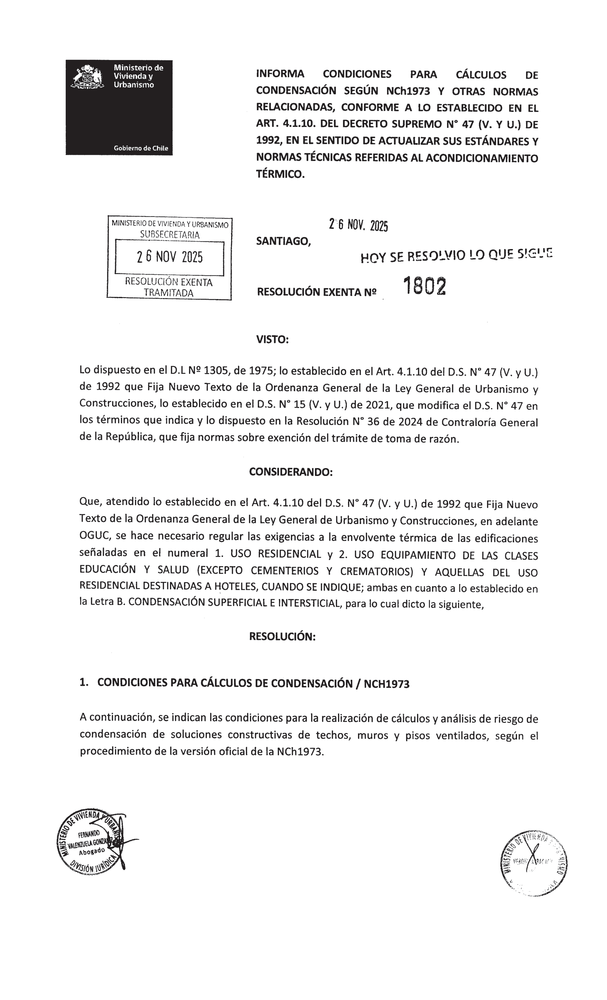

## Página 2

1.1 Condiciones para análisis y cálculo de riesgo de condensación

Los análisis y cálculos para evaluar el riesgo de condensación superficial e intersticial se
deben realizar en un momento determinado del año y según los datos de temperatura y
humedad relativa del emplazamiento, según lo indicado en el punto 1.2.

La humedad relativa máxima aceptable será: psicr = 1,0 (100%). Opcionalmente, y para
evaluar la formación de moho, se podrá utilizar psicr = 0,8 (80%).

Se deberán utilizar los valores de “Rsi y Rse” indicados en el ANEXO 2, para el tipo de
elemento constructivo correspondiente. Opcionalmente, se podrá considerar el efecto del
mobiliario.

Los cálculos de riesgo de condensación se realizarán en al menos dos secciones de la
solución constructiva:

Sección A: la de mayor resistencia térmica

Sección B: la de menor resistencia térmica (puente térmico constructivo)

Cada sección está compuesta por todas las capas térmicamente homogéneas presentes en
la sección de análisis. Se debe conocer el espesor, la conductividad térmica y la propiedad
a la difusión de vapor de agua de cada una de las capas.

1.2 Valores de temperatura y humedad

Condiciones del ambiente exterior:
Temperatura (T”ex) y Humedad relativa (HRex) según emplazamiento, conforme a lo
indicado en el ANEXO 1.

Condiciones del ambiente interior:
Temperatura (T*int): 19*C.
Humedad relativa (HRint): hasta 75% (inclusive)

1.3 Excepciones

Cuando la solución constructiva considere un revestimiento interior con un factor de
resistencia al vapor de agua infinito, sólo se deberá realizar el cálculo de riesgo de
condensación superficial, quedando exceptuado de realizar el cálculo de condensación
intersticial.

Cuando la solución constructiva considere revestimiento exterior con cámaras de aire el
cálculo de condensación no deberá considerar dicho revestimiento.

Cuando la solución constructiva de techumbre posea una barrera hidrófuga bajo un
revestimiento exterior cuyo factor de resistencia al vapor de agua sea infinito, este último
no se debe considerar en el cálculo de riesgo de condensación intersticial.

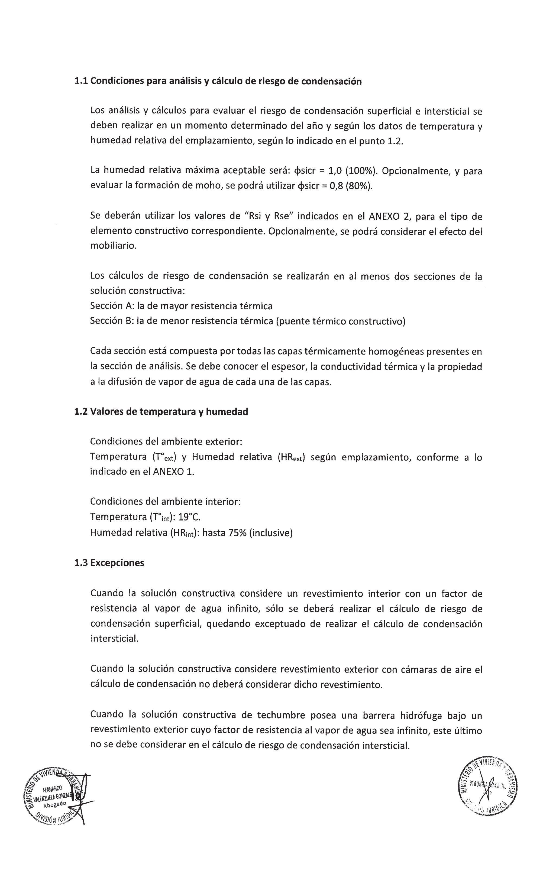

## Página 3

Cuando en la solución constructiva existan puentes térmicos puntuales, y que no superen
el 10% de la superficie de la solución, se podrá exceptuar el cálculo de condensación
superficial e intersticial en dicha sección.

Nota: para efecto del cálculo de riesgo de condensación, se debe considerar el factor de
resistencia al vapor de agua infinito como 1x108,

3. CONDICIONES PARA CÁLCULOS DE RESISTENCIA Y TRANSMITANCIA TÉRMICA /
NCH853

A continuación, se indican las condiciones para la realización de cálculos de Resistencia Térmica
(Rt) y Transmitancia Térmica (U) de soluciones constructivas de techos, muros y pisos
ventilados, según el procedimiento de la versión oficial de la NCh853.

Resistencia térmica total

Cuando el elemento constructivo está compuesto solo por una sección con capas homogéneas,
la resistencia térmica total se calculará como la suma de las resistencias superficiales y las
resistencias térmicas de cada capa.

Cuando el elemento constructivo está compuesto por capas heterogéneas, se deberá calcular

el límite inferior y superior de la resistencia térmica, y el promedio de ellos será la resistencia
térmica total.

El error relativo máximo debe ser igual o menor a 20% para que el cálculo se considere válido.
Cuando el error relativo máximo sea superior al 20% se puede utilizar el método detallado
indicado en punto 4.3 de la NCh853, o bien, optar por acreditar el valor R100 del material
aislante incorporado en la solución constructiva.

4. CONDICIONES PARA CÁLCULOS DE TRANSMISIÓN DE CALOR POR EL TERRENO /
NCH3117

A continuación, se indican las condiciones para la realización de cálculos de Transmisión de

calor por el terreno de soluciones constructivas, según el procedimiento de la versión oficial de
la NCh3117.

Para el caso de muros enterrados se debe considerar una conductividad térmica del terreno
igual a 2; “Ag = 2 W/mK”.

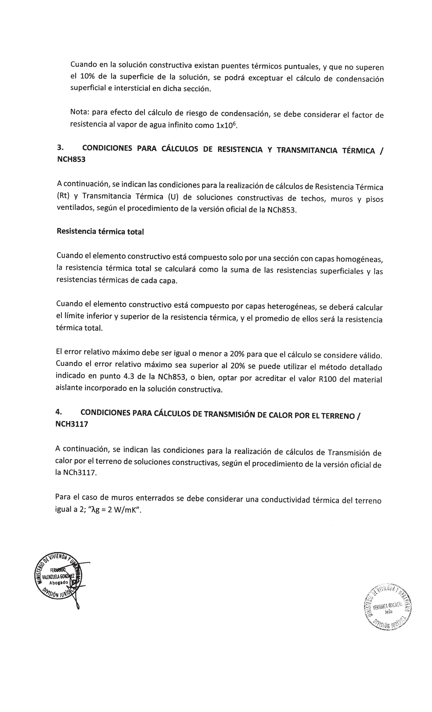

## Página 4

ANEXO 1

A continuación, se indican los datos de temperatura [T"exk] y humedad relativa [HRext] del
ambiente exterior, según emplazamiento.

El emplazamiento corresponde a la comuna o localidad donde se ubica del proyecto de
arquitectura y la Zona Térmica a la cual corresponde, según los planos de zonificación térmica
para la reglamentación térmica contenidos en la versión oficial de la NCh1079.

Existen territorios con datos de clima excepcionales dentro de la Zona Térmica correspondiente
que constituyen “particularidades climáticas” (p). La Antártica chilena, las islas de Pascua,
Alejandro Selkirk, Robinson Crusoe, Santa Clara, Salas y Gómez, San Ambrosio y San Félix, así
como las comunas de Calama, Futaleufú, San José de Maipo, San Pedro de Atacama, María
Elena, Palena y Sierra Gorda, son particularidades climáticas y poseen datos climáticos propios.

Zona Comuna / localidad
Térmica
po A Alto Hospicio
A Antofagasta
A Arica
L A Caldera
A Camarones - < 1.100 13,6 73
A Chañaral - - 10,3 + 73
A Copiapó >70*44' - 10,3 73
A Freirina - - 10,3 73
A Huara - < 1.100 12,4 69
A Huasco - - 10,3 73
A Iquique - E - 12,4 69
A Mejillones - - 10,3 73
¡A Taltal 270 - 10,3 73
A Tocopilla - - 12,4 69
Ai) Isla de Pascua 16 85
A Todas las comunas excepto Isla de Pascua 10,3 73
Zona Comuna / localidad Meridiano Altitud [msnm] Ten HRex
Térmica
B Alto del Carmen - < 3.000 7,8 76
B Andacollo - - 7,8 76 |
B Antofagasta <70* < 3.000 7,8 76
B Arica - 1.100 < altitud < 3.000 7,8 76
Calama < 3.000 0,4 27
B Camarones - 1.100 s altitud < 3.000 7,8 76
B Camiña - 1.100 < altitud < 3.000 7,8 76
8 Combarbalá - < 2.000 7,8 76
B Copiapó <70”44' < 3.000 6,9 8s |
B Diego de Almagro - < 3.000 6,9 85
B Huara - 1.100 s altitud < 3.000 7,8 76
loB Illapel - <2.000 7,8 76
[o B La Higuera s71 - 7,8 76
La Serena s71* - 7,8 76
Bío) María Elena - - 0,4 27
B Monte Patria 7 - < 2.000 7,8 76
Ovalle <71%15' - 78 | 76
| B Paiguano - < 3.000 E 7,8 76
B Pica - < 3.000 7,8 76
B Pozo Almonte - < 3.000 7,8 76
B Punitaqui —— - - 7,8 76
B Río Hurtado - < 3.000 7,8 76
8 | Salamanca - < 2.000 7,8 76
Bío) San Pedro de Atacama - < 3.000 0,4 NA

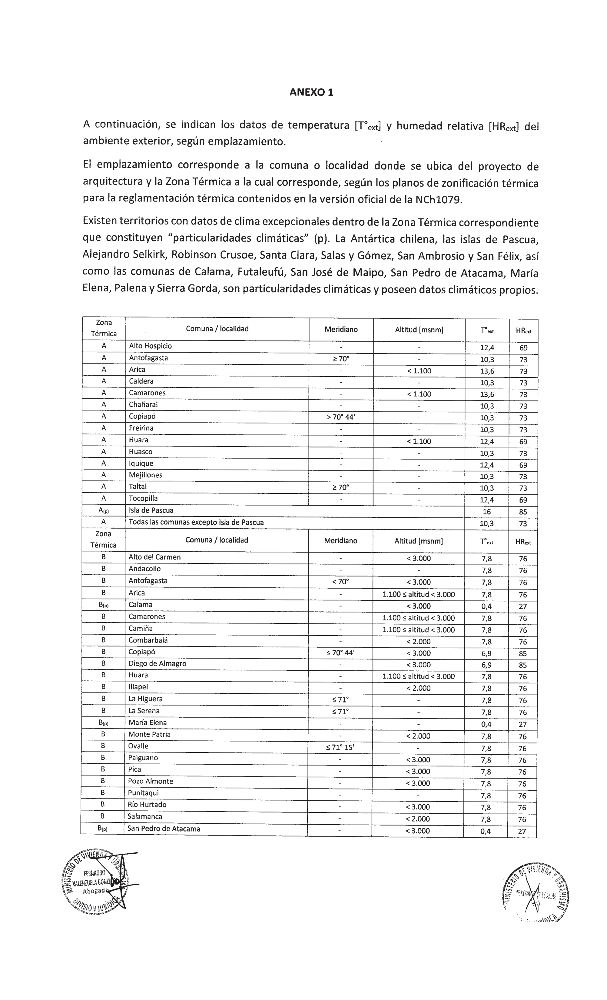

## Página 5

Bío) Sierra Gorda - [ - 0,4 27
Taltal <70* | < 3.000 7,3 76
Tierra Amarilla - < 3.000 6,9 85
Vallenar - - 6,9 85
Vicuña - < 3.000 7,8 76
Calama, María Elena, San Pedro de Atacama y Sierra Gorda 0,4 27
Todas las comunas excepto Calama, María Elena, San Pedro de Atacama y Sierra Gorda 6,9 85

Zona
o Comuna / localidad Meridiano MEN Tex HRex
Térmica

Algarrobo - 4,8 90
Canela - 6,9 85
Cartagena - 4,8 90
Casablanca - 4,8 90
Concón - 48 | 90

Coquimbo - 6,9 85
El Quisco - - 4,8 90
El Tabo - -
a
La Higuera >71 -
La Ligua >7115'

La Serena
Licantén

el

o

Litueche - -
Los Vilos - -
Navidad
Ovalle >71*15' -

Papudo - -
Cc P

ajjoajojojojaojajojajojojojalajoja

aredones - -

Pichilemu - -
Puchuncaví
Quintero
San Antonio
Santo Domingo - -
Valparaíso - -

Vichuquén -
Viña del Mar 7 7

Zapallar - -

Las islas: Alejandro Selkirk, Robinson Crusoe, Santa Clara, Salas y Gómez, San Ambrosio y San Félix 12,5 74

.le aaa

Todas las comunas excepto "Las Islas" 3,9 95

Zona
Térmica

Comuna / localidad Meridiano Altitud [msnm] Tex HRex

Alhué -

Cabildo 7
Calera -
Calera de Tango -
Calle Larga -

|

oju

o

Cerrillos 7
Cerro Navia -
Chépica 7

Codegua -

_—

Coinco
Colbún

Doñihue
El Bosque | -
El Monte | 7
Estación Central | -
Graneros 7

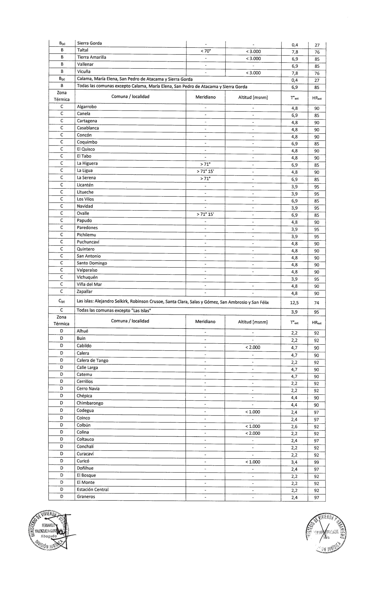

## Página 6

D Hijuelas - - 4,7 90
PD Hualañé - P - 134 99]

D [Huechuraba - - za 92
Lo D Independencia - - 2,2 [| 92]

D Isla de Maipo - T - A 2,2 92
po D La Cisterna - - 2,2 92

D Ju Cruz - y - an 4,7 90

D La Estrella — - - 3,9 95 7]
L D La Florida - - 2,2 92

D La Granja - q - T 2,2 92

D La Ligua s7115' - 4,7 90
Pp [taPintana - - | 22 | 92

D La Reina E ES - 2,2 92 |
E D Lampa - - 2,2 q

D Las Cabras - - 2,4 97

D Las Condes - - 2,2 92

D Limache - - 4,7 90
[| D [Linares - < 1.000 2,6 92

D Llaillay - N 47 | 90

D Lo Barnechea - < 2.000 2,2 92

D [Lo Espejo - - 2,2 92

D Lo Prado - [— - 7] 2,2 |
[o [tool - - 4,4 —

D Longaví - < 1.000 2,6 92

D Los Andes - < 2.000 4,7 90

D a] Machalí - < 1.000 2,4 97

D Macul E - 2,2 92 |

D Maipú - - 2,2 92

D Malloa - < 1.000 2,4 +

D Marchihue - - 3,9 95

D María Pinto - - 2,2 92 |

D [Maule - - 2,6 92

D [Melipilla 2 [| 92

D Molina 3,4 99

D Mostazal 2,4 97

D Nancagua 4,4 90

D Nogales 4,7 90 |

D Ñuñoa 2,2 92

D Olivar 2,4 97

D Olmué - - 4,7 90 ]

D Padre Hurtado - - 2,2 92

D Paine - - 2,2 92

D Palmilla - - 4,4 90
Pp Panquehue - - 4,7 90

D Parral - < 1.000 2,6 92

D Pedro Aguirre Cerda - - 2,2 92
Ll D Pelarco -

D Pencahue

D Peñaflor -

D Peñalolén -

D Peralillo -
¡DB Petorca -

D Peumo - 97 |

D Pichidegua - - 2,4 97
E "
[ob Pirque | - - 22 | 2
| D Placilla - - 4,4 + 90

D Providencia - - 2,2 9 |

O [Pudahuel - - 2,2 92

D Puente Alto - - 2,2 92

D Pumanque - - 1] 4,4 90 ]

D Putaendo MA - <2.000 4,7 90
| p | Quilicura - + - 2,2 92

D Quillota y - - — 4,7 90 .

D Quilpué >] - 47 | 90

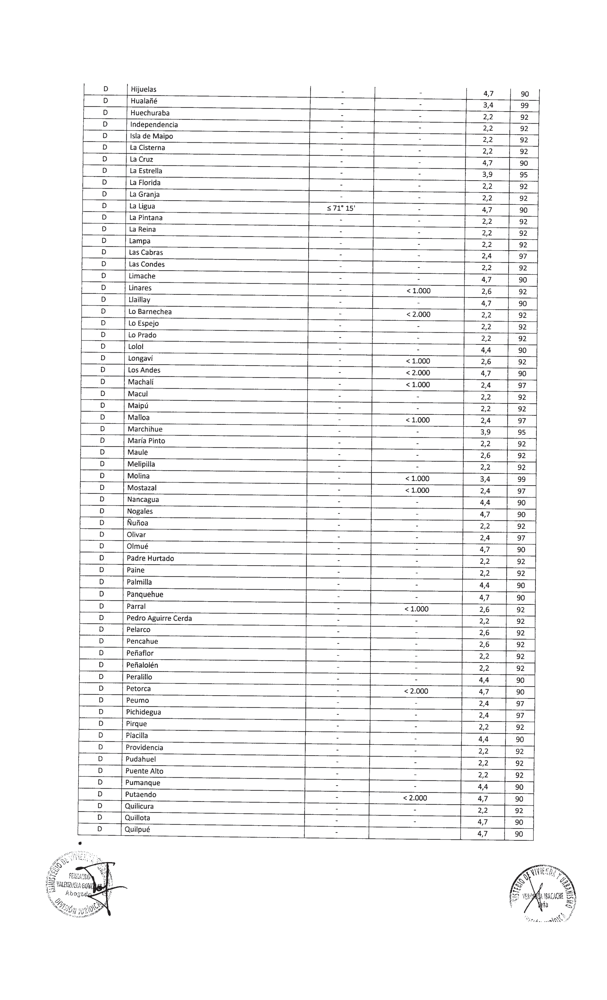

## Página 7

Quinta de Tilcoco

Quinta Normal
Rancagua

us

Recoleta

Renca
Rengo
Requínoa
Retiro

Rinconada
Río Claro
Romeral

Sagrada Familia
San Bernardo

San Clemente

O¡O|O¡OJO|OjoO¡o¡jo¡jojOo

D San Esteban

D San Felipe

D San Fernando

D San Javier

D San Joaquín
Dip San José de Maipo

D San Miguel

D San Pedro

D San Rafael

D San Ramón

D San Vicente

D Santa Cruz

D Santa María

|») Santiago

D Talagante - 2,2 92
D Talca - 2,6 92
D Teno < 1.000 3,4 99
D Tiltil - 2,2 92
D Villa Alegre - 2,6 92

Po D Villa Alemana 4,7 90
D Vitacura - 2,2 92 |
D Yerbas Buenas - 2,6 92
D Todas las comunas excepto San José de Maipo 2,2 92
Térmica
[E Constitución A - 3,5 95

E Curepto - 3,5 95
E 357]
E Cauquenes - - 3,5 95
E | Chanco - | - 3,5 MIES
E Pelluhue - - 3,5 95
E Concepción - - 5,7 96
E Chiguayante - - 5,7 96
13 Hualqui - - 5,7 96
E Santa Juana - - 5,7 96
E Talcahuano - - 5,7 96
E Tomé - - 5,7 96
E [pan O : 57 | 3
E Lebu - 5,1 94
E Contulmo —=—, - 5,1 94
E | Curanilahue 2 os [a
E Los Álamos - 5,1 94
E Tirúa - 5,1 94

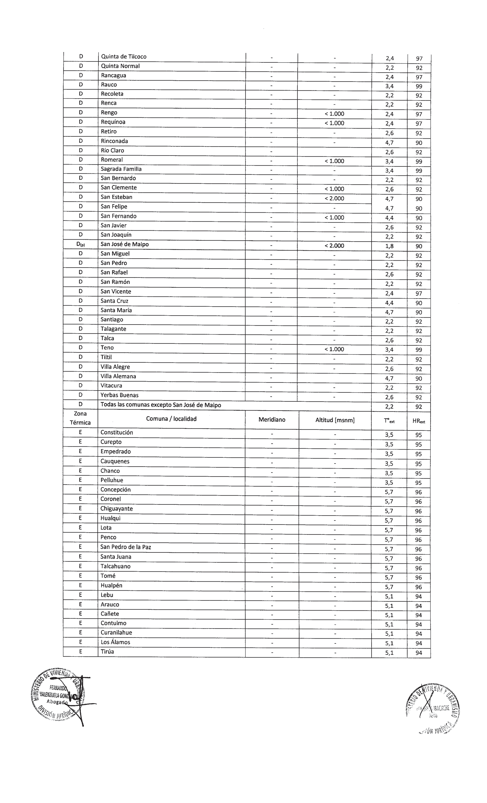

## Página 8

Quirihue
Cobquecura
Coelemu
Treguaco

Carahue

Saavedra
| Teodoro Schmidt

Toltén
Todas las comunas

Zona
Térmica

Chillán Viejo

Cholchol

Collipulli
Cunco

Curacautín

Ercilla
Florida
Freire

Futrono

Galvarino

Gorbea

La Unión
Lago Ranco
Laja

Lanco

Lautaro

Loncoche
Los Ángeles

Los Lagos

Los Sauces
Lumaco

Mulchén

Nacimiento

Negrete
Ninhue
Nueva Imperial

Ñiquén
Padre Las Casas
Paillaco

F
F
F
F
F
F
F
F
F
F
F
F
A El Carmen
F
FE
F
F
F
F
F
F
F
TI
F
F
F
F
F
F
F
F
F
F
FE
F
F
F

Panguipulli

—_
Pemuco

min

Perquenco
Pinto

Pitrufquén
Portezuelo

Quilaco
Quilleco

aia nm [min |.

Quillón

Ránquil

Renaico

lo

Río Bueno

F
F San Carlos
F San Fabián

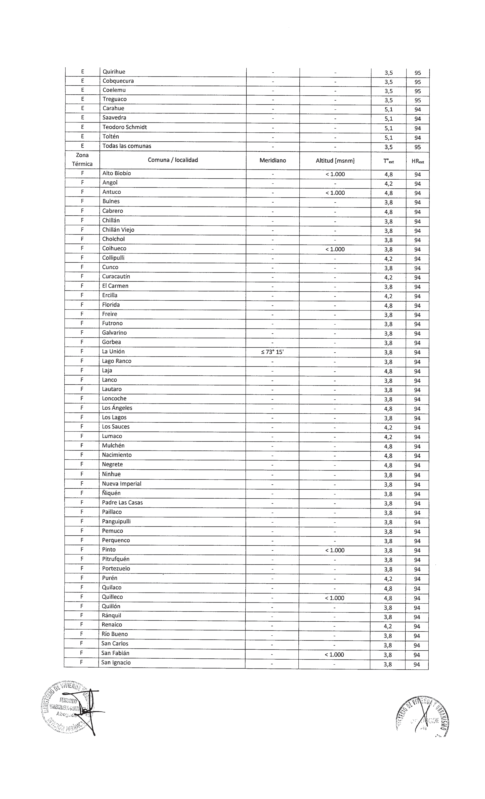

## Página 9

San Nicolás - [38 94
San Rosendo - | 4,8 94

[FÉ [Santa Bárbara < 1.000 4,8 94
7 rriguén

Ñl

- - 4,2 94
Tucapel - < 1.000 4,8 94
| F [Victoria - - 4,2 94
Vilcún - - 3,8 9 |
F Villarrica - - 3,8 94
Yumbel - - 4,8 94
Yungay - < 1.000 3,8 94
[A roas as comunas 7 ar fs
G Ancud - - 3,5 98
G Calbuco - - 3,5 98
6 Castro - - 3,5 98
Chaitén - - 3,5 98
—— Chonchi - - 35 98 |
G Cochamó - - 3,5 98
G Corral - - 3,5 98
G Curaco de Vélez - - 3,5 98
G Dalcahue - - 3,5 98|
G Fresia - - 3,5 98
G Frutillar - - 3,5 98
G Hualaihué - - 3,5 98
6 La Unión >7315' - 35 | 98
G Llanquihue - - 3,5 98
| 6  |LosMuermos - - 3,5 98
6 |máfil - - 3,5 98
[| G  |Mariquina - 3,5 98
| 6 | Maullín - - 98
| 6 | Osorno - - 98
G Puerto Montt - T - 98
6 Puerto Octay O 98 |
G Puerto Varas - T
G Puqueldón -
G Purranque -
G Puyehue -
G Queilén -
G Quellón -
G Quemchi - poo
G Quinchao -
| G  |[RíoNegro - - o [| 35 98
G San Juan de la Costa - - 3,5 98
6 San Pablo | - 3,5 98
G Valdivia - - 3,5 98
G Todas las comunas — 3,5 98

Zona i ] -
Térmica Comuna / localidad Meridiano Altitud [msnm] Ter HRea

Alto Biobío A > 1.000 18 90

H Alto del Carmen - 2 3.000 1,8 90

H Antofagasta - > 3.000 1,8 90

[—H [Antuco - > 1.000 1,8 90

H Arica - > 3.000 1,8 90

H Cabildo - > 2.000 1,8 90

Hi — Calama O 04]

A camarones 18 [90

| H [Codegua - > 1.000 1,8 90

| HH | Coihueco - > 1.000 18 90
[——H | Colina - > 2.000 18 so]

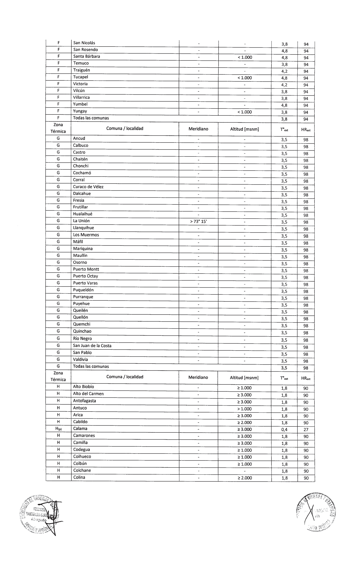

## Página 10

H Combarbalá | - 2 2.000 1,8 | 90
H Copiapó - 2 3.000 1,8 90
H Curarrehue - - 18 90
H Curicó - 2 1.000 1,8 | 90
H Diego de Almagro -
H General Lagos -
H Huara -
H illapel -
H Linares -
H Lo Barnechea .
H Longaví -
H Lonquimay -
H Los Andes -
H Machalí -
Pa Malloa
H Melipeuco
H Molina
H Monte Patria
H Mostazal
H Ollagúe
H Paiguano
H Parral
H Petorca 90
H Pica
H Pinto
H Pozo Almonte
H Pucón
H Putaendo
H Putre 90
H Quilleco 90
H Rengo - > 1.000 18 90
Poy Requínoa - > 1.000 1,8 90
H Río Hurtado - 2 3.000 1,8 90
H Romeral - > 1.000 1,8 90
H Salamanca - > 2.000 138 90
H San Clemente - > 1.000 1,8
H San Esteban - | > 2.000 18 90
H San Fabián - > 1.000 18 90
—__—__—_———
H San Fernando - 2 1.000 18 90
H San José de Maipo - > 2.000 1,8 90
Hip) San Pedro de Atacama - > 3.000 0,4 27
H Santa Bárbara - > 1.000 1,8 90
H Taltal - 2 3.000 18 90
Teno - 2 1.000 18 90
Tierra Amarilla | - 2 3.000 1,8 90
Tucapel | - > 1.000 18 90
Vicuña | - 2 3.000 1,8 90
H Yungay | - > 1.000 1,8 90
Hip) Calama y San Pedro de Atacama 0,4 27
H Todas las comunas excepto Calama y San Pedro de Atacama 1,8 90
Zona Comuna / localidad Ten HRext
Térmica
1 Aysén - - 18 98
Nor Antártica chilena -6,8 88
1 Cabo de Hornos - - -1,6 93
I Chile Chico - - -0,4 95
! Cisnes - - 1,8 98 7
l Cochrane - - a6 | 93
| Coihaique - - -0,4 95
lo) Futaleufú - -
1 Guaitecas - -
1 Lago Verde - -
| Laguna Blanca - MM -
1 Natales - - —Í

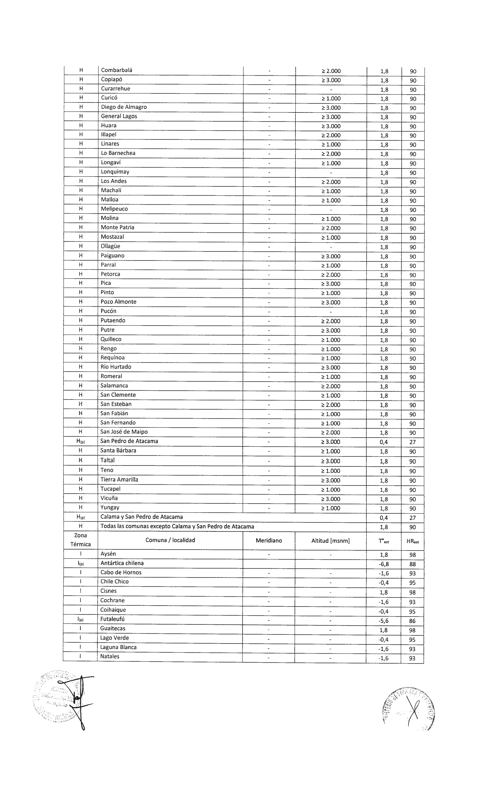

## Página 11

O'Higgins
Palena
Porvenir
Primavera
Punta Arenas
Río Ibáñez
Río Verde

San Gregorio

Timaukel

Torres del Paine

Tortel

Futaleufú y Palena

Todas las comunas excepto Antártica chilena, Futaleufú y Palena

Cuando se requiera acreditar el cumplimiento de las exigencias de condensación, en los
complejos constructivos de techos, muros y pisos ventilados, en más de una Zona Térmica, se
podrán agrupar Zonas Térmicas en “Macrozonas Térmicas”, y se deberán utilizar los datos de
Text Y HRext indicados a continuación.

La Zona Térmica A y los territorios de; las islas de Pascua, Alejandro Selkirk, Robinson Crusoe,
Santa Clara, Salas y Gómez, San Ambrosio y San Félix y la Antártica chilena no pueden ser
incluidos en una Macrozona Térmica.

| Macrozona |

Comuna / localidad T, HR
Térmica / a. a“

Todas las comunas excepto Calama, María Elena, San Pedro de Atacama y Sierra Gorda, las islas:
Alejandro Selkirk, Robinson Crusoe, Santa Clara, Salas y Gómez, San Ambrosio y San Félix y San 2,2 92
José de Maipo

Todas las comunas excepto las islas: Alejandro Selkirk, Robinson Crusoe, Santa Clara, Salas y
Gómez, San Ambrosio y San Félix

B/C/D

0,4 27

Macrozona
Térmica

Comuna / localidad

Todas las comunas excepto Calama, María Elena, San Pedro de Atacama y Sierra Gorda, las islas:
Alejandro Selkirk, Robinson Crusoe, Santa Clara, Salas y Gómez, San Ambrosio y San Félix y San 2,2 92
José de Maipo

B/C/D/E

Todas las comunas excepto las islas: Alejandro Selkirk, Robinson Crusoe, Santa Clara, Salas y
Gómez, San Ambrosio y San Félix

B/C/D/Etp,

Macrozona
Térmica

F/G
Macrozona
Térmica

Comuna / localidad

Todas las comunas

Comuna / localidad

Todas las comunas excepto Calama, San Pedro de Atacama, Antártica chilena,
Futaleufú y Palena

Todas las comunas excepto la Antártica chilena

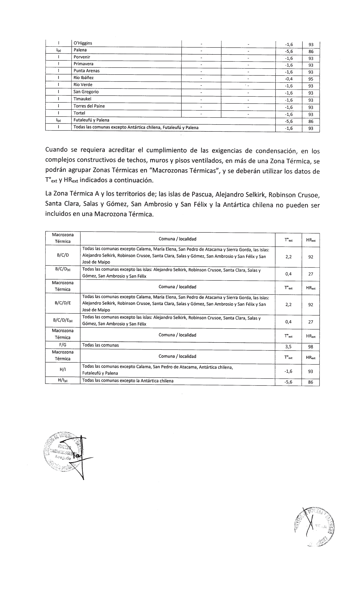

## Página 12

ANEXO 2

Según el elemento constructivo, y la dirección de flujo de calor correspondiente, se deberán
utilizar las resistencias superficiales [Rs] indicadas en la tabla siguiente.

Opcionalmente, para cualquier elemento constructivo, se podrá evaluar el efecto del mobiliario
utilizando el valor de resistencia superficial [Rsi] interior indicado en la tabla.

Elemento constructivo Dirección del flujo de calor im] [mn

Techo Ascendente 0,10

Muro Horizontal 0,13

Piso ventilado Descendente 0,17 0,04
Para evaluar el efecto del mobiliario

Techo, muro y piso ventilado Todas las direcciones de flujo de calor 0,25 |

ANÓTESE, PUBLÍQUESE EN EL DIARIO OFICIAL Y ARCHÍVESE

MSZ/ CLG/ LRE
Distribución:

e DIARIO OFICIAL

+ GABINETE MINISTRO

+ GABINETE SUBSECRETARIA

+ SEREMI TODAS LAS REGIONES

+ SERVIU TODAS LAS REGIONES

+ SISTEMA INTEGRADO DE ATENCION AL CIUDADANO
e OFICINA DE PARTES

LO QUE TRANSCRIBO PARA su CONOCIMIENTO

JOVITA GAVILAN Go ZALEZ

INGENIERO
MINISTRO DE PE OMERCIAL

MINISTERIO De VIVIENDA Y URBANISMO

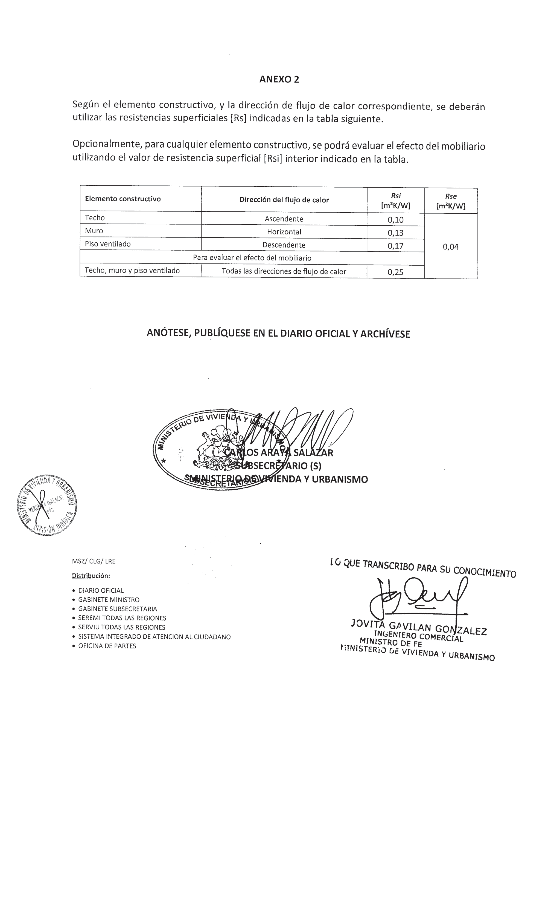

---

## Referencias de Imágenes

- **Condiciones-de-Calculos-Condensacion_Res.-Ex.-1802-1.png**: Extraída de página 1 (2004x3301px)
- **Condiciones-de-Calculos-Condensacion_Res.-Ex.-1802-2.png**: Extraída de página 2 (2004x3301px)
- **Condiciones-de-Calculos-Condensacion_Res.-Ex.-1802-3.png**: Extraída de página 3 (2004x3301px)
- **Condiciones-de-Calculos-Condensacion_Res.-Ex.-1802-4.png**: Extraída de página 4 (2004x3301px)
- **Condiciones-de-Calculos-Condensacion_Res.-Ex.-1802-5.png**: Extraída de página 5 (2004x3301px)
- **Condiciones-de-Calculos-Condensacion_Res.-Ex.-1802-6.png**: Extraída de página 6 (2004x3301px)
- **Condiciones-de-Calculos-Condensacion_Res.-Ex.-1802-7.png**: Extraída de página 7 (2004x3301px)
- **Condiciones-de-Calculos-Condensacion_Res.-Ex.-1802-8.png**: Extraída de página 8 (2004x3301px)
- **Condiciones-de-Calculos-Condensacion_Res.-Ex.-1802-9.png**: Extraída de página 9 (2004x3301px)
- **Condiciones-de-Calculos-Condensacion_Res.-Ex.-1802-10.png**: Extraída de página 10 (2004x3301px)
- **Condiciones-de-Calculos-Condensacion_Res.-Ex.-1802-11.png**: Extraída de página 11 (2004x3301px)
- **Condiciones-de-Calculos-Condensacion_Res.-Ex.-1802-12.png**: Extraída de página 12 (2004x3301px)
