# Modificacion-art-4110-OGUC_Reglamentacion-Termica

## Página 1

CVE 2494861 | Director: Felipe Andrés Peroti Díaz
Sitio Web: www.diarioficial.cl
| Mesa Central: 600 712 0001    Email: consultas@diarioficial.cl
Dirección: Dr. Torres Boonen N°511, Providencia, Santiago, Chile.
Este documento ha sido firmado electrónicamente de acuerdo con la ley N°19.799 e incluye sellado de tiempo y firma electrónica
avanzada. Para verificar la autenticidad de una representación impresa del mismo, ingrese este código en el sitio web www.diarioficial.cl
DIARIO OFICIAL
DE LA REPUBLICA DE CHILE
Ministerio del Interior y Seguridad Pública
I
SECCIÓN
LEYES, REGLAMENTOS, DECRETOS Y RESOLUCIONES DE ORDEN GENERAL
Núm. 43.860
|
Lunes 27 de Mayo de 2024
|
Página 1 de 19
Normas Generales
CVE 2494861
MINISTERIO DE VIVIENDA Y URBANISMO
MODIFICA DECRETO SUPREMO N° 47, DE VIVIENDA Y URBANISMO, DE 1992,
ORDENANZA GENERAL DE URBANISMO Y CONSTRUCCIONES EN EL SENTIDO
DE ACTUALIZAR SUS ESTÁNDARES Y NORMAS TÉCNICAS REFERIDAS AL
ACONDICIONAMIENTO TÉRMICO, ESTABLECIENDO REQUISITOS Y
MECANISMOS DE ACREDITACIÓN PARA LAS EDIFICACIONES QUE SEÑALA
 
Santiago, 9 de junio de 2021.- Hoy se decretó lo que sigue:
Núm. 15.
 
Visto:
 
Las facultades que me confiere el artículo 32, número 6° de la Constitución Política de la
República de Chile; la Ley N° 16.391; el DL N° 1.305, de 1975, que reestructura y regionaliza el
Ministerio de la Vivienda y Urbanismo; el DFL N° 458 (V. y U.), de 1975, que aprueba Nueva
Ley General de Urbanismo y Construcciones, en especial sus artículos 1, 2, 3, 105 y 106; el DS
N° 47 (V. y U.), de 1992, que Fija Nuevo Texto de la Ordenanza General de la Ley General de
Urbanismo y Construcciones; la Ley N° 19.300 Bases Generales del Medio Ambiente, en
especial su artículo 46; el DS N° 39 (Medio Ambiente), de 2012, que aprueba Reglamento para
la Dictación de Planes de Prevención y de Descontaminación; la Ley N° 21.305, sobre Eficiencia
Energética; la resolución N° 7, de 2019, de la Contraloría General de la República y
 
Considerando:
 
1. Que, con fecha 12 de diciembre de 2015, se adoptó el Acuerdo de París en la Vigésimo
Primera Reunión de la Conferencia de las Partes de la Convención Marco de las Naciones
Unidas sobre el Cambio Climático, que fue suscrito por la República de Chile el 20 de
septiembre de 2016. Este acuerdo fue promulgado mediante el decreto supremo N° 30, de 13 de
febrero de 2017, del Ministerio de Relaciones Exteriores, publicado en el Diario Oficial con
fecha 23 de mayo de 2017.
2. Que, en el marco del Acuerdo Climático de París, el Gobierno de Chile adquirió el
compromiso de reducir al año 2030, en un 30% sus emisiones de CO2 por unidad de PIB con
respecto al nivel alcanzado en 2007.
3. Que, a nivel nacional, la eficiencia energética ha estado presente en los distintos
instrumentos de política energética que se han dictado en el país, desde la “Estrategia Nacional
de Energía 2012-2030”, la “Política Energética de Chile Energía 2050” y, recientemente, la
“Ruta Energética 2018-2022”.
4. Que, una de las principales medidas de eficiencia energética desde el punto de vista de la
construcción corresponde al mejoramiento térmico de las edificaciones, lo que permite generar
beneficios económicos, sociales y medioambientales que contribuyan a mejorar la calidad de
vida, permitiendo alcanzar temperaturas de confort y calidad del aire al interior de las viviendas;
alcanzar condiciones adecuadas para un ambiente saludable; disminuir el consumo energético,
contribuyendo al ahorro en gastos de calefacción; disminuir el consumo de leña, lo que implica,
de forma consecuencial, la disminución de la emisión de material particulado al ambiente
(prevención y descontaminación atmosférica); prevenir la aparición de patologías constructivas
asociadas a humedad por condensaciones, aumentando la vida útil tanto en calidad como
durabilidad de las construcciones; y disminuir los gastos en mantenimiento y costos de
post-venta.

## Página 2

DIARIO OFICIAL DE LA REPUBLICA DE CHILE
Núm. 43.860
Lunes 27 de Mayo de 2024
Página 2 de 19
CVE 2494861 | Director: Felipe Andrés Peroti Díaz
Sitio Web: www.diarioficial.cl
| Mesa Central: 600 712 0001    Email: consultas@diarioficial.cl
Dirección: Dr. Torres Boonen N°511, Providencia, Santiago, Chile.
Este documento ha sido firmado electrónicamente de acuerdo con la ley N°19.799 e incluye sellado de tiempo y firma electrónica
avanzada. Para verificar la autenticidad de una representación impresa del mismo, ingrese este código en el sitio web www.diarioficial.cl
5. Que, a la fecha, el Ministerio del Medio Ambiente ha dictado los decretos supremos que
sancionan los siguientes planes de descontaminación atmosférica, todos los cuales se encuentran
vigentes y establecen como medida estructural la regulación referida al mejoramiento de la
eficiencia térmica de la vivienda, cuyos estándares específicos son concordantes con la
modificación a la Ordenanza General de Urbanismo y Construcciones contenida en el presente
decreto: (i) el decreto supremo N° 8 de 2015, que Establece Plan de Descontaminación
Atmosférica por Mp2,5, para las comunas de Temuco y Padre Las Casas y de Actualización del
Plan de Descontaminación por Mp10, para las mismas comunas; (ii) el decreto supremo N° 7 de
2018, que Establece Plan de Descontaminación Atmosférica para la ciudad de Coyhaique y su
Zona Circundante; (iii) el decreto supremo N° 48 de 2015, que Establece Plan de Prevención y
Descontaminación Atmosférica para las comunas de Chillán y Chillán Viejo; (iv) el decreto
supremo N° 49 de 2015, que Establece Plan de Descontaminación Atmosférica para las comunas
de Talca y Maule; (v) el decreto supremo N° 25 de 2016, que Establece Plan de
Descontaminación Atmosférica para la comuna de Valdivia; (vi) el decreto supremo N° 4 de
2017, que Establece Plan de Descontaminación Atmosférica para la comuna de Los Ángeles;
(vii) el decreto supremo N° 47 de 2015, que Establece Plan de Descontaminación Atmosférica
para la comuna de Osorno; (viii) el decreto N° 44 de 2017, que Establece Plan de
Descontaminación Atmosférica para el Valle Central de la Provincia de Curicó; y (ix) el decreto
supremo N° 6 de 2018, que Establece Plan de Prevención y de Descontaminación Atmosférica
para las comunas de Concepción Metropolitano.
6. Que, conforme al artículo 3° del decreto con fuerza de ley N° 458, de 1975, Ley General
de Urbanismo y Construcciones, al Ministerio de Vivienda y Urbanismo le corresponde estudiar
las modificaciones que requiera la Ordenanza General de Urbanismo y Construcciones, para
mantenerla al día con el avance tecnológico y desarrollo socio-económico, las que se aprobarán
por decreto supremo.
7. Que, conforme al artículo 105 del decreto con fuerza de ley N° 458, de 1975, Ley
General de Urbanismo y Construcciones, el diseño de las obras de urbanización y edificación
deberá cumplir con los estándares técnicos de diseño y de construcción que establezca la
Ordenanza General de Urbanismo y Construcciones, conforme lo dispone el artículo 1.1.1. de la
misma Ordenanza.
8. La urgencia de implementar la modificación a los actuales estándares térmicos de
viviendas, debido a los problemas que estos han generado en la habitabilidad a causa de la
generación de patologías constructivas asociadas a humedad por condensaciones, y que han
generado un alto costo para el Estado a través del otorgamiento de subsidios habitacionales
necesarios a fin de corregir deficiencias y ejecutar mejoras a las viviendas cuyos estándares
térmicos impiden dar solución a dichos problemas.
9. Que, lo anterior fue recogido por la Ley N° 21.305, sobre Eficiencia Energética, entre
otras disposiciones, estableciendo la obligación de las empresas constructoras e inmobiliarias, así
como de los Servicios de Vivienda y Urbanización de entregar información respecto de los
requerimientos energéticos de las edificaciones que indica su artículo 3°, creando con ello el
sistema de Calificación Energética de Viviendas, entre otros destinos, que contempla la
herramienta de evaluación y etiquetado energético nacional que debe aplicarse.
10. Que, a través del Oficio Ordinario C49 N° 1941, de 14 de junio de 2022, del
Subsecretario de Redes Asistenciales del Ministerio de Salud y el Oficio Ordinario N° 01389, de
12 de julio de 2022, del Director de Educación Pública de la Subsecretaría de Educación Pública,
ambas autoridades ratifican, respectivamente, la importancia y necesidad de realizar la
actualización de los estándares térmicos contenidos en el artículo 4.1.10. de la Ordenanza
General de Urbanismo y Construcciones, incorporando exigencias a los establecimientos de
salud, y la necesidad de incorporar el estándar propuesto de la reglamentación térmica para los
establecimientos educacionales, en lo que respecta a la transmitancia térmica, condensación
superficial e intersticial, filtraciones de aire y ventilación.
11. Que, de conformidad con lo dispuesto en la resolución exenta N° 3.288 (V. y U.), de
2015 que establece la Norma de Participación Ciudadana del Ministerio de Vivienda y
Urbanismo y sus Secretarías Regionales Ministeriales, y considerando que la comprensión del
contenido de la modificación propuesta requería de conocimientos técnicos y/o especializados, la
presente modificación se sometió a una consulta simplificada entre los días 21 de agosto y 4 de
septiembre del año 2020, a la que se invitó a diversas organizaciones y profesionales vinculados
a las materias tratadas, pudiendo suministrar antecedentes que contribuyeran a su
perfeccionamiento, quienes contaron en total con 10 días hábiles para enviar sus observaciones,
propuestas y contribuciones.

## Página 3

DIARIO OFICIAL DE LA REPUBLICA DE CHILE
Núm. 43.860
Lunes 27 de Mayo de 2024
Página 3 de 19
CVE 2494861 | Director: Felipe Andrés Peroti Díaz
Sitio Web: www.diarioficial.cl
| Mesa Central: 600 712 0001    Email: consultas@diarioficial.cl
Dirección: Dr. Torres Boonen N°511, Providencia, Santiago, Chile.
Este documento ha sido firmado electrónicamente de acuerdo con la ley N°19.799 e incluye sellado de tiempo y firma electrónica
avanzada. Para verificar la autenticidad de una representación impresa del mismo, ingrese este código en el sitio web www.diarioficial.cl
Decreto:
 
Artículo único.- Modifícase la Ordenanza General de Urbanismo y Construcciones, cuyo
texto fue fijado por DS N° 47 (V. y U.), de 1992, en la siguiente forma:
 
N° 1. Reemplázanse los artículos 4.1.10. y 4.1.10 Bis por el siguiente:
 
“Artículo 4.1.10. En las edificaciones de uso residencial, y de uso equipamiento de las
clases educación y salud, exceptuados los cementerios y crematorios, su envolvente térmica
deberá incorporar requisitos de acondicionamiento térmico, cumpliendo para esto con las
exigencias de transmitancia térmica máxima o resistencia térmica mínima, condensación
superficial e intersticial, infiltración de aire y ventilación, según lo dispuesto en este artículo.
Tratándose de permisos de obra nueva, ampliación o reconstrucción de edificaciones
destinadas a viviendas en áreas en que se esté aplicando un plan de prevención o
descontaminación conforme a lo establecido en la Ley N° 19.300 sobre Bases Generales del
Medio Ambiente, deberá estarse, en materia de exigencias de acondicionamiento térmico, a lo
dispuesto en dicho Plan.
El cumplimiento de las exigencias señaladas en el inciso primero de este artículo referidas a
transmitancia térmica máxima y resistencia térmica mínima, condensación superficial e
intersticial, infiltraciones de aire y ventilación, cuando corresponda, se deberán acreditar de
acuerdo a lo señalado en los respectivos literales contenidos en los numerales 1 y 2 de este
artículo.
Para los efectos de lo dispuesto en el inciso anterior, el cumplimiento de las exigencias ahí
señaladas, se podrá acreditar mediante un Informe de acreditación de cumplimiento, un Informe
de Ensayo, una Memoria de Cálculo, adopción de una solución constructiva inscrita en el Listado
Oficial de Soluciones Constructivas para Acondicionamiento Térmico elaborado por el
Ministerio de Vivienda y Urbanismo o mediante la incorporación de un material que, para cada
caso proponga el arquitecto del proyecto, sin perjuicio que esto conste además en las
especificaciones técnicas. En los casos que así se establezca en este artículo, los Informes o la
Memoria podrán ser elaborados por un profesional competente o un profesional especialista, los
cuales deberán ser suscritos además por el arquitecto del proyecto.
Alternativamente, y solo para las edificaciones destinadas a viviendas, el cumplimiento de
las exigencias se podrá acreditar con el Informe de Precalificación Energética, elaborado por un
Evaluador Energético con inscripción vigente en el Registro Nacional de Evaluadores
Energéticos, en el cual se demuestre que el valor de demanda de energía de la vivienda es igual o
inferior al indicado en la resolución que para dicho efecto dicte el Ministerio de Vivienda y
Urbanismo. Con todo, el cumplimiento de las exigencias referidas a condensación superficial e
intersticial, infiltraciones de aire y ventilación, se deberán acreditar de acuerdo a lo señalado en
el resto de literales de ese mismo numeral.
Para efectos de la aplicación de las disposiciones de este artículo, se deberán considerar las
siguientes expresiones conforme a sus respectivas definiciones:
 
Complejo de techumbre: Conjunto de elementos constructivos que conforman la
techumbre de una edificación, cuyo plano de terminación interior tiene una inclinación de menos
de 60° sexagesimales, medidos desde la horizontal. En el caso de mansardas o paramentos
inclinados, se considerará complejo de techumbre todo elemento cuyo plano de terminación
interior tenga una inclinación de 60° sexagesimales o menos, medidos desde la horizontal.
Complejo de piso ventilado: Conjunto de elementos constructivos que conforman el piso
de una edificación y que no están en contacto directo con el terreno. También se considerarán
como pisos ventilados los planos horizontales inferiores de recintos cerrados que constituyan una
prolongación del espacio interior hacia el exterior y los planos inclinados inferiores de escaleras
o rampas cerradas que estén en contacto con el exterior.
Complejo de muros perimetrales: Conjunto de elementos constructivos que conforman
los muros de una edificación, cuyo plano de terminación interior tiene una inclinación de más de
60° sexagesimales, medidos desde la horizontal.
Complejo de puertas opacas: Conjunto conformado por el marco de la puerta y la parte
opaca de la hoja de esa puerta.
Complejo de ventanas: Conjunto de elementos constructivos que conforman los
cerramientos traslúcidos o transparentes de los vanos de una edificación, insertos en los
complejos de muros perimetrales, techumbre, piso ventilado y puertas opacas.

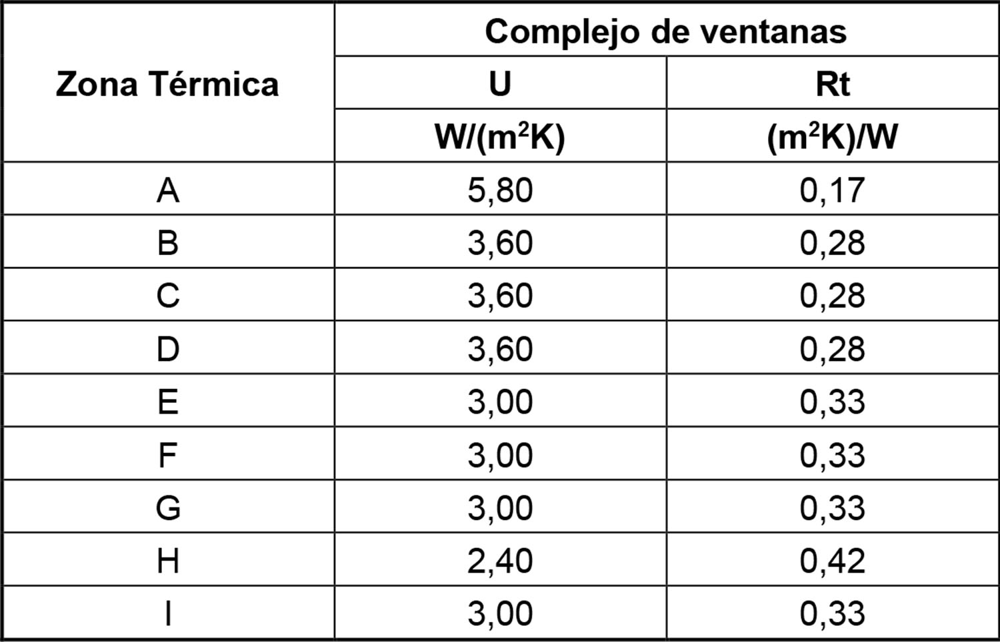

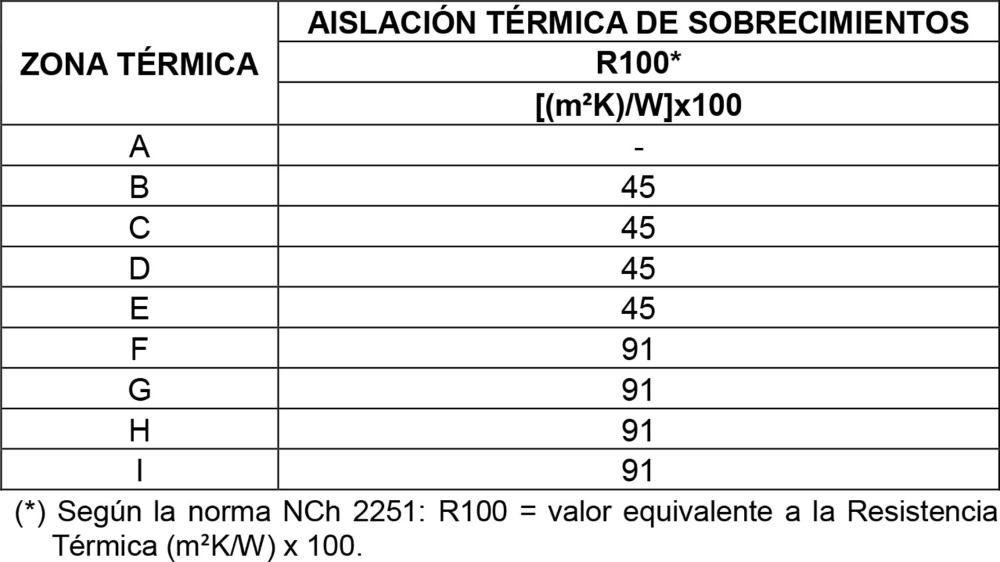

## Página 4

DIARIO OFICIAL DE LA REPUBLICA DE CHILE
Núm. 43.860
Lunes 27 de Mayo de 2024
Página 4 de 19
CVE 2494861 | Director: Felipe Andrés Peroti Díaz
Sitio Web: www.diarioficial.cl
| Mesa Central: 600 712 0001    Email: consultas@diarioficial.cl
Dirección: Dr. Torres Boonen N°511, Providencia, Santiago, Chile.
Este documento ha sido firmado electrónicamente de acuerdo con la ley N°19.799 e incluye sellado de tiempo y firma electrónica
avanzada. Para verificar la autenticidad de una representación impresa del mismo, ingrese este código en el sitio web www.diarioficial.cl
Elementos perimetrales: Componentes de la edificación expuestos al ambiente exterior
tales como complejos de techumbre, muros perimetrales, piso ventilado, puertas opacas y
ventanas, y sobrecimiento en una edificación.
Envolvente térmica: Conjunto que forman los elementos perimetrales de una edificación
en los cuales se cumplen las exigencias de acondicionamiento térmico señaladas en esta
Ordenanza y que, a su vez, la separan de un recinto no acondicionado o de elementos del
ambiente exterior, tales como terreno, aire, agua, asoleamiento, temperatura, humedad u otros.
Infiltración de aire: Entrada no controlada de aire a recintos provocado por diferencias de
presión entre recintos acondicionados y no acondicionados o el exterior, a través de aberturas en
los complejos de techumbre, muros perimetrales, piso ventilado, puertas y ventanas.
Orientación Global Teórica (OGT): Orientación que se aplica cuando la edificación posee
menos del 60% de la superficie total de los muros perimetrales expuesta al ambiente exterior, a
espacios contiguos abiertos o a recintos no acondicionados.
Puente Térmico: Parte de la envolvente térmica de una edificación en la que su resistencia
térmica, normalmente uniforme, se reduce por efecto de un elemento estructural o producto de su
geometría.
Recinto acondicionado: Recinto cerrado o un conjunto de ellos, cuya envolvente térmica
cumple con los requisitos de acondicionamiento térmico señalados en esta Ordenanza.
 
Las exigencias a la envolvente térmica de las edificaciones de uso residencial, y de las
clases educación y salud, exceptuados los cementerios y crematorios, corresponden a las
señaladas en los siguientes numerales:
 
1. USO RESIDENCIAL.
 
Las exigencias a las edificaciones de uso residencial, incluye a todos los destinos
mencionados en el artículo 2.1.25. de esta Ordenanza, con las excepciones que señale este
numeral, en las cuales se deberán cumplir las siguientes exigencias:
 
A. TRANSMITANCIA TÉRMICA Y RESISTENCIA TÉRMICA.
 
Los complejos de techumbre, muros perimetrales, piso ventilado y puertas opacas deberán
tener una transmitancia térmica U igual o menor, o una resistencia térmica total Rt igual o
superior, a la señalada en la Tabla 1 de este numeral, para la zona térmica en la cual se ubica el
proyecto de acuerdo con los planos de zonificación térmica para la reglamentación térmica,
contenidos en la NCh 1079.
 
TABLA 1. Transmitancia térmica U máxima y resistencia térmica Rt mínima para complejos de
techumbre, muros perimetrales, piso ventilado y puertas opacas.
 
 
Los recintos contiguos a la edificación con uso residencial y destinados a bodegas, logias,
instalaciones, quinchos, estacionamientos cubiertos u otros de similar naturaleza y uso, serán
considerados como recintos abiertos para efectos de esta reglamentación y no tendrán requisitos
de acondicionamiento térmico.
Los aislantes térmicos o soluciones constructivas especificadas en el proyecto de
arquitectura deberán cubrir en forma continua el máximo de la superficie de los complejos de

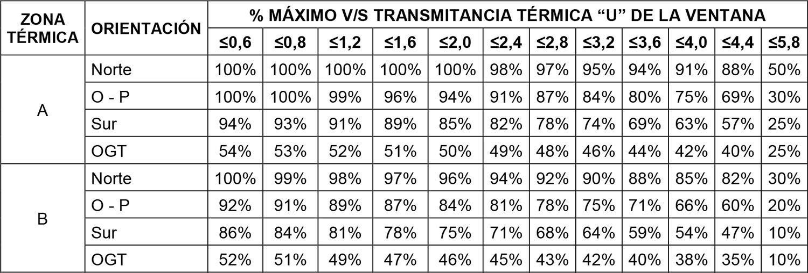

## Página 5

DIARIO OFICIAL DE LA REPUBLICA DE CHILE
Núm. 43.860
Lunes 27 de Mayo de 2024
Página 5 de 19
CVE 2494861 | Director: Felipe Andrés Peroti Díaz
Sitio Web: www.diarioficial.cl
| Mesa Central: 600 712 0001    Email: consultas@diarioficial.cl
Dirección: Dr. Torres Boonen N°511, Providencia, Santiago, Chile.
Este documento ha sido firmado electrónicamente de acuerdo con la ley N°19.799 e incluye sellado de tiempo y firma electrónica
avanzada. Para verificar la autenticidad de una representación impresa del mismo, ingrese este código en el sitio web www.diarioficial.cl
techumbre, muros perimetrales, piso ventilado y sobrecimiento, procurando la continuidad de la
envolvente térmica, la que solo podrá interrumpirse por elementos de la estructura o por las redes
o canalizaciones de las instalaciones.
 
A.1 COMPLEJO DE TECHUMBRE.
 
Para cumplir las exigencias de transmitancia térmica y resistencia térmica en los complejos
de techumbre, los aislantes térmicos o la solución constructiva incorporada deberán cubrir el
máximo de la superficie de la parte superior de los muros en su encuentro con el complejo de
techumbre, tales como cadenas, vigas o soleras superiores, conformando un elemento continuo
por todo el contorno de los muros perimetrales.
Para obtener una continuidad en el aislamiento térmico, todo muro o tabique, antepecho o
dintel que sea parte de una ventana de techo, lucarna, u otro elemento similar en la techumbre, y
que interrumpa esa continuidad, deberá cumplir con la misma exigencia que le corresponde al
complejo de techumbre, de acuerdo a lo señalado en la Tabla 1 del presente artículo. Lo mismo
en caso que este muro o tabique delimite un recinto acondicionado de otro no acondicionado.
Los complejos de techumbre que contemplen entretecho, deberán considerar una rejilla,
celosía u otro elemento que permita la ventilación cruzada, a través de los frontones, las
cumbreras o los aleros.
 
A.2 COMPLEJO DE MUROS PERIMETRALES.
 
Para cumplir las exigencias de transmitancia térmica y resistencia térmica en los complejos
de muros perimetrales, los aislantes térmicos o la solución constructiva adoptada deberán cubrir
el máximo de la superficie del muro conformando un elemento continuo por todo el contorno de
los muros perimetrales, pudiendo estar interrumpidos solo por los vanos.
A los cerramientos traslúcidos o transparentes de los vanos en los muros perimetrales les
serán aplicables las exigencias establecidas en el literal A.5 Complejo de ventanas de este
numeral.
 
A.3 COMPLEJO DE PISO VENTILADO.
 
Para obtener una continuidad en el aislamiento térmico del piso ventilado, los elementos
salientes y que sean parte de éste deberán cumplir con la misma exigencia que le corresponde al
complejo de piso ventilado, de acuerdo a lo señalado en la Tabla 1 de este artículo. Lo anterior,
independiente del ángulo de inclinación del elemento.
 
A.4 COMPLEJO DE PUERTAS OPACAS.
 
Las exigencias señaladas en la Tabla 1 de este artículo serán aplicables al complejo de
puertas opacas y a las partes opacas de puertas con partes traslúcidas o transparentes, que
comuniquen recintos acondicionados con el espacio exterior o con uno o más espacios o recintos
no acondicionados. Lo anterior, independiente del ángulo de inclinación del elemento y del
complejo donde se ubique.
Las partes traslúcidas o transparentes de las puertas opacas serán consideradas como parte
del complejo de ventanas y les serán aplicables las exigencias establecidas en el literal A.5
Complejo de ventanas, de este numeral.
 
Alternativas de cumplimiento
 
Para efectos de cumplir con la transmitancia térmica U máxima y resistencia térmica Rt
mínima para complejos de techumbre, muros perimetrales, piso ventilado y puertas opacas en
edificaciones establecidas en la Tabla 1 de este numeral, se podrá optar entre las siguientes
alternativas:
 
1) Incorporación de un material aislante, rotulado según la norma técnica NCh 2251, que
cumpla con una resistencia térmica R100 igual o superior a la señalada en la Tabla 2, para la
zona térmica en la que se ubica el proyecto. En las especificaciones técnicas se deberá indicar el
aislante térmico incorporado o adosado al complejo de techumbre, complejo de muros
perimetrales o complejo de piso ventilado.

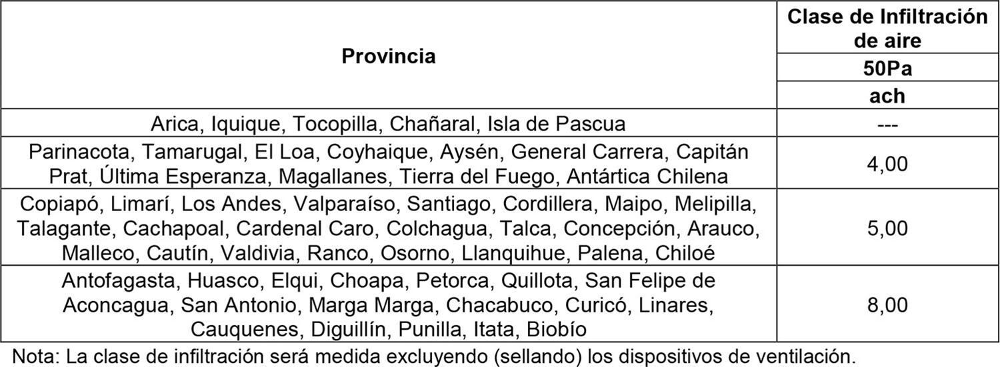

## Página 6

DIARIO OFICIAL DE LA REPUBLICA DE CHILE
Núm. 43.860
Lunes 27 de Mayo de 2024
Página 6 de 19
CVE 2494861 | Director: Felipe Andrés Peroti Díaz
Sitio Web: www.diarioficial.cl
| Mesa Central: 600 712 0001    Email: consultas@diarioficial.cl
Dirección: Dr. Torres Boonen N°511, Providencia, Santiago, Chile.
Este documento ha sido firmado electrónicamente de acuerdo con la ley N°19.799 e incluye sellado de tiempo y firma electrónica
avanzada. Para verificar la autenticidad de una representación impresa del mismo, ingrese este código en el sitio web www.diarioficial.cl
TABLA 2. Resistencia térmica R100 mínima del material aislante térmico en complejos de
techumbre, muros perimetrales y piso ventilado.
 
 
2) Informe de Ensayo, con una antigüedad no mayor a 10 años a partir de la fecha de su
realización, demostrando el cumplimiento de la transmitancia o resistencia térmica exigida,
otorgado por un laboratorio con inscripción vigente en el Registro Oficial de Laboratorios de
Control Técnico de Calidad de la Construcción del Ministerio de Vivienda y Urbanismo,
reglamentado por el DS N° 10 (V. y U.), de 2002, y sus modificaciones.
Para complejos de techumbre, muros perimetrales y piso ventilado, el ensayo debe
realizarse conforme al procedimiento indicado en la NCh 851.
Para complejo de puertas opacas el ensayo debe realizarse conforme al procedimiento
indicado en la NCh 3076/1 y NCh 3076/2.
3) Memoria de Cálculo demostrando el cumplimiento de la transmitancia o resistencia
térmica exigida.
Para complejos de techumbre, muros perimetrales y piso ventilado el cálculo debe realizarse
conforme al procedimiento indicado en la NCh 853 y NCh 3117 según corresponda.
Para complejo de puertas opacas, el cálculo debe realizarse conforme al procedimiento
indicado en la NCh 3137/1 y NCh 3137/2.
4) Adopción de una solución constructiva inscrita en el Listado Oficial de Soluciones
Constructivas para Acondicionamiento Térmico, elaborado por el Ministerio de Vivienda y
Urbanismo.
 
A.5 COMPLEJO DE VENTANAS.
 
El complejo de ventanas según su orientación y valor de transmitancia térmica U, deberá
tener un porcentaje de superficies igual o menor al indicado en la Tabla 3, para la zona térmica
en la cual se ubica el proyecto de acuerdo con los planos de zonificación térmica para la
reglamentación térmica, contenidos en la NCh 1079.
Cuando la edificación posea menos del 60% de la superficie total de los muros perimetrales
expuesta al ambiente exterior, a espacios contiguos abiertos o a recintos no acondicionados, solo
le será aplicable la exigencia de porcentaje indicado para la orientación global teórica (“OGT”).
El porcentaje obtenido para la orientación OGT se aplicará al total de los paramentos
verticales que componen la envolvente y podrá distribuirse entre los muros perimetrales
expuestos al ambiente exterior, a espacios contiguos abiertos o recintos no acondicionados.
 
TABLA 3. Porcentaje máximo permitido de superficie de ventanas según orientación y valor U,
para cada zona térmica.

## Página 7

DIARIO OFICIAL DE LA REPUBLICA DE CHILE
Núm. 43.860
Lunes 27 de Mayo de 2024
Página 7 de 19
CVE 2494861 | Director: Felipe Andrés Peroti Díaz
Sitio Web: www.diarioficial.cl
| Mesa Central: 600 712 0001    Email: consultas@diarioficial.cl
Dirección: Dr. Torres Boonen N°511, Providencia, Santiago, Chile.
Este documento ha sido firmado electrónicamente de acuerdo con la ley N°19.799 e incluye sellado de tiempo y firma electrónica
avanzada. Para verificar la autenticidad de una representación impresa del mismo, ingrese este código en el sitio web www.diarioficial.cl
 
Para determinar el porcentaje máximo de superficie de ventanas permitido según la
orientación del proyecto, se deberá realizar el siguiente procedimiento:
 
a) Identificar las orientaciones correspondientes a los paramentos verticales de la envolvente
térmica. Se deberá determinar la orientación predominante para cada muro perimetral de la
unidad habitacional a partir de la dirección normal, que corresponde a la línea imaginaria
perpendicular al plano de fachada, expresada en grados sexagesimales. La dirección 0° estará
definida por el norte geográfico, por lo que las orientaciones estarán limitadas de acuerdo a lo
establecido en la Tabla 4.
 
TABLA 4. Definición de orientaciones de los muros perimetrales para acreditación del
cumplimiento de exigencias del complejo de ventanas.
 
 
b) Identificar el porcentaje máximo permitido de superficie de ventanas por orientación
según transmitancia térmica del complejo de ventanas conforme a Tabla 3. En el caso que el
proyecto considere ventanas de distinto valor de transmitancia térmica U en una misma
orientación, el porcentaje máximo permitido de superficie de ventanas corresponderá al de la
ventana de mayor valor U de dicha orientación.
c) Determinar la superficie de los paramentos verticales de la envolvente térmica por
orientación. La superficie por orientación a considerar para este cálculo corresponderá a la suma
de las superficies interiores de todos los paramentos verticales perimetrales identificados para
cada orientación, incluyendo muros medianeros.

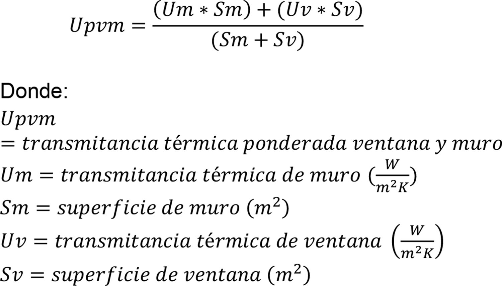

## Página 8

DIARIO OFICIAL DE LA REPUBLICA DE CHILE
Núm. 43.860
Lunes 27 de Mayo de 2024
Página 8 de 19
CVE 2494861 | Director: Felipe Andrés Peroti Díaz
Sitio Web: www.diarioficial.cl
| Mesa Central: 600 712 0001    Email: consultas@diarioficial.cl
Dirección: Dr. Torres Boonen N°511, Providencia, Santiago, Chile.
Este documento ha sido firmado electrónicamente de acuerdo con la ley N°19.799 e incluye sellado de tiempo y firma electrónica
avanzada. Para verificar la autenticidad de una representación impresa del mismo, ingrese este código en el sitio web www.diarioficial.cl
d) Determinar la superficie máxima de ventanas permitida por orientación, según la
siguiente fórmula:
 
 
e) Determinar la superficie de ventanas por orientación del proyecto, correspondiente a la
suma de la superficie de vanos de los paramentos verticales identificados para cada orientación.
Las superficies de ventanas obtenidas deberán ser iguales o menores a la superficie máxima
determinada de conformidad con lo establecido en la letra d) precedente, para cada orientación.
Para el caso de ventanas salientes, se considerará como superficie de ventana aquella
correspondiente al desarrollo completo del complejo de ventanas. En estos casos, se deberá
determinar la orientación para cada superficie vidriada, de acuerdo a la dirección de la normal,
para ser considerada en el cálculo por cada orientación según corresponda.
 
Todo complejo de ventanas en techumbre de edificaciones ubicadas entre la zona térmica B
a I, ambas inclusive, cuyo plano tenga una inclinación de 60° sexagesimales o menos, medidos
desde la horizontal, deberá tener una transmitancia térmica igual o menor a 3,6 W/(m²K).
De manera alternativa a las exigencias de porcentaje máximo de superficie de ventanas
según orientación y valor U, establecidas en la Tabla 3, y para las zonas térmicas B a I (ambas
inclusive), se podrá optar por el valor de transmitancia térmica ponderada máxima de los
complejos de ventanas y muros perimetrales “Upvm”, según lo establecido en la Tabla 5.
Las soluciones constructivas para complejos de muros perimetrales y de ventanas, según su
orientación y valor de U de la ventana, deberán cumplir con el valor de U pvm máximo por
orientación indicado en la Tabla 5 según zona térmica.
 
TABLA 5. Valor U ponderado máximo de los complejos de ventanas y de muros perimetrales
según orientación y valor U de ventana, para cada zona térmica.

## Página 9

DIARIO OFICIAL DE LA REPUBLICA DE CHILE
Núm. 43.860
Lunes 27 de Mayo de 2024
Página 9 de 19
CVE 2494861 | Director: Felipe Andrés Peroti Díaz
Sitio Web: www.diarioficial.cl
| Mesa Central: 600 712 0001    Email: consultas@diarioficial.cl
Dirección: Dr. Torres Boonen N°511, Providencia, Santiago, Chile.
Este documento ha sido firmado electrónicamente de acuerdo con la ley N°19.799 e incluye sellado de tiempo y firma electrónica
avanzada. Para verificar la autenticidad de una representación impresa del mismo, ingrese este código en el sitio web www.diarioficial.cl
 
En el caso que el proyecto considere ventanas de distinto valor de transmitancia térmica U
en una misma orientación, el Upvm se determinará utilizando el valor U mayor de las ventanas de
dicha orientación.
El valor U de la solución constructiva de muro deberá cumplir las exigencias de valor U
máximo indicado en la Tabla 1, para la zona térmica en la que se ubica el proyecto.
Para determinar el valor de Upvm máximo permitido por orientación se deberá realizar el
siguiente procedimiento:
 
a) Identificar las orientaciones correspondientes a los paramentos verticales de la envolvente
térmica. Se deberá determinar la orientación predominante para cada muro perimetral de la
unidad habitacional a partir de la dirección normal, que corresponde a la línea imaginaria
perpendicular al plano de fachada, expresada en grados sexagesimales. La dirección 0° estará
definida por el norte geográfico, por lo que las orientaciones estarán limitadas de acuerdo a lo
establecido en la Tabla 4.
b) Determinar la superficie de los paramentos verticales de la envolvente térmica por
orientación. La superficie por orientación a considerar para este cálculo corresponderá a la suma
de las superficies interiores de todos los paramentos verticales perimetrales identificados para
cada orientación, excluyendo medianeros.
c) Determinar la superficie de ventanas por orientación del proyecto, correspondiente a la
suma de la superficie de vanos de los paramentos verticales identificados para cada orientación.
d) Determinar el valor de U pvm máximo permitido por orientación, según la siguiente
fórmula:
 
 
El resultado de Upvm obtenido según la fórmula anterior, para cada orientación, deberá ser
igual o menor al indicado en la Tabla 5, para la zona térmica en la que se ubica el proyecto de
acuerdo con los planos de zonificación térmica para la reglamentación térmica, contenidos en la
NCh 1079.
 
Alternativas de cumplimiento.
 
Para acreditar el valor de transmitancia térmica del complejo de ventanas, según lo
dispuesto en este numeral, se podrá optar entre las siguientes alternativas:
 
1) Informe de Ensayo de transmitancia térmica, realizado conforme a la NCh 3076/1 y NCh
3076/2, otorgado por un laboratorio con inscripción vigente en el Registro Oficial de
Laboratorios de Control Técnico de Calidad de la Construcción del Ministerio de Vivienda y
Urbanismo, reglamentado por el DS N° 10 (V. y U.), de 2002, y sus modificaciones.
2) Memoria de Cálculo de transmitancia térmica “U”, desarrollado conforme al
procedimiento de la norma NCh 3137/1 y NCh 3137/2.
3) Adopción de una solución constructiva de ventana que corresponda a alguna de las
soluciones inscritas en el Listado Oficial de Soluciones Constructivas para Acondicionamiento
Térmico, elaborado por el Ministerio de Vivienda y Urbanismo.
 
Para acreditar el porcentaje de ventanas según orientación y valor “U” se presentará un
informe acreditando el cumplimiento de la superficie de complejo de ventanas por orientación
exigida y el valor de transmitancia térmica por orientación, según Tabla 3.

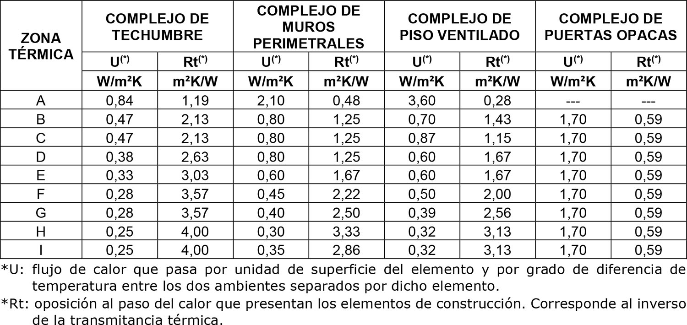

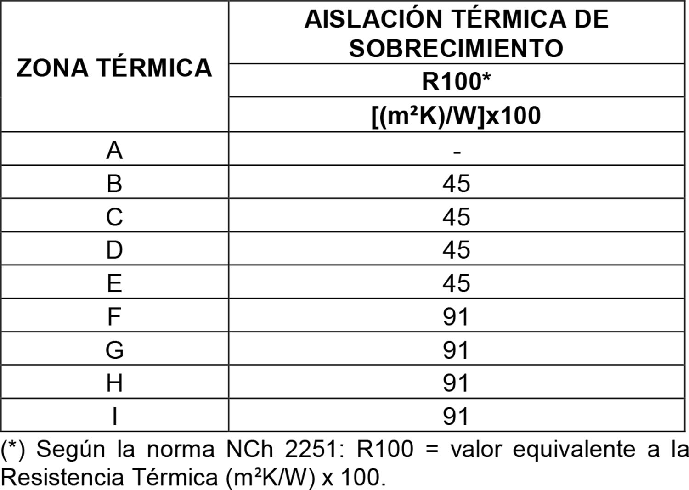

## Página 10

DIARIO OFICIAL DE LA REPUBLICA DE CHILE
Núm. 43.860
Lunes 27 de Mayo de 2024
Página 10 de 19
CVE 2494861 | Director: Felipe Andrés Peroti Díaz
Sitio Web: www.diarioficial.cl
| Mesa Central: 600 712 0001    Email: consultas@diarioficial.cl
Dirección: Dr. Torres Boonen N°511, Providencia, Santiago, Chile.
Este documento ha sido firmado electrónicamente de acuerdo con la ley N°19.799 e incluye sellado de tiempo y firma electrónica
avanzada. Para verificar la autenticidad de una representación impresa del mismo, ingrese este código en el sitio web www.diarioficial.cl
Para acreditar el valor de transmitancia térmica ponderada máxima de los complejos de
ventanas y de muros perimetrales, según orientación y valor “U” de ventana se presentará un
Informe acreditando el cumplimiento del valor de transmitancia térmica máxima ponderada de
ventana y muro según orientación según la Tabla 5.
El complejo de ventanas de las edificaciones de uso residencial destinadas a hoteles, deberá
cumplir las exigencias establecidas en el literal A.5 del numeral 2. de este artículo.
 
A.6 SOBRECIMIENTOS.
 
El material aislante térmico utilizado en los sobrecimientos de pisos sobre el terreno en
edificaciones deberá tener una resistencia térmica igual o superior a la indicada en la Tabla 6,
para la zona térmica en la que se ubica el proyecto de acuerdo con los planos de zonificación
térmica para la reglamentación térmica, contenidos en la NCh 1079. Si no se contempla
sobrecimientos, el elemento que cumpla la función de separar el nivel de piso terminado de la
edificación y sus muros perimetrales del nivel del terreno, deberá cumplir esta misma exigencia.
Para cumplir esta resistencia, y minimizar el puente térmico en el o los pisos en contacto
con el terreno, se deberá incorporar un material aislante, rotulado según la norma técnica NCh
2251, que cumpla con una resistencia térmica R100 igual o superior a la indicada en la Tabla 6.
 
TABLA 6. Resistencia térmica R100 mínima del material aislante térmico utilizado en los
sobrecimientos de pisos sobre el terreno.
 
 
Los aislantes térmicos especificados en las soluciones constructivas que den cumplimiento a
las exigencias señaladas anteriormente deberán ser instalados por el exterior, cubriendo el
sobrecimiento o el elemento que corresponda, desde el nivel de piso terminado hasta el hombro
de la fundación, o bien desde el nivel de piso terminado hasta 30 cm bajo el nivel de terreno.
El radier afinado o la losa apoyada sobre el terreno, no tendrá exigencia de colocación de
material aislante bajo este.
 
Alternativas de cumplimiento.
 
Para los efectos de acreditar el valor de resistencia térmica R100 de los aislantes térmicos
incorporados en sobrecimientos, o en el elemento que corresponda, se podrá optar entre las
siguientes alternativas:
 
1) Incorporación de un material aislante, rotulado según la norma técnica NCh 2251, que
cumpla con una resistencia térmica R100 igual o superior a la señalada en la Tabla 6 para la zona
térmica que corresponda a la ubicación del proyecto.
2) Adopción de alguna de las soluciones constructivas inscritas en el Listado Oficial de
Soluciones Constructivas para Acondicionamiento Térmico, elaborado por el Ministerio de
Vivienda y Urbanismo.
 
B. CONDENSACIÓN SUPERFICIAL E INTERSTICIAL.
 
En los complejos de techumbre, muros perimetrales y piso ventilado se deberá verificar que
no exista riesgo de condensación superficial e intersticial, de acuerdo al procedimiento de la NCh

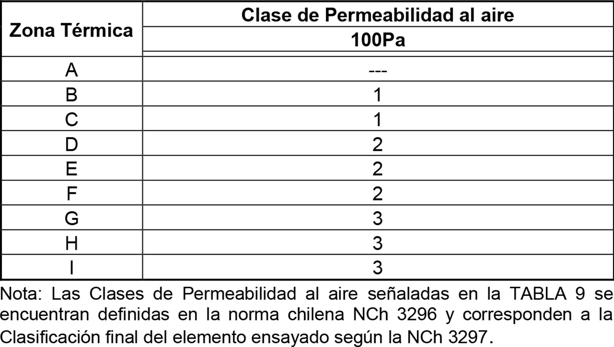

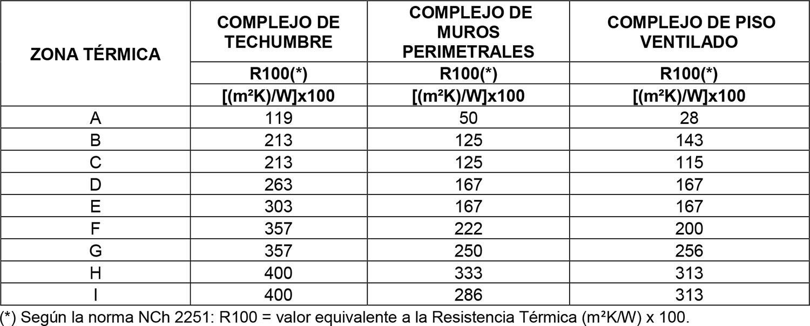

## Página 11

DIARIO OFICIAL DE LA REPUBLICA DE CHILE
Núm. 43.860
Lunes 27 de Mayo de 2024
Página 11 de 19
CVE 2494861 | Director: Felipe Andrés Peroti Díaz
Sitio Web: www.diarioficial.cl
| Mesa Central: 600 712 0001    Email: consultas@diarioficial.cl
Dirección: Dr. Torres Boonen N°511, Providencia, Santiago, Chile.
Este documento ha sido firmado electrónicamente de acuerdo con la ley N°19.799 e incluye sellado de tiempo y firma electrónica
avanzada. Para verificar la autenticidad de una representación impresa del mismo, ingrese este código en el sitio web www.diarioficial.cl
1973 y a las condiciones de cálculo que definirá el Ministerio de Vivienda y Urbanismo
mediante Resolución, debiendo acreditar este cumplimiento por medio de una Memoria de
Cálculo.
El análisis de condensación superficial debe incluir los puentes térmicos contenidos en la
solución constructiva o en el sistema constructivo adoptado para los complejos de techumbre,
muros perimetrales y piso ventilado.
El diseño de la solución constructiva de los complejos de techumbre, muros perimetrales y
piso ventilado debe permitir que el vapor de agua que ingrese al respectivo complejo pueda salir
al exterior.
Las edificaciones de uso residencial destinadas a hoteles estarán exentas de cumplir las
exigencias de condensación superficial e intersticial en los complejos de techumbre, muros
perimetrales y piso ventilado.
 
C. INFILTRACIONES DE AIRE.
 
Las edificaciones de uso residencial, exceptuando los hoteles, deberán controlar las
infiltraciones de aire cumpliendo los estándares de clase de infiltración y clase de permeabilidad
al aire indicados a continuación.
La envolvente térmica deberá tener una clase de infiltración de aire medido a 50 Pa igual o
menor a la clase de infiltración señalada en la Tabla 7, para la provincia en la cual se ubica el
proyecto.
 
TABLA 7. Clase de infiltración de aire máxima permitida para la envolvente térmica de las
edificaciones, excluyendo de ésta los complejos de puertas opacas y ventanas.
 
 
La acreditación de la clase de infiltración de aire máxima de la envolvente térmica se
realizará mediante un Informe de Ensayo en terreno, realizado conforme al procedimiento
indicado en la NCh 3295, elaborado por el arquitecto del proyecto, un profesional competente o
especialista, con inscripción vigente en el Registro de Consultores del Ministerio de Vivienda y
Urbanismo, reglamentado por el DS N° 135, de 1978 (V. y U.) y sus modificaciones, o por un
laboratorio con Inscripción vigente en el Registro Oficial de Laboratorios de Control Técnico de
Calidad de la Construcción del Ministerio de Vivienda y Urbanismo, reglamentado por el DS
N° 10 (V. y U.), de 2002, y sus modificaciones.
El ensayo se aplicará una vez terminada la ejecución de la obra, a una muestra
representativa cuyo tamaño será el indicado en la Tabla 8, según el tamaño del lote. Si el
resultado de los ensayos alcanza la cantidad de ítemes no conformes indicados en esta Tabla, éste
se entenderá como rechazado. En estos casos deberá repetirse el ensayo, aplicándose a un tamaño
de muestra correspondiente al doble del indicado según el tamaño del lote.
 
TABLA 8. Tamaño de la muestra de ensayo en terreno, según tamaño del lote y cantidad de
ítemes no conformes.

## Página 12

DIARIO OFICIAL DE LA REPUBLICA DE CHILE
Núm. 43.860
Lunes 27 de Mayo de 2024
Página 12 de 19
CVE 2494861 | Director: Felipe Andrés Peroti Díaz
Sitio Web: www.diarioficial.cl
| Mesa Central: 600 712 0001    Email: consultas@diarioficial.cl
Dirección: Dr. Torres Boonen N°511, Providencia, Santiago, Chile.
Este documento ha sido firmado electrónicamente de acuerdo con la ley N°19.799 e incluye sellado de tiempo y firma electrónica
avanzada. Para verificar la autenticidad de una representación impresa del mismo, ingrese este código en el sitio web www.diarioficial.cl
De manera alternativa a las exigencias de Clase de Infiltración de aire máxima establecidas
en la Tabla 7, y mientras en la región donde se ubica el proyecto no existan profesionales
competentes, especialistas y laboratorios con inscripción vigente en los registros del Ministerio
de Vivienda y Urbanismo habilitados para realizar un ensayo en terreno conforme al
procedimiento indicado en la NCh 3295, y para tamaños de lotes de 10 o menos unidades, se
podrá optar por la especificación de una solución constructiva determinada en la partida de sellos
de las Especificaciones Técnicas, en:
 
- encuentros entre marcos y vanos de puertas y ventanas.
- uniones de elementos de distinta materialidad.
- uniones de elementos de una misma materialidad.
- perforaciones de todas las instalaciones.
- encuentro de solera inferior con su elemento de soporte.
- encuentro de solera superior con su elemento de soporte.
- dispositivos de ventilación.
- ductos de evacuación de gases.
- otros encuentros o uniones similares.
 
Esta alternativa dejará de estar permitida cuando el Ministerio de Vivienda y Urbanismo lo
establezca mediante resolución.
Los complejos de puertas opacas y ventanas de las edificaciones de uso residencial, deberán
tener una clase final de permeabilidad al aire, medido a 100Pa, igual o mayor a la señalada en la
Tabla 9 para la zona térmica en la cual se ubica el proyecto de acuerdo con los planos de
zonificación térmica para la reglamentación térmica, contenidos en la NCh 1079.
 
TABLA 9. Clase de Permeabilidad al aire mínima para complejos de puertas opacas y ventanas.
 
 
Para los efectos de acreditar la Clase de Permeabilidad al aire mínima de los complejos de
puertas opacas y ventanas se podrá optar entre las siguientes alternativas:
 
1. Informe de Ensayo, realizado conforme al procedimiento indicado en la NCh 3296 y NCh
3297, otorgado por un laboratorio con inscripción vigente en el Registro Oficial de Laboratorios
de Control Técnico de Calidad de la Construcción del Ministerio de Vivienda y Urbanismo,
reglamentado por el DS N° 10 (V. y U.), de 2002, y sus modificaciones, demostrando el
cumplimiento de la Clasificación final de Permeabilidad al aire de los complejos de ventanas y
puertas opacas de la edificación.
2. Adopción de un elemento constructivo de puerta y ventana que corresponda a alguna de
las soluciones inscritas en el Listado Oficial de Soluciones Constructivas para
Acondicionamiento Térmico, elaborado por el Ministerio de Vivienda y Urbanismo.
 
D. VENTILACIÓN.
 
Las edificaciones destinadas al uso residencial, exceptuando los hoteles, deberán contar con
un sistema de ventilación que asegure una tasa de ventilación no menor a las indicadas en las
NCh 3308 y NCh 3309, según corresponda, y cuyo diseño esté orientado a proveer una calidad
de aire interior aceptable.
Las tasas de ventilación mínimas se acreditarán mediante un Informe de acreditación de
cumplimiento de la tasa de ventilación conforme lo señalan la NCh 3308 y NCh 3309, según
corresponda.

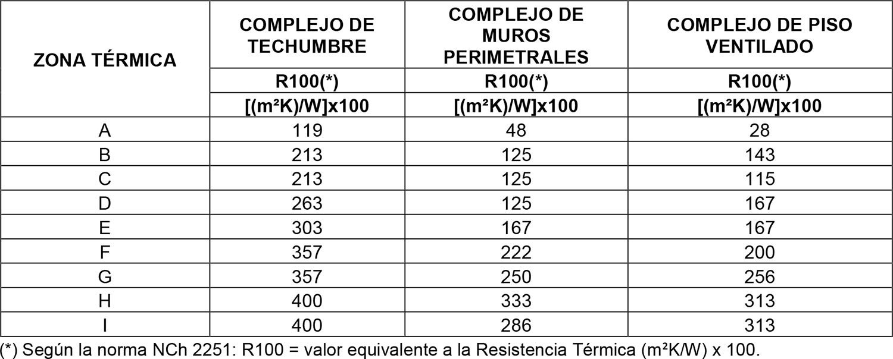

## Página 13

DIARIO OFICIAL DE LA REPUBLICA DE CHILE
Núm. 43.860
Lunes 27 de Mayo de 2024
Página 13 de 19
CVE 2494861 | Director: Felipe Andrés Peroti Díaz
Sitio Web: www.diarioficial.cl
| Mesa Central: 600 712 0001    Email: consultas@diarioficial.cl
Dirección: Dr. Torres Boonen N°511, Providencia, Santiago, Chile.
Este documento ha sido firmado electrónicamente de acuerdo con la ley N°19.799 e incluye sellado de tiempo y firma electrónica
avanzada. Para verificar la autenticidad de una representación impresa del mismo, ingrese este código en el sitio web www.diarioficial.cl
2. USO EQUIPAMIENTO DE LAS CLASES EDUCACIÓN Y SALUD (EXCEPTO
CEMENTERIOS Y CREMATORIOS) Y AQUELLAS DEL USO RESIDENCIAL
DESTINADAS A HOTELES, CUANDO SE INDIQUE.
 
Las exigencias a las edificaciones de uso equipamiento de las clases educación y salud,
señaladas en el artículo 2.1.33. de esta Ordenanza, con las excepciones que señale este numeral,
y exceptuando los cementerios y crematorios, y aquellas del uso residencial destinadas a hoteles,
cuando se indique, serán las siguientes:
 
A. TRANSMITANCIA TÉRMICA y RESISTENCIA TÉRMICA.
 
Los complejos de techumbre, muros perimetrales, piso ventilado y puertas opacas deberán
tener una transmitancia térmica U igual o menor, o una resistencia térmica total Rt igual o
superior, a la señalada en la Tabla 10 de este numeral, para la zona térmica en la que se ubica el
proyecto de acuerdo con los planos de zonificación térmica para la reglamentación térmica,
contenidos en la NCh 1079.
 
TABLA 10. Transmitancia térmica U máxima y resistencia térmica Rt mínima para complejos de
techumbre, muros perimetrales, piso ventilado y puertas opacas.
 
 
Los recintos cerrados no acondicionados, contiguos a la edificación, y destinados a bodegas,
talleres de reparación o de materiales, instalaciones, estacionamientos cubiertos u otros de
similar naturaleza, serán considerados como recintos abiertos para efectos de esta reglamentación
y no tendrán requisitos de acondicionamiento térmico.
Los aislantes térmicos o soluciones constructivas especificadas en el proyecto deberán
cubrir en forma continua el máximo de la superficie de los complejos de techumbre, muros
perimetrales, piso ventilado y sobrecimiento, procurando la continuidad de la envolvente
térmica, la que solo podrá interrumpirse por elementos de la estructura o por las redes o
canalizaciones de las instalaciones.
 
A.1 COMPLEJO DE TECHUMBRE.
 
Para cumplir las exigencias de transmitancia térmica y resistencia térmica, en los complejos
de techumbre los aislantes térmicos o la solución constructiva incorporada deberá cubrir el
máximo de la superficie de la parte superior de los muros en su encuentro con el complejo de
techumbre, tales como cadenas, vigas o soleras superiores, conformando un elemento continuo
por todo el contorno de los muros perimetrales.
Para obtener una continuidad en el aislamiento térmico, todo muro o tabique, antepecho o
dintel que sea parte de una ventana de techo, lucarna, u otro elemento similar en la techumbre, y
que interrumpa esa continuidad, deberá cumplir con la misma exigencia que le corresponda al
complejo de techumbre, de acuerdo a lo señalado en la Tabla 10 de este numeral. Igual exigencia
se aplicará al muro o tabique que delimite un recinto acondicionado de otro no acondicionado.

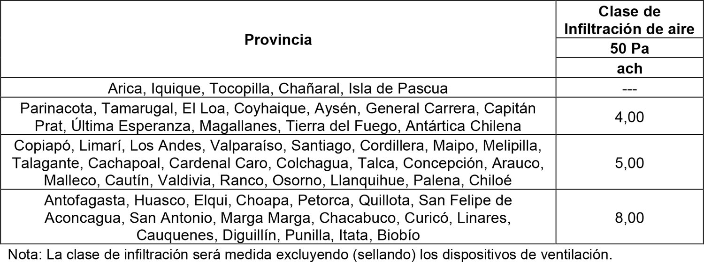

## Página 14

DIARIO OFICIAL DE LA REPUBLICA DE CHILE
Núm. 43.860
Lunes 27 de Mayo de 2024
Página 14 de 19
CVE 2494861 | Director: Felipe Andrés Peroti Díaz
Sitio Web: www.diarioficial.cl
| Mesa Central: 600 712 0001    Email: consultas@diarioficial.cl
Dirección: Dr. Torres Boonen N°511, Providencia, Santiago, Chile.
Este documento ha sido firmado electrónicamente de acuerdo con la ley N°19.799 e incluye sellado de tiempo y firma electrónica
avanzada. Para verificar la autenticidad de una representación impresa del mismo, ingrese este código en el sitio web www.diarioficial.cl
A.2 COMPLEJO DE MUROS PERIMETRALES.
 
Para cumplir las exigencias de transmitancia térmica y resistencia térmica en los complejos
de muros perimetrales, los aislantes térmicos o la solución constructiva adoptada deberán cubrir
el máximo de la superficie del muro conformando un elemento continuo por todo el contorno de
los muros perimetrales, pudiendo estar interrumpidos solo por los vanos.
A los cerramientos traslúcidos o transparentes de los vanos en los muros perimetrales les
serán aplicables las exigencias señaladas en el literal A.5 Complejo de ventanas de este numeral.
 
A.3 COMPLEJO DE PISO VENTILADO.
 
Para obtener una continuidad en el aislamiento térmico del piso ventilado, los elementos
salientes y que sean parte de éste deberán cumplir con la misma exigencia que le corresponda al
complejo del cual son parte, de acuerdo a lo señalado en la Tabla 10 de este artículo. Lo anterior
independiente del ángulo de inclinación del elemento.
 
A.4 COMPLEJO DE PUERTAS OPACAS.
 
Las exigencias señaladas en la Tabla 10 del presente artículo serán aplicables al complejo
de puertas opacas y a las partes opacas de puertas con partes traslúcidas o transparentes, que
comuniquen recintos acondicionados con el espacio exterior o con uno o más espacios o recintos
no acondicionados. Lo anterior, independiente del ángulo de inclinación del elemento y del
complejo donde se ubique.
Las partes vidriadas de las puertas serán consideradas como elementos traslúcidos y les
serán aplicables las exigencias establecidas para el Complejo de ventanas señalados en el literal
A.5 de este numeral.
 
Alternativas de cumplimiento.
 
Para los efectos de acreditar el cumplimiento de las exigencias establecidas en la Tabla 10,
conforme a lo señalado en este numeral, se podrá optar entre las siguientes alternativas:
 
a) Incorporación de un material aislante, rotulado según la norma técnica NCh 2251, que
cumpla con una resistencia térmica R100 igual o superior a la señalada en la Tabla 11 para la
zona térmica en la que se ubica el proyecto. Se deberá especificar y colocar un material aislante
térmico, incorporado o adosado, a los complejos de techumbre, muros perimetrales o piso
ventilado.
 
TABLA 11. Resistencia térmica R100 mínima del material aislante térmico en complejos de
techumbre, muros perimetrales y piso ventilado.
 
 
b) Informe de Ensayo, con una antigüedad no mayor a 10 años a partir de la fecha de su
realización, demostrando el cumplimiento de la transmitancia o resistencia térmica exigida,
otorgado por un laboratorio con inscripción vigente en el Registro Oficial de Laboratorios de
Control Técnico de Calidad de la Construcción del Ministerio de Vivienda y Urbanismo,
reglamentado por el DS N° 10 (V. y U.), de 2002, y sus modificaciones.
Para complejos de techumbre, muros perimetrales y piso ventilado, el ensayo debe
realizarse conforme al procedimiento indicado en la NCh 851.

## Página 15

DIARIO OFICIAL DE LA REPUBLICA DE CHILE
Núm. 43.860
Lunes 27 de Mayo de 2024
Página 15 de 19
CVE 2494861 | Director: Felipe Andrés Peroti Díaz
Sitio Web: www.diarioficial.cl
| Mesa Central: 600 712 0001    Email: consultas@diarioficial.cl
Dirección: Dr. Torres Boonen N°511, Providencia, Santiago, Chile.
Este documento ha sido firmado electrónicamente de acuerdo con la ley N°19.799 e incluye sellado de tiempo y firma electrónica
avanzada. Para verificar la autenticidad de una representación impresa del mismo, ingrese este código en el sitio web www.diarioficial.cl
Para complejo de puertas opacas el ensayo debe realizarse conforme al procedimiento
indicado en la NCh 3076/1 y NCh 3076/2.
c) Memoria de Cálculo demostrando el cumplimiento de la transmitancia o resistencia
térmica exigida.
Para complejos de techumbre, muros perimetrales y piso ventilado el cálculo debe realizarse
conforme al procedimiento indicado en la NCh 853 y NCh 3117 según corresponda.
Para complejo de puertas opacas, el cálculo debe realizarse conforme al procedimiento
indicado en la NCh 3137/1 y NCh 3137/2.
d) Adopción de alguna de las soluciones constructivas inscritas en el Listado Oficial de
Soluciones Constructivas para Acondicionamiento Térmico, confeccionado por el Ministerio de
Vivienda y Urbanismo.
 
A.5 COMPLEJO DE VENTANAS.
 
El complejo de ventanas de edificaciones a las cuales le aplican las exigencias de este
numeral, y aquellas del uso residencial destinadas a hoteles, deberán tener una transmitancia
térmica U igual o menor, o una resistencia térmica Rt igual o mayor, a la señalada en la Tabla 12,
para la zona térmica en la que se ubica el proyecto de acuerdo con los planos de zonificación
térmica para la reglamentación térmica, contenidos en la NCh 1079.
 
TABLA 12. Transmitancia térmica U máxima y resistencia térmica Rt mínima para el complejo
de ventanas.
 
 
Todo complejo de ventanas en techumbre de las edificaciones ubicadas entre la zona
térmica B a I, ambas inclusive, cuyo plano tenga una inclinación de 60° sexagesimales o menos,
medidos desde la horizontal, deberá tener una transmitancia térmica igual o menor a 3,6
W/(m²K).
 
Alternativas de cumplimiento
 
Para efectos de acreditar el valor de transmitancia térmica del complejo de ventanas, de
acuerdo a la Tabla 12 se podrá optar entre las siguientes alternativas:
 
a) Informe de Ensayo de transmitancia térmica U, realizado conforme a la NCh 3076/1 y
NCh 3076/2, demostrando el cumplimiento de la transmitancia térmica indicada en la Tabla 12,
otorgado por un laboratorio con inscripción vigente en el Registro Oficial de Laboratorios de
Control Técnico de Calidad de la Construcción del Ministerio de Vivienda y Urbanismo,
reglamentado por el DS N° 10 (V. y U.), de 2002, y sus modificaciones.
b) Memoria de Cálculo de transmitancia térmica U, elaborado conforme al procedimiento
de la norma NCh 3137/1 y NCh 3137/2, demostrando el cumplimiento de la transmitancia
térmica indicada en la Tabla 12.
c) Adopción de un elemento que corresponda a alguna de las soluciones inscritas en el
Listado Oficial de Soluciones Constructivas para Acondicionamiento Térmico, confeccionado
por el Ministerio de Vivienda y Urbanismo.
 
A.6 SOBRECIMIENTOS.
 
El material aislante térmico utilizado en los sobrecimientos de pisos sobre el terreno en
edificaciones, deberá tener una resistencia térmica R100 igual o superior a la indicada en la

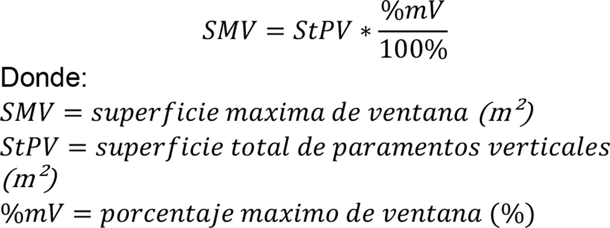

## Página 16

DIARIO OFICIAL DE LA REPUBLICA DE CHILE
Núm. 43.860
Lunes 27 de Mayo de 2024
Página 16 de 19
CVE 2494861 | Director: Felipe Andrés Peroti Díaz
Sitio Web: www.diarioficial.cl
| Mesa Central: 600 712 0001    Email: consultas@diarioficial.cl
Dirección: Dr. Torres Boonen N°511, Providencia, Santiago, Chile.
Este documento ha sido firmado electrónicamente de acuerdo con la ley N°19.799 e incluye sellado de tiempo y firma electrónica
avanzada. Para verificar la autenticidad de una representación impresa del mismo, ingrese este código en el sitio web www.diarioficial.cl
Tabla 13, para la zona térmica en la que se ubica el proyecto de acuerdo con los planos de
zonificación térmica para la reglamentación térmica, contenidos en la NCh 1079. Si no se
contempla sobrecimiento, el elemento que cumpla la función de separar el nivel de piso
terminado de la edificación y sus muros perimetrales, del nivel del terreno, deberá cumplir esta
misma exigencia.
 
TABLA 13. Resistencia térmica R100 mínima del material aislante térmico utilizado en los
sobrecimientos de pisos sobre el terreno.
 
 
Los aislantes térmicos especificados en las soluciones constructivas que den cumplimiento a
las exigencias señaladas anteriormente, deberán ser instalados por el exterior del sobrecimiento o
del elemento que corresponda, desde el nivel de piso terminado hasta el hombro de la fundación,
o bien, desde el nivel de piso terminado hasta 30 cm bajo el nivel de terreno natural.
El radier afinado o la losa apoyada sobre el terreno no tendrá exigencia de colocación de
material aislante bajo esta.
 
Alternativas de cumplimiento
 
Para efectos de acreditar la resistencia térmica R100 igual o superior a la indicada en la
Tabla 13, del material aislante térmico utilizado en los sobrecimientos de pisos sobre el terreno,
para la zona térmica en la que se ubica el proyecto, se podrá optar entre las siguientes
alternativas:
 
1) Incorporación de un material aislante, rotulado según la norma técnica NCh 2251, que
cumpla con una resistencia térmica R100 igual o superior a la señalada en la Tabla 13 para la
zona térmica que le corresponda al proyecto de arquitectura.
2) Especificación de alguna de las soluciones constructivas inscritas en el Listado Oficial de
Soluciones Constructivas para Acondicionamiento Térmico, elaborado por el Ministerio de
Vivienda y Urbanismo.
 
B. CONDENSACIÓN SUPERFICIAL E INTERSTICIAL.
 
En los complejos de techumbre, muros perimetrales y piso ventilado de las edificaciones,
deberá acreditarse que no existe riesgo de condensación superficial e intersticial mediante una
Memoria de Cálculo, elaborada conforme al procedimiento de la NCh 1973 y a las condiciones
de cálculo definidas por el Ministerio de Vivienda y Urbanismo mediante resolución,
demostrando que no existe condensación superficial ni intersticial en los complejos constructivos
indicados en la exigencia.
El análisis de condensación superficial debe incluir los puentes térmicos contenidos en los
sistemas constructivos de los complejos de techumbre, muros perimetrales y piso ventilado.
 
C. INFILTRACIONES DE AIRE.
 
Las edificaciones a las cuales le aplican las exigencias de este numeral, deberán controlar
las infiltraciones de aire cumpliendo los estándares de clase de infiltración y clase de
permeabilidad al aire indicados a continuación.
La envolvente térmica deberá tener una clase de infiltración de aire medido a 50Pa igual o
menor a la clase de infiltración señalada en la Tabla 14, para la provincia en la cual se ubica el
proyecto.

## Página 17

DIARIO OFICIAL DE LA REPUBLICA DE CHILE
Núm. 43.860
Lunes 27 de Mayo de 2024
Página 17 de 19
CVE 2494861 | Director: Felipe Andrés Peroti Díaz
Sitio Web: www.diarioficial.cl
| Mesa Central: 600 712 0001    Email: consultas@diarioficial.cl
Dirección: Dr. Torres Boonen N°511, Providencia, Santiago, Chile.
Este documento ha sido firmado electrónicamente de acuerdo con la ley N°19.799 e incluye sellado de tiempo y firma electrónica
avanzada. Para verificar la autenticidad de una representación impresa del mismo, ingrese este código en el sitio web www.diarioficial.cl
TABLA 14. Clase de infiltración de aire máxima permitida para la envolvente térmica de las
edificaciones, excluyendo de ésta los complejos de puerta y ventanas.
 
 
La acreditación de la clase de infiltración de aire máxima de la envolvente térmica se
realizará mediante Informe de Ensayo en terreno, elaborado conforme al procedimiento indicado
en la NCh 3295 por el arquitecto del proyecto, un profesional competente o especialista, con
inscripción vigente en el Registro de Consultores del Ministerio de Vivienda y Urbanismo,
reglamentado por el DS N° 135, de 1978 (V. y U.) y sus modificaciones, o por un laboratorio con
Inscripción vigente en el Registro Oficial de Laboratorios de Control Técnico de Calidad de la
Construcción del Ministerio de Vivienda y Urbanismo, reglamentado por el DS N° 10 (V. y U.),
de 2002, y sus modificaciones.
El ensayo en terreno se aplicará una vez terminada la ejecución de la obra, a una muestra
representativa dependiendo del tipo de edificación.
Para edificaciones de la clase educación, el tamaño de la muestra a ensayar será el indicado
en la Tabla 15, según la cantidad de recintos docentes que contemple el proyecto.
Los proyectos ubicados en las provincias de Parinacota, Tamarugal, El Loa, Coyhaique,
Aysén, General Carrera, Capitán Prat, Última Esperanza, Magallanes, Tierra del Fuego y
Antártica Chilena, solo podrán utilizar esta alternativa de acreditación.
 
TABLA 15. Tamaño de la muestra de ensayo en terreno en edificaciones de la clase educación.
 
 
Para la determinación de la cantidad total de recintos docentes de las edificaciones de la
clase educación que son parte de la muestra de ensaye, se contabilizarán los siguientes tipos de
recintos que sean parte del proyecto:
 
- Laboratorios.
- Talleres y Multitalleres.
- Aulas.
- Aulas de integración.
- Sala de profesores.
- Salas de actividades de párvulos.
- Biblioteca o CRA.
 
Para edificaciones de la clase salud, el tamaño de la muestra corresponderá al 5% de la
cantidad total de la sumatoria de los recintos perimetrales acondicionados en la edificación.
De manera alternativa a las exigencias de Clase de Infiltración de aire máxima establecidas
en la Tabla 14, y mientras en la región donde se ubica el proyecto no existan profesionales
competentes, especialistas y laboratorios con inscripción vigente en los registros del Ministerio
de Vivienda y Urbanismo habilitados para realizar un ensayo en terreno realizado conforme al
procedimiento indicado en la NCh 3295, se podrá optar por la especificación de una solución
constructiva determinada en la partida de sellos de las Especificaciones Técnicas, en:
 
- encuentros entre marcos y vanos de puertas y ventanas.
- uniones de elementos de distinta materialidad.

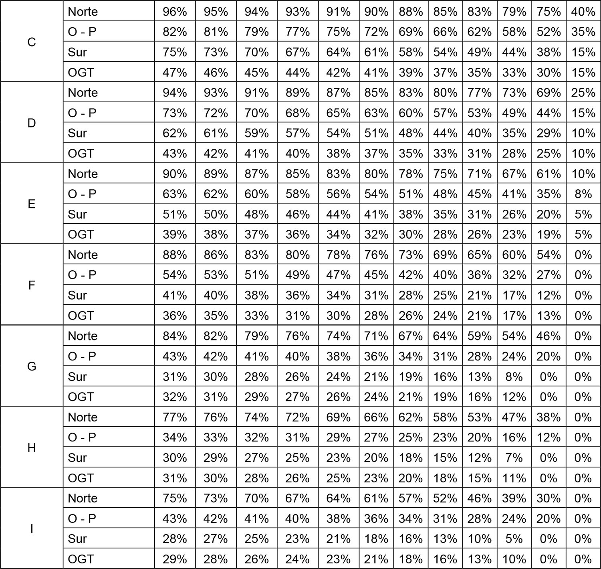

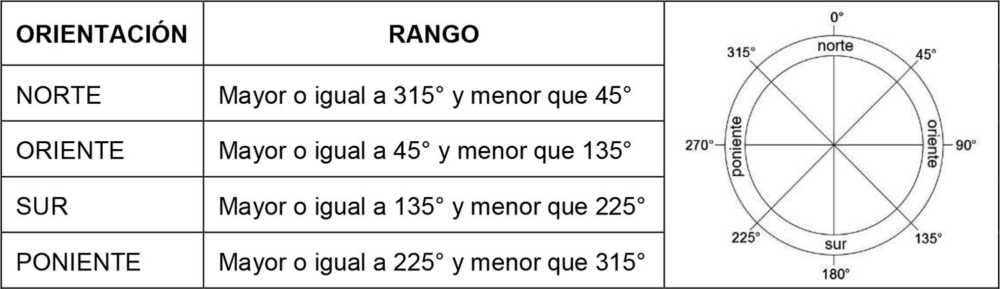

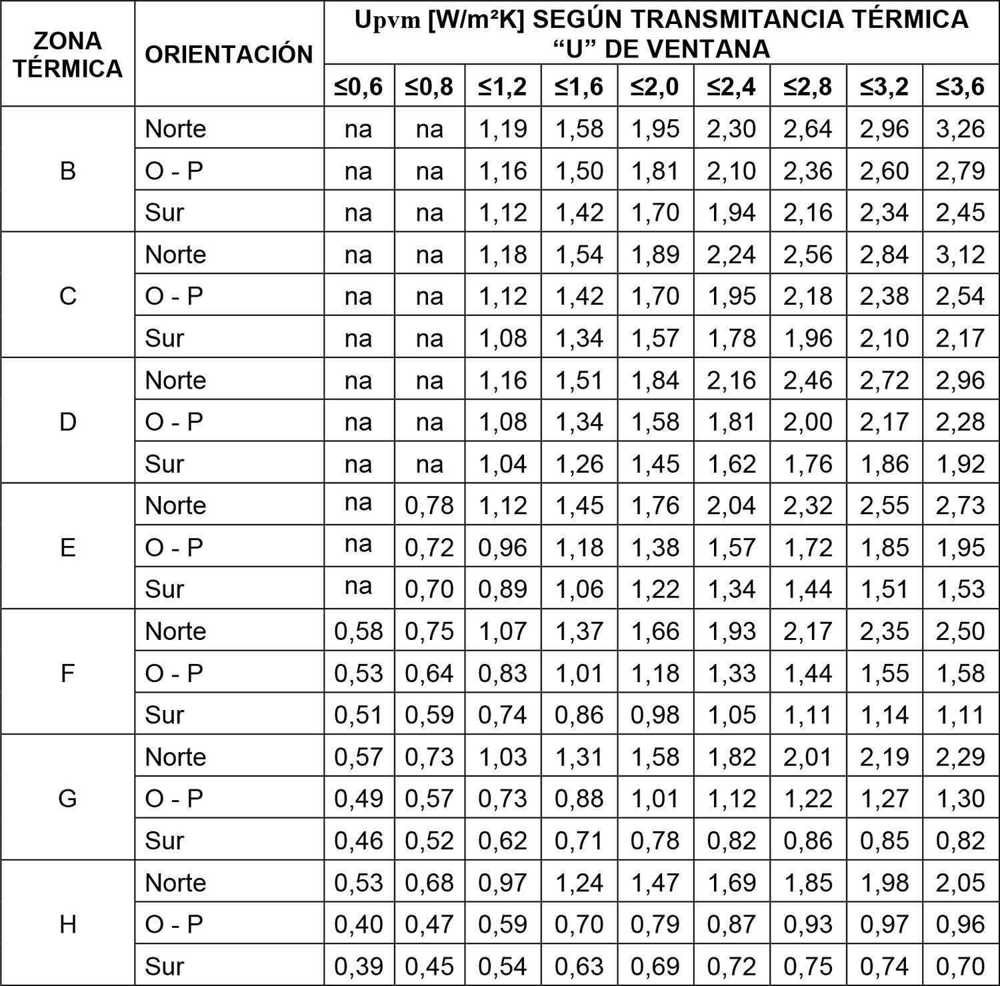

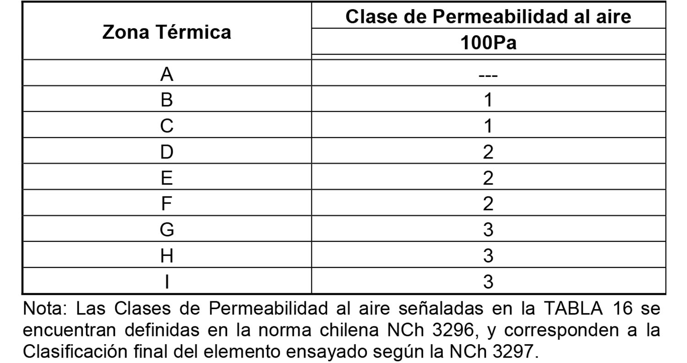

## Página 18

DIARIO OFICIAL DE LA REPUBLICA DE CHILE
Núm. 43.860
Lunes 27 de Mayo de 2024
Página 18 de 19
CVE 2494861 | Director: Felipe Andrés Peroti Díaz
Sitio Web: www.diarioficial.cl
| Mesa Central: 600 712 0001    Email: consultas@diarioficial.cl
Dirección: Dr. Torres Boonen N°511, Providencia, Santiago, Chile.
Este documento ha sido firmado electrónicamente de acuerdo con la ley N°19.799 e incluye sellado de tiempo y firma electrónica
avanzada. Para verificar la autenticidad de una representación impresa del mismo, ingrese este código en el sitio web www.diarioficial.cl
- uniones de elementos de una misma materialidad.
- perforaciones de todas las instalaciones.
- encuentro de solera inferior con su elemento de soporte.
- encuentro de solera superior con su elemento de soporte.
- dispositivos de ventilación.
- ductos de evacuación de gases.
- otros encuentros o uniones similares.
 
Esta alternativa dejará de estar permitida cuando el Ministerio de Vivienda y Urbanismo lo
establezca mediante resolución.
Los complejos de ventanas y de puertas opacas de las edificaciones a las cuales le aplican
las exigencias de este numeral deberán tener una clase final de permeabilidad al aire, medido a
100Pa, igual o mayor a la señalada en la Tabla 16 para la zona térmica en la que se ubica el
proyecto, de acuerdo con los planos de zonificación térmica para la reglamentación térmica,
contenidos en la NCh 1079.
 
TABLA 16. Clase de Permeabilidad al aire mínima para complejos de ventanas y de puertas
opacas de las edificaciones.
 
 
Alternativas de cumplimiento
 
1) Informe de Ensayo, realizado conforme al procedimiento indicado en la NCh 3296 y
NCh 3297, otorgado por un laboratorio con inscripción vigente en el Registro Oficial de
Laboratorios de Control Técnico de Calidad de la Construcción del Ministerio de Vivienda y
Urbanismo, reglamentado por el DS N° 10 (V. y U.), de 2002, y sus modificaciones,
demostrando el cumplimiento de la Clasificación final de Permeabilidad al aire de los complejos
de ventanas y puertas de la edificación.
2) Adopción de un elemento que corresponda a alguna de las soluciones inscritas en el
Listado Oficial de Soluciones Constructivas para Acondicionamiento Térmico, confeccionado
por el Ministerio de Vivienda y Urbanismo.
 
D. VENTILACIÓN.
 
Las edificaciones de la clase educación deberán contar con un sistema de ventilación que
asegure una tasa de ventilación no menor a la indicada en la NCh 3308 y cuyo diseño esté
orientado a proveer una calidad de aire interior aceptable.
La tasa de ventilación mínima y los requisitos del sistema de ventilación, necesarios para
proveer una calidad de aire interior aceptable, se acreditarán mediante un Informe de
cumplimiento de la tasa de ventilación conforme lo señala la NCh 3308.
Las edificaciones de la clase salud estarán eximidas del cumplimiento de las exigencias de
ventilación.”.
 
N° 2. Reemplázase en el artículo 5.1.6., el numeral 11 del inciso primero por el siguiente:
 
“11. Especificaciones técnicas de las partidas contempladas en el proyecto, especialmente
las que se refieran al cumplimiento de las normas de seguridad contra incendio,
acondicionamiento térmico u otros estándares previstos en esta Ordenanza. Tratándose de las

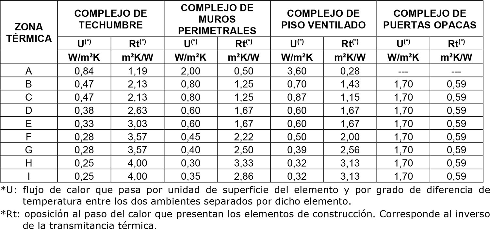

## Página 19

DIARIO OFICIAL DE LA REPUBLICA DE CHILE
Núm. 43.860
Lunes 27 de Mayo de 2024
Página 19 de 19
CVE 2494861 | Director: Felipe Andrés Peroti Díaz
Sitio Web: www.diarioficial.cl
| Mesa Central: 600 712 0001    Email: consultas@diarioficial.cl
Dirección: Dr. Torres Boonen N°511, Providencia, Santiago, Chile.
Este documento ha sido firmado electrónicamente de acuerdo con la ley N°19.799 e incluye sellado de tiempo y firma electrónica
avanzada. Para verificar la autenticidad de una representación impresa del mismo, ingrese este código en el sitio web www.diarioficial.cl
edificaciones destinadas a los usos residencial y equipamiento de la clase educación y salud,
exceptuados los cementerios y crematorios, se deberá adjuntar, además, y según corresponda, el
Informe de acreditación, el Informe de Ensayo, la Memoria de Cálculo, el detalle de la solución
constructiva adoptada inscrita en el Listado Oficial de Soluciones Constructivas para
Acondicionamiento Térmico, con las que se da cumplimiento a las exigencias de
acondicionamiento término señaladas en el artículo 4.1.10. de esta Ordenanza. Alternativamente,
y para los mismos fines, en el caso de las edificaciones destinadas a viviendas, se podrá presentar
en cambio el Informe de Precalificación Energética, elaborado por un Evaluador Energético con
inscripción vigente en el Registro Nacional de Evaluadores Energéticos.”.
 
N° 3. Agrégase en el numeral 7 del inciso tercero del artículo 5.2.6., a continuación del
punto final que pasa a ser punto seguido, la siguiente frase y punto final:
 
“Asimismo, y según el destino del proyecto, para acreditar el cumplimiento de las
exigencias de acondicionamiento térmico señaladas en el artículo 4.1.10. de esta Ordenanza, se
deberán adjuntar, según corresponda, el informe de Precalificación Energética, el Informe de
ensayo, Memorias de cálculo, o la descripción del material o de la o las soluciones constructivas
adoptadas en el proyecto y en qué parte de éste, en estos dos últimos casos.”.
 
DISPOSICIONES TRANSITORIAS
 
Artículo primero. Las modificaciones introducidas por el presente decreto a la Ordenanza
General de Urbanismo y Construcciones comenzarán a regir una vez transcurridos dieciocho
meses desde la fecha de su publicación en el Diario Oficial.
 
Artículo segundo. El valor de la demanda aplicable a las edificaciones destinadas a
vivienda, indicado en el inciso quinto del artículo 4.1.10. de la Ordenanza General de Urbanismo
y Construcciones, comenzará a regir una vez transcurridos treinta y seis meses contados desde la
fecha de publicación de este decreto en el Diario Oficial.
 
Anótese, tómese razón y publíquese.- SEBASTIÁN PIÑERA ECHENIQUE, Presidente de
la República.- Felipe Ward Edwards, Ministro de Vivienda y Urbanismo.
Lo que transcribo para su conocimiento.- Guillermo Rolando Vicente, Subsecretario de
Vivienda y Urbanismo.

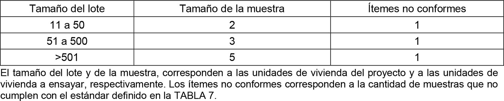

---

## Referencias de Imágenes

- **Modificacion-art-4110-OGUC_Reglamentacion-Termica-1.png**: Extraída de página 1 (585x439px)
- **Modificacion-art-4110-OGUC_Reglamentacion-Termica-2.jpeg**: Extraída de página 1 (1500x710px)
- **Modificacion-art-4110-OGUC_Reglamentacion-Termica-3.jpeg**: Extraída de página 1 (1500x604px)
- **Modificacion-art-4110-OGUC_Reglamentacion-Termica-4.jpeg**: Extraída de página 1 (1500x508px)
- **Modificacion-art-4110-OGUC_Reglamentacion-Termica-5.jpeg**: Extraída de página 1 (1500x1419px)
- **Modificacion-art-4110-OGUC_Reglamentacion-Termica-6.jpeg**: Extraída de página 1 (1500x434px)
- **Modificacion-art-4110-OGUC_Reglamentacion-Termica-7.jpeg**: Extraída de página 1 (1500x563px)
- **Modificacion-art-4110-OGUC_Reglamentacion-Termica-8.jpeg**: Extraída de página 1 (1500x1479px)
- **Modificacion-art-4110-OGUC_Reglamentacion-Termica-9.jpeg**: Extraída de página 1 (1500x856px)
- **Modificacion-art-4110-OGUC_Reglamentacion-Termica-10.jpeg**: Extraída de página 1 (1500x1067px)
- **Modificacion-art-4110-OGUC_Reglamentacion-Termica-11.jpeg**: Extraída de página 1 (1500x560px)
- **Modificacion-art-4110-OGUC_Reglamentacion-Termica-12.jpeg**: Extraída de página 1 (1500x302px)
- **Modificacion-art-4110-OGUC_Reglamentacion-Termica-13.jpeg**: Extraída de página 1 (1500x850px)
- **Modificacion-art-4110-OGUC_Reglamentacion-Termica-14.jpeg**: Extraída de página 1 (1500x701px)
- **Modificacion-art-4110-OGUC_Reglamentacion-Termica-15.jpeg**: Extraída de página 1 (1500x605px)
- **Modificacion-art-4110-OGUC_Reglamentacion-Termica-16.jpeg**: Extraída de página 1 (1500x964px)
- **Modificacion-art-4110-OGUC_Reglamentacion-Termica-17.jpeg**: Extraída de página 1 (1500x843px)
- **Modificacion-art-4110-OGUC_Reglamentacion-Termica-18.jpeg**: Extraída de página 1 (1500x551px)
- **Modificacion-art-4110-OGUC_Reglamentacion-Termica-19.jpeg**: Extraída de página 1 (1500x794px)
- **Modificacion-art-4110-OGUC_Reglamentacion-Termica-20.png**: Extraída de página 2 (585x439px)
- **Modificacion-art-4110-OGUC_Reglamentacion-Termica-21.jpeg**: Extraída de página 2 (1500x710px)
- **Modificacion-art-4110-OGUC_Reglamentacion-Termica-22.jpeg**: Extraída de página 2 (1500x604px)
- **Modificacion-art-4110-OGUC_Reglamentacion-Termica-23.jpeg**: Extraída de página 2 (1500x508px)
- **Modificacion-art-4110-OGUC_Reglamentacion-Termica-24.jpeg**: Extraída de página 2 (1500x1419px)
- **Modificacion-art-4110-OGUC_Reglamentacion-Termica-25.jpeg**: Extraída de página 2 (1500x434px)
- **Modificacion-art-4110-OGUC_Reglamentacion-Termica-26.jpeg**: Extraída de página 2 (1500x563px)
- **Modificacion-art-4110-OGUC_Reglamentacion-Termica-27.jpeg**: Extraída de página 2 (1500x1479px)
- **Modificacion-art-4110-OGUC_Reglamentacion-Termica-28.jpeg**: Extraída de página 2 (1500x856px)
- **Modificacion-art-4110-OGUC_Reglamentacion-Termica-29.jpeg**: Extraída de página 2 (1500x1067px)
- **Modificacion-art-4110-OGUC_Reglamentacion-Termica-30.jpeg**: Extraída de página 2 (1500x560px)
- **Modificacion-art-4110-OGUC_Reglamentacion-Termica-31.jpeg**: Extraída de página 2 (1500x302px)
- **Modificacion-art-4110-OGUC_Reglamentacion-Termica-32.jpeg**: Extraída de página 2 (1500x850px)
- **Modificacion-art-4110-OGUC_Reglamentacion-Termica-33.jpeg**: Extraída de página 2 (1500x701px)
- **Modificacion-art-4110-OGUC_Reglamentacion-Termica-34.jpeg**: Extraída de página 2 (1500x605px)
- **Modificacion-art-4110-OGUC_Reglamentacion-Termica-35.jpeg**: Extraída de página 2 (1500x964px)
- **Modificacion-art-4110-OGUC_Reglamentacion-Termica-36.jpeg**: Extraída de página 2 (1500x843px)
- **Modificacion-art-4110-OGUC_Reglamentacion-Termica-37.jpeg**: Extraída de página 2 (1500x551px)
- **Modificacion-art-4110-OGUC_Reglamentacion-Termica-38.jpeg**: Extraída de página 2 (1500x794px)
- **Modificacion-art-4110-OGUC_Reglamentacion-Termica-39.png**: Extraída de página 3 (585x439px)
- **Modificacion-art-4110-OGUC_Reglamentacion-Termica-40.jpeg**: Extraída de página 3 (1500x710px)
- **Modificacion-art-4110-OGUC_Reglamentacion-Termica-41.jpeg**: Extraída de página 3 (1500x604px)
- **Modificacion-art-4110-OGUC_Reglamentacion-Termica-42.jpeg**: Extraída de página 3 (1500x508px)
- **Modificacion-art-4110-OGUC_Reglamentacion-Termica-43.jpeg**: Extraída de página 3 (1500x1419px)
- **Modificacion-art-4110-OGUC_Reglamentacion-Termica-44.jpeg**: Extraída de página 3 (1500x434px)
- **Modificacion-art-4110-OGUC_Reglamentacion-Termica-45.jpeg**: Extraída de página 3 (1500x563px)
- **Modificacion-art-4110-OGUC_Reglamentacion-Termica-46.jpeg**: Extraída de página 3 (1500x1479px)
- **Modificacion-art-4110-OGUC_Reglamentacion-Termica-47.jpeg**: Extraída de página 3 (1500x856px)
- **Modificacion-art-4110-OGUC_Reglamentacion-Termica-48.jpeg**: Extraída de página 3 (1500x1067px)
- **Modificacion-art-4110-OGUC_Reglamentacion-Termica-49.jpeg**: Extraída de página 3 (1500x560px)
- **Modificacion-art-4110-OGUC_Reglamentacion-Termica-50.jpeg**: Extraída de página 3 (1500x302px)
- **Modificacion-art-4110-OGUC_Reglamentacion-Termica-51.jpeg**: Extraída de página 3 (1500x850px)
- **Modificacion-art-4110-OGUC_Reglamentacion-Termica-52.jpeg**: Extraída de página 3 (1500x701px)
- **Modificacion-art-4110-OGUC_Reglamentacion-Termica-53.jpeg**: Extraída de página 3 (1500x605px)
- **Modificacion-art-4110-OGUC_Reglamentacion-Termica-54.jpeg**: Extraída de página 3 (1500x964px)
- **Modificacion-art-4110-OGUC_Reglamentacion-Termica-55.jpeg**: Extraída de página 3 (1500x843px)
- **Modificacion-art-4110-OGUC_Reglamentacion-Termica-56.jpeg**: Extraída de página 3 (1500x551px)
- **Modificacion-art-4110-OGUC_Reglamentacion-Termica-57.jpeg**: Extraída de página 3 (1500x794px)
- **Modificacion-art-4110-OGUC_Reglamentacion-Termica-58.png**: Extraída de página 4 (585x439px)
- **Modificacion-art-4110-OGUC_Reglamentacion-Termica-59.jpeg**: Extraída de página 4 (1500x710px)
- **Modificacion-art-4110-OGUC_Reglamentacion-Termica-60.jpeg**: Extraída de página 4 (1500x604px)
- **Modificacion-art-4110-OGUC_Reglamentacion-Termica-61.jpeg**: Extraída de página 4 (1500x508px)
- **Modificacion-art-4110-OGUC_Reglamentacion-Termica-62.jpeg**: Extraída de página 4 (1500x1419px)
- **Modificacion-art-4110-OGUC_Reglamentacion-Termica-63.jpeg**: Extraída de página 4 (1500x434px)
- **Modificacion-art-4110-OGUC_Reglamentacion-Termica-64.jpeg**: Extraída de página 4 (1500x563px)
- **Modificacion-art-4110-OGUC_Reglamentacion-Termica-65.jpeg**: Extraída de página 4 (1500x1479px)
- **Modificacion-art-4110-OGUC_Reglamentacion-Termica-66.jpeg**: Extraída de página 4 (1500x856px)
- **Modificacion-art-4110-OGUC_Reglamentacion-Termica-67.jpeg**: Extraída de página 4 (1500x1067px)
- **Modificacion-art-4110-OGUC_Reglamentacion-Termica-68.jpeg**: Extraída de página 4 (1500x560px)
- **Modificacion-art-4110-OGUC_Reglamentacion-Termica-69.jpeg**: Extraída de página 4 (1500x302px)
- **Modificacion-art-4110-OGUC_Reglamentacion-Termica-70.jpeg**: Extraída de página 4 (1500x850px)
- **Modificacion-art-4110-OGUC_Reglamentacion-Termica-71.jpeg**: Extraída de página 4 (1500x701px)
- **Modificacion-art-4110-OGUC_Reglamentacion-Termica-72.jpeg**: Extraída de página 4 (1500x605px)
- **Modificacion-art-4110-OGUC_Reglamentacion-Termica-73.jpeg**: Extraída de página 4 (1500x964px)
- **Modificacion-art-4110-OGUC_Reglamentacion-Termica-74.jpeg**: Extraída de página 4 (1500x843px)
- **Modificacion-art-4110-OGUC_Reglamentacion-Termica-75.jpeg**: Extraída de página 4 (1500x551px)
- **Modificacion-art-4110-OGUC_Reglamentacion-Termica-76.jpeg**: Extraída de página 4 (1500x794px)
- **Modificacion-art-4110-OGUC_Reglamentacion-Termica-77.png**: Extraída de página 5 (585x439px)
- **Modificacion-art-4110-OGUC_Reglamentacion-Termica-78.jpeg**: Extraída de página 5 (1500x710px)
- **Modificacion-art-4110-OGUC_Reglamentacion-Termica-79.jpeg**: Extraída de página 5 (1500x604px)
- **Modificacion-art-4110-OGUC_Reglamentacion-Termica-80.jpeg**: Extraída de página 5 (1500x508px)
- **Modificacion-art-4110-OGUC_Reglamentacion-Termica-81.jpeg**: Extraída de página 5 (1500x1419px)
- **Modificacion-art-4110-OGUC_Reglamentacion-Termica-82.jpeg**: Extraída de página 5 (1500x434px)
- **Modificacion-art-4110-OGUC_Reglamentacion-Termica-83.jpeg**: Extraída de página 5 (1500x563px)
- **Modificacion-art-4110-OGUC_Reglamentacion-Termica-84.jpeg**: Extraída de página 5 (1500x1479px)
- **Modificacion-art-4110-OGUC_Reglamentacion-Termica-85.jpeg**: Extraída de página 5 (1500x856px)
- **Modificacion-art-4110-OGUC_Reglamentacion-Termica-86.jpeg**: Extraída de página 5 (1500x1067px)
- **Modificacion-art-4110-OGUC_Reglamentacion-Termica-87.jpeg**: Extraída de página 5 (1500x560px)
- **Modificacion-art-4110-OGUC_Reglamentacion-Termica-88.jpeg**: Extraída de página 5 (1500x302px)
- **Modificacion-art-4110-OGUC_Reglamentacion-Termica-89.jpeg**: Extraída de página 5 (1500x850px)
- **Modificacion-art-4110-OGUC_Reglamentacion-Termica-90.jpeg**: Extraída de página 5 (1500x701px)
- **Modificacion-art-4110-OGUC_Reglamentacion-Termica-91.jpeg**: Extraída de página 5 (1500x605px)
- **Modificacion-art-4110-OGUC_Reglamentacion-Termica-92.jpeg**: Extraída de página 5 (1500x964px)
- **Modificacion-art-4110-OGUC_Reglamentacion-Termica-93.jpeg**: Extraída de página 5 (1500x843px)
- **Modificacion-art-4110-OGUC_Reglamentacion-Termica-94.jpeg**: Extraída de página 5 (1500x551px)
- **Modificacion-art-4110-OGUC_Reglamentacion-Termica-95.jpeg**: Extraída de página 5 (1500x794px)
- **Modificacion-art-4110-OGUC_Reglamentacion-Termica-96.png**: Extraída de página 6 (585x439px)
- **Modificacion-art-4110-OGUC_Reglamentacion-Termica-97.jpeg**: Extraída de página 6 (1500x710px)
- **Modificacion-art-4110-OGUC_Reglamentacion-Termica-98.jpeg**: Extraída de página 6 (1500x604px)
- **Modificacion-art-4110-OGUC_Reglamentacion-Termica-99.jpeg**: Extraída de página 6 (1500x508px)
- **Modificacion-art-4110-OGUC_Reglamentacion-Termica-100.jpeg**: Extraída de página 6 (1500x1419px)
- **Modificacion-art-4110-OGUC_Reglamentacion-Termica-101.jpeg**: Extraída de página 6 (1500x434px)
- **Modificacion-art-4110-OGUC_Reglamentacion-Termica-102.jpeg**: Extraída de página 6 (1500x563px)
- **Modificacion-art-4110-OGUC_Reglamentacion-Termica-103.jpeg**: Extraída de página 6 (1500x1479px)
- **Modificacion-art-4110-OGUC_Reglamentacion-Termica-104.jpeg**: Extraída de página 6 (1500x856px)
- **Modificacion-art-4110-OGUC_Reglamentacion-Termica-105.jpeg**: Extraída de página 6 (1500x1067px)
- **Modificacion-art-4110-OGUC_Reglamentacion-Termica-106.jpeg**: Extraída de página 6 (1500x560px)
- **Modificacion-art-4110-OGUC_Reglamentacion-Termica-107.jpeg**: Extraída de página 6 (1500x302px)
- **Modificacion-art-4110-OGUC_Reglamentacion-Termica-108.jpeg**: Extraída de página 6 (1500x850px)
- **Modificacion-art-4110-OGUC_Reglamentacion-Termica-109.jpeg**: Extraída de página 6 (1500x701px)
- **Modificacion-art-4110-OGUC_Reglamentacion-Termica-110.jpeg**: Extraída de página 6 (1500x605px)
- **Modificacion-art-4110-OGUC_Reglamentacion-Termica-111.jpeg**: Extraída de página 6 (1500x964px)
- **Modificacion-art-4110-OGUC_Reglamentacion-Termica-112.jpeg**: Extraída de página 6 (1500x843px)
- **Modificacion-art-4110-OGUC_Reglamentacion-Termica-113.jpeg**: Extraída de página 6 (1500x551px)
- **Modificacion-art-4110-OGUC_Reglamentacion-Termica-114.jpeg**: Extraída de página 6 (1500x794px)
- **Modificacion-art-4110-OGUC_Reglamentacion-Termica-115.png**: Extraída de página 7 (585x439px)
- **Modificacion-art-4110-OGUC_Reglamentacion-Termica-116.jpeg**: Extraída de página 7 (1500x710px)
- **Modificacion-art-4110-OGUC_Reglamentacion-Termica-117.jpeg**: Extraída de página 7 (1500x604px)
- **Modificacion-art-4110-OGUC_Reglamentacion-Termica-118.jpeg**: Extraída de página 7 (1500x508px)
- **Modificacion-art-4110-OGUC_Reglamentacion-Termica-119.jpeg**: Extraída de página 7 (1500x1419px)
- **Modificacion-art-4110-OGUC_Reglamentacion-Termica-120.jpeg**: Extraída de página 7 (1500x434px)
- **Modificacion-art-4110-OGUC_Reglamentacion-Termica-121.jpeg**: Extraída de página 7 (1500x563px)
- **Modificacion-art-4110-OGUC_Reglamentacion-Termica-122.jpeg**: Extraída de página 7 (1500x1479px)
- **Modificacion-art-4110-OGUC_Reglamentacion-Termica-123.jpeg**: Extraída de página 7 (1500x856px)
- **Modificacion-art-4110-OGUC_Reglamentacion-Termica-124.jpeg**: Extraída de página 7 (1500x1067px)
- **Modificacion-art-4110-OGUC_Reglamentacion-Termica-125.jpeg**: Extraída de página 7 (1500x560px)
- **Modificacion-art-4110-OGUC_Reglamentacion-Termica-126.jpeg**: Extraída de página 7 (1500x302px)
- **Modificacion-art-4110-OGUC_Reglamentacion-Termica-127.jpeg**: Extraída de página 7 (1500x850px)
- **Modificacion-art-4110-OGUC_Reglamentacion-Termica-128.jpeg**: Extraída de página 7 (1500x701px)
- **Modificacion-art-4110-OGUC_Reglamentacion-Termica-129.jpeg**: Extraída de página 7 (1500x605px)
- **Modificacion-art-4110-OGUC_Reglamentacion-Termica-130.jpeg**: Extraída de página 7 (1500x964px)
- **Modificacion-art-4110-OGUC_Reglamentacion-Termica-131.jpeg**: Extraída de página 7 (1500x843px)
- **Modificacion-art-4110-OGUC_Reglamentacion-Termica-132.jpeg**: Extraída de página 7 (1500x551px)
- **Modificacion-art-4110-OGUC_Reglamentacion-Termica-133.jpeg**: Extraída de página 7 (1500x794px)
- **Modificacion-art-4110-OGUC_Reglamentacion-Termica-134.png**: Extraída de página 8 (585x439px)
- **Modificacion-art-4110-OGUC_Reglamentacion-Termica-135.jpeg**: Extraída de página 8 (1500x710px)
- **Modificacion-art-4110-OGUC_Reglamentacion-Termica-136.jpeg**: Extraída de página 8 (1500x604px)
- **Modificacion-art-4110-OGUC_Reglamentacion-Termica-137.jpeg**: Extraída de página 8 (1500x508px)
- **Modificacion-art-4110-OGUC_Reglamentacion-Termica-138.jpeg**: Extraída de página 8 (1500x1419px)
- **Modificacion-art-4110-OGUC_Reglamentacion-Termica-139.jpeg**: Extraída de página 8 (1500x434px)
- **Modificacion-art-4110-OGUC_Reglamentacion-Termica-140.jpeg**: Extraída de página 8 (1500x563px)
- **Modificacion-art-4110-OGUC_Reglamentacion-Termica-141.jpeg**: Extraída de página 8 (1500x1479px)
- **Modificacion-art-4110-OGUC_Reglamentacion-Termica-142.jpeg**: Extraída de página 8 (1500x856px)
- **Modificacion-art-4110-OGUC_Reglamentacion-Termica-143.jpeg**: Extraída de página 8 (1500x1067px)
- **Modificacion-art-4110-OGUC_Reglamentacion-Termica-144.jpeg**: Extraída de página 8 (1500x560px)
- **Modificacion-art-4110-OGUC_Reglamentacion-Termica-145.jpeg**: Extraída de página 8 (1500x302px)
- **Modificacion-art-4110-OGUC_Reglamentacion-Termica-146.jpeg**: Extraída de página 8 (1500x850px)
- **Modificacion-art-4110-OGUC_Reglamentacion-Termica-147.jpeg**: Extraída de página 8 (1500x701px)
- **Modificacion-art-4110-OGUC_Reglamentacion-Termica-148.jpeg**: Extraída de página 8 (1500x605px)
- **Modificacion-art-4110-OGUC_Reglamentacion-Termica-149.jpeg**: Extraída de página 8 (1500x964px)
- **Modificacion-art-4110-OGUC_Reglamentacion-Termica-150.jpeg**: Extraída de página 8 (1500x843px)
- **Modificacion-art-4110-OGUC_Reglamentacion-Termica-151.jpeg**: Extraída de página 8 (1500x551px)
- **Modificacion-art-4110-OGUC_Reglamentacion-Termica-152.jpeg**: Extraída de página 8 (1500x794px)
- **Modificacion-art-4110-OGUC_Reglamentacion-Termica-153.png**: Extraída de página 9 (585x439px)
- **Modificacion-art-4110-OGUC_Reglamentacion-Termica-154.jpeg**: Extraída de página 9 (1500x710px)
- **Modificacion-art-4110-OGUC_Reglamentacion-Termica-155.jpeg**: Extraída de página 9 (1500x604px)
- **Modificacion-art-4110-OGUC_Reglamentacion-Termica-156.jpeg**: Extraída de página 9 (1500x508px)
- **Modificacion-art-4110-OGUC_Reglamentacion-Termica-157.jpeg**: Extraída de página 9 (1500x1419px)
- **Modificacion-art-4110-OGUC_Reglamentacion-Termica-158.jpeg**: Extraída de página 9 (1500x434px)
- **Modificacion-art-4110-OGUC_Reglamentacion-Termica-159.jpeg**: Extraída de página 9 (1500x563px)
- **Modificacion-art-4110-OGUC_Reglamentacion-Termica-160.jpeg**: Extraída de página 9 (1500x1479px)
- **Modificacion-art-4110-OGUC_Reglamentacion-Termica-161.jpeg**: Extraída de página 9 (1500x856px)
- **Modificacion-art-4110-OGUC_Reglamentacion-Termica-162.jpeg**: Extraída de página 9 (1500x1067px)
- **Modificacion-art-4110-OGUC_Reglamentacion-Termica-163.jpeg**: Extraída de página 9 (1500x560px)
- **Modificacion-art-4110-OGUC_Reglamentacion-Termica-164.jpeg**: Extraída de página 9 (1500x302px)
- **Modificacion-art-4110-OGUC_Reglamentacion-Termica-165.jpeg**: Extraída de página 9 (1500x850px)
- **Modificacion-art-4110-OGUC_Reglamentacion-Termica-166.jpeg**: Extraída de página 9 (1500x701px)
- **Modificacion-art-4110-OGUC_Reglamentacion-Termica-167.jpeg**: Extraída de página 9 (1500x605px)
- **Modificacion-art-4110-OGUC_Reglamentacion-Termica-168.jpeg**: Extraída de página 9 (1500x964px)
- **Modificacion-art-4110-OGUC_Reglamentacion-Termica-169.jpeg**: Extraída de página 9 (1500x843px)
- **Modificacion-art-4110-OGUC_Reglamentacion-Termica-170.jpeg**: Extraída de página 9 (1500x551px)
- **Modificacion-art-4110-OGUC_Reglamentacion-Termica-171.jpeg**: Extraída de página 9 (1500x794px)
- **Modificacion-art-4110-OGUC_Reglamentacion-Termica-172.png**: Extraída de página 10 (585x439px)
- **Modificacion-art-4110-OGUC_Reglamentacion-Termica-173.jpeg**: Extraída de página 10 (1500x710px)
- **Modificacion-art-4110-OGUC_Reglamentacion-Termica-174.jpeg**: Extraída de página 10 (1500x604px)
- **Modificacion-art-4110-OGUC_Reglamentacion-Termica-175.jpeg**: Extraída de página 10 (1500x508px)
- **Modificacion-art-4110-OGUC_Reglamentacion-Termica-176.jpeg**: Extraída de página 10 (1500x1419px)
- **Modificacion-art-4110-OGUC_Reglamentacion-Termica-177.jpeg**: Extraída de página 10 (1500x434px)
- **Modificacion-art-4110-OGUC_Reglamentacion-Termica-178.jpeg**: Extraída de página 10 (1500x563px)
- **Modificacion-art-4110-OGUC_Reglamentacion-Termica-179.jpeg**: Extraída de página 10 (1500x1479px)
- **Modificacion-art-4110-OGUC_Reglamentacion-Termica-180.jpeg**: Extraída de página 10 (1500x856px)
- **Modificacion-art-4110-OGUC_Reglamentacion-Termica-181.jpeg**: Extraída de página 10 (1500x1067px)
- **Modificacion-art-4110-OGUC_Reglamentacion-Termica-182.jpeg**: Extraída de página 10 (1500x560px)
- **Modificacion-art-4110-OGUC_Reglamentacion-Termica-183.jpeg**: Extraída de página 10 (1500x302px)
- **Modificacion-art-4110-OGUC_Reglamentacion-Termica-184.jpeg**: Extraída de página 10 (1500x850px)
- **Modificacion-art-4110-OGUC_Reglamentacion-Termica-185.jpeg**: Extraída de página 10 (1500x701px)
- **Modificacion-art-4110-OGUC_Reglamentacion-Termica-186.jpeg**: Extraída de página 10 (1500x605px)
- **Modificacion-art-4110-OGUC_Reglamentacion-Termica-187.jpeg**: Extraída de página 10 (1500x964px)
- **Modificacion-art-4110-OGUC_Reglamentacion-Termica-188.jpeg**: Extraída de página 10 (1500x843px)
- **Modificacion-art-4110-OGUC_Reglamentacion-Termica-189.jpeg**: Extraída de página 10 (1500x551px)
- **Modificacion-art-4110-OGUC_Reglamentacion-Termica-190.jpeg**: Extraída de página 10 (1500x794px)
- **Modificacion-art-4110-OGUC_Reglamentacion-Termica-191.png**: Extraída de página 11 (585x439px)
- **Modificacion-art-4110-OGUC_Reglamentacion-Termica-192.jpeg**: Extraída de página 11 (1500x710px)
- **Modificacion-art-4110-OGUC_Reglamentacion-Termica-193.jpeg**: Extraída de página 11 (1500x604px)
- **Modificacion-art-4110-OGUC_Reglamentacion-Termica-194.jpeg**: Extraída de página 11 (1500x508px)
- **Modificacion-art-4110-OGUC_Reglamentacion-Termica-195.jpeg**: Extraída de página 11 (1500x1419px)
- **Modificacion-art-4110-OGUC_Reglamentacion-Termica-196.jpeg**: Extraída de página 11 (1500x434px)
- **Modificacion-art-4110-OGUC_Reglamentacion-Termica-197.jpeg**: Extraída de página 11 (1500x563px)
- **Modificacion-art-4110-OGUC_Reglamentacion-Termica-198.jpeg**: Extraída de página 11 (1500x1479px)
- **Modificacion-art-4110-OGUC_Reglamentacion-Termica-199.jpeg**: Extraída de página 11 (1500x856px)
- **Modificacion-art-4110-OGUC_Reglamentacion-Termica-200.jpeg**: Extraída de página 11 (1500x1067px)
- **Modificacion-art-4110-OGUC_Reglamentacion-Termica-201.jpeg**: Extraída de página 11 (1500x560px)
- **Modificacion-art-4110-OGUC_Reglamentacion-Termica-202.jpeg**: Extraída de página 11 (1500x302px)
- **Modificacion-art-4110-OGUC_Reglamentacion-Termica-203.jpeg**: Extraída de página 11 (1500x850px)
- **Modificacion-art-4110-OGUC_Reglamentacion-Termica-204.jpeg**: Extraída de página 11 (1500x701px)
- **Modificacion-art-4110-OGUC_Reglamentacion-Termica-205.jpeg**: Extraída de página 11 (1500x605px)
- **Modificacion-art-4110-OGUC_Reglamentacion-Termica-206.jpeg**: Extraída de página 11 (1500x964px)
- **Modificacion-art-4110-OGUC_Reglamentacion-Termica-207.jpeg**: Extraída de página 11 (1500x843px)
- **Modificacion-art-4110-OGUC_Reglamentacion-Termica-208.jpeg**: Extraída de página 11 (1500x551px)
- **Modificacion-art-4110-OGUC_Reglamentacion-Termica-209.jpeg**: Extraída de página 11 (1500x794px)
- **Modificacion-art-4110-OGUC_Reglamentacion-Termica-210.png**: Extraída de página 12 (585x439px)
- **Modificacion-art-4110-OGUC_Reglamentacion-Termica-211.jpeg**: Extraída de página 12 (1500x710px)
- **Modificacion-art-4110-OGUC_Reglamentacion-Termica-212.jpeg**: Extraída de página 12 (1500x604px)
- **Modificacion-art-4110-OGUC_Reglamentacion-Termica-213.jpeg**: Extraída de página 12 (1500x508px)
- **Modificacion-art-4110-OGUC_Reglamentacion-Termica-214.jpeg**: Extraída de página 12 (1500x1419px)
- **Modificacion-art-4110-OGUC_Reglamentacion-Termica-215.jpeg**: Extraída de página 12 (1500x434px)
- **Modificacion-art-4110-OGUC_Reglamentacion-Termica-216.jpeg**: Extraída de página 12 (1500x563px)
- **Modificacion-art-4110-OGUC_Reglamentacion-Termica-217.jpeg**: Extraída de página 12 (1500x1479px)
- **Modificacion-art-4110-OGUC_Reglamentacion-Termica-218.jpeg**: Extraída de página 12 (1500x856px)
- **Modificacion-art-4110-OGUC_Reglamentacion-Termica-219.jpeg**: Extraída de página 12 (1500x1067px)
- **Modificacion-art-4110-OGUC_Reglamentacion-Termica-220.jpeg**: Extraída de página 12 (1500x560px)
- **Modificacion-art-4110-OGUC_Reglamentacion-Termica-221.jpeg**: Extraída de página 12 (1500x302px)
- **Modificacion-art-4110-OGUC_Reglamentacion-Termica-222.jpeg**: Extraída de página 12 (1500x850px)
- **Modificacion-art-4110-OGUC_Reglamentacion-Termica-223.jpeg**: Extraída de página 12 (1500x701px)
- **Modificacion-art-4110-OGUC_Reglamentacion-Termica-224.jpeg**: Extraída de página 12 (1500x605px)
- **Modificacion-art-4110-OGUC_Reglamentacion-Termica-225.jpeg**: Extraída de página 12 (1500x964px)
- **Modificacion-art-4110-OGUC_Reglamentacion-Termica-226.jpeg**: Extraída de página 12 (1500x843px)
- **Modificacion-art-4110-OGUC_Reglamentacion-Termica-227.jpeg**: Extraída de página 12 (1500x551px)
- **Modificacion-art-4110-OGUC_Reglamentacion-Termica-228.jpeg**: Extraída de página 12 (1500x794px)
- **Modificacion-art-4110-OGUC_Reglamentacion-Termica-229.png**: Extraída de página 13 (585x439px)
- **Modificacion-art-4110-OGUC_Reglamentacion-Termica-230.jpeg**: Extraída de página 13 (1500x710px)
- **Modificacion-art-4110-OGUC_Reglamentacion-Termica-231.jpeg**: Extraída de página 13 (1500x604px)
- **Modificacion-art-4110-OGUC_Reglamentacion-Termica-232.jpeg**: Extraída de página 13 (1500x508px)
- **Modificacion-art-4110-OGUC_Reglamentacion-Termica-233.jpeg**: Extraída de página 13 (1500x1419px)
- **Modificacion-art-4110-OGUC_Reglamentacion-Termica-234.jpeg**: Extraída de página 13 (1500x434px)
- **Modificacion-art-4110-OGUC_Reglamentacion-Termica-235.jpeg**: Extraída de página 13 (1500x563px)
- **Modificacion-art-4110-OGUC_Reglamentacion-Termica-236.jpeg**: Extraída de página 13 (1500x1479px)
- **Modificacion-art-4110-OGUC_Reglamentacion-Termica-237.jpeg**: Extraída de página 13 (1500x856px)
- **Modificacion-art-4110-OGUC_Reglamentacion-Termica-238.jpeg**: Extraída de página 13 (1500x1067px)
- **Modificacion-art-4110-OGUC_Reglamentacion-Termica-239.jpeg**: Extraída de página 13 (1500x560px)
- **Modificacion-art-4110-OGUC_Reglamentacion-Termica-240.jpeg**: Extraída de página 13 (1500x302px)
- **Modificacion-art-4110-OGUC_Reglamentacion-Termica-241.jpeg**: Extraída de página 13 (1500x850px)
- **Modificacion-art-4110-OGUC_Reglamentacion-Termica-242.jpeg**: Extraída de página 13 (1500x701px)
- **Modificacion-art-4110-OGUC_Reglamentacion-Termica-243.jpeg**: Extraída de página 13 (1500x605px)
- **Modificacion-art-4110-OGUC_Reglamentacion-Termica-244.jpeg**: Extraída de página 13 (1500x964px)
- **Modificacion-art-4110-OGUC_Reglamentacion-Termica-245.jpeg**: Extraída de página 13 (1500x843px)
- **Modificacion-art-4110-OGUC_Reglamentacion-Termica-246.jpeg**: Extraída de página 13 (1500x551px)
- **Modificacion-art-4110-OGUC_Reglamentacion-Termica-247.jpeg**: Extraída de página 13 (1500x794px)
- **Modificacion-art-4110-OGUC_Reglamentacion-Termica-248.png**: Extraída de página 14 (585x439px)
- **Modificacion-art-4110-OGUC_Reglamentacion-Termica-249.jpeg**: Extraída de página 14 (1500x710px)
- **Modificacion-art-4110-OGUC_Reglamentacion-Termica-250.jpeg**: Extraída de página 14 (1500x604px)
- **Modificacion-art-4110-OGUC_Reglamentacion-Termica-251.jpeg**: Extraída de página 14 (1500x508px)
- **Modificacion-art-4110-OGUC_Reglamentacion-Termica-252.jpeg**: Extraída de página 14 (1500x1419px)
- **Modificacion-art-4110-OGUC_Reglamentacion-Termica-253.jpeg**: Extraída de página 14 (1500x434px)
- **Modificacion-art-4110-OGUC_Reglamentacion-Termica-254.jpeg**: Extraída de página 14 (1500x563px)
- **Modificacion-art-4110-OGUC_Reglamentacion-Termica-255.jpeg**: Extraída de página 14 (1500x1479px)
- **Modificacion-art-4110-OGUC_Reglamentacion-Termica-256.jpeg**: Extraída de página 14 (1500x856px)
- **Modificacion-art-4110-OGUC_Reglamentacion-Termica-257.jpeg**: Extraída de página 14 (1500x1067px)
- **Modificacion-art-4110-OGUC_Reglamentacion-Termica-258.jpeg**: Extraída de página 14 (1500x560px)
- **Modificacion-art-4110-OGUC_Reglamentacion-Termica-259.jpeg**: Extraída de página 14 (1500x302px)
- **Modificacion-art-4110-OGUC_Reglamentacion-Termica-260.jpeg**: Extraída de página 14 (1500x850px)
- **Modificacion-art-4110-OGUC_Reglamentacion-Termica-261.jpeg**: Extraída de página 14 (1500x701px)
- **Modificacion-art-4110-OGUC_Reglamentacion-Termica-262.jpeg**: Extraída de página 14 (1500x605px)
- **Modificacion-art-4110-OGUC_Reglamentacion-Termica-263.jpeg**: Extraída de página 14 (1500x964px)
- **Modificacion-art-4110-OGUC_Reglamentacion-Termica-264.jpeg**: Extraída de página 14 (1500x843px)
- **Modificacion-art-4110-OGUC_Reglamentacion-Termica-265.jpeg**: Extraída de página 14 (1500x551px)
- **Modificacion-art-4110-OGUC_Reglamentacion-Termica-266.jpeg**: Extraída de página 14 (1500x794px)
- **Modificacion-art-4110-OGUC_Reglamentacion-Termica-267.png**: Extraída de página 15 (585x439px)
- **Modificacion-art-4110-OGUC_Reglamentacion-Termica-268.jpeg**: Extraída de página 15 (1500x710px)
- **Modificacion-art-4110-OGUC_Reglamentacion-Termica-269.jpeg**: Extraída de página 15 (1500x604px)
- **Modificacion-art-4110-OGUC_Reglamentacion-Termica-270.jpeg**: Extraída de página 15 (1500x508px)
- **Modificacion-art-4110-OGUC_Reglamentacion-Termica-271.jpeg**: Extraída de página 15 (1500x1419px)
- **Modificacion-art-4110-OGUC_Reglamentacion-Termica-272.jpeg**: Extraída de página 15 (1500x434px)
- **Modificacion-art-4110-OGUC_Reglamentacion-Termica-273.jpeg**: Extraída de página 15 (1500x563px)
- **Modificacion-art-4110-OGUC_Reglamentacion-Termica-274.jpeg**: Extraída de página 15 (1500x1479px)
- **Modificacion-art-4110-OGUC_Reglamentacion-Termica-275.jpeg**: Extraída de página 15 (1500x856px)
- **Modificacion-art-4110-OGUC_Reglamentacion-Termica-276.jpeg**: Extraída de página 15 (1500x1067px)
- **Modificacion-art-4110-OGUC_Reglamentacion-Termica-277.jpeg**: Extraída de página 15 (1500x560px)
- **Modificacion-art-4110-OGUC_Reglamentacion-Termica-278.jpeg**: Extraída de página 15 (1500x302px)
- **Modificacion-art-4110-OGUC_Reglamentacion-Termica-279.jpeg**: Extraída de página 15 (1500x850px)
- **Modificacion-art-4110-OGUC_Reglamentacion-Termica-280.jpeg**: Extraída de página 15 (1500x701px)
- **Modificacion-art-4110-OGUC_Reglamentacion-Termica-281.jpeg**: Extraída de página 15 (1500x605px)
- **Modificacion-art-4110-OGUC_Reglamentacion-Termica-282.jpeg**: Extraída de página 15 (1500x964px)
- **Modificacion-art-4110-OGUC_Reglamentacion-Termica-283.jpeg**: Extraída de página 15 (1500x843px)
- **Modificacion-art-4110-OGUC_Reglamentacion-Termica-284.jpeg**: Extraída de página 15 (1500x551px)
- **Modificacion-art-4110-OGUC_Reglamentacion-Termica-285.jpeg**: Extraída de página 15 (1500x794px)
- **Modificacion-art-4110-OGUC_Reglamentacion-Termica-286.png**: Extraída de página 16 (585x439px)
- **Modificacion-art-4110-OGUC_Reglamentacion-Termica-287.jpeg**: Extraída de página 16 (1500x710px)
- **Modificacion-art-4110-OGUC_Reglamentacion-Termica-288.jpeg**: Extraída de página 16 (1500x604px)
- **Modificacion-art-4110-OGUC_Reglamentacion-Termica-289.jpeg**: Extraída de página 16 (1500x508px)
- **Modificacion-art-4110-OGUC_Reglamentacion-Termica-290.jpeg**: Extraída de página 16 (1500x1419px)
- **Modificacion-art-4110-OGUC_Reglamentacion-Termica-291.jpeg**: Extraída de página 16 (1500x434px)
- **Modificacion-art-4110-OGUC_Reglamentacion-Termica-292.jpeg**: Extraída de página 16 (1500x563px)
- **Modificacion-art-4110-OGUC_Reglamentacion-Termica-293.jpeg**: Extraída de página 16 (1500x1479px)
- **Modificacion-art-4110-OGUC_Reglamentacion-Termica-294.jpeg**: Extraída de página 16 (1500x856px)
- **Modificacion-art-4110-OGUC_Reglamentacion-Termica-295.jpeg**: Extraída de página 16 (1500x1067px)
- **Modificacion-art-4110-OGUC_Reglamentacion-Termica-296.jpeg**: Extraída de página 16 (1500x560px)
- **Modificacion-art-4110-OGUC_Reglamentacion-Termica-297.jpeg**: Extraída de página 16 (1500x302px)
- **Modificacion-art-4110-OGUC_Reglamentacion-Termica-298.jpeg**: Extraída de página 16 (1500x850px)
- **Modificacion-art-4110-OGUC_Reglamentacion-Termica-299.jpeg**: Extraída de página 16 (1500x701px)
- **Modificacion-art-4110-OGUC_Reglamentacion-Termica-300.jpeg**: Extraída de página 16 (1500x605px)
- **Modificacion-art-4110-OGUC_Reglamentacion-Termica-301.jpeg**: Extraída de página 16 (1500x964px)
- **Modificacion-art-4110-OGUC_Reglamentacion-Termica-302.jpeg**: Extraída de página 16 (1500x843px)
- **Modificacion-art-4110-OGUC_Reglamentacion-Termica-303.jpeg**: Extraída de página 16 (1500x551px)
- **Modificacion-art-4110-OGUC_Reglamentacion-Termica-304.jpeg**: Extraída de página 16 (1500x794px)
- **Modificacion-art-4110-OGUC_Reglamentacion-Termica-305.png**: Extraída de página 17 (585x439px)
- **Modificacion-art-4110-OGUC_Reglamentacion-Termica-306.jpeg**: Extraída de página 17 (1500x710px)
- **Modificacion-art-4110-OGUC_Reglamentacion-Termica-307.jpeg**: Extraída de página 17 (1500x604px)
- **Modificacion-art-4110-OGUC_Reglamentacion-Termica-308.jpeg**: Extraída de página 17 (1500x508px)
- **Modificacion-art-4110-OGUC_Reglamentacion-Termica-309.jpeg**: Extraída de página 17 (1500x1419px)
- **Modificacion-art-4110-OGUC_Reglamentacion-Termica-310.jpeg**: Extraída de página 17 (1500x434px)
- **Modificacion-art-4110-OGUC_Reglamentacion-Termica-311.jpeg**: Extraída de página 17 (1500x563px)
- **Modificacion-art-4110-OGUC_Reglamentacion-Termica-312.jpeg**: Extraída de página 17 (1500x1479px)
- **Modificacion-art-4110-OGUC_Reglamentacion-Termica-313.jpeg**: Extraída de página 17 (1500x856px)
- **Modificacion-art-4110-OGUC_Reglamentacion-Termica-314.jpeg**: Extraída de página 17 (1500x1067px)
- **Modificacion-art-4110-OGUC_Reglamentacion-Termica-315.jpeg**: Extraída de página 17 (1500x560px)
- **Modificacion-art-4110-OGUC_Reglamentacion-Termica-316.jpeg**: Extraída de página 17 (1500x302px)
- **Modificacion-art-4110-OGUC_Reglamentacion-Termica-317.jpeg**: Extraída de página 17 (1500x850px)
- **Modificacion-art-4110-OGUC_Reglamentacion-Termica-318.jpeg**: Extraída de página 17 (1500x701px)
- **Modificacion-art-4110-OGUC_Reglamentacion-Termica-319.jpeg**: Extraída de página 17 (1500x605px)
- **Modificacion-art-4110-OGUC_Reglamentacion-Termica-320.jpeg**: Extraída de página 17 (1500x964px)
- **Modificacion-art-4110-OGUC_Reglamentacion-Termica-321.jpeg**: Extraída de página 17 (1500x843px)
- **Modificacion-art-4110-OGUC_Reglamentacion-Termica-322.jpeg**: Extraída de página 17 (1500x551px)
- **Modificacion-art-4110-OGUC_Reglamentacion-Termica-323.jpeg**: Extraída de página 17 (1500x794px)
- **Modificacion-art-4110-OGUC_Reglamentacion-Termica-324.png**: Extraída de página 18 (585x439px)
- **Modificacion-art-4110-OGUC_Reglamentacion-Termica-325.jpeg**: Extraída de página 18 (1500x710px)
- **Modificacion-art-4110-OGUC_Reglamentacion-Termica-326.jpeg**: Extraída de página 18 (1500x604px)
- **Modificacion-art-4110-OGUC_Reglamentacion-Termica-327.jpeg**: Extraída de página 18 (1500x508px)
- **Modificacion-art-4110-OGUC_Reglamentacion-Termica-328.jpeg**: Extraída de página 18 (1500x1419px)
- **Modificacion-art-4110-OGUC_Reglamentacion-Termica-329.jpeg**: Extraída de página 18 (1500x434px)
- **Modificacion-art-4110-OGUC_Reglamentacion-Termica-330.jpeg**: Extraída de página 18 (1500x563px)
- **Modificacion-art-4110-OGUC_Reglamentacion-Termica-331.jpeg**: Extraída de página 18 (1500x1479px)
- **Modificacion-art-4110-OGUC_Reglamentacion-Termica-332.jpeg**: Extraída de página 18 (1500x856px)
- **Modificacion-art-4110-OGUC_Reglamentacion-Termica-333.jpeg**: Extraída de página 18 (1500x1067px)
- **Modificacion-art-4110-OGUC_Reglamentacion-Termica-334.jpeg**: Extraída de página 18 (1500x560px)
- **Modificacion-art-4110-OGUC_Reglamentacion-Termica-335.jpeg**: Extraída de página 18 (1500x302px)
- **Modificacion-art-4110-OGUC_Reglamentacion-Termica-336.jpeg**: Extraída de página 18 (1500x850px)
- **Modificacion-art-4110-OGUC_Reglamentacion-Termica-337.jpeg**: Extraída de página 18 (1500x701px)
- **Modificacion-art-4110-OGUC_Reglamentacion-Termica-338.jpeg**: Extraída de página 18 (1500x605px)
- **Modificacion-art-4110-OGUC_Reglamentacion-Termica-339.jpeg**: Extraída de página 18 (1500x964px)
- **Modificacion-art-4110-OGUC_Reglamentacion-Termica-340.jpeg**: Extraída de página 18 (1500x843px)
- **Modificacion-art-4110-OGUC_Reglamentacion-Termica-341.jpeg**: Extraída de página 18 (1500x551px)
- **Modificacion-art-4110-OGUC_Reglamentacion-Termica-342.jpeg**: Extraída de página 18 (1500x794px)
- **Modificacion-art-4110-OGUC_Reglamentacion-Termica-343.png**: Extraída de página 19 (585x439px)
- **Modificacion-art-4110-OGUC_Reglamentacion-Termica-344.jpeg**: Extraída de página 19 (1500x710px)
- **Modificacion-art-4110-OGUC_Reglamentacion-Termica-345.jpeg**: Extraída de página 19 (1500x604px)
- **Modificacion-art-4110-OGUC_Reglamentacion-Termica-346.jpeg**: Extraída de página 19 (1500x508px)
- **Modificacion-art-4110-OGUC_Reglamentacion-Termica-347.jpeg**: Extraída de página 19 (1500x1419px)
- **Modificacion-art-4110-OGUC_Reglamentacion-Termica-348.jpeg**: Extraída de página 19 (1500x434px)
- **Modificacion-art-4110-OGUC_Reglamentacion-Termica-349.jpeg**: Extraída de página 19 (1500x563px)
- **Modificacion-art-4110-OGUC_Reglamentacion-Termica-350.jpeg**: Extraída de página 19 (1500x1479px)
- **Modificacion-art-4110-OGUC_Reglamentacion-Termica-351.jpeg**: Extraída de página 19 (1500x856px)
- **Modificacion-art-4110-OGUC_Reglamentacion-Termica-352.jpeg**: Extraída de página 19 (1500x1067px)
- **Modificacion-art-4110-OGUC_Reglamentacion-Termica-353.jpeg**: Extraída de página 19 (1500x560px)
- **Modificacion-art-4110-OGUC_Reglamentacion-Termica-354.jpeg**: Extraída de página 19 (1500x302px)
- **Modificacion-art-4110-OGUC_Reglamentacion-Termica-355.jpeg**: Extraída de página 19 (1500x850px)
- **Modificacion-art-4110-OGUC_Reglamentacion-Termica-356.jpeg**: Extraída de página 19 (1500x701px)
- **Modificacion-art-4110-OGUC_Reglamentacion-Termica-357.jpeg**: Extraída de página 19 (1500x605px)
- **Modificacion-art-4110-OGUC_Reglamentacion-Termica-358.jpeg**: Extraída de página 19 (1500x964px)
- **Modificacion-art-4110-OGUC_Reglamentacion-Termica-359.jpeg**: Extraída de página 19 (1500x843px)
- **Modificacion-art-4110-OGUC_Reglamentacion-Termica-360.jpeg**: Extraída de página 19 (1500x551px)
- **Modificacion-art-4110-OGUC_Reglamentacion-Termica-361.jpeg**: Extraída de página 19 (1500x794px)
