# Acondicionamiento térmico - Casa QEP

## Página 1

1
MEMORIA ACONDICIONAMIENTO TÉRMICO
CASA QEP - ISABEL MONTT
16/6/2026
Felipe Langlois C
Arquitecto

## Página 2

2
INDICE
Capítulo
Página
CAPÍTULO 1. Antecedentes Generales del Proyecto
3
CAPÍTULO 2. Definición de Exigencias Normativas
3
2.1 Exigencias de Acondicionamiento Térmico
4
CAPÍTULO 3. Memoria de Transmitancia Térmica (U) y Resistencia Térmica (Rt)
6
3.1 Cuadro Resumen de Exigencias y Cumplimiento (Zona D)
6
3.2 Detalle de Complejos Constructivos
7
3.2.1 Muros Perimetrales
7
3.2.2 Complejo de Techumbre
8
3.2.3 Radier y Aislación de Sobrecimientos
9
3.2.4 Puertas Exteriores Opacas
10
3.2.5 Acreditación de Puertas Exteriores
11
CAPÍTULO 4. Memoria de Cálculo de Riesgo de Condensación
12
4.1 Objetivo y Parámetros de Cálculo
12
4.1.1 Condiciones Climáticas de Diseño
12
4.1.2 Condiciones Ambientales Interiores
12
4.2 Metodología de Análisis
12
4.3 Verificación por Elemento Constructivo
13
4.3.1 Muros Perimetrales
13
4.3.2 Complejo de Techumbre
13
4.3.3 Radier y Sobrecimientos
13
4.4 Conclusión del Análisis de Condensación
13
CAPÍTULO 5. Memoria Técnica del Complejo de Ventanas y Superficies Vidriadas
14
5.1 Especificación Técnica de los Componentes
14
5.2 Justificación de Superficies Vidriadas por Fachada
15
5.2 Cuadro de Vanos y Verificación de Superficies
16
5.3 Hermeticidad e Infiltraciones de Aire
15
5.4 Métodos de Acreditación de ventanas
19
CAPÍTULO 6. Memoria de Hermeticidad e Infiltraciones de Aire
33
6.1. Marco Normativo y Exigencias Aplicables
33
6.2. Estrategia de Hermeticidad de la Envolvente
33
6.3. Partida de Sellos y Control de Infiltraciones
34
6.4. Especificación de Componentes Ventanas
35
6.5. Metodología de Acreditación y Verificación
35
CAPITULO 7.- MEMORIA DEL SISTEMA DE VENTILACIÓN MÍNIMA.
35
7.1. Objetivo y Marco Normativo
35
7.2. Descripción del Sistema Adoptado: Sistema Híbrido
36
7.3. Cálculo de Tasas de Ventilación:
36
7.4. Mecanismo de Acreditación:
36

## Página 3

3
MEMORIA ACONDICIONAMIENTO TÉRMICO
CASA QEP - ISABEL MONTT
CAPITULO 1.- 
Antecedentes Generales del Proyecto:
•
Nombre del proyecto y dirección exacta : Isabel Montt 2773, Vitacura.
•
Destino de la edificación: Residencial
•
Identificación de profesionales: Felipe Langlois Consiglio. Arquitecto.
•
Descripción resumen del sistema estructural: La construcción es una construcción de 2 
pisos, el cual tiene una base de Raidier sobre terreno y una estructura principal de 
Maderas Laminadas y tabiquería de madera con aislación principal de Lana de 
Oveja de 12kg/m2
CAPITULO 2.-
Definición de Exigencias Normativas:
◦
Determinación de la Zona Térmica : Zona D. Comuna de Vitacura.
◦
Condiciones climáticas de diseño para Vitacura según la Res. Ex. 1802: 
Temperatura exterior de 2,2 °C y Humedad Relativa del 92%.

REGIONES
!P
!P
!P
!P
!P
Chépica
Lolol
Chimbarongo
Nancagua
Placilla
Santa
Cruz
Paredones
Pumanque
San Fernando
Palmilla
Malloa
Peralillo
San
Vicente
Quinta de
Tilcoco
Rengo
Peumo
Pichidegua
Coinco
Requínoa
Marchihue
Olivar
Coltauco
Pichilemu
Doñihue
La Estrella
Rancagua
Las Cabras
Machalí
Graneros
Navidad
Litueche
Codegua
Alhué
Mostazal
San Pedro
Paine
Isla de Maipo
Buin
Talagante
El Monte
Santo
Domingo
Pirque
Calera
de Tango
La Pintana
San Antonio
Puente Alto
El Bosque
Melipilla
Padre Hurtado
La Florida
Maipú
Cartagena
El Tabo
María Pinto
Renca
El Quisco
Algarrobo
Las Condes
Pudahuel
Quilicura
Curacaví
Lampa
Casablanca
Lo Barnechea
San José
de Maipo
Villa Alemana
Quilpué
Olmué
Viña del Mar
Colina
Tiltil
Limache
Concón
Quillota
Calle Larga
Llaillay
Quintero
Rinconada
La Cruz
Calera
Hijuelas
Panquehue
Los Andes
San Felipe
Puchuncaví
Catemu
Nogales
Zapallar
Santa María
Papudo
San Esteban
Putaendo
Cabildo
La Ligua
Petorca
Valparaíso
D
C
H
Rancagua
Santiago
70°0'W
70°0'W
71°0'W
71°0'W
72°0'W
72°0'W
32°0'S
32°0'S
33°0'S
33°0'S
34°0'S
34°0'S
35°0'S
35°0'S
³
0
40
80
20
Kilómetros
O c é a n o P a c í f i c o
A r g e n t i n a
A r g e n t i n a
Valparaíso
Región del Maule
Región de Coquimbo
VALPARAÍSO,
 METROPOLITANA DE SANTIAGO,
DEL LIBERTADOR GENERAL 
BERNARDO O'HIGGINS
105°20'W
26°25'S
Isla Salas y Gómez
109°30'W
27°0'S
79°50'W
26°20'S
Isla San Ambrosio
80°5'W
26°18'S
Isla San Félix
80°50'W
33°44'S
Isla Alejandro
Selkirk
78°48'W
33°40'S
Isla Robinson Crusoe
Isla de Pascua
Isla Santa
Clara
0
20
40
10
Km
A
Archipiélago Juan Fernández
Argentina
Bolivia
70° W
20° S
30° S
40° S
50° S
Chile
*Acuerdo de 1998
O c é a n o P a c í f i c o
*
0
200
Km
ZONA CENTRO NORTE
ZONIFICACIÓN TÉRMICA NACIONAL
Autorizada su circulación por Resolución N°03 del 2019
de la Dirección Nacional de Fronteras y Límites del Estado.
La edición y circulación de mapas, cartas geográficas u 
otros impresos y documentos que se refieran o relacionen 
con límites y fronteras de Chile, no comprometen, en modo 
alguno, al Estado de Chile, de acuerdo con el Art. 2°, letra g) 
del DFL. N° 83 de 1979 del Ministerio de Relaciones Exteriores.
Simbología
!P
Capital Regional
Límite Internacional
Límite Regional
Límite Comunal
   Zona Térmica 
  A (sólo Isla de Pascua)
  C
  D
  H
Otras isla, zona C

## Página 4

4
2.1.- EXIGENCIAS ACONDICIONAMIENTO TÉRMICO:
Art. 4.1.10 OGUC Estándares mínimos para aproximarse a un ambiente confortable y 
saludable, en edificaciones residenciales, de educación y salud
Exigencias Zona D:
Los complejos de techumbres, muros perimetrales y pisos inferiores ventilados, entendidos 
como elementos que constituyen la envolvente de la vivienda, deberán tener una transmitancia 
térmica “U” igual o menor, o una resistencia térmica total “Rt” igual o superior, a la señalada para 
la zona que le corresponda al proyecto de arquitectura, de acuerdo con los planos de 
zonificación térmica aprobados por resoluciones del Ministro de Vivienda y Urbanismo y a la 
siguiente tabla:
Alternativas para cumplir las exigencias térmicas definidas en el presente artículo:
Para los efectos de cumplir con las condiciones establecidas en la Tabla 1 se podrá optar entre 
las siguiente alternativa:
Mediante la incorporación de un material aislante etiquetado con el R100 correspondiente a la 
Tabla 2:
Se deberá especificar y colocar un material aislante térmico, incorporado o adosado, al complejo 
de techumbre, al complejo de muro, o al complejo de piso ventilado cuyo R100 mínimo, rotulado 
según la norma técnica NCh 2251, de conformidad a lo indicado en la tabla 2 siguiente:
El proyecto cumple con las exigencias de la en las tablas de la normativa OGUC acorde al 
listado oficial de soluciones constructivas para acondicionamiento térmico del Ministerio de 
Vivienda ty Urbanismo

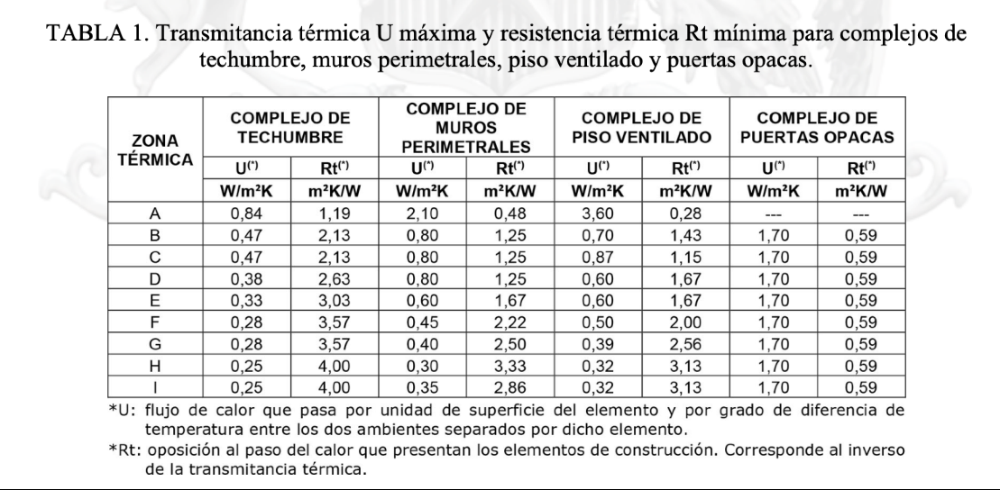

## Página 5

TABLA 2. Resistencia térmica R100 mínima del material aislante térmico en complejos de
techumbre, muros perimetrales y piso ventilado.

COMPLEJO DE
COMPLEJO DE MUROS COMPLEJO DE PISO

ZONA TÉRMICA ARPONIS PERIMETRALES VENTILADO

(*) Según la norma NCh 2251: R100 = valor equivalente a la Resistencia Térmica (m*K/W) x 100.

REGLAMENTACIÓN PARA VENTANAS:

ZONA , Upvm [W/m*K] SEGÚN TRANSMITANCIA TÉRMICA "U" DE VENTANA
ORIENTACIÓN

TÉRMICA
506 | 08 | 512 |<16 | <20 | 324 | 328 | 532 | 36

Norte [ma] ma [116151] 280] 218 | 246] 272 | 236.
JO-P__—— | na | na |108 | 134 | 158 | 181 | 2,00 | 217 | 228
Sur | na | na |104 | 1,26 | 145 | 162 | 176 | 186 | 192

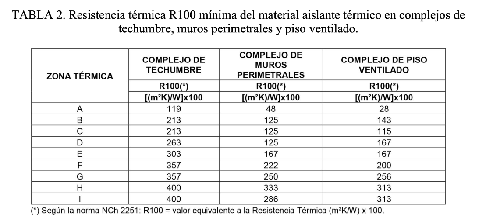

## Página 6

6
CAPITULO 3. 
MEMORIA DE TRANSMITANCIA TÉRMICA (U) Y RESISTENCIA TÉRMICA (Rt)
En el presente capítulo se detalla el cumplimiento de los estándares de aislación térmica para los elementos 
opacos de la envolvente del proyecto. La edificación se emplaza en la comuna de Vitacura, la cual, según 
la normativa vigente y la zonificación climática nacional, corresponde a la Zona Térmica D.
Las exigencias aplicadas corresponden a la actualización del Artículo 4.1.10 de la Ordenanza General 
de Urbanismo y Construcciones (OGUC), que establece límites máximos de transmitancia térmica y 
mínimos de resistencia para el material aislante (R100).
3.1 TABLA RESUMEN CUMPLIMIENTO ZONA D (Cálculos por elemento a continuación)
3.1. Cuadro Resumen de Exigencias y Cumplimiento (Zona D)
De acuerdo a las tablas de la Ordenanza General de Urbanismo y Construcciones (OGUC), los valores 
proyectados deben ser iguales o menores a la transmitancia (U) máxima, o iguales o mayores a la 
resistencia (Rt) mínima exigida para la Zona D.
Elemento de la 
Envolvente
Indicador
Exigencia (Zona D)
Proyecto
Estado
Complejo de 
Techumbre
Transmitancia 
(U)
≤0,38W/m2K
0,26W/m2K
CUMPLE
Resistencia R100
≥263
375
CUMPLE
Muros Perimetrales
Transmitancia 
(U)
≤0,80W/m2K
0,56W/m2K
CUMPLE
Resistencia R100
≥125
140
CUMPLE
Piso (Sobrecimiento)
Resistencia R100
≥45
260
CUMPLE
Puertas Exteriores
Transmitancia 
(U)
≤1,70W/m2K
1,70W/m2K
CUMPLE

## Página 7

7
3.2. Detalle de Complejos Constructivos
3.2.1. Muros Perimetrales (Estructura de Madera)
Se proyecta un muro de tabiquería con estructura de madera de pino radiata. El cálculo de 
transmitancia se realiza de forma ponderada según la norma NCh853, considerando la sección 
del aislante y el puente térmico de los bastidores estructurales.
•
Composición (Interior a Exterior): Madera tinglada 1", Terciado estructural 18 mm, 
Barrera de vapor polietileno, Lana de oveja 60 mm (entre montantes 2x4"), Plancha OSB 
15 mm, Membrana hidrófuga, Cámara de aire ventilada y Pino termotratado 1x8".
•
Desempeño Térmico: El aislante de lana de oveja de 60 mm aporta una resistencia 
R100 de 140, superando el mínimo de 125. La transmitancia térmica final ponderada es 
de 0,56W/m2K, situándose un 30% por debajo del límite máximo permitido.
3.2.1 Memoria de Transmitancia Térmica (U) - Muro Perimetral (Ajustado a 60mm)
Memoria de Capas (Interior a Exterior)
Capa (Interior a Exterior)
Espesor (e) [m]
Cond. Térmica 
(λ) [W/mK]
Resistencia (R) 
[m2K/W]
Resistencia Superficial Interior (Rsi)
---
---
0,13
Madera Tinglada Pino Radiata (1")
0,025
0,104
0,24
Terciado Estructural
0,018
0,14
0,129
Aislante: Lana de Oveja (60 mm)
0,06
0,043
1,395
Estructura: Pino Radiata (60 mm)
0,06
0,104
0,577
Plancha OSB estructural
0,015
0,14
0,107
Cámara de aire (Ventilada)
0,025
---
0,13
Resistencia Superficial Exterior 
(Rse)
---
---
0,04
Resultados del Cálculo Ponderado (NCh853)
Considerando el puente térmico de la estructura de madera (fracción de área del 19%):
Resistencia Térmica Total (Rt): 1,78m2K/W
Transmitancia Térmica Final (U): 0,56W/m2K
Resistencia R100 del Aislante: 140 (Lana de oveja 60mm)
Cuadro de Cumplimiento Normativo (Vitacura - Zona D)
Indicador
(OGUC 4.1.10)
Proyecto 
(60mm)
Estado
Transmitancia Térmica (U)
≤0,80W/m2K
0,56W/m2K
CUMPLE
Resistencia R100 mín.
≥125
140
CUMPLE

## Página 8

8
3.2.2. Complejo de Techumbre (Sistema Híbrido)
Para la techumbre se ha diseñado una solución de alto desempeño que combina aislación entre 
vigas y una capa continua superior para eliminar puentes térmicos.
•
Composición (Interior a Exterior): Pino Clear 1x4", Barrera de vapor fieltro, Lana de 
oveja 100 mm (entre envigado 2x6"), OSB 18 mm, Rastreles de madera 4 cm, 
Poliuretano proyectado 40 mm y cubierta de Zinc Microacanalado.
•
Desempeño Térmico: La combinación de lana de oveja y poliuretano entrega una 
resistencia R100 total de 375, excediendo la exigencia de 263. El valor de transmitancia 
proyectado es de 0,26W/m2K, cumpliendo holgadamente con el máximo de 0,38.
3.2.2. Memoria de Transmitancia Térmica (U) - Techumbre
Memoria de Capas (Interior a Exterior)
Capa / Elemento
Espesor (e) 
[m]
Cond. Térmica 
(λ) [W/mK]
Resistencia (R) 
[m2K/W]
Resistencia Superficial Interior (Rsi)
---
---
0,1
Pino Clear (1x4")
0,019
0,104
0,183
Barrera de Vapor (Fieltro)
0,0003
---
Despreciable
Aislante 1: Lana de oveja
0,1
0,043
2,325
Envigado Pino Radiata (2x6")*
0,14
0,104
1,346
Plancha OSB estructural
0,018
0,14
0,129
Aislante 2: Poliuretano Proyectado
0,04
0,028
1,428
Rastrel de madera (4 cm)
0,04
0,104
0,385
Zinc Microacanalado
0,0005
110
Despreciable
Resistencia Superficial Exterior (Rse)
---
---
0,04
Resultados del Cálculo Ponderado (NCh853)
Resistencia Térmica Total (Rt) Proyectada: 3,86m2K/W
Transmitancia Térmica Final (U): 0,26W/m2K
Resistencia R100 del Aislante (Suma): 375 (Lana 232 + PUR 143)
3. Cuadro Resumen de Cumplimiento (Techumbre)
Indicador
ZONA D
Proyecto
Estado
Transmitancia Térmica (U)
≤0,38W/m2K
0,26W/m2K
CUMPLE
Resistencia R100 mínima
≥263
375
CUMPLE
Análisis técnico: Tu techumbre supera la exigencia normativa en un 30%. La combinación de una 
barrera de vapor (fieltro) bajo un envigado con aislación masiva (lana) y luego una capa continua 
exterior (poliuretano) es ideal para evitar condensaciones en Vitacura, ya que el poliuretano 
mantiene el OSB y la estructura de madera "calientes", fuera del punto de rocío.

## Página 9

9
3.2.3. Radier y Aislación de Sobrecimientos
En cumplimiento con la exigencia para pisos en contacto con el terreno, se garantiza el corte de 
puente térmico perimetral mediante aislación de alta densidad.
•
Solución: Se dispone de una capa continua de Poliestireno Expandido (EPS) de alta 
densidad de 100 mm bajo la losa de hormigón armado, la cual se extiende de forma 
perimetral para cubrir el sobrecimiento.
•
Desempeño Térmico: Esta solución alcanza un R100 de 260, lo cual es 
significativamente superior al mínimo de 45 exigido para la Zona D. La transmitancia 
térmica del complejo de piso resulta en 0,35W/m2K.
3.2.3. Memoria de Transmitancia Térmica (U) - Radier
Aunque la normativa indica que el radier central (apoyado sobre terreno) no tiene una exigencia de 
transmitancia máxima obligatoria más allá del sobrecimiento, incluimos el cálculo en la memoria 
para demostrar el alto desempeño térmico de la casa.
Memoria de Capas (Interior a Exterior/Abajo)
Capa / Elemento
Espesor (e) [m]
Cond. Térmica (λ) 
[W/mK]
Resistencia (R) 
[m2K/W]
Fuente / Nota
Resistencia 
Superficial 
Interior (Rsi)
---
---
0,17
NCh853
Mármol 
Travertino
0,01
1,3
0,007
Valor estándar
Radier Hormigón 
Armado
0,1
1,63
0,061
NCh853
Aislante: EPS Alta 
Densidad
0,1
0,0384
2,604
Barrera de Vapor 
Polietileno
0,0002
---
0
Membrana 
Geotextil
---
---
0
Capa técnica
Gravilla 
Compactada
0,1
---
---
Suelo
Resultados del Cálculo
Resistencia Térmica Total (Rt): 2,84m2K/W
Transmitancia Térmica Final (U): 0,35W/m2K
Análisis de la solución: El radier es extremadamente eficiente. Un valor U de 0,35 es comparable a 
los niveles de aislación exigidos para muros en zonas mucho más frías (como Punta Arenas), lo que 
garantiza un piso cálido y minimiza la pérdida de calor por conducción hacia el suelo.

## Página 10

10
3.2.4. Puertas Exteriores Opacas.
Las puertas que comunican recintos acondicionados con el exterior han sido especificadas para 
cumplir con los nuevos estándares de la OGUC.
•
Especificación: Puerta de madera sólida de espesor igual o superior a 45 mm.
•
Desempeño Térmico: Esta materialidad garantiza una transmitancia térmica U=1,70W/
m2K, cumpliendo con el límite exacto para la Zona D. Adicionalmente, el marco incorpora 
sellos de caucho elástico para garantizar la permeabilidad al aire.
3. Memoria de Transmitancia Térmica (U) - Puerta de Acceso
Para la comuna de Vitacura (Zona D), la normativa exige que las puertas que comuniquen recintos 
acondicionados con el exterior cumplan con los siguientes valores:
Transmitancia Térmica (U) Máxima: 1,70W/m2K.
Resistencia Térmica Total (Rt) Mínima: 0,59m2K/W.
Análisis de tu Solución:
De acuerdo a los documentos técnicos, una puerta de madera maciza requiere un espesor 
específico para alcanzar por sí sola el cumplimiento normativo en la Zona D:
Espesor Requerido: Se establece que una puerta de madera sólida de 4,5 cm de espesor 
alcanza una resistencia térmica de 0,59m2K/W, lo que equivale exactamente al límite de 
U=1,70.
Estado: Las puertas de acceso (Entrada Principal, Cocina y Segundo piso) al tener 45 mm 
de espesor, se considera que CUMPLE con el estándar exigido para la Zona D.
Hermeticidad e Infiltraciones de Aire (Marco y Sellos)
Se considera una "membrana aislante y barrera de infiltración" en los laterales y la parte 
superior del marco. Esto es fundamental para cumplir con la exigencia de Permeabilidad 
al Aire.
Exigencia de Permeabilidad (Zona D): Las puertas opacas deben acreditar una Clase 2 
de permeabilidad al aire (medido a 100 Pa).
Estrategia de Sellado: El uso de membranas y sellos en el marco se alinea con las 
recomendaciones para evitar puentes térmicos por convección.
Para asegurar el cumplimiento de la Clase 2, estos sellos deben ser burletes de materiales 
elásticos (EPDM) instalados de forma continua en el rebaje del marco. Además, el 
encuentro entre el marco de madera y el vano del muro debe sellarse con espuma de 
poliuretano de baja expansión para eliminar infiltraciones.
Resumen de Cumplimiento para el Informe
Elemento
Indicador
Exigencia (Zona 
D)
Proyecto
Estado
Puerta de Acceso
Transmitancia (U)
≤1,70W/m2K
Puerta madera 
sólida ≥45mm
CUMPLE
Puerta de Acceso
Permeabilidad al 
aire
Clase 2 mín.
Marco con sellos 
y membranas
CUMPLE

## Página 11

11
Acreditación: Se acredita este valor mediante una memoria de cálculo según NCh3137 y adoptando 
la ficha del Listado Oficial del MINVU (3.1.P.M.0.05 para puertas de madera).

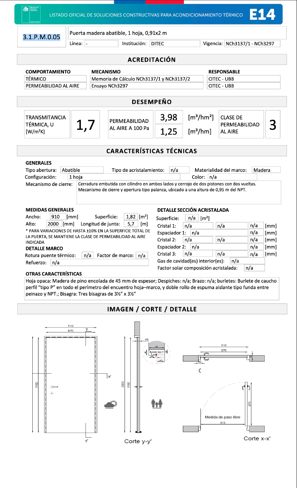

## Página 12

12
CAPITULO 4. 
MEMORIA DE CÁLCULO DE RIESGO DE CONDENSACIÓN
El presente capítulo tiene por objetivo verificar que las soluciones constructivas proyectadas 
para la envolvente térmica no presenten riesgos de patologías asociadas a la humedad. De 
acuerdo con la normativa vigente, se realiza un análisis de riesgo de condensación tanto 
superficial como intersticial para los complejos de muros, techumbres y pisos.
4.1. Objetivo y Parámetros de Cálculo
El análisis busca asegurar que la temperatura de las superficies interiores se mantenga por 
sobre el punto de rocío y que no exista acumulación de vapor de agua en el interior de los 
elementos constructivos que pueda degradar los materiales o permitir la formación de moho.
4.1.1. Condiciones Climáticas de Diseño (ZONA D. Vitacura)
Para el cálculo, se utilizan las condiciones ambientales más exigentes para la comuna de 
Vitacura (Zona Térmica D), correspondientes al mes de julio:
•
Temperatura Exterior: 2,2 °C.
•
Humedad Relativa Exterior: 92%.

4.1.2. Condiciones Ambientales Interiores
Se establecen parámetros estándar de confort y exigencia higrotérmica:
•
Temperatura Interior: 19 °C.
•
Humedad Relativa Interior: 75%.
4.2. Metodología de Análisis
La verificación se realiza siguiendo los procedimientos de la norma NCh1973, evaluando cada 
complejo constructivo en dos secciones críticas:
•
Sección A (Cuerpo): Zona con aislación térmica continua y mayor resistencia térmica.
•
Sección B (Puente Térmico): Zona donde la estructura de madera interrumpe el 
aislante, representando el punto de menor resistencia y mayor riesgo de enfriamiento 
superficial.

El criterio de aceptación estipula que la humedad relativa en cualquier interfaz interna no debe 
superar el 80%, incorporando así un factor de seguridad para prevenir preventivamente la 
formación de hongos.

## Página 13

13
4.3. Verificación por Elemento Constructivo:
4.3.1. Muros Perimetrales (Madera y Lana de Oveja)
El diseño del muro incorpora una barrera de vapor en la cara interna y una membrana hidrófuga 
respirable hacia la cámara de aire exterior.
•
Condensación Superficial: Gracias a la resistencia térmica aportada por los 60 mm de 
lana de oveja, la temperatura superficial interior se mantiene estable, eliminando el riesgo 
de condensación bajo las condiciones de diseño.

•
Condensación Intersticial: La barrera de vapor interior limita eficazmente el ingreso de 
humedad hacia el alma del muro. La configuración de fachada ventilada permite que 
cualquier residuo de vapor sea evacuado hacia el exterior, manteniendo todas las 
interfaces con una humedad relativa inferior al límite crítico.
•
Barrera de humedad continua: Membrana hidrófuga tipo Tyvek o fieltro asfáltico, 
instalada sobre el aislante rígido permite la difusión de vapor hacia el exterior e 
impidiendo el paso de agua líquida.

4.3.2. Complejo de Techumbre (Sistema Híbrido)
La solución híbrida combina aislación entre vigas y una capa continua exterior de poliuretano 
proyectado.
•
Análisis de Riesgo: La presencia de aislación térmica por el exterior de la estructura 
(poliuretano) asegura que los elementos estructurales de madera y las placas de OSB se 
mantengan a una temperatura cercana a la interior (cara caliente). Esto previene que el 
vapor de agua alcance su punto de rocío dentro del complejo, garantizando la durabilidad 
de la estructura.
•
Barrera de humedad continua: Membrana hidrófuga tipo Tyvek, instalada sobre el 
aislante rígido permite la difusión de vapor hacia el exterior e impidiendo el paso de agua 
líquida.
4.3.3. Radier y Sobrecimientos
La continuidad de la aislación de poliestireno expandido de alta densidad bajo la losa y en el 
perímetro del sobrecimiento elimina los puentes térmicos en el encuentro con el terreno. Esto 
asegura que no existan puntos fríos en las esquinas de los recintos, evitando la formación de 
humedad por condensación superficial en los bordes del piso terminado.
Por otro lado, la barrera de vapor de Polietileno evita la humedad ascendente del terreno.
4.4. Conclusión del Análisis de Condensación
Tras la evaluación higrotérmica de los complejos propuestos, se concluye que el proyecto 
CUMPLE con las exigencias de la normativa. La correcta disposición de aislantes y barreras de 
vapor garantiza una envolvente saludable, protegida de patologías por humedad y conforme a 
los estándares exigidos para la Zona Térmica D.

## Página 14

14
CAPITULO 5.- 
MEMORIA TÉCNICA DEL COMPLEJO DE VENTANAS Y SUPERFICIES 
VIDRIADAS
 
En el presente capítulo se describe y justifica el cumplimiento de los estándares de desempeño 
térmico y hermeticidad para los vanos traslúcidos de la edificación. Al emplazarse en Vitacura 
(Zona Térmica D), el proyecto se acoge a los nuevos límites de superficie vidriada máxima 
permitida por orientación geográfica, definidos en la actualización de la normativa térmica 
nacional.
5.1. Especificación Técnica de los Componentes
Para garantizar el confort higrotérmico y la eficiencia energética de la vivienda, se han 
especificado componentes con certificación de laboratorio según los siguientes parámetros:
•
Cristales: Doble Vidriado Hermético (DVH) estándar, compuesto por dos hojas de cristal 
con cámara de aire estanca, asegurando un control térmico superior al vidrio monolítico 
convencional.
•
Marcos: Perfiles de aluminio con tecnología de Rotura de Puente Térmico (RPT), 
diseñados para interrumpir la conducción de calor a través del metal del marco.
•
Transmitancia Térmica Total (Uw ): De acuerdo con las memorias de cálculo 
individuales según NCh3137, el conjunto marco-vidrio de las tipologías proyectadas 
arroja valores de transmitancia térmica situados entre 3,5 y 3,6 W/m2K.
A) Exigencias de Superficie Vidriada para Zona D
El porcentaje máximo de ventanas permitido respecto a la superficie de los muros de cada 
fachada se rige por la siguiente tabla.

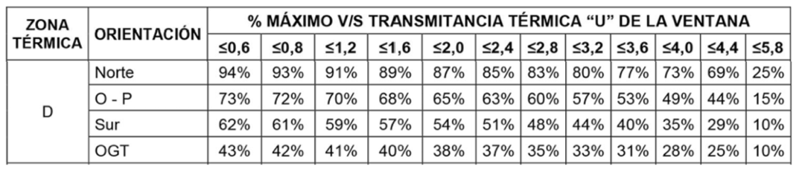

## Página 15

15
5.2. Justificación de Superficies Vidriadas por Fachada
De acuerdo con la Tabla 3 de la actualización del Art. 4.1.10 de la OGUC,
para una transmitancia térmica proyectada de Uw≤3,6 en la Zona
D, se establecen límites estrictos para la proporción de ventana respecto a la superficie de muro 
de cada fachada.
A continuación, se presenta
el cuadro comparativo del proyecto frente a las exigencias normativas:
Análisis de Cumplimiento: El diseño arquitectónico optimiza las ganancias solares en la 
fachada Norte sin exceder el límite del 77%. En la fachada Sur, la más crítica por pérdidas de 
calor, el proyecto se mantiene bajo el restrictivo límite del 40%. Finalmente, las fachadas Oriente 
y Poniente presentan un porcentaje mínimo de vidriado (14,39%), lo que reduce 
significativamente el riesgo de sobrecalentamiento estival.
5.3. Hermeticidad e Infiltraciones de Aire
Para cumplir con las exigencias de infiltración de aire en la Zona Térmica D, todos los 
complejos de ventanas instalados deben acreditar obligatoriamente una Clase 2 de 
Permeabilidad al Aire (ensayada a 100 Pa).
•
Acreditación: Se garantiza que los modelos instalados cuentan con sellos elásticos 
perimetrales y burletes que aseguran la hermeticidad del vano, minimizando las pérdidas 
energéticas por infiltraciones no deseadas.
Fachada / 
Orientación
Sup. Muros 
(m2)
Sup. 
Vidriado 
% Vidriado 
Real
% Máximo 
(U≤3,6)
Estado
NORTE
73,34
27,45
37,43 %
77 %
CUMPLE
SUR
69,26
22,09
31,90 %
40 %
CUMPLE
ORIENTE + 
PONIENTE
82,56
11,88
14,39 %
53 %
CUMPLE

## Página 16

16
VENTANAS POR FACHADA Y ACREDITACIÓN DE SUPERFICIE DE MUROS
Nivel 1 (LxA) Sup Nivel 1 Nivel 2 (LxA)
Sup Nivel 2 SUP Por 
fachada
MURO NORTE
1320 x 324
42,77 m2
980 x 305
29,89 m2
72,66 m2
MURO SUR
1320 x 324
42,77 m2
980 x 270
26,46 m2
69,23 m2
MURO ORIENTE 720 x 324
23,33 m2
610 x 272 + 
(610*34/2)
17,63 m2
81,91 m2
MURO 
PONIENTE
720 x 324
23,33 m2
610 x 272 + 
(610*34/2)
17,63 m2
V3
220x200
V2
210x200
V5
100x220
V6
100x220
VF
VF
V4
115x220
V8
220x106
V9
90x106
V10
90x106
V11
220x106
VF
VF
VF
V17
220x208
V18
220x91
V12
220x91
V7
100x330
V1
728x250
VF
VF
V13
196x77
V14
206x125
V15
V16
206x125
206x125
Fachada Oriente
Fachada Norte
Fachada Sur
Fachada Poniente

## Página 17

17
5.2. Cuadro de Vanos y Verificación de Superficies
Se ha calculado el porcentaje de superficie vidriada respecto a los paramentos verticales 
(muros) por cada orientación geográfica, comparándolo con los límites máximos permitidos para 
la Zona D.
5.3. Análisis de Resultados para el Informe:
1.
Fachada Norte: Es la orientación más eficiente para ganancias solares. El diseño 
proyecta un 37,43%, lo que está muy por debajo del generoso 77% que permite la norma 
en Vitacura para este tipo de ventana.
2.
Fachada Sur: Es la orientación más crítica por las pérdidas de calor. Tu diseño utiliza un 
31,90%, cumpliendo con el límite del 40% establecido para la Zona D.
3.
Fachadas Oriente y Poniente: Con un 14,39% total, el proyecto se mantiene 
significativamente por debajo del 53% máximo, lo que ayudará a evitar el 
sobrecalentamiento en verano (especialmente en la fachada Poniente).

FACHADA
Ventana
Largo A 
(cm)
Alto B (cm)
Superficie 
(m²)
Uw
NORTE
V1
728
250
18,2
3.2
SUR
V2
210
200
4,2
3.5
SUR
V3
220
200
4,4
3.5
SUR
V4
115
220
2,53
3.5
SUR
V5
100
220
2,2
3.6
SUR
V6
100
220
2,2
3.6
ORIENTE
V7
100
330
3,3
3.6
SUR
V8
220
106
2,33
3.5
SUR
V9
90
106
0,95
3.6
SUR
V10
90
106
0,95
3.6
SUR
V11
220
106
2,33
3.5
ORIENTE
V12
220
91
2
3.6
NORTE
V13
196
77
1,51
3.6
NORTE
V14
206
125
2,58
3.5
NORTE
V15
206
125
2,58
3.5
NORTE
V16
206
125
2,58
3.5
PONIENTE
V17
220
208
4,58
3.5
PONIENTE
V18
220
91
2
3.6
TOTAL MURO FACHADA NORTE
73,34
TOTAL VIDRIADO FACHADA NORTE
27,45
TOTAL MURO FACHADA SUR
69,26
TOTAL VIDRIADO FACHADA SUR
22,09
TOTAL MURO FACHADA ORIENTE + PONIENTE
82,56
TOTAL VIDRIADO FACHADA ORIENTE + PONIENTE
11,88

## Página 18

18
UBICACIÓN DE VENTANAS 
V1
V2
V3
V6
V7
V4
V8
V9
V10
V11
V12
V13
V14
V15
V16
V17
V18
CLOSET
M11
COMODA
M12
VANITORIO
ROPA BLANCA
M13
CLOSET
M14
ESCRITORIO
M15
CAMA KING
MESA COMEDOR
LAVA MANOS
RECEPTACULO DUCHA
TINA 150CM
REPISAS DE MADERA
V5
NIVEL 2
NIVEL 1
N
N

## Página 19

19
5.4. Métodos de Acreditación
El cumplimiento respalda con Memorias de cálculo individuales por tipología de ventana según 
NCh3137

Ventana V1
mm
mm
m²
Proporción marco vidrio:
Alternativa 1:
Alternativa 2:
Alternativa 3:
m²
mm
Área marco, Af:
m²
Área vidrio, Ag:
m²
Valor usuario
Configuración:
m
Tipo abertura:
Tipo de marco:
Tipo de vidriado:
Distancia RPT:
mm
mm
mm
Interior, Af/Af,di:
mm
Exterior, Af/Af,de:
mm
mm
Valor usuario
W/m²K
W/mK
m
Condiciones de cálculo:
Nombre y firma Profesional:
Razón entre área de marco y área 
desarrollada de marco :
3,64
Área vidrio, Ag:
Factor de marco:
Altura de marco:
Por defecto
común incoloro
50%
2 hojas, 1 fija lateral
con lámina emisividad 0,8
Vidrio 3
Espaciador 2
11,6
Gas:
Tipo
Vidrio 1
Largo de junta operable:
5
12
5
Espaciador
Vidrio 2
Proporción hoja móvil:
18,2
Área total ventana, Aw:
Ψg =
mejorado
2%
Marco
Vidriado
Espaciador
Transmitancias térmicas:
Fecha:
Corredera
Marco:
4,6
Ug =
- Transmitancia térmica del marco, Uf obtenido de Anexo D (Informativo).
- Resistencia térmica de la cámara de aire, Rs, para el cálculo de transmitancia térmica del vidriado,Ug, 
obtenido de Anexo C (Informativo).
- Transmitancia térmica lineal de la junta marco-vidrio, Ψg, obtenido de Anexo E (Normativo).
29%
69%
Cálculo térmico para ventanas según NCh 3137-1
5
7280
2500
Ancho total:
Alto total:
Características generales:
0,8
DVH
14,6
Especificaciones marco y vidrio:
Espesor
Elemento
Aire
Metal con RPT
0,06
Resultado:
22,1
Aporte:
Transmitancia térmica 
total de la ventana, Uw
3,2
Efecto marco-espaciador-vidriado:
Uf =
2,8
4,6
Vidriado:
0,06
Perímetro junta espaciador-marco-vidrio, lg:
Por defecto
Transmitancia térmica lineal marco-espaciador-vidrio, Ψg:
Transmitancia térmica marco, Uf:
!
"!#
!
"#
!
"!#
!
"!#

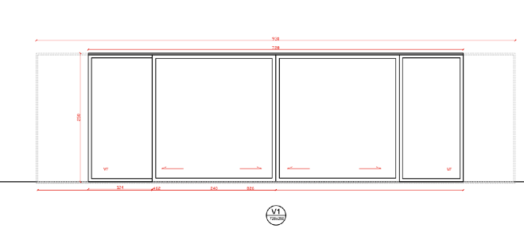

## Página 20

20
Ventana V2
mm
mm
m²
Proporción marco vidrio:
Alternativa 1:
Alternativa 2:
Alternativa 3:
m²
mm
Área marco, Af:
m²
Área vidrio, Ag:
m²
Valor usuario
Configuración:
m
Tipo abertura:
Tipo de marco:
Tipo de vidriado:
Distancia RPT:
mm
mm
mm
Interior, Af/Af,di:
mm
Exterior, Af/Af,de:
mm
mm
Valor usuario
W/m²K
W/mK
m
Condiciones de cálculo:
Nombre y firma Profesional:
Razón entre área de marco y área 
desarrollada de marco :
0,84
Área vidrio, Ag:
Factor de marco:
Altura de marco:
Por defecto
común incoloro
50%
2 hojas, 1 fija lateral
común incoloro
Vidrio 3
Espaciador 2
5,7
Gas:
Tipo
Vidrio 1
Largo de junta operable:
4
10
4
Espaciador
Vidrio 2
Proporción hoja móvil:
4,2
Área total ventana, Aw:
Ψg =
normal
6%
Marco
Vidriado
Espaciador
Transmitancias térmicas:
Fecha:
Corredera
Marco:
4,6
Ug =
- Transmitancia térmica del marco, Uf obtenido de Anexo D (Informativo).
- Resistencia térmica de la cámara de aire, Rs, para el cálculo de transmitancia térmica del vidriado,Ug, 
obtenido de Anexo C (Informativo).
- Transmitancia térmica lineal de la junta marco-vidrio, Ψg, obtenido de Anexo E (Normativo).
26%
68%
Cálculo térmico para ventanas según NCh 3137-1
5
2100
2000
Ancho total:
Alto total:
Características generales:
0,8
DVH
3,36
Especificaciones marco y vidrio:
Espesor
Elemento
Aire
Metal con RPT
0,08
Resultado:
10,9
Aporte:
Transmitancia térmica 
total de la ventana, Uw
3,5
Efecto marco-espaciador-vidriado:
Uf =
3,0
4,6
Vidriado:
0,08
Perímetro junta espaciador-marco-vidrio, lg:
Por defecto
Transmitancia térmica lineal marco-espaciador-vidrio, Ψg:
Transmitancia térmica marco, Uf:
!
"!#
!
"#
!
"!#
!
"!#

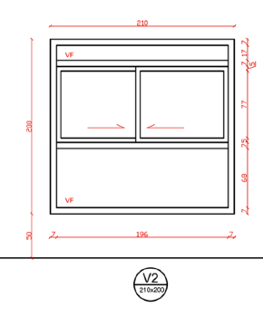

## Página 21

21
Ventana V3
mm
mm
m²
Proporción marco vidrio:
Alternativa 1:
Alternativa 2:
Alternativa 3:
m²
mm
Área marco, Af:
m²
Área vidrio, Ag:
m²
Valor usuario
Configuración:
m
Tipo abertura:
Tipo de marco:
Tipo de vidriado:
Distancia RPT:
mm
mm
mm
Interior, Af/Af,di:
mm
Exterior, Af/Af,de:
mm
mm
Valor usuario
W/m²K
W/mK
m
Condiciones de cálculo:
Nombre y firma Profesional:
Razón entre área de marco y área 
desarrollada de marco :
0,88
Área vidrio, Ag:
Factor de marco:
Altura de marco:
Por defecto
común incoloro
50%
2 hojas, 1 fija lateral
común incoloro
Vidrio 3
Espaciador 2
5,8
Gas:
Tipo
Vidrio 1
Largo de junta operable:
4
10
4
Espaciador
Vidrio 2
Proporción hoja móvil:
4,4
Área total ventana, Aw:
Ψg =
normal
6%
Marco
Vidriado
Espaciador
Transmitancias térmicas:
Fecha:
Corredera
Marco:
4,6
Ug =
- Transmitancia térmica del marco, Uf obtenido de Anexo D (Informativo).
- Resistencia térmica de la cámara de aire, Rs, para el cálculo de transmitancia térmica del vidriado,Ug, 
obtenido de Anexo C (Informativo).
- Transmitancia térmica lineal de la junta marco-vidrio, Ψg, obtenido de Anexo E (Normativo).
26%
68%
Cálculo térmico para ventanas según NCh 3137-1
5
2200
2000
Ancho total:
Alto total:
Características generales:
0,8
DVH
3,52
Especificaciones marco y vidrio:
Espesor
Elemento
Aire
Metal con RPT
0,08
Resultado:
11,1
Aporte:
Transmitancia térmica 
total de la ventana, Uw
3,5
Efecto marco-espaciador-vidriado:
Uf =
3,0
4,6
Vidriado:
0,08
Perímetro junta espaciador-marco-vidrio, lg:
Por defecto
Transmitancia térmica lineal marco-espaciador-vidrio, Ψg:
Transmitancia térmica marco, Uf:
!
"!#
!
"#
!
"!#
!
"!#

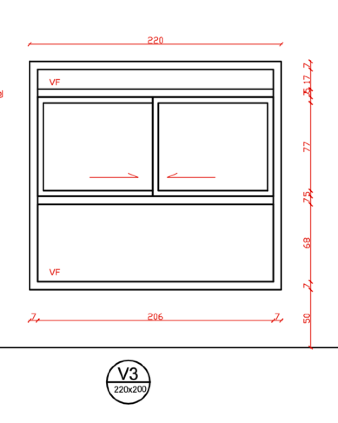

## Página 22

22
Ventana V4
mm
mm
m²
Proporción marco vidrio:
Alternativa 1:
Alternativa 2:
Alternativa 3:
m²
mm
Área marco, Af:
m²
Área vidrio, Ag:
m²
Valor usuario
Configuración:
m
Tipo abertura:
Tipo de marco:
Tipo de vidriado:
Distancia RPT:
mm
mm
mm
Interior, Af/Af,di:
mm
Exterior, Af/Af,de:
mm
mm
Valor usuario
W/m²K
W/mK
m
Condiciones de cálculo:
Nombre y firma Profesional:
Razón entre área de marco y área 
desarrollada de marco :
0,6
Área vidrio, Ag:
Factor de marco:
Altura de marco:
Por defecto
común incoloro
50%
1 hoja
común incoloro
Vidrio 3
Espaciador 2
6,6
Gas:
Tipo
Vidrio 1
Largo de junta operable:
4
10
4
Espaciador
Vidrio 2
Proporción hoja móvil:
3
Área total ventana, Aw:
Ψg =
normal
5%
Marco
Vidriado
Espaciador
Transmitancias térmicas:
Fecha:
Fija
Marco:
4,6
Ug =
- Transmitancia térmica del marco, Uf obtenido de Anexo D (Informativo).
- Resistencia térmica de la cámara de aire, Rs, para el cálculo de transmitancia térmica del vidriado,Ug, 
obtenido de Anexo C (Informativo).
- Transmitancia térmica lineal de la junta marco-vidrio, Ψg, obtenido de Anexo E (Normativo).
26%
69%
Cálculo térmico para ventanas según NCh 3137-1
5
1500
2000
Ancho total:
Alto total:
Características generales:
0,8
DVH
2,4
Especificaciones marco y vidrio:
Espesor
Elemento
Aire
Metal con RPT
0,08
Resultado:
6,28
Aporte:
Transmitancia térmica 
total de la ventana, Uw
3,5
Efecto marco-espaciador-vidriado:
Uf =
3,0
4,6
Vidriado:
0,08
Perímetro junta espaciador-marco-vidrio, lg:
Por defecto
Transmitancia térmica lineal marco-espaciador-vidrio, Ψg:
Transmitancia térmica marco, Uf:
!
"!#
!
"#
!
"!#
!
"!#

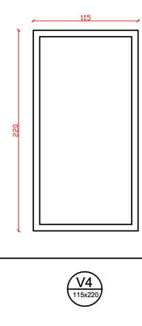

## Página 23

23
Ventana V5 y V6
mm
mm
m²
Proporción marco vidrio:
Alternativa 1:
Alternativa 2:
Alternativa 3:
m²
mm
Área marco, Af:
m²
Área vidrio, Ag:
m²
Valor usuario
Configuración:
m
Tipo abertura:
Tipo de marco:
Tipo de vidriado:
Distancia RPT:
mm
mm
mm
Interior, Af/Af,di:
mm
Exterior, Af/Af,de:
mm
mm
Valor usuario
W/m²K
W/mK
m
Condiciones de cálculo:
Nombre y firma Profesional:
Razón entre área de marco y área 
desarrollada de marco :
0,44
Área vidrio, Ag:
Factor de marco:
Altura de marco:
Por defecto
común incoloro
50%
2 hojas móviles laterales
común incoloro
Vidrio 3
Espaciador 2
7,0
Gas:
Tipo
Vidrio 1
Largo de junta operable:
5
10
5
Espaciador
Vidrio 2
Proporción hoja móvil:
2,2
Área total ventana, Aw:
Ψg =
normal
7%
Marco
Vidriado
Espaciador
Transmitancias térmicas:
Fecha:
Corredera
Marco:
4,6
Ug =
- Transmitancia térmica del marco, Uf obtenido de Anexo D (Informativo).
- Resistencia térmica de la cámara de aire, Rs, para el cálculo de transmitancia térmica del vidriado,Ug, 
obtenido de Anexo C (Informativo).
- Transmitancia térmica lineal de la junta marco-vidrio, Ψg, obtenido de Anexo E (Normativo).
26%
67%
Cálculo térmico para ventanas según NCh 3137-1
5
2200
1000
Ancho total:
Alto total:
Características generales:
0,8
DVH
1,76
Especificaciones marco y vidrio:
Espesor
Elemento
Aire
Metal con RPT
0,08
Resultado:
6,66
Aporte:
Transmitancia térmica 
total de la ventana, Uw
3,6
Efecto marco-espaciador-vidriado:
Uf =
3,0
4,6
Vidriado:
0,08
Perímetro junta espaciador-marco-vidrio, lg:
Por defecto
Transmitancia térmica lineal marco-espaciador-vidrio, Ψg:
Transmitancia térmica marco, Uf:
!
"!#
!
"#
!
"!#
!
"!#

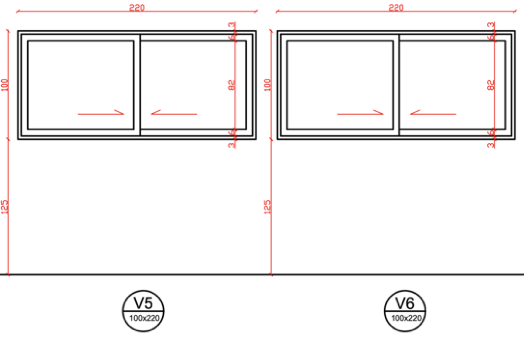

## Página 24

24
Ventana V7
mm
mm
m²
Proporción marco vidrio:
Alternativa 1:
Alternativa 2:
Alternativa 3:
m²
mm
Área marco, Af:
m²
Área vidrio, Ag:
m²
Valor usuario
Configuración:
m
Tipo abertura:
Tipo de marco:
Tipo de vidriado:
Distancia RPT:
mm
mm
mm
Interior, Af/Af,di:
mm
Exterior, Af/Af,de:
mm
mm
Valor usuario
W/m²K
W/mK
m
Condiciones de cálculo:
Nombre y firma Profesional:
Razón entre área de marco y área 
desarrollada de marco :
0,66
Área vidrio, Ag:
Factor de marco:
Altura de marco:
Por defecto
común incoloro
50%
2 hojas móviles laterales
común incoloro
Vidrio 3
Espaciador 2
11,5
Gas:
Tipo
Vidrio 1
Largo de junta operable:
5
10
5
Espaciador
Vidrio 2
Proporción hoja móvil:
3,3
Área total ventana, Aw:
Ψg =
normal
8%
Marco
Vidriado
Espaciador
Transmitancias térmicas:
Fecha:
Corredera
Marco:
4,6
Ug =
- Transmitancia térmica del marco, Uf obtenido de Anexo D (Informativo).
- Resistencia térmica de la cámara de aire, Rs, para el cálculo de transmitancia térmica del vidriado,Ug, 
obtenido de Anexo C (Informativo).
- Transmitancia térmica lineal de la junta marco-vidrio, Ψg, obtenido de Anexo E (Normativo).
26%
67%
Cálculo térmico para ventanas según NCh 3137-1
5
1000
3300
Ancho total:
Alto total:
Características generales:
0,8
DVH
2,64
Especificaciones marco y vidrio:
Espesor
Elemento
Aire
Metal con RPT
0,08
Resultado:
11,2
Aporte:
Transmitancia térmica 
total de la ventana, Uw
3,6
Efecto marco-espaciador-vidriado:
Uf =
3,0
4,6
Vidriado:
0,08
Perímetro junta espaciador-marco-vidrio, lg:
Por defecto
Transmitancia térmica lineal marco-espaciador-vidrio, Ψg:
Transmitancia térmica marco, Uf:
!
"!#
!
"#
!
"!#
!
"!#

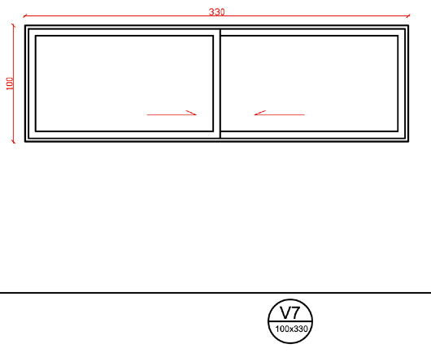

## Página 25

25
Ventana V8
mm
mm
m²
Proporción marco vidrio:
Alternativa 1:
Alternativa 2:
Alternativa 3:
m²
mm
Área marco, Af:
m²
Área vidrio, Ag:
m²
Valor usuario
Configuración:
m
Tipo abertura:
Tipo de marco:
Tipo de vidriado:
Distancia RPT:
mm
mm
mm
Interior, Af/Af,di:
mm
Exterior, Af/Af,de:
mm
mm
Valor usuario
W/m²K
W/mK
m
Condiciones de cálculo:
Nombre y firma Profesional:
Razón entre área de marco y área 
desarrollada de marco :
0,47
Área vidrio, Ag:
Factor de marco:
Altura de marco:
Por defecto
común incoloro
50%
2 hojas móviles laterales
común incoloro
Vidrio 3
Espaciador 2
7,2
Gas:
Tipo
Vidrio 1
Largo de junta operable:
5
10
5
Espaciador
Vidrio 2
Proporción hoja móvil:
2,33
Área total ventana, Aw:
Ψg =
normal
7%
Marco
Vidriado
Espaciador
Transmitancias térmicas:
Fecha:
Corredera
Marco:
4,6
Ug =
- Transmitancia térmica del marco, Uf obtenido de Anexo D (Informativo).
- Resistencia térmica de la cámara de aire, Rs, para el cálculo de transmitancia térmica del vidriado,Ug, 
obtenido de Anexo C (Informativo).
- Transmitancia térmica lineal de la junta marco-vidrio, Ψg, obtenido de Anexo E (Normativo).
26%
67%
Cálculo térmico para ventanas según NCh 3137-1
5
2200
1060
Ancho total:
Alto total:
Características generales:
0,8
DVH
1,87
Especificaciones marco y vidrio:
Espesor
Elemento
Aire
Metal con RPT
0,08
Resultado:
6,81
Aporte:
Transmitancia térmica 
total de la ventana, Uw
3,5
Efecto marco-espaciador-vidriado:
Uf =
3,0
4,6
Vidriado:
0,08
Perímetro junta espaciador-marco-vidrio, lg:
Por defecto
Transmitancia térmica lineal marco-espaciador-vidrio, Ψg:
Transmitancia térmica marco, Uf:
!
"!#
!
"#
!
"!#
!
"!#

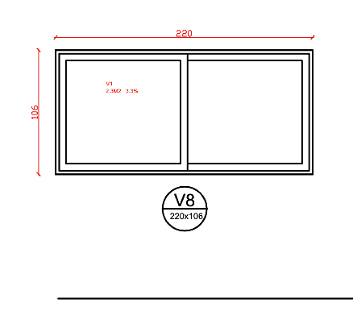

## Página 26

26
Ventana V9 y V10
mm
mm
m²
Proporción marco vidrio:
Alternativa 1:
Alternativa 2:
Alternativa 3:
m²
mm
Área marco, Af:
m²
Área vidrio, Ag:
m²
Valor usuario
Configuración:
m
Tipo abertura:
Tipo de marco:
Tipo de vidriado:
Distancia RPT:
mm
mm
mm
Interior, Af/Af,di:
mm
Exterior, Af/Af,de:
mm
mm
Valor usuario
W/m²K
W/mK
m
Condiciones de cálculo:
Nombre y firma Profesional:
Razón entre área de marco y área 
desarrollada de marco :
0,19
Área vidrio, Ag:
Factor de marco:
Altura de marco:
Por defecto
común incoloro
50%
1 hoja
común incoloro
Vidrio 3
Espaciador 2
3,7
Gas:
Tipo
Vidrio 1
Largo de junta operable:
5
10
5
Espaciador
Vidrio 2
Proporción hoja móvil:
0,95
Área total ventana, Aw:
Ψg =
normal
8%
Marco
Vidriado
Espaciador
Transmitancias térmicas:
Fecha:
Proyectante
Marco:
4,6
Ug =
- Transmitancia térmica del marco, Uf obtenido de Anexo D (Informativo).
- Resistencia térmica de la cámara de aire, Rs, para el cálculo de transmitancia térmica del vidriado,Ug, 
obtenido de Anexo C (Informativo).
- Transmitancia térmica lineal de la junta marco-vidrio, Ψg, obtenido de Anexo E (Normativo).
25%
66%
Cálculo térmico para ventanas según NCh 3137-1
5
900
1060
Ancho total:
Alto total:
Características generales:
0,8
DVH
0,76
Especificaciones marco y vidrio:
Espesor
Elemento
Aire
Metal con RPT
0,08
Resultado:
3,51
Aporte:
Transmitancia térmica 
total de la ventana, Uw
3,6
Efecto marco-espaciador-vidriado:
Uf =
3,0
4,6
Vidriado:
0,08
Perímetro junta espaciador-marco-vidrio, lg:
Por defecto
Transmitancia térmica lineal marco-espaciador-vidrio, Ψg:
Transmitancia térmica marco, Uf:
!
"!#
!
"#
!
"!#
!
"!#

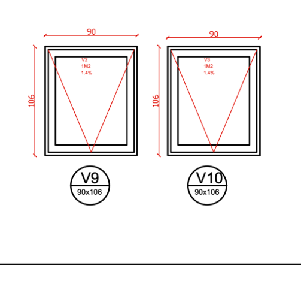

## Página 27

27
Ventana V11
mm
mm
m²
Proporción marco vidrio:
Alternativa 1:
Alternativa 2:
Alternativa 3:
m²
mm
Área marco, Af:
m²
Área vidrio, Ag:
m²
Valor usuario
Configuración:
m
Tipo abertura:
Tipo de marco:
Tipo de vidriado:
Distancia RPT:
mm
mm
mm
Interior, Af/Af,di:
mm
Exterior, Af/Af,de:
mm
mm
Valor usuario
W/m²K
W/mK
m
Condiciones de cálculo:
Nombre y firma Profesional:
Razón entre área de marco y área 
desarrollada de marco :
0,47
Área vidrio, Ag:
Factor de marco:
Altura de marco:
Por defecto
común incoloro
50%
2 hojas móviles laterales
común incoloro
Vidrio 3
Espaciador 2
7,2
Gas:
Tipo
Vidrio 1
Largo de junta operable:
5
10
5
Espaciador
Vidrio 2
Proporción hoja móvil:
2,33
Área total ventana, Aw:
Ψg =
normal
7%
Marco
Vidriado
Espaciador
Transmitancias térmicas:
Fecha:
Corredera
Marco:
4,6
Ug =
- Transmitancia térmica del marco, Uf obtenido de Anexo D (Informativo).
- Resistencia térmica de la cámara de aire, Rs, para el cálculo de transmitancia térmica del vidriado,Ug, 
obtenido de Anexo C (Informativo).
- Transmitancia térmica lineal de la junta marco-vidrio, Ψg, obtenido de Anexo E (Normativo).
26%
67%
Cálculo térmico para ventanas según NCh 3137-1
5
2200
1060
Ancho total:
Alto total:
Características generales:
0,8
DVH
1,87
Especificaciones marco y vidrio:
Espesor
Elemento
Aire
Metal con RPT
0,08
Resultado:
6,81
Aporte:
Transmitancia térmica 
total de la ventana, Uw
3,5
Efecto marco-espaciador-vidriado:
Uf =
3,0
4,6
Vidriado:
0,08
Perímetro junta espaciador-marco-vidrio, lg:
Por defecto
Transmitancia térmica lineal marco-espaciador-vidrio, Ψg:
Transmitancia térmica marco, Uf:
!
"!#
!
"#
!
"!#
!
"!#

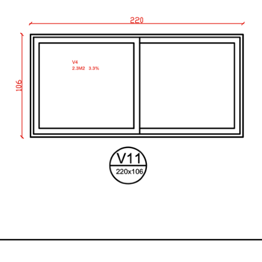

## Página 28

28
Ventana V12
mm
mm
m²
Proporción marco vidrio:
Alternativa 1:
Alternativa 2:
Alternativa 3:
m²
mm
Área marco, Af:
m²
Área vidrio, Ag:
m²
Valor usuario
Configuración:
m
Tipo abertura:
Tipo de marco:
Tipo de vidriado:
Distancia RPT:
mm
mm
mm
Interior, Af/Af,di:
mm
Exterior, Af/Af,de:
mm
mm
Valor usuario
W/m²K
W/mK
m
Condiciones de cálculo:
Nombre y firma Profesional:
Razón entre área de marco y área 
desarrollada de marco :
0,4
Área vidrio, Ag:
Factor de marco:
Altura de marco:
Por defecto
común incoloro
50%
2 hojas móviles laterales
común incoloro
Vidrio 3
Espaciador 2
6,8
Gas:
Tipo
Vidrio 1
Largo de junta operable:
5
10
5
Espaciador
Vidrio 2
Proporción hoja móvil:
2
Área total ventana, Aw:
Ψg =
normal
7%
Marco
Vidriado
Espaciador
Transmitancias térmicas:
Fecha:
Corredera
Marco:
4,6
Ug =
- Transmitancia térmica del marco, Uf obtenido de Anexo D (Informativo).
- Resistencia térmica de la cámara de aire, Rs, para el cálculo de transmitancia térmica del vidriado,Ug, 
obtenido de Anexo C (Informativo).
- Transmitancia térmica lineal de la junta marco-vidrio, Ψg, obtenido de Anexo E (Normativo).
26%
67%
Cálculo térmico para ventanas según NCh 3137-1
5
2200
910
Ancho total:
Alto total:
Características generales:
0,8
DVH
1,6
Especificaciones marco y vidrio:
Espesor
Elemento
Aire
Metal con RPT
0,08
Resultado:
6,44
Aporte:
Transmitancia térmica 
total de la ventana, Uw
3,6
Efecto marco-espaciador-vidriado:
Uf =
3,0
4,6
Vidriado:
0,08
Perímetro junta espaciador-marco-vidrio, lg:
Por defecto
Transmitancia térmica lineal marco-espaciador-vidrio, Ψg:
Transmitancia térmica marco, Uf:
!
"!#
!
"#
!
"!#
!
"!#

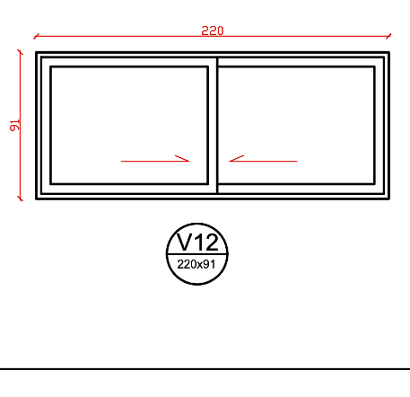

## Página 29

29
Ventana V13
mm
mm
m²
Proporción marco vidrio:
Alternativa 1:
Alternativa 2:
Alternativa 3:
m²
mm
Área marco, Af:
m²
Área vidrio, Ag:
m²
Valor usuario
Configuración:
m
Tipo abertura:
Tipo de marco:
Tipo de vidriado:
Distancia RPT:
mm
mm
mm
Interior, Af/Af,di:
mm
Exterior, Af/Af,de:
mm
mm
Valor usuario
W/m²K
W/mK
m
Condiciones de cálculo:
Nombre y firma Profesional:
Razón entre área de marco y área 
desarrollada de marco :
0,3
Área vidrio, Ag:
Factor de marco:
Altura de marco:
Por defecto
común incoloro
50%
2 hojas móviles laterales
común incoloro
Vidrio 3
Espaciador 2
5,9
Gas:
Tipo
Vidrio 1
Largo de junta operable:
5
10
5
Espaciador
Vidrio 2
Proporción hoja móvil:
1,51
Área total ventana, Aw:
Ψg =
normal
8%
Marco
Vidriado
Espaciador
Transmitancias térmicas:
Fecha:
Corredera
Marco:
4,6
Ug =
- Transmitancia térmica del marco, Uf obtenido de Anexo D (Informativo).
- Resistencia térmica de la cámara de aire, Rs, para el cálculo de transmitancia térmica del vidriado,Ug, 
obtenido de Anexo C (Informativo).
- Transmitancia térmica lineal de la junta marco-vidrio, Ψg, obtenido de Anexo E (Normativo).
25%
66%
Cálculo térmico para ventanas según NCh 3137-1
5
1960
770
Ancho total:
Alto total:
Características generales:
0,8
DVH
1,21
Especificaciones marco y vidrio:
Espesor
Elemento
Aire
Metal con RPT
0,08
Resultado:
5,63
Aporte:
Transmitancia térmica 
total de la ventana, Uw
3,6
Efecto marco-espaciador-vidriado:
Uf =
3,0
4,6
Vidriado:
0,08
Perímetro junta espaciador-marco-vidrio, lg:
Por defecto
Transmitancia térmica lineal marco-espaciador-vidrio, Ψg:
Transmitancia térmica marco, Uf:
!
"!#
!
"#
!
"!#
!
"!#

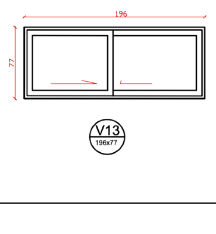

## Página 30

30
Ventana V14 - 15 - 16
mm
mm
m²
Proporción marco vidrio:
Alternativa 1:
Alternativa 2:
Alternativa 3:
m²
mm
Área marco, Af:
m²
Área vidrio, Ag:
m²
Valor usuario
Configuración:
m
Tipo abertura:
Tipo de marco:
Tipo de vidriado:
Distancia RPT:
mm
mm
mm
Interior, Af/Af,di:
mm
Exterior, Af/Af,de:
mm
mm
Valor usuario
W/m²K
W/mK
m
Condiciones de cálculo:
Nombre y firma Profesional:
Razón entre área de marco y área 
desarrollada de marco :
0,52
Área vidrio, Ag:
Factor de marco:
Altura de marco:
Por defecto
común incoloro
50%
2 hojas móviles laterales
común incoloro
Vidrio 3
Espaciador 2
7,4
Gas:
Tipo
Vidrio 1
Largo de junta operable:
5
10
5
Espaciador
Vidrio 2
Proporción hoja móvil:
2,58
Área total ventana, Aw:
Ψg =
normal
6%
Marco
Vidriado
Espaciador
Transmitancias térmicas:
Fecha:
Corredera
Marco:
4,6
Ug =
- Transmitancia térmica del marco, Uf obtenido de Anexo D (Informativo).
- Resistencia térmica de la cámara de aire, Rs, para el cálculo de transmitancia térmica del vidriado,Ug, 
obtenido de Anexo C (Informativo).
- Transmitancia térmica lineal de la junta marco-vidrio, Ψg, obtenido de Anexo E (Normativo).
26%
68%
Cálculo térmico para ventanas según NCh 3137-1
5
2060
1250
Ancho total:
Alto total:
Características generales:
0,8
DVH
2,06
Especificaciones marco y vidrio:
Espesor
Elemento
Aire
Metal con RPT
0,08
Resultado:
7,05
Aporte:
Transmitancia térmica 
total de la ventana, Uw
3,5
Efecto marco-espaciador-vidriado:
Uf =
3,0
4,6
Vidriado:
0,08
Perímetro junta espaciador-marco-vidrio, lg:
Por defecto
Transmitancia térmica lineal marco-espaciador-vidrio, Ψg:
Transmitancia térmica marco, Uf:
!
"!#
!
"#
!
"!#
!
"!#

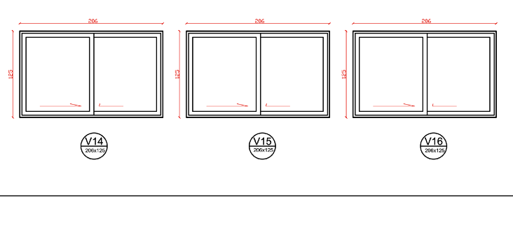

## Página 31

31
Ventana V17 
mm
mm
m²
Proporción marco vidrio:
Alternativa 1:
Alternativa 2:
Alternativa 3:
m²
mm
Área marco, Af:
m²
Área vidrio, Ag:
m²
Valor usuario
Configuración:
m
Tipo abertura:
Tipo de marco:
Tipo de vidriado:
Distancia RPT:
mm
mm
mm
Interior, Af/Af,di:
mm
Exterior, Af/Af,de:
mm
mm
Valor usuario
W/m²K
W/mK
m
Condiciones de cálculo:
Nombre y firma Profesional:
Razón entre área de marco y área 
desarrollada de marco :
0,92
Área vidrio, Ag:
Factor de marco:
Altura de marco:
Por defecto
común incoloro
50%
2 hojas móviles laterales
común incoloro
Vidrio 3
Espaciador 2
10,0
Gas:
Tipo
Vidrio 1
Largo de junta operable:
5
10
5
Espaciador
Vidrio 2
Proporción hoja móvil:
4,58
Área total ventana, Aw:
Ψg =
normal
5%
Marco
Vidriado
Espaciador
Transmitancias térmicas:
Fecha:
Corredera
Marco:
4,6
Ug =
- Transmitancia térmica del marco, Uf obtenido de Anexo D (Informativo).
- Resistencia térmica de la cámara de aire, Rs, para el cálculo de transmitancia térmica del vidriado,Ug, 
obtenido de Anexo C (Informativo).
- Transmitancia térmica lineal de la junta marco-vidrio, Ψg, obtenido de Anexo E (Normativo).
26%
69%
Cálculo térmico para ventanas según NCh 3137-1
5
2200
2080
Ancho total:
Alto total:
Características generales:
0,8
DVH
3,66
Especificaciones marco y vidrio:
Espesor
Elemento
Aire
Metal con RPT
0,08
Resultado:
9,53
Aporte:
Transmitancia térmica 
total de la ventana, Uw
3,5
Efecto marco-espaciador-vidriado:
Uf =
3,0
4,6
Vidriado:
0,08
Perímetro junta espaciador-marco-vidrio, lg:
Por defecto
Transmitancia térmica lineal marco-espaciador-vidrio, Ψg:
Transmitancia térmica marco, Uf:
!
"!#
!
"#
!
"!#
!
"!#

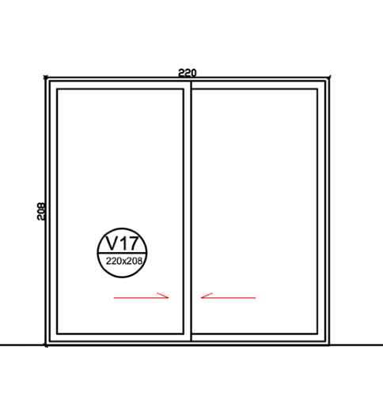

## Página 32

32
Ventana V18 
mm
mm
m²
Proporción marco vidrio:
Alternativa 1:
Alternativa 2:
Alternativa 3:
m²
mm
Área marco, Af:
m²
Área vidrio, Ag:
m²
Valor usuario
Configuración:
m
Tipo abertura:
Tipo de marco:
Tipo de vidriado:
Distancia RPT:
mm
mm
mm
Interior, Af/Af,di:
mm
Exterior, Af/Af,de:
mm
mm
Valor usuario
W/m²K
W/mK
m
Condiciones de cálculo:
Nombre y firma Profesional:
Razón entre área de marco y área 
desarrollada de marco :
0,4
Área vidrio, Ag:
Factor de marco:
Altura de marco:
Por defecto
común incoloro
50%
2 hojas móviles laterales
común incoloro
Vidrio 3
Espaciador 2
6,8
Gas:
Tipo
Vidrio 1
Largo de junta operable:
5
10
5
Espaciador
Vidrio 2
Proporción hoja móvil:
2
Área total ventana, Aw:
Ψg =
normal
7%
Marco
Vidriado
Espaciador
Transmitancias térmicas:
Fecha:
Corredera
Marco:
4,6
Ug =
- Transmitancia térmica del marco, Uf obtenido de Anexo D (Informativo).
- Resistencia térmica de la cámara de aire, Rs, para el cálculo de transmitancia térmica del vidriado,Ug, 
obtenido de Anexo C (Informativo).
- Transmitancia térmica lineal de la junta marco-vidrio, Ψg, obtenido de Anexo E (Normativo).
26%
67%
Cálculo térmico para ventanas según NCh 3137-1
5
2200
910
Ancho total:
Alto total:
Características generales:
0,8
DVH
1,6
Especificaciones marco y vidrio:
Espesor
Elemento
Aire
Metal con RPT
0,08
Resultado:
6,44
Aporte:
Transmitancia térmica 
total de la ventana, Uw
3,6
Efecto marco-espaciador-vidriado:
Uf =
3,0
4,6
Vidriado:
0,08
Perímetro junta espaciador-marco-vidrio, lg:
Por defecto
Transmitancia térmica lineal marco-espaciador-vidrio, Ψg:
Transmitancia térmica marco, Uf:
!
"!#
!
"#
!
"!#
!
"!#

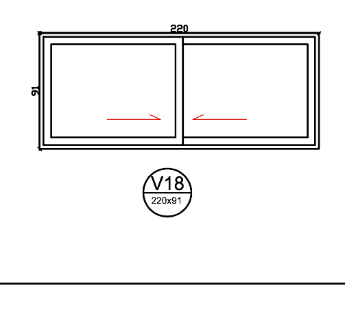

## Página 33

33
CAPÍTULO 6
MEMORIA DE HERMETICIDAD E INFILTRACIONES DE AIRE
El presente capítulo describe las estrategias y exigencias técnicas para el control de las 
infiltraciones de aire no deseadas en la envolvente térmica del proyecto, con el objetivo de 
minimizar las pérdidas de calor por convección, mejorar la eficiencia energética de la vivienda y 
garantizar que el desempeño de los materiales aislantes sea efectivo en condiciones reales de 
uso.
La hermeticidad de la envolvente constituye un aspecto fundamental del comportamiento 
higrotérmico de la edificación, ya que permite controlar los flujos de aire no intencionados a 
través de muros, techumbres, pisos, vanos y encuentros constructivos, reduciendo las pérdidas 
energéticas y los riesgos asociados a condensaciones intersticiales.
6.1. Marco Normativo y Exigencias Aplicables
De acuerdo con la Reglamentación Térmica vigente y considerando que el proyecto se emplaza 
en la comuna de Vitacura, Provincia de Santiago, correspondiente a la Zona Térmica D, la 
envolvente deberá cumplir con las siguientes exigencias:
Hermeticidad de la Envolvente:
Se establece una infiltración máxima de aire de 5,00 ach (renovaciones de aire por hora a una 
presión diferencial de 50 Pa).
Permeabilidad al Aire de Componentes
Todos los complejos de ventanas y puertas exteriores opacas deberán acreditar como mínimo:
Clase 2 de permeabilidad al aire, determinada mediante ensayo a 100 Pa. Estas exigencias 
buscan asegurar una adecuada estanqueidad de la envolvente térmica, limitando las pérdidas 
energéticas asociadas a infiltraciones no controladas.
6.2. Estrategia de Hermeticidad de la Envolvente
Siguiendo la metodología de análisis higrotérmico desarrollada para el proyecto, se establecen 
estrategias diferenciadas según el comportamiento de cada sección constructiva.
6.2.1. Sección A: Cuerpo de los Elementos (Aislación Continua)
Corresponde a las zonas donde la aislación térmica se desarrolla de manera continua y 
presenta la mayor resistencia térmica de la envolvente.
Criterio Técnico
La estrategia de hermeticidad considera la continuidad de las capas de control mediante:
•
Instalación continua de barrera de vapor de polietileno de 0,20 mm por la cara interior.
•
Solapes mínimos y sellados en juntas y traslapos.
•
Instalación continua de membrana hidrófuga y cortaviento por la cara exterior.
•
Correcta ejecución de encuentros entre elementos constructivos.
Estas medidas evitan el movimiento de aire a través de la masa del aislante térmico, 
manteniendo su desempeño proyectado.

## Página 34

34
6.2.2. Sección B: Puentes Térmicos y Nudos Estructurales
Corresponde a las zonas donde elementos estructurales de madera o acero interrumpen la 
continuidad de la aislación térmica, constituyendo puntos críticos tanto desde el punto de vista 
térmico como de estanqueidad.
Criterio Técnico
Para reducir las infiltraciones en estos sectores se considera:
•
Sellos elásticos de alta adherencia en encuentros entre materiales.
•
Continuidad de las capas de control de aire y humedad.
•
Tratamiento especial de uniones estructurales y cambios de materialidad.
La aislación exterior permite mantener temperaturas superficiales por sobre el punto de rocío, 
mientras que los sellos impiden el flujo de aire por convección a través de los nudos 
constructivos.
6.3. Partida de Sellos y Control de Infiltraciones
Con el fin de garantizar el cumplimiento del estándar de hermeticidad exigido, el proyecto 
incorpora una partida específica de sellos detallada en los planos y Especificaciones Técnicas.
6.3.1. Encuentros entre Marcos y Vanos
Todos los perímetros de puertas y ventanas serán sellados mediante:
•
Espuma de poliuretano de expansión controlada y celda cerrada.
•
Sellado exterior mediante silicona neutra de alto desempeño.
•
Terminaciones que aseguren continuidad entre marco y muro.
Esta solución elimina puentes de aire entre los elementos de cierre y la envolvente.
6.3.2. Uniones de Materialidad y Placas
Se considera:
•
Sellado de juntas entre placas estructurales mediante cintas técnicas para hermeticidad.
•
Bandas de estanqueidad elásticas tipo EPDM o equivalente en encuentros de soleras 
con radier y techumbre.
•
Sellado de uniones entre revestimientos estructurales.
Estas medidas aseguran la continuidad de la barrera de aire en toda la envolvente.
6.3.3. Perforaciones para Instalaciones
Todas las perforaciones generadas por instalaciones que atraviesen la envolvente térmica 
deberán sellarse mediante:
•
Manguitos elásticos (collars).
•
Sellantes acrílicos permanentes.
•
Espumas de sellado específicas cuando corresponda.
Esta exigencia aplica a:
•
Instalaciones eléctricas.
•
Instalaciones sanitarias.
•
Ductos de ventilación.
•
Otras instalaciones que atraviesen muros o techumbres.

## Página 35

35
6.4. Especificación de Componentes Ventanas
Todas las ventanas del proyecto corresponden a sistemas de aluminio con Rotura de Puente 
Térmico (RPT), cuyas certificaciones o fichas técnicas acreditan el cumplimiento de la exigencia 
mínima de Clase 2 de permeabilidad al aire establecida por la normativa vigente.
Puertas Exteriores
Las puertas exteriores opacas consideradas en el proyecto cuentan con especificaciones 
técnicas y sistemas de sellado perimetral compatibles con el cumplimiento de la exigencia de 
permeabilidad al aire requerida.
6.5. Metodología de Acreditación y Verificación
Considerando que el proyecto corresponde a una vivienda individual y se encuentra dentro del 
régimen aplicable a edificaciones de hasta 10 unidades, el cumplimiento de las exigencias de 
hermeticidad se acreditará mediante la alternativa de Partida de Sellos, conforme a la 
normativa vigente. (Cápitulo 10 de las EETT )
Esta metodología consiste en la incorporación explícita en especificaciones Técnicas de todas 
las soluciones constructivas destinadas al control de infiltraciones de aire descritas en el 
presente capítulo.
En consecuencia, y mientras no exista obligatoriedad o disponibilidad regional de laboratorios 
habilitados para la realización de ensayos de presurización, el proyecto podrá acreditar su 
cumplimiento sin necesidad de ejecutar ensayo Blower Door, mediante la correcta 
especificación y ejecución de la partida de sellos definida en obra.
La correcta implementación de estas medidas deberá verificarse durante el proceso 
constructivo, asegurando la continuidad de los sellos, membranas y barreras que conforman la 
estrategia de hermeticidad de la envolvente.
CAPITULO 7.-
MEMORIA DEL SISTEMA DE VENTILACIÓN MÍNIMA.
El presente capítulo describe la solución técnica adoptada para garantizar la calidad del aire 
interior (CAI) y la salud de los habitantes. Con el aumento de las exigencias de hermeticidad de 
la envolvente, el proyecto incorpora un sistema de ventilación diseñado para asegurar caudales 
de renovación constantes según los estándares de las normas NCh3308 y NCh3309.
7.1. Objetivo y Marco Normativo
El sistema tiene por objetivo suministrar aire exterior fresco a los recintos habitables (dormitorios 
y estar) y extraer el aire viciado o húmedo desde los recintos de servicio (baños y cocina), 
previniendo patologías por condensación y garantizando un ambiente saludable.

## Página 36

36
7.2. Descripción del Sistema Adoptado: Sistema Híbrido
Se proyecta un Sistema de Ventilación Híbrido, que combina la admisión pasiva con la 
extracción mecánica localizada:
•
Admisión de Aire (Áreas Secas): El ingreso de aire fresco a dormitorios y salas de estar 
se realiza de forma natural asistida. Se utilizarán marcos de ventanas con posición de 
micro-ventilación o aireadores autorregulables instalados en los vanos, permitiendo un 
flujo controlado de aire exterior conforme a la NCh3309.
•
Extracción de Aire (Áreas Húmedas): Se dispone de extracción mecánica mediante 
ventiladores eléctricos con descarga directa al exterior en los siguientes recintos:
◦
Cocina: Campana extractora con un flujo mínimo de 50 L/s (100 cfm).
◦
Baños: Extractores individuales activados por sensor de humedad o interruptor, 
garantizando una tasa mínima de 25 L/s (50 cfm).
7.3. Cálculo de Tasas de Ventilación:
El diseño del sistema asegura que la vivienda cumpla con la tasa de ventilación total 
requerida, la cual se dimensiona en función de la superficie total (m2) y el número de 
dormitorios, siguiendo las tablas de requerimientos de la NCh3309. La suma de las capacidades 
de extracción instaladas supera el mínimo global exigido para una vivienda de estas 
características.
7.4. Mecanismo de Acreditación:
Para la Recepción Final de Obras ante la Dirección de Obras Municipales de Vitacura, el 
cumplimiento de este capítulo se respaldará mediante un "Informe de cumplimiento de la tasa 
de ventilación". Este documento, suscrito por el arquitecto o profesional competente, visará 
que el sistema instalado cumple íntegramente con los caudales y especificaciones declarados 
en esta memoria
Conclusión de Ventilación: 
El sistema híbrido propuesto permite que la vivienda mantenga un estándar saludable de 
habitabilidad, protegiendo la estructura de Metalcon y los aislantes térmicos de patologías por 
humedad, cumpliendo estrictamente con el nuevo estándar higrotérmico nacional.
_______________________
Felipe Langlois Consiglio
16.209.765-2
Arquitecto

---

## Referencias de Imágenes

- **Acondicionamiento térmico - Casa QEP-1.png**: Extraída de página 4 (1109x544px)
- **Acondicionamiento térmico - Casa QEP-2.png**: Extraída de página 5 (1109x506px)
- **Acondicionamiento térmico - Casa QEP-3.png**: Extraída de página 11 (827x1357px)
- **Acondicionamiento térmico - Casa QEP-4.png**: Extraída de página 14 (1073x236px)
- **Acondicionamiento térmico - Casa QEP-5.png**: Extraída de página 19 (659x302px)
- **Acondicionamiento térmico - Casa QEP-6.png**: Extraída de página 20 (290x350px)
- **Acondicionamiento térmico - Casa QEP-7.png**: Extraída de página 21 (338x423px)
- **Acondicionamiento térmico - Casa QEP-8.png**: Extraída de página 22 (205x471px)
- **Acondicionamiento térmico - Casa QEP-9.png**: Extraída de página 23 (524x342px)
- **Acondicionamiento térmico - Casa QEP-10.png**: Extraída de página 24 (530x440px)
- **Acondicionamiento térmico - Casa QEP-11.png**: Extraída de página 25 (438x417px)
- **Acondicionamiento térmico - Casa QEP-12.png**: Extraída de página 26 (503x494px)
- **Acondicionamiento térmico - Casa QEP-13.png**: Extraída de página 27 (446x446px)
- **Acondicionamiento térmico - Casa QEP-14.png**: Extraída de página 28 (457x442px)
- **Acondicionamiento térmico - Casa QEP-15.png**: Extraída de página 29 (363x392px)
- **Acondicionamiento térmico - Casa QEP-16.png**: Extraída de página 30 (732x322px)
- **Acondicionamiento térmico - Casa QEP-17.png**: Extraída de página 31 (484x501px)
- **Acondicionamiento térmico - Casa QEP-18.png**: Extraída de página 32 (503x490px)
