# Acondicionamiento térmico - Casa POLO

## Página 1

1
MEMORIA ACONDICIONAMIENTO TÉRMICO
CASA POLO MAITENCILLO
_______________________
Felipe Langlois Consiglio
16.209.765-2
Arquitecto
INDICE

## Página 2

2
Capítulo
Página
CAPÍTULO 1. Antecedentes Generales del Proyecto
3
CAPÍTULO 2. Definición de Exigencias Normativas
3
2.1 Exigencias de Acondicionamiento Térmico
4
CAPÍTULO 3. Memoria de Transmitancia Térmica (U) y Resistencia Térmica (Rt)
5
3.1 Cuadro Resumen de Cumplimiento (Zona C)
5
3.2 Detalle de Complejos Constructivos
6
3.2.1 Muros Perimetrales
6
3.2.2 Complejo de Techumbre
9
3.2.3 Piso Ventilado
12
3.2.4 Puertas Exteriores Opacas
15
3.2.5 Acreditación de Puertas Exteriores
16
CAPÍTULO 4. Memoria de Cálculo de Riesgo de Condensación
17
4.1 Objetivo y Parámetros de Cálculo
17
4.2 Metodología de Análisis
17
4.3 Verificación por Elemento Constructivo
17
4.4 Conclusiones del Análisis de Condensación
17
CAPÍTULO 5. Memoria Técnica del Complejo de Ventanas y Superficies Vidriadas
18
5.1 Especificación Técnica de los Componentes
18
5.2 Cuadro de Vanos y Verificación de Superficies
26
5.3 Hermeticidad e Infiltraciones de Aire
27
5.4 Métodos de Acreditación de Ventanas
27
CAPÍTULO 6. Memoria de Hermeticidad e Infiltraciones de Aire
47
6.1 Marco Normativo y Exigencias Aplicables
47
6.2 Estrategia de Hermeticidad de la Envolvente
47
6.3 Partida de Sellos y Control de Infiltraciones
48
6.4 Especificación de Componentes de Ventanas
48
6.5 Metodología de Acreditación y Verificación
48
CAPÍTULO 7. Memoria del Sistema de Ventilación Mínima
49
7.1 Objetivo y Marco Normativo
49
7.2 Descripción del Sistema Adoptado
49
7.3 Cálculo de Tasas de Ventilación
49
7.4 Mecanismo de Acreditación
49

## Página 3

3
MEMORIA ACONDICIONAMIENTO TÉRMICO
CASA POLO MAITENCILLO
CAPITULO 1.- 
Antecedentes Generales del Proyecto:
•
Nombre del proyecto y dirección: Casa 24A Polo Maitencillo N° 1728
•
Destino de la edificación:              Residencial
•
Identificación de profesionales:    Felipe Langlois Consiglio. Arquitecto.
•
Descripción del Sistema Estructural:
•
La construcción consta de una vivienda de 1 piso (por confirmar) estructurada íntegramente en 
madera de Pino Radiata.
•
Muros: Tabiquería de madera de 2x4" con aislación térmica de Lana de Vidrio (Aislaglass) de 80 mm.
•
Piso: Sistema de piso ventilado sobre pilotes, compuesto por una placa de terciado estructural de 18 
mm, aislación de EPS (Aislapol) de alta densidad (50 mm) y una sobrelosa de hormigón liviano de 5 
cm con terminación de porcelanato.
•
Techumbre: Cerchas de madera con cubierta de membrana asfáltica y aislación de Lana de Vidrio de 
80 mm sobre el cielo de madera.
•
Ventanas: Termopanel Marco PVC.
•
Puertas a exterior: Madera Solidas
CAPITULO 2.-
Definición de Exigencias Normativas:
◦
Determinación de la Zona Térmica : 
Zona C. Comuna de Puchuncavi.
REGIONES
!P
!P
!P
!P
!P
Chépica
Lolol
Chimbarongo
Nancagua
Placilla
Santa
Cruz
Paredones
Pumanque
San Fernando
Palmilla
Malloa
Peralillo
San
Vicente
Quinta de
Tilcoco
Rengo
Peumo
Pichidegua
Coinco
Requínoa
Marchihue
Olivar
Coltauco
Pichilemu
Doñihue
La Estrella
Rancagua
Las Cabras
Machalí
Graneros
Navidad
Litueche
Codegua
Alhué
Mostazal
San Pedro
Paine
Isla de Maipo
Buin
Talagante
El Monte
Santo
Domingo
Pirque
Calera
de Tango
La Pintana
San Antonio
Puente Alto
El Bosque
Melipilla
Padre Hurtado
La Florida
Maipú
Cartagena
El Tabo
María Pinto
Renca
El Quisco
Algarrobo
Las Condes
Pudahuel
Quilicura
Curacaví
Lampa
Casablanca
Lo Barnechea
San José
de Maipo
Villa Alemana
Quilpué
Olmué
Viña del Mar
Colina
Tiltil
Limache
Concón
Quillota
Calle Larga
Llaillay
Quintero
Rinconada
La Cruz
Calera
Hijuelas
Panquehue
Los Andes
San Felipe
Puchuncaví
Catemu
Nogales
Zapallar
Santa María
Papudo
San Esteban
Putaendo
Cabildo
La Ligua
Petorca
Valparaíso
D
C
H
Rancagua
Santiago
70°0'W
70°0'W
71°0'W
71°0'W
72°0'W
72°0'W
32°0'S
32°0'S
33°0'S
33°0'S
34°0'S
34°0'S
35°0'S
35°0'S
³
0
40
80
20
Kilómetros
O c é a n o P a c í f i c o
A r g e n t i n a
A r g e n t i n a
Valparaíso
Región del Maule
Región de Coquimbo
VALPARAÍSO,
 METROPOLITANA DE SANTIAGO,
DEL LIBERTADOR GENERAL 
BERNARDO O'HIGGINS
105°20'W
26°25'S
Isla Salas y Gómez
109°30'W
27°0'S
79°50'W
26°20'S
Isla San Ambrosio
80°5'W
26°18'S
Isla San Félix
80°50'W
33°44'S
Isla Alejandro
Selkirk
78°48'W
33°40'S
Isla Robinson Crusoe
Isla de Pascua
Isla Santa
Clara
0
20
40
10
Km
A
Archipiélago Juan Fernández
Argentina
Bolivia
70° W
20° S
30° S
40° S
50° S
Chile
*Acuerdo de 1998
O c é a n o P a c í f i c o
*
0
200
Km
ZONA CENTRO NORTE
ZONIFICACIÓN TÉRMICA NACIONAL
Autorizada su circulación por Resolución N°03 del 2019
de la Dirección Nacional de Fronteras y Límites del Estado.
La edición y circulación de mapas, cartas geográficas u 
otros impresos y documentos que se refieran o relacionen 
con límites y fronteras de Chile, no comprometen, en modo 
alguno, al Estado de Chile, de acuerdo con el Art. 2°, letra g) 
del DFL. N° 83 de 1979 del Ministerio de Relaciones Exteriores.
Simbología
!P
Capital Regional
Límite Internacional
Límite Regional
Límite Comunal
   Zona Térmica 
  A (sólo Isla de Pascua)
  C
  D
  H
Otras isla, zona C

## Página 4

4
2.1.- EXIGENCIAS ACONDICIONAMIENTO TÉRMICO:
Art. 4.1.10 OGUC establece estándares mínimos para aproximarse a un ambiente confortable y saludable, en 
edificaciones residenciales, de educación y salud
Exigencias Zona C: Los complejos de techumbres, muros perimetrales y pisos inferiores ventilados, entendidos 
como elementos que constituyen la envolvente de la vivienda, deberán tener una transmitancia térmica “U” igual o 
menor, o una resistencia térmica total “Rt” igual o superior, a la señalada para la zona que le corresponda al 
proyecto de arquitectura, de acuerdo con los planos de zonificación térmica aprobados por resoluciones del Ministro 
de Vivienda y Urbanismo y a la siguiente tabla:
Alternativas para cumplir las exigencias térmicas definidas en el presente artículo:
Para los efectos de cumplir con las condiciones establecidas en la Tabla 1 se podrá optar entre las siguiente 
alternativa mediante la incorporación de un material aislante etiquetado con el R100 correspondiente a la Tabla 2:
Se deberá especificar y colocar un material aislante térmico, incorporado o adosado, al complejo de techumbre, al 
complejo de muro, o al complejo de piso ventilado cuyo R100 mínimo, rotulado según la norma técnica NCh 2251, 
de conformidad a lo indicado en la tabla 2 siguiente:
El proyecto cumple con las exigencias de la en las tablas de la normativa OGUC acorde al listado oficial de 
soluciones constructivas para acondicionamiento térmico del Ministerio de Vivienda y Urbanismo

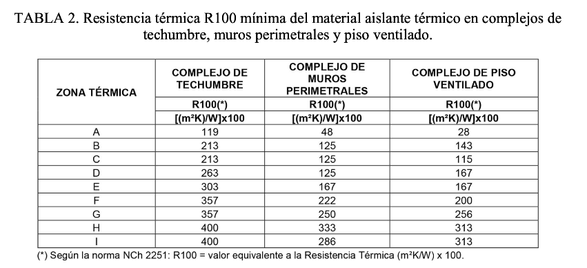

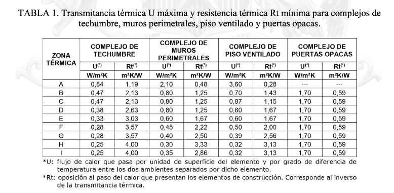

## Página 5

5
CAPITULO 3. 
MEMORIA DE TRANSMITANCIA TÉRMICA (U) Y RESISTENCIA TÉRMICA (Rt)
En el presente capítulo se detalla el cumplimiento de los estándares de aislación térmica para los elementos 
opacos de la envolvente del proyecto. La edificación se emplaza en la comuna de Puchuncavi, la cual, según la 
normativa vigente y la zonificación climática nacional, corresponde a la Zona Térmica C.
Las exigencias aplicadas corresponden a la actualización del Artículo 4.1.10 de la Ordenanza General de 
Urbanismo y Construcciones (OGUC), que establece límites máximos de transmitancia térmica y mínimos de 
resistencia para el material aislante (R100).
3.1 TABLA RESUMEN CUMPLIMIENTO ZONA C (Cálculos por elemento a continuación)
Herramienta de cálculo: Para todos los elementos constructivos se utiliza la información recopilada de la Planilla de 
Análisis Higrotérmico del MINVU versión v2026.06.23, conforme a la norma NCh853.
Elemento de la Envolvente
Indicador
Exigencia 
(Zona C)
Proyecto
Estado
Complejo de Techumbre
Transmitancia (U)
≤0,47 W/m²K
0,33 W/m²K
CUMPLE
Resistencia R100
≥213
238
CUMPLE
Muros Perimetrales
Transmitancia (U)
≤0,8 W/m²K
0,36 W/m²K
CUMPLE
Resistencia R100
≥ 125
214
CUMPLE
Piso Ventilado
Transmitancia (U)
≤0,87 W/m²K
0,46 W/m²K
CUMPLE
Resistencia R100
≥115
190
CUMPLE
Puertas Ext, Opacas
Transmitancia (U)
≤1,70 W/m²K
1,70 W/m²K
CUMPLE
Ventanas y Sup. Vidriadas
Transmitancia (U)
≤3,6 W/m²K
≈3,0 W/m²K
CUMPLE

## Página 6

6
3.2. Detalle de Complejos Constructivos
Conforme a la norma NCh853, para el cálculo de la resistencia térmica se consideran dos secciones de 
análisis: Sección A (corte por el aislante) y Sección B (corte por la estructura de madera). La transmitancia térmica 
se calcula para la sección más conservadora.
3.2.1. Muros Perimetrales (Estructura de Madera)
Conforme a la norma NCh853, para el cálculo de la resistencia térmica se consideran dos secciones de 
análisis: Sección A (corte por el aislante) y Sección B (corte por la estructura de madera). La transmitancia térmica 
se calcula para la sección más conservadora.
Composición (Exterior a Interior): Revestimiento exterior Pino 1×4", Membrana hidrófuga Fieltro M-1, Tablero 
OSB, Lana mineral 90 mm (entre montantes 2×4"), Tablero OSB, Barrera de vapor polietileno, Terminación interior 
Pino 1×4”

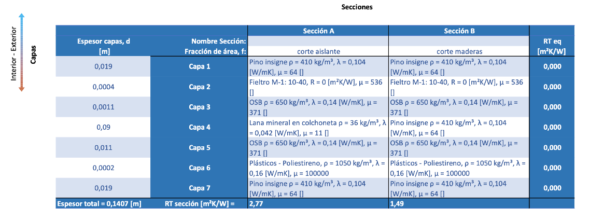

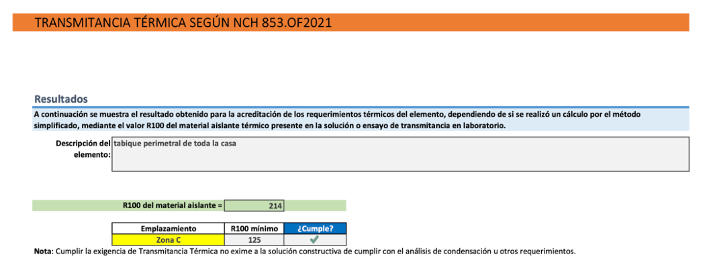

## Página 7

7
CUADRO DE CONDENSACIÓN MUROS PERIMETRALES
•
Barrera de Vapor: Es obligatorio instalar una lámina de alta resistencia al vapor (ej. polietileno 0,2 mm) por 
el lado "caliente" (cara interior) de la aislación. Esto impide que el vapor generado por la habitación sature 
el aislante en invierno.
•
Piel Ventilada: Adicional a esta solución, el muro cuenta con una cámara de aire tras el revestimiento 
exterior de pino, lo que favorece que cualquier infiltración de vapor residual que cruce el complejo pueda 
salir al exterior sin condensar en el OSB.
•
CONDENSACIÓN SEGÚN NCH1973.OF2014
Condiciones de análisis
Julio
Temp. exterior, ϴ_e
4,7 °C
HR exterior, ϕ_e
90%
Temp. interior, ϴ_i
19 °C
HR interior, ϕ_i
75%
HR crítica, ϕ_sicr
100%
ϕ_sicr por defecto
100%
Mobiliario
No
Resultados
Zona Térmica:
Alcance:
Condensación superficial
¿Cumple?
Condensación intersticial
¿Cumple?
Detalles de cálculo
Condensación superficial
0,410
Sección
Rt sección
¿Cumple?
A: 
2,766
B: 
1,488
Condensación intersticial
Cantidad de interfases con condensación
Sección
Jul
¿Cumple?
A: 
0
B: 
0
Gráficos
Sección de análisis para gráficos: A
Julio
²
Puchuncaví
La condición más estricta para el emplazamiento ocurre en el mes de Julio. La sección A es la de mayor resistencia 
térmica. La sección B es la de menor resistencia térmica.
Mes de análisis para gráficos:
A continuación se muestran los resultados obtenidos para el análisis de riesgo de condensación superficial e intersticial del elemento, de acuerdo con NCh1973.2014.
Descripción del 
elemento:
A continuación se muestran los resultados detallados obtenidos para el análisis de riesgo de condensación superficial e intersticial del elemento, de acuerdo con NCh1973.2014.
Rt mín requerido por sección =
Nota: Cumplir la exigencia de Condensación Superficial no exime a la solución constructiva de cumplir otros requerimientos como la Transmitancia Térmica o Condensación Intersticial.
Nota: Cumplir la exigencia de Condensación Intersticial no exime a la solución constructiva de cumplir otros requerimientos como la Transmitancia Térmica o Condensación Superficial.
Todas las secciones analizadas tienen una resistencia térmica total mayor o igual al mínimo requerido. La condición más estricta para el 
emplazamiento ocurre en el mes de Julio.
No se predice condensación en ninguna interfaz de ninguna sección.
tabique perimetral de toda la casa
Zona C
Presión de 
saturación
Presión de vapor de la 
Sección
Interfaz de 
condensación
Capa 1: Pino insigne 1x4
Capa 2: fieltro
Capa 3: tablero osb 11mm
Capa 4: lana de vidrio 80 mm
Capa 5: tablero osb 11mm
Capa 6: barrera de vapor
Capa 7: Pino insigne 1x4
0
500
1000
1500
2000
2500
3000
Espesor de capa de aire equivalente, Sd, [m]
Perfil de presión de vapor de agua
Sd Total = 28,1 [m]
E XTE RIOR
IN TE RIOR
Temperatura de 
la Sección
Capa 1: Pino insigne 1x4
Capa 2: fieltro
Capa 3: tablero osb 11mm
Capa 4: lana de vidrio 80 mm
Capa 5: tablero osb 11mm
Capa 6: barrera de vapor
Capa 7: Pino insigne 1x4
4,9
5,9
5,9
5,9
17,0
17,4
17,4
18,3
Espesor, d, [m]
Perfil de temperatura
E XT ERIOR
INTE RIOR
Temperatura de 
rocío

## Página 8

8
Análisis de Cumplimiento de Muros Perimetrales.
Transmitancia Térmica (U):  
La solución alcanza un valor de 0,36 W/m²K (Sección A), significativamente inferior al máximo de 0,60 W/m²K 
exigido por la OGUC para muros en la Zona C. 
Aislante R100: 
El material aislante (Lana mineral 90 mm) posee un valor R100 = 214, superando holgadamente el mínimo de 190 
requerido para Zona C. 
Consideración de Hermeticidad:  
Al ser una estructura de madera, se considera que el fieltro asfáltico exterior y la barrera de vapor interior tengan 
traslapes sellados para cumplir con el límite de 5,00 ach de infiltraciones.

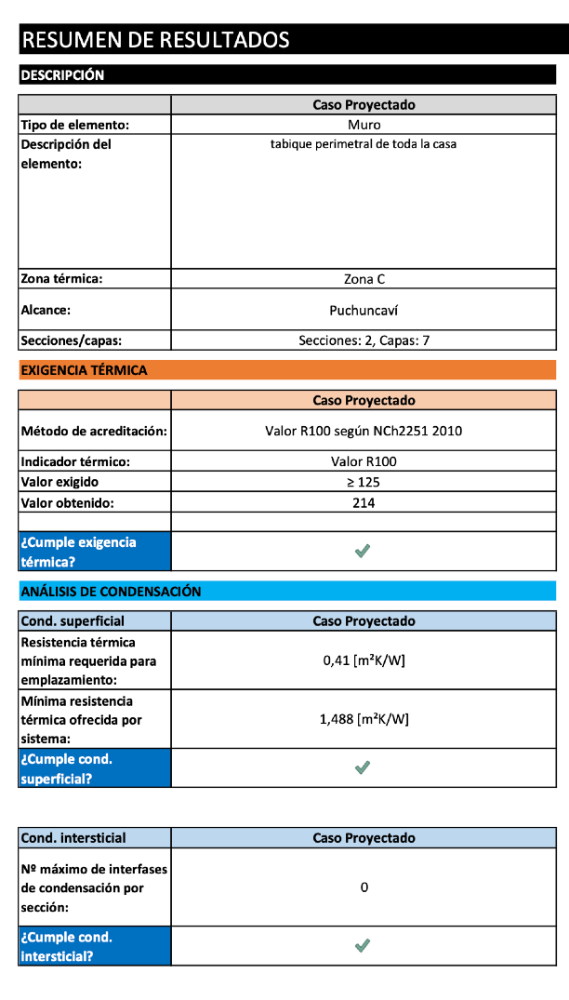

## Página 9

9
3.2.2. Complejo de Techumbre
La solución de techumbre consiste en una estructura de cerchas de madera que alberga la aislación térmica 
principal entre sus elementos, protegida superiormente por un tablero de terciado y una membrana asfáltica. 
Exigencia Normativa: Según la Tabla 1 de la OGUC para la Zona C, el complejo de techumbre debe tener una 
Transmitancia Térmica (U) máxima de 0,47 W/m²K o una Resistencia Térmica (Rt) mínima de 2,13 m²K/W.
TABLA: Memoria de Capas ( Interior a Exterior )

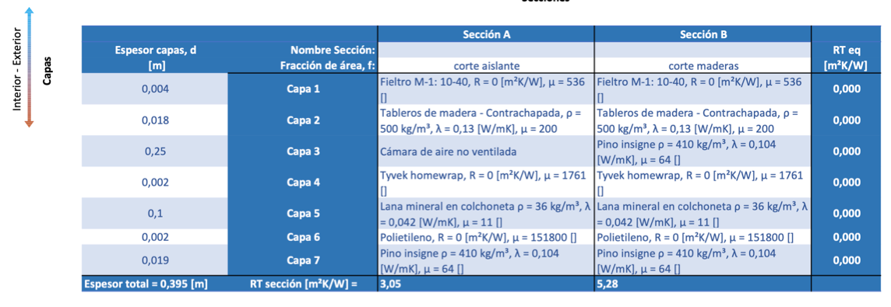

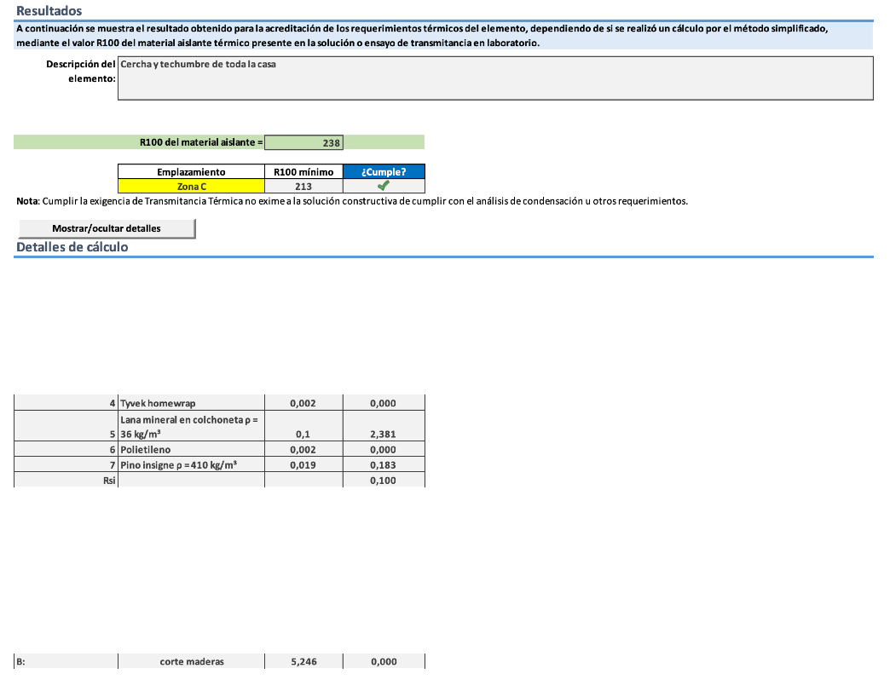

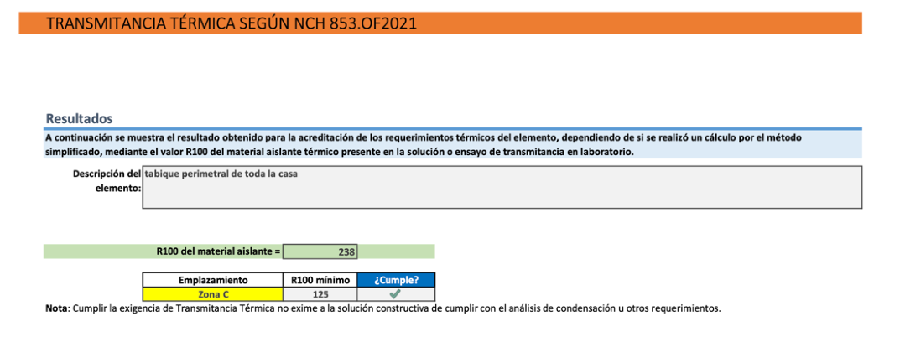

## Página 10

10
CUADRO DE CONDENSACIÓN TECHUMBRE
•
Barrera de Vapor: Es obligatorio instalar una lámina de alta resistencia al vapor (ej. polietileno 0,2 mm) por 
el lado "caliente" (cara interior) de la aislación. Esto impide que el vapor generado por la habitación sature 
el aislante en invierno.
CONDENSACIÓN SEGÚN NCH1973.OF2014
Condiciones de análisis
Julio
Temp. exterior, ϴ_e
4,7 °C
HR exterior, ϕ_e
90%
Temp. interior, ϴ_i
19 °C
HR interior, ϕ_i
75%
HR crítica, ϕ_sicr
60%
ϕ_sicr por defecto
100%
Mobiliario
Sí
Resultados
Zona Térmica:
Alcance:
Condensación superficial
¿Cumple?
Condensación intersticial
¿Cumple?
Detalles de cálculo
Condensación superficial
-0,985
Sección
Rt sección
¿Cumple?
A: 
3,052
B: 
5,276
Condensación intersticial
Cantidad de interfases con condensación
Sección
Jul
¿Cumple?
A: 
0
B: 
0
Gráficos
Sección de análisis para gráficos: A
Julio
Máxima cantidad de agua acumulada [kg/m²]
C
S
ió A
S
ió B
Puchuncaví
La condición más estricta para el emplazamiento ocurre en el mes de Julio. La sección B es la de mayor resistencia 
térmica. La sección A es la de menor resistencia térmica.
Mes de análisis para gráficos:
A continuación se muestran los resultados obtenidos para el análisis de riesgo de condensación superficial e intersticial del elemento, de acuerdo con NCh1973.2014.
Descripción del 
elemento:
A continuación se muestran los resultados detallados obtenidos para el análisis de riesgo de condensación superficial e intersticial del elemento, de acuerdo con NCh1973.2014.
Rt mín requerido por sección =
Nota: Cumplir la exigencia de Condensación Superficial no exime a la solución constructiva de cumplir otros requerimientos como la Transmitancia Térmica o Condensación Intersticial.
Nota: Cumplir la exigencia de Condensación Intersticial no exime a la solución constructiva de cumplir otros requerimientos como la Transmitancia Térmica o Condensación Superficial.
Todas las secciones analizadas tienen una resistencia térmica total mayor o igual al mínimo requerido. La condición más estricta para el 
emplazamiento ocurre en el mes de Julio.
No se predice condensación en ninguna interfaz de ninguna sección.
tabique perimetral de toda la casa
Zona C
Presión de 
saturación
Presión de vapor de la 
Sección
Interfaz de 
condensación
Capa 1: fieltro
Capa 2: terciado
Capa 3: camara de aire
Capa 4: tyvek
Capa 5: lana mineral
Capa 6: polietileno
Capa 7: Pino insigne
0
500
1000
1500
2000
2500
3000
Espesor de capa de aire equivalente, Sd, [m]
Perfil de presión de vapor de agua
Sd Total = 315,2 [m]
E XTE RIOR
IN TE RIOR
Temperatura de 
la Sección
Capa 1: fieltro
Capa 2: terciado
Capa 3: camara de aire
Capa 4: tyvek
Capa 5: lana mineral
Capa 6: polietileno
Capa 7: Pino insigne
4,9
4,9 5,5
6,4
6,4
17,5
17,5 18,4
Espesor, d, [m]
Perfil de temperatura
E XT ERIOR
INTE RIOR
Temperatura de 
rocío

## Página 11

11
Análisis de Cumplimiento de Complejo de Techumbre..
Exigencia Normativa:  
Según la Tabla 1 de la OGUC para Zona C, el complejo de techumbre debe tener U ≤ 0,45 W/m²K o R100 ≥ 213. 


Resultado del Proyecto: 
La solución propuesta alcanza un valor R100 de 238, cumpliendo con la normativa de 213.
Nota Técnica:  
La barrera de vapor de polietileno entre el pino 1×4" y la aislación protege la estructura de la cercha y el terciado de 
posibles condensaciones intersticiales, especialmente en climas litorales como el de Puchuncaví. 
Puentes Térmicos (Estructura de Cercha):  
La sección B (corte por estructura de cercha) arroja Rt = 5,276 m²K/W, confirmando el buen desempeño térmico 
incluso en los puentes de madera.

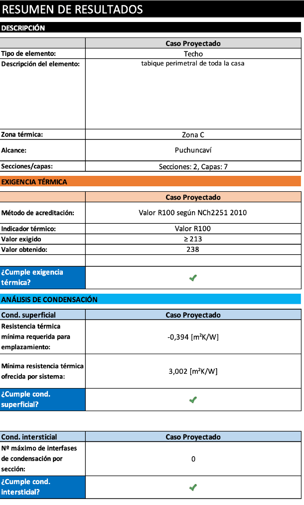

## Página 12

12
3.2.3. Piso Ventilado
La solución consiste en un sistema de piso ventilado sobre pilotes con aislación de lana mineral de 80 mm instalada 
en la cara inferior de la estructura. El sistema incluye barrera de vapor, placa de terciado estructural como base, 
sobrelosa de hormigón y terminación de porcelanato.

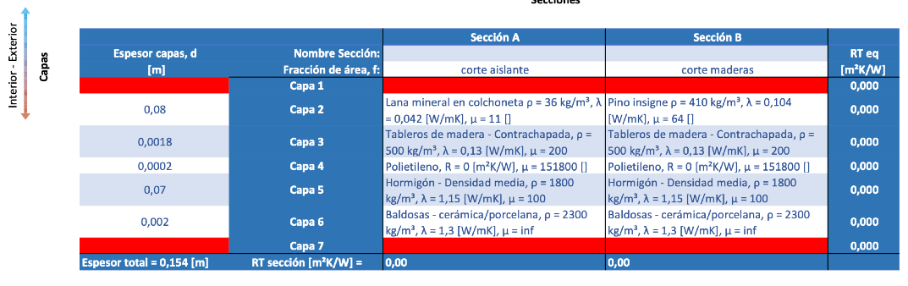

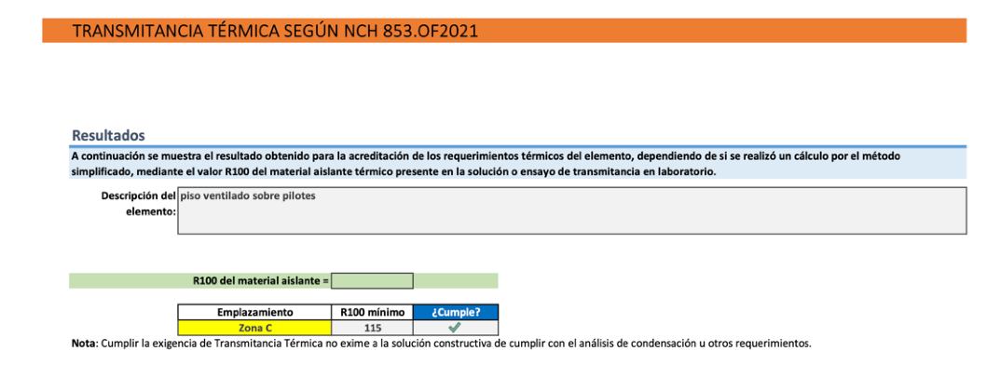

## Página 13

13
CUADRO DE CONDENSACIÓN PISO VENTILADO
Piso Ventilado sobre Pilotes La solución con sobrelosa de hormigón presenta un comportamiento favorable. La 
baja permeabilidad al vapor del porcelanato y el hormigón liviano actúan como un retardador de vapor natural 
desde el interior. Se debe asegurar el sello hermético en el encuentro entre el muro y el piso para evitar puentes 
térmicos en las esquinas.
Barrera de Vapor: Es obligatorio instalar una lámina de alta resistencia al vapor (ej. polietileno 0,2 mm) por el lado 
"caliente" (cara interior) de la aislación. Esto impide que el vapor generado por la habitación sature el aislante en 
invierno.
CONDENSACIÓN SEGÚN NCH1973.OF2014
Condiciones de análisis
Julio
Temp. exterior, ϴ_e
4,7 °C
HR exterior, ϕ_e
90%
Temp. interior, ϴ_i
19 °C
HR interior, ϕ_i
75%
HR crítica, ϕ_sicr
ϕ_sicr por defecto
100%
Mobiliario
Sí
Resultados
Zona Térmica:
Alcance:
Condensación superficial
¿Cumple?
Condensación intersticial
¿Cumple?
Detalles de cálculo
Condensación superficial
0,789
Sección
Rt sección
¿Cumple?
A: 
2,191
B: 
1,055
Condensación intersticial
Cantidad de interfases con condensación
Sección
Jul
¿Cumple?
A: 
0
B: 
0
Gráficos
Sección de análisis para gráficos: A
Julio
Puchuncaví
La condición más estricta para el emplazamiento ocurre en el mes de Julio. La sección A es la de mayor resistencia 
térmica. La sección B es la de menor resistencia térmica.
Mes de análisis para gráficos:
A continuación se muestran los resultados obtenidos para el análisis de riesgo de condensación superficial e intersticial del elemento, de acuerdo con NCh1973.2014.
Descripción del 
elemento:
A continuación se muestran los resultados detallados obtenidos para el análisis de riesgo de condensación superficial e intersticial del elemento, de acuerdo con NCh1973.2014.
Rt mín requerido por sección =
Nota: Cumplir la exigencia de Condensación Superficial no exime a la solución constructiva de cumplir otros requerimientos como la Transmitancia Térmica o Condensación Intersticial.
Nota: Cumplir la exigencia de Condensación Intersticial no exime a la solución constructiva de cumplir otros requerimientos como la Transmitancia Térmica o Condensación Superficial.
Todas las secciones analizadas tienen una resistencia térmica total mayor o igual al mínimo requerido. La condición más estricta para el 
emplazamiento ocurre en el mes de Julio.
No se predice condensación en ninguna interfaz de ninguna sección.
piso ventilado sobre pilotes
Zona C
Presión de 
saturación
Presión de vapor de la 
Sección
Interfaz de 
condensación
Capa 1: Capa 1
Capa 2: lana mineral
Capa 3: terciado
Capa 4: polietileno
Capa 5: loseta hormigon
Capa 6: porcelanato
Capa 7: Capa 7
0
500
1000
1500
2000
2500
3000
Espesor de capa de aire equivalente, Sd, [m]
Perfil de presión de vapor de agua
Sd Total = 2038,6 [m]
E XTE RIOR
IN TE RIOR
Temperatura de 
la Sección
Capa 1: Capa 1
Capa 2: lana mineral
Capa 3: terciado
Capa 4: polietileno
Capa 5: loseta hormigon
Capa 6: porcelanato
Capa 7: Capa 7
5,0
5,0
17,4
17,5
17,5
17,9
17,9
17,9
Espesor, d, [m]
Perfil de temperatura
E XT ERIOR
INTE RIOR
Temperatura de 
rocío

## Página 14

14
Análisis de Cumplimiento de Piso Ventilado.
Exigencia Normativa:  
Para la Zona C, el complejo de piso ventilado debe cumplir con una Transmitancia Térmica (U) máxima de 0,87 W/
m²K o una Resistencia Térmica (Rt) mínima de 1,15 m²K/W. 
Resultado del Proyecto:  
La solución alcanza un Rt de 1,70 m²K/W (equivalente a un U de 0,59), superando con holgura los requerimientos 
mínimos de la actualización del Art. 4.1.10 de la OGUC. 
Acreditación mediante R100:  
El aislante de EPS de 50 mm aporta por sí solo un R100 de 130 (1,30×100), lo cual es superior al mínimo de 115 
exigido para materiales aislantes en pisos ventilados de la Zona C. 
Consideración Técnica:  
La losa de hormigón liviano y el porcelanato no solo aportan a la aislación, sino que dotan a la vivienda de inercia 
térmica, ayudando a estabilizar la temperatura interior frente a las oscilaciones térmicas diarias. 
RESUMEN DE RESULTADOS
DESCRIPCIÓN
Caso Proyectado
Ca
Tipo de elemento:
Piso ventilado
Descripción del 
elemento:
piso ventilado sobre pilotes
Zona térmica:
Zona C
Alcance:
Puchuncaví
Secciones/capas:
Secciones: 2, Capas: 7
EXIGENCIA TÉRMICA
Caso Proyectado
Ca
Método de acreditación:
Valor R100 según NCh2251 2010
Indicador térmico:
Valor R100
Valor exigido
≥ 115
Valor obtenido:
190
Error relativo máximo:
¿Cumple exigencia 
térmica?
ANÁLISIS DE CONDENSACIÓN
Cond. superficial
Caso Proyectado
Ca
Resistencia térmica 
mínima requerida para 
emplazamiento:
0,789 [m²K/W]
Mínima resistencia 
térmica ofrecida por 
sistema:
1,055 [m²K/W]
¿Cumple cond. 
superficial?
Cond. intersticial
Caso Proyectado
Ca
Nº máximo de interfases 
de condensación por 
sección:
0
¿Cumple cond. 
intersticial?

## Página 15

15
3.2.4. Puertas Exteriores Opacas.
Las puertas que comunican recintos acondicionados con el exterior han sido especificadas para cumplir con los 
nuevos estándares de la OGUC.
•
Especificación: Puerta de madera sólida de espesor igual o superior a 45 mm.
•
Desempeño Térmico: Esta materialidad garantiza una transmitancia térmica U=1,70W/m2K, cumpliendo 
con el límite exacto para la Zona D. Adicionalmente, el marco incorpora sellos de caucho elástico para 
garantizar la permeabilidad al aire.
3. Memoria de Transmitancia Térmica (U) - Puertas de Acceso
Para la comuna de Vitacura (Zona D), la normativa exige que las puertas que comuniquen recintos acondicionados con el 
exterior cumplan con los siguientes valores:
Transmitancia Térmica (U) Máxima: 1,70W/m2K.
Resistencia Térmica Total (Rt) Mínima: 0,59m2K/W.
Análisis de tu Solución:
De acuerdo a los documentos técnicos, una puerta de madera maciza requiere un espesor específico para alcanzar por 
sí sola el cumplimiento normativo en la Zona D:
Espesor Requerido: Se establece que una puerta de madera sólida de 4,5 cm de espesor alcanza una 
resistencia térmica de 0,59m2K/W, lo que equivale exactamente al límite de U=1,70.
Estado: Las puertas de acceso (Entrada Principal, Cocina y Segundo piso) al tener 45 mm de espesor, se 
considera que CUMPLE con el estándar exigido para la Zona D.
Hermeticidad e Infiltraciones de Aire (Marco y Sellos)
Se considera una "membrana aislante y barrera de infiltración" en los laterales y la parte superior del marco. 
Esto es fundamental para cumplir con la exigencia de Permeabilidad al Aire.
Exigencia de Permeabilidad (Zona D): Las puertas opacas deben acreditar una Clase 2 de permeabilidad al 
aire (medido a 100 Pa).
Estrategia de Sellado: El uso de membranas y sellos en el marco se alinea con las recomendaciones para 
evitar puentes térmicos por convección.
Para asegurar el cumplimiento de la Clase 2, estos sellos deben ser burletes de materiales elásticos (EPDM) 
instalados de forma continua en el rebaje del marco. Además, el encuentro entre el marco de madera y el 
vano del muro debe sellarse con espuma de poliuretano de baja expansión para eliminar infiltraciones.
Resumen de Cumplimiento para el Informe
Elemento
Indicador
Exigencia (Zona D)
Proyecto
Estado
Puerta de Acceso
Transmitancia (U)
≤1,70W/m2K
Puerta madera sólida 
≥45mm
CUMPLE
Puerta de Acceso
Permeabilidad al aire
Clase 2 mín.
Marco con sellos y 
membranas
CUMPLE
Acreditación: Se acredita este valor mediante una memoria de cálculo según NCh3137 y adoptando la ficha del Listado 
Oficial del MINVU (3.1.P.M.0.05 para puertas de madera).

## Página 16

De =

LISTADO OFICIAL DE SOLUCIONES CONSTRUCTIVAS PARA ACONDICIONAMIENTO TÉRMICO E14

Puerta madera abatible, 1 hoja, 0,91x2 m

3.1.P.M.0.05
Línea: - Institución: DITEC Vigencia: NCh3137/1 - NCh3297
ACREDITACIÓN

COMPORTAMIENTO MECANISMO RESPONSABLE

TÉRMICO Memoria de Cálculo NCh3137/1 y NCh3137/2 CITEC - UBB

PERMEABILIDAD AL AIRE Ensayo NCh3297 CITEC - UBB

DESEMPEÑO
3 2

TRANSMITANCIA PERMEABILIDAD 3,98  [m”/hm?] CLASE DE

TÉRMICA, U 1 7 ALAIREA-100 Pa PERMEABILIDAD 3

[W/m*Kk] , 1,25  [m*/hm]  ALAIRE

CARACTERÍSTICAS TÉCNICAS

GENERALES

Tipo abertura: Abatible Tipo de acristalamiento: n/a Materialidad del marco: Madera
Configuración: 1 hoja Color: n/a

Mecanismo de cierre: Cerradura embutida con cilindro en ambos lados y cerrojo de dos pistones con dos vueltas.
Mecanismo de cierre y apertura tipo palanca, ubicado a una altura de 0,95 m del NPT.

MEDIDAS GENERALES DETALLE SECCIÓN ACRISTALADA

Ancho: 910 [mm] Superficie: 1,82 [m”] Superficie: n/a [m?]

Alto: 2000 [mm] Longitud dejunta: 5,7  [m] Cristal 1: n/a n/a n/a [mm]
* PARA VARIACIONES DE HASTA +10% EN LA SUPERFICIE TOTALDE — ESpaciador1: n/a n/a [mm]
LA PUERTA, SE MANTIENE LA CLASE DE PERMEABILIDAD AL AIRE :

INDICADA Cristal 2: n/a n/a n/a [mm]
DETALLE MARCO Espaciador 2: n/a n/a [mm]
Rotura puente térmico: n/a Factor de marco: n/a Cristal 3: n/a n/a n/a [mm]
Refuerzo: n/a Gas de cavidad(es) interior(es): n/a

Factor solar composición acristalada: n/a
OTRAS CARACTERÍSTICAS

Hoja opaca: Madera de pino encolada de 45 mm de espesor; Despiches: n/a; Brazo: n/a; burletes: Burlete de caucho
perfil “tipo P” en todo el perímetro del encuentro hoja-marco, y doble rollo de espuma aislante tipo funda entre
peinazo y NPT.; Bisagra: Tres bisagras de 34” x 3/4”

IMAGEN / CORTE / DETALLE

210
870 Y

C

t4 5

Medida de paso libre
815

y Corte y-y' Corte x-x

16

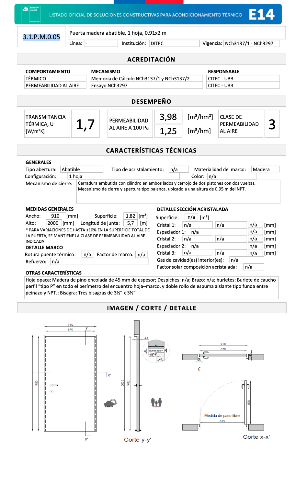

## Página 17

17
CAPITULO 4. 
MEMORIA DE CÁLCULO DE RIESGO DE CONDENSACIÓN
4.1. Objetivo y Parámetros de Cálculo
El presente capítulo tiene por objetivo verificar que las soluciones constructivas proyectadas para la 
envolvente térmica (techumbre, muros perimetrales y piso ventilado) no presenten riesgos de patologías asociadas 
a la humedad. De acuerdo con la normativa vigente, se realiza un análisis conforme a la norma NCh1973, utilizando 
la Planilla de Análisis Higrotérmico del MINVU v2026.06.23.
4.1.1. Condiciones Climáticas de Diseño
Para el emplazamiento en la comuna de Puchuncaví (Zona C), se utiliza el mes más desfavorable para el 
análisis de riesgo, correspondiente a Julio. Los datos de temperatura y humedad relativa exterior se determinan 
según el  listado oficial de la Res. Ex. 1802:
- Temperatura exterior (Te): 4,7 °C
- Humedad Relativa exterior (HRe): 90%
4.1.2. Condiciones Ambientales Interiores
Acorde a la Res. Ex.1802, los cálculos se basan en los siguientes parámetros interiores de diseño:
- Temperatura Interior (Ti): 19 °C
- Humedad Relativa Interior (HRi): 75%
- Humedad Relativa Crítica Superficial (φsicr): 1,0 (100% para evitar condensación líquida)
4.2. Metodología de Análisis
El riesgo se evalúa en dos dimensiones críticas bajo el procedimiento de la norma NCh1973:
Condensación Superficial: Se verifica que la temperatura de la cara interna de los paramentos se mantenga 
por sobre la temperatura de rocío para evitar la formación de moho y hongos.
Condensación Intersticial: Se analiza el comportamiento de la presión de vapor a través de las capas del 
complejo para asegurar que no exista acumulación de agua líquida dentro de los materiales.
4.3. Verificación por Elemento Constructivo
Acorde al capitulo anterior, los tres complejos constructivos fueron analizados mediante la Planilla de Análisis 
Higrotérmico del MINVU v2026.06.23, conforme a NCh1973. A continuación se presentan los resultados:
4.4. Conclusión del Análisis de Condensación
Tras la evaluación higrotérmica de los complejos propuestos, se concluye que el proyecto CUMPLE con las 
exigencias normativas. La correcta disposición de las barreras de vapor interiores y el fieltro exterior garantiza una 
envolvente saludable, protegiendo la estructura de madera de pudrición y deformaciones por humedad intersticial 
acumulada
Elemento
Tipo de 
Condensación
Rt mín. exigido (m²K/
W)
Rt proyectado (m²K/
W)
Estado
Muros Perimetrales
Superficial
0,41
RT_B = 1,49
CUMPLE
Intersticial
0 interfases de cond.
0 interfases (Julio)
CUMPLE
Complejo de 
Techumbre
Superficial
Siempre cumple 
RT = 5,28
CUMPLE
Intersticial
0 interfases de cond.
0 interfases (Julio)
CUMPLE
Piso Ventilado
Superficial
0,79
RT_B = 1,06
CUMPLE
Intersticial
0 interfases de cond.
0 interfases (Julio)
CUMPLE

## Página 18

18
CAPITULO 5.- 
MEMORIA TÉCNICA DEL COMPLEJO DE VENTANAS Y SUPERFICIES VIDRIADAS
 
De acuerdo con la normativa vigente, se ha determinado la superficie máxima de ventanas permitida para 
la vivienda en función de su orientación geográfica y el valor de Transmitancia Térmica (U) del conjunto ventana 
(vidrio + marco). El objetivo es equilibrar las ganancias solares pasivas con la resistencia térmica de la envolvente 
para optimizar la demanda de energía.
5.1. Especificación Técnica de los Componentes
Para garantizar el confort higrotérmico y la eficiencia energética de la vivienda, se han especificado componentes 
con certificación de laboratorio según los siguientes parámetros:
•
Cristales: Doble Vidriado Hermético (DVH) estándar, compuesto por dos hojas de cristal con cámara de 
aire estanca, asegurando un control térmico superior al vidrio monolítico convencional.
•
Marcos: Perfiles de PVC, diseñados para interrumpir la conducción de calor a través del metal del marco.
•
Transmitancia Térmica Total (Uw ): De acuerdo con las memorias de cálculo individuales según 
NCh3137, el conjunto marco-vidrio de las tipologías proyectadas arroja valores de transmitancia térmica 
situados en Uw ≥ 2,8 W/m2K.
A) Exigencias de Superficie Vidriada para Zona C
El porcentaje máximo de ventanas permitido respecto a la superficie de los muros de cada fachada se rige por la 
siguiente tabla.
CUADRO RESUMEN DE % DE VENTANAS POR MURO 
TRANSMITANCIA TÉRMICA "U" de la ventana ≤ 3,6 W/m²K
Utilizando los datos de la planilla de vanos del proyecto y comparándolos con los límites máximos permitidos en la 
Zona C para un valor U≤ 3,6
5.4. Análisis de Cumplimiento
Optimización por Fachada: El diseño arquitectónico se mantiene significativamente por debajo de los límites 
máximos en todas sus orientaciones.
Acreditación: Para la recepción final, se deberán presentar las fichas del Listado Oficial del MINVU de las 
ventanas o certificados de ensayo que validen el valor U y la Clase de Permeabilidad declarada
CUADRO RESUMEN DE % DE VENTANAS POR MURO
TRANSMITANCIA TÉRMICA “U” de la ventana  ≤ 3,6
FACHADA
SUPERFICIE DE 
MURO
SUPERFICIE DE 
VENTANAS
PORCENTAJE DE 
VENTANAS
PERMITIDO 
ZONA C.
CUMPLIMIENTO
NORTE
67,3 m2
9,82
14,6 %
83,0 %
CUMPLE
SUR 
64,1 m2
10,93
17,1 %
49,0 %
CUMPLE
ORIENTE
69,2 m2
11,25
16,3 %
62,0 %
CUMPLE
PONIENTE
68,96 m2
25,41
36,9 %
62,0 %
CUMPLE
TOTAL
269,56 m2
57,41
21,3 %

## Página 19

19
5.4.- VENTANAS POR FACHADA Y ACREDITACIÓN DE SUPERFICIE DE MUROS
V13
82x212
V14
92x137
V15
82x157
V17
142x157
V3
142x52
80x52
V15
82x157
V16
172x157
V18
82x206
V4B
V19
112x32
V1B
152x236
V2
196x92
V3
142x52
V4A
RASGO
88x60
V5
RASGO
180x190
V6
RASGO
220x210
V7
202x202
V9
RASGO
500x240
V10
252x236
V11
272x42
V12
RASGO
500x65
VF
Marco embutido
Sin marco PVC
Solo junquillo madera y
vidrio termopanel
Ventana Cocina
Ventana PVC marco delgado
Abatiente
Con centro de madera 2x8"
Lucarna Living
Solo Termopanel y junquillo
Con centro de madera 2x8"
y verticales 2x82
Lateral Living Fijo.
Marco PVC
Con centro de madera 2x8"
Frente a Jardin Living Fijo + corredera + fijo
Con centro de madera 2x8"
Los fijos llevan solo Termopanel y junquillo
La corredera marco PVC. marco inferior embutido.
Lateral Living a ampliación comedor.
Centro 2x8 Pino
Ventana marco PVC.
Pasillo dormitorios Fijo.
Marco PVC
Fija
Con centro de madera 2x8"
Hall de acceso Fijo.
Marco PVC
Fija
Con centro de madera 2x8"
Baño
Marco PVC
Proyectante
Con centro de madera 2x8"
Pasillo proyectante
Marco PVC
Proyectante
Con centro de madera 2x8"
SON 2
V13
82x212
Ventana Escalera
MARCO PVC
Con centro de madera 2x8"
V14
92x137
Ventana arriba escalera
Proyectante marco pvc
Con centro de madera 2x8"
V15
82x157
Dormitorio Ppal
Proyectante marco pvc
Con centro de madera 2x8"
V17
152x157
Dormitorio Ppal
Fijo marco pvc
Con centro de madera 2x8"
220
90
145
100
165
90
165
160
65
500
280
50
210
210
500
4
85
10
10
85
0
260
240
Marco embutido
220
210
190
180
60
88
60
150
142
52
152
236
240
160
100
200
92
196
80
52
236
252
302
236
272
42
82
157
137
92
V1A
RASGO
160x240
Dormitorio 2
Marco PVC.
ventanal corredera doble Con centro
de madera 2x8"
Manilla
95
152
240
160
95
SON 2
180
10
50
50
10
30
V16
RASGO
180x165
Pasillo dormitorios Fijo.
Marco PVC
Con centro de madera 2x8"
165
75
10
Fijo
180
Empavonado
VF
30
VF
100
RASGO
280x50
40
V18
RASGO
205x90
Puerta Ventana a Terraza arriba
Ventana PVC
Con centro de madera 2x8"
en laterales y superior. No inferior
75
95
152x236
Centro de madera 4 cm (*
en todas las ventanas)
Centro de madera 4 cm (*
en todas las ventanas)
Centro de madera 4 cm
Centro de madera 4 cm
RASGO
160x240
RASGO
200x100
RASGO
150x60
80x52
172x182
172
182
212
202
212x202
202
202
RASGO
210x210
492x236
RASGO
260x240
492x57
57
492
RASGO
90x220
212
82
RASGO
100x145
90x165
172x157
157
172
75
RASGO
160x195
157
152
112
32
40
120
200x82
Dormitorio 3
Marco PVC.
Ventanal Corredera doble
Con centro de madera 2x8"
Baño
Marco PVC
Proyectante
Con centro de madera 2x8"
492
200
V19
RASGO
120x40
Ventana Walking Closet
VENTANA PROYECTANTE
Ventana PVC
Con centro de madera 2x8"
112x32
210
90
30
82
206
NPT Terraza
240
236
Manilla
95
Fijo
V4B
RASGO
88x118
88
80
110
122
Empavonado
80x110
Baño
Marco PVC
Proyectante
Con centro de madera 2x8"
118
POR CONFIRMAR
ALTURA DE DINTEL
EN TERRENO
VENTANAS
L07
16 / 10 / 2025
OBRA NUEVA
PROYECTO CASA 24A
POLO MAITENCILLO
CONTENIDO       :
N
DIRECCIÓN: CONDOMINIO
 POLO MAITENCILLO
 SITIO 24A
COMUNA:  PUCHUNCAVÍ
ROL:
 600-91
Felipe Langlois Consiglio
Rut 16.209.765-2
PROPIETARIO  :
Viviana Andrea Henriquez P.
Rut: 13.954.026-3
viviana@sweetsweat.cl
+56 9 53719659
Matías Sánchez Diez
Rut: 9.400010-6
msanchez@etruria.cl
+56 9 7139 8158
felipe@LCarquitectos.cl
+56 9 94345502
ARQUITECTO :   
NOTA: Todas las ventanas deben ser
rectificadas en obra para fabricación

## Página 20

20
A) - DETALLE DE VENTANAS GENERALES:
B) DETALLE DE MUROS Y VENTANAS POR FACHADA
Nota: El proyecto no considera ventana V8
V13
82x212
V14
92x137
V15
82x157
V17
142x157
V3
142x52
80x52
V15
82x157
V16
172x157
V18
82x206
V4B
V19
112x32
PLANO S. 1
PLANO S. 2
PLANO S. 4
PLANO S. 5
PLANO S. 6
PLANO S. 7
PLANO N. 2
PLANO N. 2
PLANO N. 3
PLANO N. 1
PLANO N. 2
PLANO N.4
PLANO O. 2
PLANO O. 2
PLANO O. 4
PLANO O. 6
PLANO N. 1
PLANO O. 5
PLANO P. 1
PLANO P. 2
PLANO P. 3
PLANO P. 4
PLANO P. 5
PLANO P. 6
NIVEL 1
PLANO S. 2
V1A
152x236
V1B
152x236
V2
92x196
V3
142x52
V4B
80x110
V5
172x182
V6
212x202
V7
202x202
V9
492x236
V10
252x236
V11
272x42
V12
492x57
P1
P2B
80x210
PLANO S. 5
PLANO S. 2
PLANO S. 6
PLANO S. 3
PLANO S. 7
PLANO N. 1
PLANO N. 2
PLANO N. 3
PLANO N.4
PLANO O. 1
PLANO O. 3
PLANO O. 4
PLANO O. 5
PLANO O. 6
PLANO O. 2
PLANO P. 1
PLANO P. 2
PLANO P. 3
PLANO P. 4
PLANO P. 5
PLANO P. 6
NIVEL 2
PLANO S. 1
N

## Página 21

21
C.- PLANO DE DESGLOCE DE VENTANAS POR FACHADA
C1.- FACHADA NORTE:
V10
82
157
82
157
V15
V15
80
110
V4B
80
52
V4A
PLANO N.4
PLANO N. 3
PLANO N. 2
PLANO N. 1
236
252

## Página 22

22
C2.- FACHADA SUR:
PLANO S. 1
PLANO S. 2
PLANO S. 3
PLANO S. 4
PLANO S. 5
PLANO S. 6
PLANO S. 7
212
82
V13
137
92
V14
82
206
V18
112
32
V19
VF
202
202
V7
101
143
V2

## Página 23

23
C3.- FACHADA ORIENTE:
PLANO O. 1
PLANO O. 2
PLANO O. 4
PLANO O. 5
PLANO O. 3
PLANO O.6
152
236
V1A
152
236
V1B
VF
212
202
V16
302
236
492
V9
157
152
Fijo
V17

## Página 24

24
C4.- FACHADA PONEINTE:
PLANO P. 4
PLANO P. 3
PLANO P. 2
PLANO P. 5
PLANO P. 1
PLANO P. 6
142
52
142
52
VF
172
182
V3
V3
V5
Fijo
157
172
V16
Altura Eje
Chapa 95 cm
Puerta madera
57
492
272
42
V11

## Página 25

25
C5.- TABLA DE DETALLE DE SUPERFICIE DE MUROS POR PLANOS DE FACHADAS ACORDE A 
ORIENTACIÓN :
PLANO
SUPERFICIE
SUP. TOTAL (m2)
NORTE
N1
25,8 m2
67,3 m2
N2
22,3 m2
N3
15,5 m2
N4
3,7 m2
SUR
S1
14,6 m2
64,1 m2
S2
24,5 m2
S3
6,3 m2
S4
1,2 m2
S5
3,7 m2
S6
3,4 m2
S7
10,4 m2
ORIENTE
O1
10,1 m2
69,2 m2
O2
18,8 m2
O3
10,1 m2
O4
7,1 m2
O5
20 m2
O6
3,1 m2
PONIENTE
P1
17,2 m2
68,96 m2
P2
7,1 m2
P3
11,5 m2
P4
19,76 m2
P5
7,4 m2
P6
6 m2

## Página 26

26
5.2. Cuadro de Vanos y Verificación de Superficies
Se ha calculado el porcentaje de superficie vidriada respecto a los paramentos verticales (muros) por cada 
orientación geográfica.
ORIENTACIÓN
Ventanas
ANCHO 
(cm)
ALTO 
(cm)
SUPERFICIE 
(m2)
TIPO 
Poniente
V1A
152
236
3,59
Corredera
Poniente
V1B
152
236
3,59
Corredera
Sur
V2
92
196
1,80
Abatible
Oriente
V3
142
52
0,74
Proyectante
Oriente
V3
142
52
0,74
Proyectante
Norte
V4A
80
52
0,42
Proyectante
Norte
V4B
80
110
0,88
Proyectante
Oriente
V5
172
182
3,13
Fija
Poniente
V6
212
202
4,28
Fija
Sur
V7
202
202
4,08
fija
Poniente
V9a
320
236
7,55
Corredera
Poniente
V9B
85
236
2,01
Abatible
Poniente
V9B
85
236
2,01
Abatible
Norte
V10
252
236
5,95
corredera
Oriente
V11
272
42
1,14
abatiente
Oriente
V12
492
57
2,80
fija
Sur
V13
82
212
1,74
Fija
Sur
V14
92
137
1,26
Proyectante
Norte
V15
82
157
1,29
Proyectante
Norte
V15
82
157
1,29
Abatible
Oriente
V16
172
157
2,70
Fija
Poniente
V17
152
157
2,39
Fija
Sur
V18
82
206
1,69
Abatible
Sur
V19
112
32
0,36
Proyectante
VENTANAS 
NORTE
9,82
VENTANAS SUR
10,93
VENTANAS O/P
36,66
TOTAL MUROS NORTE
67,3
TOTAL MUROS SUR
64,1
TOTAL MUROS O/P
138,1

## Página 27

27
5.4. Métodos de Acreditación
El cumplimiento respalda con Memorias de cálculo individuales por tipología de ventana según NCh3137

Ventana V1 - V1B
mm
mm
m²
Proporción marco vidrio:
Alternativa 1:
Alternativa 2:
Alternativa 3:
m²
mm
Área marco, Af:
m²
Área vidrio, Ag:
m²
Valor usuario
Configuración:
m
Tipo abertura:
Tipo de marco:
Tipo de vidriado:
mm
mm
mm
Interior, Af/Af,di:
mm
Exterior, Af/Af,de:
mm
mm
Valor usuario
W/m²K
W/mK
m
Condiciones de cálculo:
Nombre y firma Profesional:
Razón entre área de marco y área 
desarrollada de marco :
0,72
Área vidrio, Ag:
Factor de marco:
Altura de marco:
Por defecto
común incoloro
50%
2 hojas móviles laterales
común incoloro
Vidrio 3
Espaciador 2
9,6
Gas:
Tipo
Vidrio 1
Largo de junta operable:
4
10
4
Espaciador
Vidrio 2
Proporción hoja móvil:
3,59
Área total ventana, Aw:
Ψg =
normal
5%
Marco
Vidriado
Espaciador
Transmitancias térmicas:
Fecha:
Corredera
Marco:
2,2
Ug =
- Transmitancia térmica del marco, Uf obtenido de Anexo D (Informativo).
- Resistencia térmica de la cámara de aire, Rs, para el cálculo de transmitancia térmica del vidriado,Ug, 
obtenido de Anexo C (Informativo).
- Transmitancia térmica lineal de la junta marco-vidrio, Ψg, obtenido de Anexo E (Normativo).
15%
80%
Cálculo térmico para ventanas según NCh 3137-1
5
1520
2360
Ancho total:
Alto total:
Características generales:
0,8
DVH
2,87
Especificaciones marco y vidrio:
Espesor
Elemento
Aire
PVC
0,06
Resultado:
9,19
Aporte:
Transmitancia térmica 
total de la ventana, Uw
3,0
Efecto marco-espaciador-vidriado:
Uf =
3,0
2,2
Vidriado:
0,06
Perímetro junta espaciador-marco-vidrio, lg:
Por defecto
Transmitancia térmica lineal marco-espaciador-vidrio, Ψg:
Transmitancia térmica marco, Uf:
!
"!#
!
"#
!
"!#
!
"!#

## Página 28

28
Ventana V2
mm
mm
m²
Proporción marco vidrio:
Alternativa 1:
Alternativa 2:
Alternativa 3:
m²
mm
Área marco, Af:
m²
Área vidrio, Ag:
m²
Valor usuario
Configuración:
m
Tipo abertura:
Tipo de marco:
Tipo de vidriado:
mm
mm
mm
Interior, Af/Af,di:
mm
Exterior, Af/Af,de:
mm
mm
Valor usuario
W/m²K
W/mK
m
Condiciones de cálculo:
Nombre y firma Profesional:
Razón entre área de marco y área 
desarrollada de marco :
0,36
Área vidrio, Ag:
Factor de marco:
Altura de marco:
Por defecto
común incoloro
50%
1 hoja
común incoloro
Vidrio 3
Espaciador 2
5,5
Gas:
Tipo
Vidrio 1
Largo de junta operable:
4
10
4
Espaciador
Vidrio 2
Proporción hoja móvil:
1,8
Área total ventana, Aw:
Ψg =
normal
6%
Marco
Vidriado
Espaciador
Transmitancias térmicas:
Fecha:
Abatible
Marco:
2,2
Ug =
- Transmitancia térmica del marco, Uf obtenido de Anexo D (Informativo).
- Resistencia térmica de la cámara de aire, Rs, para el cálculo de transmitancia térmica del vidriado,Ug, 
obtenido de Anexo C (Informativo).
- Transmitancia térmica lineal de la junta marco-vidrio, Ψg, obtenido de Anexo E (Normativo).
15%
80%
Cálculo térmico para ventanas según NCh 3137-1
5
920
1960
Ancho total:
Alto total:
Características generales:
0,8
DVH
1,44
Especificaciones marco y vidrio:
Espesor
Elemento
Aire
PVC
0,06
Resultado:
5,24
Aporte:
Transmitancia térmica 
total de la ventana, Uw
3,0
Efecto marco-espaciador-vidriado:
Uf =
3,0
2,2
Vidriado:
0,06
Perímetro junta espaciador-marco-vidrio, lg:
Por defecto
Transmitancia térmica lineal marco-espaciador-vidrio, Ψg:
Transmitancia térmica marco, Uf:
!
"!#
!
"#
!
"!#
!
"!#

## Página 29

29
Ventana V3
mm
mm
m²
Proporción marco vidrio:
Alternativa 1:
Alternativa 2:
Alternativa 3:
m²
mm
Área marco, Af:
m²
Área vidrio, Ag:
m²
Valor usuario
Configuración:
m
Tipo abertura:
Tipo de marco:
Tipo de vidriado:
mm
mm
mm
Interior, Af/Af,di:
mm
Exterior, Af/Af,de:
mm
mm
Valor usuario
W/m²K
W/mK
m
Condiciones de cálculo:
Nombre y firma Profesional:
Razón entre área de marco y área 
desarrollada de marco :
0,15
Área vidrio, Ag:
Factor de marco:
Altura de marco:
Por defecto
común incoloro
50%
1 hoja
común incoloro
Vidrio 3
Espaciador 2
3,7
Gas:
Tipo
Vidrio 1
Largo de junta operable:
4
10
4
Espaciador
Vidrio 2
Proporción hoja móvil:
0,74
Área total ventana, Aw:
Ψg =
normal
9%
Marco
Vidriado
Espaciador
Transmitancias térmicas:
Fecha:
Proyectante
Marco:
2,2
Ug =
- Transmitancia térmica del marco, Uf obtenido de Anexo D (Informativo).
- Resistencia térmica de la cámara de aire, Rs, para el cálculo de transmitancia térmica del vidriado,Ug, 
obtenido de Anexo C (Informativo).
- Transmitancia térmica lineal de la junta marco-vidrio, Ψg, obtenido de Anexo E (Normativo).
14%
77%
Cálculo térmico para ventanas según NCh 3137-1
5
1420
520
Ancho total:
Alto total:
Características generales:
0,8
DVH
0,59
Especificaciones marco y vidrio:
Espesor
Elemento
Aire
PVC
0,06
Resultado:
3,56
Aporte:
Transmitancia térmica 
total de la ventana, Uw
3,1
Efecto marco-espaciador-vidriado:
Uf =
3,0
2,2
Vidriado:
0,06
Perímetro junta espaciador-marco-vidrio, lg:
Por defecto
Transmitancia térmica lineal marco-espaciador-vidrio, Ψg:
Transmitancia térmica marco, Uf:
!
"!#
!
"#
!
"!#
!
"!#

## Página 30

30
Ventana V4 A
mm
mm
m²
Proporción marco vidrio:
Alternativa 1:
Alternativa 2:
Alternativa 3:
m²
mm
Área marco, Af:
m²
Área vidrio, Ag:
m²
Valor usuario
Configuración:
m
Tipo abertura:
Tipo de marco:
Tipo de vidriado:
mm
mm
mm
Interior, Af/Af,di:
mm
Exterior, Af/Af,de:
mm
mm
Valor usuario
W/m²K
W/mK
m
Condiciones de cálculo:
Nombre y firma Profesional:
Razón entre área de marco y área 
desarrollada de marco :
0,08
Área vidrio, Ag:
Factor de marco:
Altura de marco:
Por defecto
común incoloro
50%
1 hoja
común incoloro
Vidrio 3
Espaciador 2
2,5
Gas:
Tipo
Vidrio 1
Largo de junta operable:
4
10
4
Espaciador
Vidrio 2
Proporción hoja móvil:
0,42
Área total ventana, Aw:
Ψg =
normal
11%
Marco
Vidriado
Espaciador
Transmitancias térmicas:
Fecha:
Proyectante
Marco:
2,2
Ug =
- Transmitancia térmica del marco, Uf obtenido de Anexo D (Informativo).
- Resistencia térmica de la cámara de aire, Rs, para el cálculo de transmitancia térmica del vidriado,Ug, 
obtenido de Anexo C (Informativo).
- Transmitancia térmica lineal de la junta marco-vidrio, Ψg, obtenido de Anexo E (Normativo).
14%
75%
Cálculo térmico para ventanas según NCh 3137-1
5
800
520
Ancho total:
Alto total:
Características generales:
0,8
DVH
0,33
Especificaciones marco y vidrio:
Espesor
Elemento
Aire
PVC
0,06
Resultado:
2,37
Aporte:
Transmitancia térmica 
total de la ventana, Uw
3,2
Efecto marco-espaciador-vidriado:
Uf =
3,0
2,2
Vidriado:
0,06
Perímetro junta espaciador-marco-vidrio, lg:
Por defecto
Transmitancia térmica lineal marco-espaciador-vidrio, Ψg:
Transmitancia térmica marco, Uf:
!
"!#
!
"#
!
"!#
!
"!#

## Página 31

31
Ventana V4 B
mm
mm
m²
Proporción marco vidrio:
Alternativa 1:
Alternativa 2:
Alternativa 3:
m²
mm
Área marco, Af:
m²
Área vidrio, Ag:
m²
Valor usuario
Configuración:
m
Tipo abertura:
Tipo de marco:
Tipo de vidriado:
mm
mm
mm
Interior, Af/Af,di:
mm
Exterior, Af/Af,de:
mm
mm
Valor usuario
W/m²K
W/mK
m
Condiciones de cálculo:
Nombre y firma Profesional:
Razón entre área de marco y área 
desarrollada de marco :
0,18
Área vidrio, Ag:
Factor de marco:
Altura de marco:
Por defecto
común incoloro
50%
1 hoja
común incoloro
Vidrio 3
Espaciador 2
3,6
Gas:
Tipo
Vidrio 1
Largo de junta operable:
4
10
4
Espaciador
Vidrio 2
Proporción hoja móvil:
0,88
Área total ventana, Aw:
Ψg =
normal
8%
Marco
Vidriado
Espaciador
Transmitancias térmicas:
Fecha:
Proyectante
Marco:
2,2
Ug =
- Transmitancia térmica del marco, Uf obtenido de Anexo D (Informativo).
- Resistencia térmica de la cámara de aire, Rs, para el cálculo de transmitancia térmica del vidriado,Ug, 
obtenido de Anexo C (Informativo).
- Transmitancia térmica lineal de la junta marco-vidrio, Ψg, obtenido de Anexo E (Normativo).
14%
78%
Cálculo térmico para ventanas según NCh 3137-1
5
800
1100
Ancho total:
Alto total:
Características generales:
0,8
DVH
0,7
Especificaciones marco y vidrio:
Espesor
Elemento
Aire
PVC
0,06
Resultado:
3,41
Aporte:
Transmitancia térmica 
total de la ventana, Uw
3,1
Efecto marco-espaciador-vidriado:
Uf =
3,0
2,2
Vidriado:
0,06
Perímetro junta espaciador-marco-vidrio, lg:
Por defecto
Transmitancia térmica lineal marco-espaciador-vidrio, Ψg:
Transmitancia térmica marco, Uf:
!
"!#
!
"#
!
"!#
!
"!#

## Página 32

32
Ventana V5
mm
mm
m²
Proporción marco vidrio:
Alternativa 1:
Alternativa 2:
Alternativa 3:
m²
mm
Área marco, Af:
m²
Área vidrio, Ag:
m²
Valor usuario
Configuración:
m
Tipo abertura:
Tipo de marco:
Tipo de vidriado:
mm
mm
mm
Interior, Af/Af,di:
mm
Exterior, Af/Af,de:
mm
mm
Valor usuario
W/m²K
W/mK
m
Condiciones de cálculo:
Nombre y firma Profesional:
Razón entre área de marco y área 
desarrollada de marco :
0,63
Área vidrio, Ag:
Factor de marco:
Altura de marco:
Por defecto
común incoloro
50%
1 hoja
común incoloro
Vidrio 3
Espaciador 2
6,7
Gas:
Tipo
Vidrio 1
Largo de junta operable:
4
10
4
Espaciador
Vidrio 2
Proporción hoja móvil:
3,13
Área total ventana, Aw:
Ψg =
normal
4%
Marco
Vidriado
Espaciador
Transmitancias térmicas:
Fecha:
Fija
Marco:
2,2
Ug =
- Transmitancia térmica del marco, Uf obtenido de Anexo D (Informativo).
- Resistencia térmica de la cámara de aire, Rs, para el cálculo de transmitancia térmica del vidriado,Ug, 
obtenido de Anexo C (Informativo).
- Transmitancia térmica lineal de la junta marco-vidrio, Ψg, obtenido de Anexo E (Normativo).
15%
81%
Cálculo térmico para ventanas según NCh 3137-1
5
1720
1820
Ancho total:
Alto total:
Características generales:
0,8
DVH
2,5
Especificaciones marco y vidrio:
Espesor
Elemento
Aire
PVC
0,06
Resultado:
6,33
Aporte:
Transmitancia térmica 
total de la ventana, Uw
3,0
Efecto marco-espaciador-vidriado:
Uf =
3,0
2,2
Vidriado:
0,06
Perímetro junta espaciador-marco-vidrio, lg:
Por defecto
Transmitancia térmica lineal marco-espaciador-vidrio, Ψg:
Transmitancia térmica marco, Uf:
!
"!#
!
"#
!
"!#
!
"!#

## Página 33

33
Ventana V6
mm
mm
m²
Proporción marco vidrio:
Alternativa 1:
Alternativa 2:
Alternativa 3:
m²
mm
Área marco, Af:
m²
Área vidrio, Ag:
m²
Valor usuario
Configuración:
m
Tipo abertura:
Tipo de marco:
Tipo de vidriado:
mm
mm
mm
Interior, Af/Af,di:
mm
Exterior, Af/Af,de:
mm
mm
Valor usuario
W/m²K
W/mK
m
Condiciones de cálculo:
Nombre y firma Profesional:
Razón entre área de marco y área 
desarrollada de marco :
0,86
Área vidrio, Ag:
Factor de marco:
Altura de marco:
Por defecto
común incoloro
50%
1 hoja
común incoloro
Vidrio 3
Espaciador 2
7,8
Gas:
Tipo
Vidrio 1
Largo de junta operable:
4
10
4
Espaciador
Vidrio 2
Proporción hoja móvil:
4,28
Área total ventana, Aw:
Ψg =
normal
4%
Marco
Vidriado
Espaciador
Transmitancias térmicas:
Fecha:
Fija
Marco:
2,2
Ug =
- Transmitancia térmica del marco, Uf obtenido de Anexo D (Informativo).
- Resistencia térmica de la cámara de aire, Rs, para el cálculo de transmitancia térmica del vidriado,Ug, 
obtenido de Anexo C (Informativo).
- Transmitancia térmica lineal de la junta marco-vidrio, Ψg, obtenido de Anexo E (Normativo).
15%
82%
Cálculo térmico para ventanas según NCh 3137-1
5
2120
2020
Ancho total:
Alto total:
Características generales:
0,8
DVH
3,43
Especificaciones marco y vidrio:
Espesor
Elemento
Aire
PVC
0,06
Resultado:
7,41
Aporte:
Transmitancia térmica 
total de la ventana, Uw
3,0
Efecto marco-espaciador-vidriado:
Uf =
3,0
2,2
Vidriado:
0,06
Perímetro junta espaciador-marco-vidrio, lg:
Por defecto
Transmitancia térmica lineal marco-espaciador-vidrio, Ψg:
Transmitancia térmica marco, Uf:
!
"!#
!
"#
!
"!#
!
"!#

## Página 34

34
Ventana V7
mm
mm
m²
Proporción marco vidrio:
Alternativa 1:
Alternativa 2:
Alternativa 3:
m²
mm
Área marco, Af:
m²
Área vidrio, Ag:
m²
Valor usuario
Configuración:
m
Tipo abertura:
Tipo de marco:
Tipo de vidriado:
mm
mm
mm
Interior, Af/Af,di:
mm
Exterior, Af/Af,de:
mm
mm
Valor usuario
W/m²K
W/mK
m
Condiciones de cálculo:
Nombre y firma Profesional:
Razón entre área de marco y área 
desarrollada de marco :
0,82
Área vidrio, Ag:
Factor de marco:
Altura de marco:
Por defecto
común incoloro
50%
1 hoja
común incoloro
Vidrio 3
Espaciador 2
7,7
Gas:
Tipo
Vidrio 1
Largo de junta operable:
4
10
4
Espaciador
Vidrio 2
Proporción hoja móvil:
4,08
Área total ventana, Aw:
Ψg =
normal
4%
Marco
Vidriado
Espaciador
Transmitancias térmicas:
Fecha:
Fija
Marco:
2,2
Ug =
- Transmitancia térmica del marco, Uf obtenido de Anexo D (Informativo).
- Resistencia térmica de la cámara de aire, Rs, para el cálculo de transmitancia térmica del vidriado,Ug, 
obtenido de Anexo C (Informativo).
- Transmitancia térmica lineal de la junta marco-vidrio, Ψg, obtenido de Anexo E (Normativo).
15%
82%
Cálculo térmico para ventanas según NCh 3137-1
5
2020
2020
Ancho total:
Alto total:
Características generales:
0,8
DVH
3,26
Especificaciones marco y vidrio:
Espesor
Elemento
Aire
PVC
0,06
Resultado:
7,23
Aporte:
Transmitancia térmica 
total de la ventana, Uw
3,0
Efecto marco-espaciador-vidriado:
Uf =
3,0
2,2
Vidriado:
0,06
Perímetro junta espaciador-marco-vidrio, lg:
Por defecto
Transmitancia térmica lineal marco-espaciador-vidrio, Ψg:
Transmitancia térmica marco, Uf:
!
"!#
!
"#
!
"!#
!
"!#

## Página 35

35
Ventana V9A
mm
mm
m²
Proporción marco vidrio:
Alternativa 1:
Alternativa 2:
Alternativa 3:
m²
mm
Área marco, Af:
m²
Área vidrio, Ag:
m²
Valor usuario
Configuración:
m
Tipo abertura:
Tipo de marco:
Tipo de vidriado:
mm
mm
mm
Interior, Af/Af,di:
mm
Exterior, Af/Af,de:
mm
mm
Valor usuario
W/m²K
W/mK
m
Condiciones de cálculo:
Nombre y firma Profesional:
Razón entre área de marco y área 
desarrollada de marco :
1,43
Área vidrio, Ag:
Factor de marco:
Altura de marco:
Por defecto
común incoloro
50%
2 hojas móviles laterales
común incoloro
Vidrio 3
Espaciador 2
12,4
Gas:
Tipo
Vidrio 1
Largo de junta operable:
4
10
4
Espaciador
Vidrio 2
Proporción hoja móvil:
7,13
Área total ventana, Aw:
Ψg =
normal
3%
Marco
Vidriado
Espaciador
Transmitancias térmicas:
Fecha:
Corredera
Marco:
2,2
Ug =
- Transmitancia térmica del marco, Uf obtenido de Anexo D (Informativo).
- Resistencia térmica de la cámara de aire, Rs, para el cálculo de transmitancia térmica del vidriado,Ug, 
obtenido de Anexo C (Informativo).
- Transmitancia térmica lineal de la junta marco-vidrio, Ψg, obtenido de Anexo E (Normativo).
15%
82%
Cálculo térmico para ventanas según NCh 3137-1
5
3020
2360
Ancho total:
Alto total:
Características generales:
0,8
DVH
5,7
Especificaciones marco y vidrio:
Espesor
Elemento
Aire
PVC
0,06
Resultado:
11,7
Aporte:
Transmitancia térmica 
total de la ventana, Uw
2,9
Efecto marco-espaciador-vidriado:
Uf =
3,0
2,2
Vidriado:
0,06
Perímetro junta espaciador-marco-vidrio, lg:
Por defecto
Transmitancia térmica lineal marco-espaciador-vidrio, Ψg:
Transmitancia térmica marco, Uf:
!
"!#
!
"#
!
"!#
!
"!#

## Página 36

36
Ventana V9 B
mm
mm
m²
Proporción marco vidrio:
Alternativa 1:
Alternativa 2:
Alternativa 3:
m²
mm
Área marco, Af:
m²
Área vidrio, Ag:
m²
Valor usuario
Configuración:
m
Tipo abertura:
Tipo de marco:
Tipo de vidriado:
mm
mm
mm
Interior, Af/Af,di:
mm
Exterior, Af/Af,de:
mm
mm
Valor usuario
W/m²K
W/mK
m
Condiciones de cálculo:
Nombre y firma Profesional:
Razón entre área de marco y área 
desarrollada de marco :
0,4
Área vidrio, Ag:
Factor de marco:
Altura de marco:
Por defecto
común incoloro
50%
1 hoja
común incoloro
Vidrio 3
Espaciador 2
6,2
Gas:
Tipo
Vidrio 1
Largo de junta operable:
4
10
4
Espaciador
Vidrio 2
Proporción hoja móvil:
2,01
Área total ventana, Aw:
Ψg =
normal
6%
Marco
Vidriado
Espaciador
Transmitancias térmicas:
Fecha:
Abatible
Marco:
2,2
Ug =
- Transmitancia térmica del marco, Uf obtenido de Anexo D (Informativo).
- Resistencia térmica de la cámara de aire, Rs, para el cálculo de transmitancia térmica del vidriado,Ug, 
obtenido de Anexo C (Informativo).
- Transmitancia térmica lineal de la junta marco-vidrio, Ψg, obtenido de Anexo E (Normativo).
15%
80%
Cálculo térmico para ventanas según NCh 3137-1
5
850
2360
Ancho total:
Alto total:
Características generales:
0,8
DVH
1,6
Especificaciones marco y vidrio:
Espesor
Elemento
Aire
PVC
0,06
Resultado:
5,9
Aporte:
Transmitancia térmica 
total de la ventana, Uw
3,0
Efecto marco-espaciador-vidriado:
Uf =
3,0
2,2
Vidriado:
0,06
Perímetro junta espaciador-marco-vidrio, lg:
Por defecto
Transmitancia térmica lineal marco-espaciador-vidrio, Ψg:
Transmitancia térmica marco, Uf:
!
"!#
!
"#
!
"!#
!
"!#

## Página 37

37
Ventana V10
mm
mm
m²
Proporción marco vidrio:
Alternativa 1:
Alternativa 2:
Alternativa 3:
m²
mm
Área marco, Af:
m²
Área vidrio, Ag:
m²
Valor usuario
Configuración:
m
Tipo abertura:
Tipo de marco:
Tipo de vidriado:
mm
mm
mm
Interior, Af/Af,di:
mm
Exterior, Af/Af,de:
mm
mm
Valor usuario
W/m²K
W/mK
m
Condiciones de cálculo:
Nombre y firma Profesional:
Razón entre área de marco y área 
desarrollada de marco :
1,19
Área vidrio, Ag:
Factor de marco:
Altura de marco:
Por defecto
común incoloro
50%
2 hojas móviles laterales
común incoloro
Vidrio 3
Espaciador 2
11,4
Gas:
Tipo
Vidrio 1
Largo de junta operable:
4
10
4
Espaciador
Vidrio 2
Proporción hoja móvil:
5,95
Área total ventana, Aw:
Ψg =
normal
4%
Marco
Vidriado
Espaciador
Transmitancias térmicas:
Fecha:
Corredera
Marco:
2,2
Ug =
- Transmitancia térmica del marco, Uf obtenido de Anexo D (Informativo).
- Resistencia térmica de la cámara de aire, Rs, para el cálculo de transmitancia térmica del vidriado,Ug, 
obtenido de Anexo C (Informativo).
- Transmitancia térmica lineal de la junta marco-vidrio, Ψg, obtenido de Anexo E (Normativo).
15%
81%
Cálculo térmico para ventanas según NCh 3137-1
5
2520
2360
Ancho total:
Alto total:
Características generales:
0,8
DVH
4,76
Especificaciones marco y vidrio:
Espesor
Elemento
Aire
PVC
0,06
Resultado:
10,9
Aporte:
Transmitancia térmica 
total de la ventana, Uw
3,0
Efecto marco-espaciador-vidriado:
Uf =
3,0
2,2
Vidriado:
0,06
Perímetro junta espaciador-marco-vidrio, lg:
Por defecto
Transmitancia térmica lineal marco-espaciador-vidrio, Ψg:
Transmitancia térmica marco, Uf:
!
"!#
!
"#
!
"!#
!
"!#

## Página 38

38
Ventana V11
mm
mm
m²
Proporción marco vidrio:
Alternativa 1:
Alternativa 2:
Alternativa 3:
m²
mm
Área marco, Af:
m²
Área vidrio, Ag:
m²
Valor usuario
Configuración:
m
Tipo abertura:
Tipo de marco:
Tipo de vidriado:
mm
mm
mm
Interior, Af/Af,di:
mm
Exterior, Af/Af,de:
mm
mm
Valor usuario
W/m²K
W/mK
m
Condiciones de cálculo:
Nombre y firma Profesional:
Razón entre área de marco y área 
desarrollada de marco :
0,23
Área vidrio, Ag:
Factor de marco:
Altura de marco:
Por defecto
común incoloro
50%
2 hojas móviles laterales
común incoloro
Vidrio 3
Espaciador 2
6,8
Gas:
Tipo
Vidrio 1
Largo de junta operable:
4
10
4
Espaciador
Vidrio 2
Proporción hoja móvil:
1,14
Área total ventana, Aw:
Ψg =
normal
11%
Marco
Vidriado
Espaciador
Transmitancias térmicas:
Fecha:
Abatible
Marco:
2,2
Ug =
- Transmitancia térmica del marco, Uf obtenido de Anexo D (Informativo).
- Resistencia térmica de la cámara de aire, Rs, para el cálculo de transmitancia térmica del vidriado,Ug, 
obtenido de Anexo C (Informativo).
- Transmitancia térmica lineal de la junta marco-vidrio, Ψg, obtenido de Anexo E (Normativo).
14%
75%
Cálculo térmico para ventanas según NCh 3137-1
5
2720
420
Ancho total:
Alto total:
Características generales:
0,8
DVH
0,91
Especificaciones marco y vidrio:
Espesor
Elemento
Aire
PVC
0,06
Resultado:
6,59
Aporte:
Transmitancia térmica 
total de la ventana, Uw
3,2
Efecto marco-espaciador-vidriado:
Uf =
3,0
2,2
Vidriado:
0,06
Perímetro junta espaciador-marco-vidrio, lg:
Por defecto
Transmitancia térmica lineal marco-espaciador-vidrio, Ψg:
Transmitancia térmica marco, Uf:
!
"!#
!
"#
!
"!#
!
"!#

## Página 39

39
Ventana V12
mm
mm
m²
Proporción marco vidrio:
Alternativa 1:
Alternativa 2:
Alternativa 3:
m²
mm
Área marco, Af:
m²
Área vidrio, Ag:
m²
Valor usuario
Configuración:
m
Tipo abertura:
Tipo de marco:
Tipo de vidriado:
mm
mm
mm
Interior, Af/Af,di:
mm
Exterior, Af/Af,de:
mm
mm
Valor usuario
W/m²K
W/mK
m
Condiciones de cálculo:
Nombre y firma Profesional:
Razón entre área de marco y área 
desarrollada de marco :
0,06
Área vidrio, Ag:
Factor de marco:
Altura de marco:
Por defecto
común incoloro
50%
1 hoja
común incoloro
Vidrio 3
Espaciador 2
2,0
Gas:
Tipo
Vidrio 1
Largo de junta operable:
4
10
4
Espaciador
Vidrio 2
Proporción hoja móvil:
0,28
Área total ventana, Aw:
Ψg =
normal
12%
Marco
Vidriado
Espaciador
Transmitancias térmicas:
Fecha:
Fija
Marco:
2,2
Ug =
- Transmitancia térmica del marco, Uf obtenido de Anexo D (Informativo).
- Resistencia térmica de la cámara de aire, Rs, para el cálculo de transmitancia térmica del vidriado,Ug, 
obtenido de Anexo C (Informativo).
- Transmitancia térmica lineal de la junta marco-vidrio, Ψg, obtenido de Anexo E (Normativo).
14%
74%
Cálculo térmico para ventanas según NCh 3137-1
5
492
570
Ancho total:
Alto total:
Características generales:
0,8
DVH
0,22
Especificaciones marco y vidrio:
Espesor
Elemento
Aire
PVC
0,06
Resultado:
1,9
Aporte:
Transmitancia térmica 
total de la ventana, Uw
3,3
Efecto marco-espaciador-vidriado:
Uf =
3,0
2,2
Vidriado:
0,06
Perímetro junta espaciador-marco-vidrio, lg:
Por defecto
Transmitancia térmica lineal marco-espaciador-vidrio, Ψg:
Transmitancia térmica marco, Uf:
!
"!#
!
"#
!
"!#
!
"!#

## Página 40

40
Ventana V13
mm
mm
m²
Proporción marco vidrio:
Alternativa 1:
Alternativa 2:
Alternativa 3:
m²
mm
Área marco, Af:
m²
Área vidrio, Ag:
m²
Valor usuario
Configuración:
m
Tipo abertura:
Tipo de marco:
Tipo de vidriado:
mm
mm
mm
Interior, Af/Af,di:
mm
Exterior, Af/Af,de:
mm
mm
Valor usuario
W/m²K
W/mK
m
Condiciones de cálculo:
Nombre y firma Profesional:
Razón entre área de marco y área 
desarrollada de marco :
0,35
Área vidrio, Ag:
Factor de marco:
Altura de marco:
Por defecto
común incoloro
50%
1 hoja
común incoloro
Vidrio 3
Espaciador 2
5,6
Gas:
Tipo
Vidrio 1
Largo de junta operable:
4
10
4
Espaciador
Vidrio 2
Proporción hoja móvil:
1,74
Área total ventana, Aw:
Ψg =
normal
6%
Marco
Vidriado
Espaciador
Transmitancias térmicas:
Fecha:
Fija
Marco:
2,2
Ug =
- Transmitancia térmica del marco, Uf obtenido de Anexo D (Informativo).
- Resistencia térmica de la cámara de aire, Rs, para el cálculo de transmitancia térmica del vidriado,Ug, 
obtenido de Anexo C (Informativo).
- Transmitancia térmica lineal de la junta marco-vidrio, Ψg, obtenido de Anexo E (Normativo).
14%
79%
Cálculo térmico para ventanas según NCh 3137-1
5
820
2120
Ancho total:
Alto total:
Características generales:
0,8
DVH
1,39
Especificaciones marco y vidrio:
Espesor
Elemento
Aire
PVC
0,06
Resultado:
5,39
Aporte:
Transmitancia térmica 
total de la ventana, Uw
3,0
Efecto marco-espaciador-vidriado:
Uf =
3,0
2,2
Vidriado:
0,06
Perímetro junta espaciador-marco-vidrio, lg:
Por defecto
Transmitancia térmica lineal marco-espaciador-vidrio, Ψg:
Transmitancia térmica marco, Uf:
!
"!#
!
"#
!
"!#
!
"!#

## Página 41

41
Ventana V14
mm
mm
m²
Proporción marco vidrio:
Alternativa 1:
Alternativa 2:
Alternativa 3:
m²
mm
Área marco, Af:
m²
Área vidrio, Ag:
m²
Valor usuario
Configuración:
m
Tipo abertura:
Tipo de marco:
Tipo de vidriado:
mm
mm
mm
Interior, Af/Af,di:
mm
Exterior, Af/Af,de:
mm
mm
Valor usuario
W/m²K
W/mK
m
Condiciones de cálculo:
Nombre y firma Profesional:
Razón entre área de marco y área 
desarrollada de marco :
0,25
Área vidrio, Ag:
Factor de marco:
Altura de marco:
Por defecto
común incoloro
50%
1 hoja
común incoloro
Vidrio 3
Espaciador 2
4,3
Gas:
Tipo
Vidrio 1
Largo de junta operable:
4
10
4
Espaciador
Vidrio 2
Proporción hoja móvil:
1,26
Área total ventana, Aw:
Ψg =
normal
6%
Marco
Vidriado
Espaciador
Transmitancias térmicas:
Fecha:
Proyectante
Marco:
2,2
Ug =
- Transmitancia térmica del marco, Uf obtenido de Anexo D (Informativo).
- Resistencia térmica de la cámara de aire, Rs, para el cálculo de transmitancia térmica del vidriado,Ug, 
obtenido de Anexo C (Informativo).
- Transmitancia térmica lineal de la junta marco-vidrio, Ψg, obtenido de Anexo E (Normativo).
14%
79%
Cálculo térmico para ventanas según NCh 3137-1
5
920
1370
Ancho total:
Alto total:
Características generales:
0,8
DVH
1,01
Especificaciones marco y vidrio:
Espesor
Elemento
Aire
PVC
0,06
Resultado:
4,12
Aporte:
Transmitancia térmica 
total de la ventana, Uw
3,0
Efecto marco-espaciador-vidriado:
Uf =
3,0
2,2
Vidriado:
0,06
Perímetro junta espaciador-marco-vidrio, lg:
Por defecto
Transmitancia térmica lineal marco-espaciador-vidrio, Ψg:
Transmitancia térmica marco, Uf:
!
"!#
!
"#
!
"!#
!
"!#

## Página 42

42
Ventana V15 
mm
mm
m²
Proporción marco vidrio:
Alternativa 1:
Alternativa 2:
Alternativa 3:
m²
mm
Área marco, Af:
m²
Área vidrio, Ag:
m²
Valor usuario
Configuración:
m
Tipo abertura:
Tipo de marco:
Tipo de vidriado:
mm
mm
mm
Interior, Af/Af,di:
mm
Exterior, Af/Af,de:
mm
mm
Valor usuario
W/m²K
W/mK
m
Condiciones de cálculo:
Nombre y firma Profesional:
Razón entre área de marco y área 
desarrollada de marco :
0,26
Área vidrio, Ag:
Factor de marco:
Altura de marco:
Por defecto
común incoloro
50%
1 hoja
común incoloro
Vidrio 3
Espaciador 2
4,6
Gas:
Tipo
Vidrio 1
Largo de junta operable:
4
10
4
Espaciador
Vidrio 2
Proporción hoja móvil:
1,29
Área total ventana, Aw:
Ψg =
normal
7%
Marco
Vidriado
Espaciador
Transmitancias térmicas:
Fecha:
Proyectante
Marco:
2,2
Ug =
- Transmitancia térmica del marco, Uf obtenido de Anexo D (Informativo).
- Resistencia térmica de la cámara de aire, Rs, para el cálculo de transmitancia térmica del vidriado,Ug, 
obtenido de Anexo C (Informativo).
- Transmitancia térmica lineal de la junta marco-vidrio, Ψg, obtenido de Anexo E (Normativo).
14%
79%
Cálculo térmico para ventanas según NCh 3137-1
5
820
1570
Ancho total:
Alto total:
Características generales:
0,8
DVH
1,03
Especificaciones marco y vidrio:
Espesor
Elemento
Aire
PVC
0,06
Resultado:
4,33
Aporte:
Transmitancia térmica 
total de la ventana, Uw
3,1
Efecto marco-espaciador-vidriado:
Uf =
3,0
2,2
Vidriado:
0,06
Perímetro junta espaciador-marco-vidrio, lg:
Por defecto
Transmitancia térmica lineal marco-espaciador-vidrio, Ψg:
Transmitancia térmica marco, Uf:
!
"!#
!
"#
!
"!#
!
"!#

## Página 43

43
Ventana V16
mm
mm
m²
Proporción marco vidrio:
Alternativa 1:
Alternativa 2:
Alternativa 3:
m²
mm
Área marco, Af:
m²
Área vidrio, Ag:
m²
Valor usuario
Configuración:
m
Tipo abertura:
Tipo de marco:
Tipo de vidriado:
mm
mm
mm
Interior, Af/Af,di:
mm
Exterior, Af/Af,de:
mm
mm
Valor usuario
W/m²K
W/mK
m
Condiciones de cálculo:
Nombre y firma Profesional:
Razón entre área de marco y área 
desarrollada de marco :
0,54
Área vidrio, Ag:
Factor de marco:
Altura de marco:
Por defecto
común incoloro
50%
1 hoja
común incoloro
Vidrio 3
Espaciador 2
6,2
Gas:
Tipo
Vidrio 1
Largo de junta operable:
4
10
4
Espaciador
Vidrio 2
Proporción hoja móvil:
2,7
Área total ventana, Aw:
Ψg =
normal
4%
Marco
Vidriado
Espaciador
Transmitancias térmicas:
Fecha:
Fija
Marco:
2,2
Ug =
- Transmitancia térmica del marco, Uf obtenido de Anexo D (Informativo).
- Resistencia térmica de la cámara de aire, Rs, para el cálculo de transmitancia térmica del vidriado,Ug, 
obtenido de Anexo C (Informativo).
- Transmitancia térmica lineal de la junta marco-vidrio, Ψg, obtenido de Anexo E (Normativo).
15%
81%
Cálculo térmico para ventanas según NCh 3137-1
5
1720
1570
Ancho total:
Alto total:
Características generales:
0,8
DVH
2,16
Especificaciones marco y vidrio:
Espesor
Elemento
Aire
PVC
0,06
Resultado:
5,89
Aporte:
Transmitancia térmica 
total de la ventana, Uw
3,0
Efecto marco-espaciador-vidriado:
Uf =
3,0
2,2
Vidriado:
0,06
Perímetro junta espaciador-marco-vidrio, lg:
Por defecto
Transmitancia térmica lineal marco-espaciador-vidrio, Ψg:
Transmitancia térmica marco, Uf:
!
"!#
!
"#
!
"!#
!
"!#

## Página 44

44
Ventana V17
mm
mm
m²
Proporción marco vidrio:
Alternativa 1:
Alternativa 2:
Alternativa 3:
m²
mm
Área marco, Af:
m²
Área vidrio, Ag:
m²
Valor usuario
Configuración:
m
Tipo abertura:
Tipo de marco:
Tipo de vidriado:
mm
mm
mm
Interior, Af/Af,di:
mm
Exterior, Af/Af,de:
mm
mm
Valor usuario
W/m²K
W/mK
m
Condiciones de cálculo:
Nombre y firma Profesional:
Razón entre área de marco y área 
desarrollada de marco :
0,48
Área vidrio, Ag:
Factor de marco:
Altura de marco:
Por defecto
común incoloro
50%
1 hoja
común incoloro
Vidrio 3
Espaciador 2
5,9
Gas:
Tipo
Vidrio 1
Largo de junta operable:
4
10
4
Espaciador
Vidrio 2
Proporción hoja móvil:
2,39
Área total ventana, Aw:
Ψg =
normal
5%
Marco
Vidriado
Espaciador
Transmitancias térmicas:
Fecha:
Fija
Marco:
2,2
Ug =
- Transmitancia térmica del marco, Uf obtenido de Anexo D (Informativo).
- Resistencia térmica de la cámara de aire, Rs, para el cálculo de transmitancia térmica del vidriado,Ug, 
obtenido de Anexo C (Informativo).
- Transmitancia térmica lineal de la junta marco-vidrio, Ψg, obtenido de Anexo E (Normativo).
15%
81%
Cálculo térmico para ventanas según NCh 3137-1
5
1520
1570
Ancho total:
Alto total:
Características generales:
0,8
DVH
1,91
Especificaciones marco y vidrio:
Espesor
Elemento
Aire
PVC
0,06
Resultado:
5,53
Aporte:
Transmitancia térmica 
total de la ventana, Uw
3,0
Efecto marco-espaciador-vidriado:
Uf =
3,0
2,2
Vidriado:
0,06
Perímetro junta espaciador-marco-vidrio, lg:
Por defecto
Transmitancia térmica lineal marco-espaciador-vidrio, Ψg:
Transmitancia térmica marco, Uf:
!
"!#
!
"#
!
"!#
!
"!#

## Página 45

45
Ventana V18
mm
mm
m²
Proporción marco vidrio:
Alternativa 1:
Alternativa 2:
Alternativa 3:
m²
mm
Área marco, Af:
m²
Área vidrio, Ag:
m²
Valor usuario
Configuración:
m
Tipo abertura:
Tipo de marco:
Tipo de vidriado:
mm
mm
mm
Interior, Af/Af,di:
mm
Exterior, Af/Af,de:
mm
mm
Valor usuario
W/m²K
W/mK
m
Condiciones de cálculo:
Nombre y firma Profesional:
Razón entre área de marco y área 
desarrollada de marco :
0,34
Área vidrio, Ag:
Factor de marco:
Altura de marco:
Por defecto
común incoloro
50%
1 hoja
común incoloro
Vidrio 3
Espaciador 2
5,5
Gas:
Tipo
Vidrio 1
Largo de junta operable:
4
10
4
Espaciador
Vidrio 2
Proporción hoja móvil:
1,69
Área total ventana, Aw:
Ψg =
normal
6%
Marco
Vidriado
Espaciador
Transmitancias térmicas:
Fecha:
Abatible
Marco:
2,2
Ug =
- Transmitancia térmica del marco, Uf obtenido de Anexo D (Informativo).
- Resistencia térmica de la cámara de aire, Rs, para el cálculo de transmitancia térmica del vidriado,Ug, 
obtenido de Anexo C (Informativo).
- Transmitancia térmica lineal de la junta marco-vidrio, Ψg, obtenido de Anexo E (Normativo).
14%
79%
Cálculo térmico para ventanas según NCh 3137-1
5
820
2060
Ancho total:
Alto total:
Características generales:
0,8
DVH
1,35
Especificaciones marco y vidrio:
Espesor
Elemento
Aire
PVC
0,06
Resultado:
5,27
Aporte:
Transmitancia térmica 
total de la ventana, Uw
3,0
Efecto marco-espaciador-vidriado:
Uf =
3,0
2,2
Vidriado:
0,06
Perímetro junta espaciador-marco-vidrio, lg:
Por defecto
Transmitancia térmica lineal marco-espaciador-vidrio, Ψg:
Transmitancia térmica marco, Uf:
!
"!#
!
"#
!
"!#
!
"!#

## Página 46

46
Ventana V19 
mm
mm
m²
Proporción marco vidrio:
Alternativa 1:
Alternativa 2:
Alternativa 3:
m²
mm
Área marco, Af:
m²
Área vidrio, Ag:
m²
Valor usuario
Configuración:
m
Tipo abertura:
Tipo de marco:
Tipo de vidriado:
mm
mm
mm
Interior, Af/Af,di:
mm
Exterior, Af/Af,de:
mm
mm
Valor usuario
W/m²K
W/mK
m
Condiciones de cálculo:
Nombre y firma Profesional:
Razón entre área de marco y área 
desarrollada de marco :
0,07
Área vidrio, Ag:
Factor de marco:
Altura de marco:
Por defecto
común incoloro
50%
1 hoja
común incoloro
Vidrio 3
Espaciador 2
2,8
Gas:
Tipo
Vidrio 1
Largo de junta operable:
4
10
4
Espaciador
Vidrio 2
Proporción hoja móvil:
0,36
Área total ventana, Aw:
Ψg =
normal
14%
Marco
Vidriado
Espaciador
Transmitancias térmicas:
Fecha:
Proyectante
Marco:
2,2
Ug =
- Transmitancia térmica del marco, Uf obtenido de Anexo D (Informativo).
- Resistencia térmica de la cámara de aire, Rs, para el cálculo de transmitancia térmica del vidriado,Ug, 
obtenido de Anexo C (Informativo).
- Transmitancia térmica lineal de la junta marco-vidrio, Ψg, obtenido de Anexo E (Normativo).
13%
73%
Cálculo térmico para ventanas según NCh 3137-1
5
1120
320
Ancho total:
Alto total:
Características generales:
0,8
DVH
0,29
Especificaciones marco y vidrio:
Espesor
Elemento
Aire
PVC
0,06
Resultado:
2,67
Aporte:
Transmitancia térmica 
total de la ventana, Uw
3,3
Efecto marco-espaciador-vidriado:
Uf =
3,0
2,2
Vidriado:
0,06
Perímetro junta espaciador-marco-vidrio, lg:
Por defecto
Transmitancia térmica lineal marco-espaciador-vidrio, Ψg:
Transmitancia térmica marco, Uf:
!
"!#
!
"#
!
"!#
!
"!#

## Página 47

47
CAPÍTULO 6
MEMORIA DE HERMETICIDAD E INFILTRACIONES DE AIRE
El presente capítulo describe las estrategias y exigencias técnicas para el control de las infiltraciones de aire no 
deseadas en la envolvente térmica del proyecto, con el objetivo de minimizar las pérdidas de calor por convección, 
mejorar la eficiencia energética de la vivienda y garantizar que el desempeño de los materiales aislantes sea 
efectivo en condiciones reales de uso.
La hermeticidad de la envolvente constituye un aspecto fundamental del comportamiento higrotérmico de la 
edificación, ya que permite controlar los flujos de aire no intencionados a través de muros, techumbres, pisos, 
vanos y encuentros constructivos, reduciendo las pérdidas energéticas y los riesgos asociados a condensaciones 
intersticiales.
6.1. Marco Normativo y Exigencias Aplicables
De acuerdo con la Reglamentación Térmica vigente y considerando que el proyecto se emplaza en la comuna de 
Puchuncavi, correspondiente a la Zona Térmica C, la envolvente deberá cumplir con las siguientes exigencias:
Hermeticidad de la Envolvente:
Se establece una infiltración máxima de aire de 5,00 ach (renovaciones de aire por hora a una presión diferencial 
de 50 Pa).
Permeabilidad al Aire de Componentes:
Todos los complejos de ventanas y puertas exteriores opacas deberán acreditar como mínimo:
Clase 1 de permeabilidad al aire, determinada mediante ensayo a 100 Pa. Estas exigencias buscan asegurar una 
adecuada estanqueidad de la envolvente térmica, limitando las pérdidas energéticas asociadas a infiltraciones no 
controladas.
6.2. Estrategia de Hermeticidad de la Envolvente
Siguiendo la metodología de análisis higrotérmico desarrollada para el proyecto, se establecen estrategias 
diferenciadas según el comportamiento de cada sección constructiva.
6.2.1. Sección A: Cuerpo de los Elementos (Aislación Continua)
Corresponde a las zonas donde la aislación térmica se desarrolla de manera continua y presenta la mayor 
resistencia térmica de la envolvente.
Criterio Técnico
La estrategia de hermeticidad considera la continuidad de las capas de control mediante:
•
Instalación continua de barrera de vapor de polietileno de 0,20 mm por la cara interior.
•
Solapes mínimos y sellados en juntas y traslapos.
•
Instalación continua de membrana hidrófuga y cortaviento por la cara exterior.
•
Correcta ejecución de encuentros entre elementos constructivos.
Estas medidas evitan el movimiento de aire a través de la masa del aislante térmico, manteniendo su desempeño 
proyectado.
6.2.2. Sección B: Puentes Térmicos y Nudos Estructurales
Corresponde a las zonas donde elementos estructurales de madera o acero interrumpen la continuidad de la 
aislación térmica, constituyendo puntos críticos tanto desde el punto de vista térmico como de estanqueidad.
Criterio Técnico
Para reducir las infiltraciones en estos sectores se considera:
•
Sellos elásticos de alta adherencia en encuentros entre materiales.
•
Continuidad de las capas de control de aire y humedad.
•
Tratamiento especial de uniones estructurales y cambios de materialidad.

## Página 48

48
La aislación exterior permite mantener temperaturas superficiales por sobre el punto de rocío, mientras que los 
sellos impiden el flujo de aire por convección a través de los nudos constructivos.
6.3. Partida de Sellos y Control de Infiltraciones
Con el fin de garantizar el cumplimiento del estándar de hermeticidad exigido, el proyecto incorpora una partida 
específica de sellos detallada en los planos y Especificaciones Técnicas.
6.3.1. Encuentros entre Marcos y Vanos
Todos los perímetros de puertas y ventanas serán sellados mediante:
•
Espuma de poliuretano de expansión controlada y celda cerrada.
•
Sellado exterior mediante silicona neutra de alto desempeño.
•
Terminaciones que aseguren continuidad entre marco y muro.
Esta solución elimina puentes de aire entre los elementos de cierre y la envolvente.
6.3.2. Uniones de Materialidad y Placas
Se considera:
•
Sellado de juntas entre placas estructurales mediante cintas técnicas para hermeticidad.
•
Bandas de estanqueidad elásticas tipo EPDM o equivalente en encuentros de soleras con radier y 
techumbre.
•
Sellado de uniones entre revestimientos estructurales.
Estas medidas aseguran la continuidad de la barrera de aire en toda la envolvente.
6.3.3. Perforaciones para Instalaciones
Todas las perforaciones generadas por instalaciones que atraviesen la envolvente térmica deberán sellarse 
mediante:
•
Manguitos elásticos (collars).
•
Sellantes acrílicos permanentes.
•
Espumas de sellado específicas cuando corresponda.
Esta exigencia aplica a:
•
Instalaciones eléctricas.
•
Instalaciones sanitarias.
•
Ductos de ventilación.
•
Otras instalaciones que atraviesen muros o techumbres.
6.4. Especificación de Componentes Ventanas
Todas las ventanas del proyecto corresponden a sistemas de aluminio con Rotura de Puente Térmico (RPT), cuyas 
certificaciones o fichas técnicas acreditan el cumplimiento de la exigencia mínima de Clase 2 de permeabilidad al 
aire establecida por la normativa vigente.
Puertas Exteriores
Las puertas exteriores opacas consideradas en el proyecto cuentan con especificaciones técnicas y sistemas de 
sellado perimetral compatibles con el cumplimiento de la exigencia de permeabilidad al aire requerida.
6.5. Metodología de Acreditación y Verificación
Considerando que el proyecto corresponde a una vivienda individual y se encuentra dentro del régimen aplicable a 
edificaciones de hasta 10 unidades, el cumplimiento de las exigencias de hermeticidad se acreditará mediante la 
alternativa de Partida de Sellos, conforme a la normativa vigente.
Esta metodología consiste en la incorporación explícita en especificaciones Técnicas de todas las soluciones 
constructivas destinadas al control de infiltraciones de aire descritas en el presente capítulo.
En consecuencia, y mientras no exista obligatoriedad o disponibilidad regional de laboratorios habilitados para la 
realización de ensayos de presurización, el proyecto podrá acreditar su cumplimiento sin necesidad de ejecutar 
ensayo Blower Door, mediante la correcta especificación y ejecución de la partida de sellos definida en obra.
La correcta implementación de estas medidas deberá verificarse durante el proceso constructivo, asegurando la 
continuidad de los sellos, membranas y barreras que conforman la estrategia de hermeticidad de la envolvente.

## Página 49

49
CAPITULO 7.-
MEMORIA DEL SISTEMA DE VENTILACIÓN MÍNIMA.
El presente capítulo describe la solución técnica adoptada para garantizar la calidad del aire interior (CAI) y la salud 
de los habitantes. Con el aumento de las exigencias de hermeticidad de la envolvente, el proyecto incorpora un 
sistema de ventilación diseñado para asegurar caudales de renovación constantes según los estándares de las 
normas NCh3308 y NCh3309.
7.1. Objetivo y Marco Normativo
El sistema tiene por objetivo suministrar aire exterior fresco a los recintos habitables (dormitorios y estar) y extraer 
el aire viciado o húmedo desde los recintos de servicio (baños y cocina), previniendo patologías por condensación y 
garantizando un ambiente saludable.
7.2. Descripción del Sistema Adoptado: Sistema Híbrido
Se proyecta un Sistema de Ventilación Híbrido, que combina la admisión pasiva con la extracción mecánica 
localizada:
•
Admisión de Aire (Áreas Secas): El ingreso de aire fresco a dormitorios y salas de estar se realiza de 
forma natural asistida. Se utilizarán marcos de ventanas con posición de micro-ventilación o aireadores 
autorregulables instalados en los vanos, permitiendo un flujo controlado de aire exterior conforme a la 
NCh3309.
•
Extracción de Aire (Áreas Húmedas): Se dispone de extracción mecánica mediante ventiladores 
eléctricos con descarga directa al exterior en los siguientes recintos acorde a la tabla 14 de la normativa.:
◦
Cocina: Campana extractora con un flujo mínimo de 50 L/s (100 cfm).
◦
Baños: Extractores individuales activados por sensor de humedad o interruptor, garantizando una 
tasa mínima de 25 L/s (50 cfm).
7.3. Cálculo de Tasas de Ventilación:
El diseño del sistema asegura que la vivienda cumpla con la tasa de ventilación total requerida, la cual se 
dimensiona en función de la superficie total y el número de dormitorios, siguiendo las tablas de requerimientos de la 
tabla N° 13 de la NCh3309. La suma de las capacidades de extracción instaladas supera el mínimo global exigido 
para una vivienda de estas características
7.4. Mecanismo de Acreditación:
Para la Recepción Final de Obras ante la Dirección de Obras Municipales de Vitacura, el cumplimiento de 
este capítulo se respaldará mediante un "Informe de cumplimiento de la tasa de ventilación". Este documento, 
suscrito por el arquitecto o profesional competente, visará que el sistema instalado cumple íntegramente con los 
caudales y especificaciones declarados en esta memoria
Conclusión de Ventilación: 
El sistema híbrido propuesto permite que la vivienda mantenga un estándar saludable de habitabilidad, 
protegiendo la estructura de madera y los aislantes térmicos de patologías por humedad, cumpliendo estrictamente 
con el nuevo estándar higrotérmico nacional.
_______________________
Felipe Langlois Consiglio
16.209.765-2
Arquitecto

---

## Referencias de Imágenes

- **Acondicionamiento térmico - Casa POLO-1.png**: Extraída de página 4 (851x388px)
- **Acondicionamiento térmico - Casa POLO-2.png**: Extraída de página 4 (778x381px)
- **Acondicionamiento térmico - Casa POLO-3.png**: Extraída de página 6 (1138x426px)
- **Acondicionamiento térmico - Casa POLO-4.png**: Extraída de página 6 (1050x413px)
- **Acondicionamiento térmico - Casa POLO-5.png**: Extraída de página 8 (612x1075px)
- **Acondicionamiento térmico - Casa POLO-6.png**: Extraída de página 9 (1144x395px)
- **Acondicionamiento térmico - Casa POLO-7.png**: Extraída de página 9 (1044x818px)
- **Acondicionamiento térmico - Casa POLO-8.png**: Extraída de página 9 (1073x408px)
- **Acondicionamiento térmico - Casa POLO-9.png**: Extraída de página 11 (610x1011px)
- **Acondicionamiento térmico - Casa POLO-10.png**: Extraída de página 12 (1073x338px)
- **Acondicionamiento térmico - Casa POLO-11.png**: Extraída de página 12 (1073x406px)
- **Acondicionamiento térmico - Casa POLO-12.png**: Extraída de página 16 (914x1500px)
